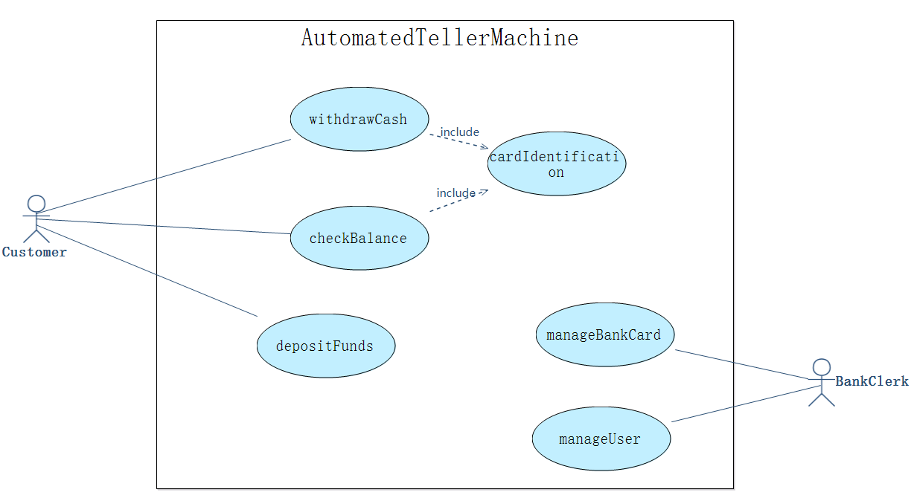
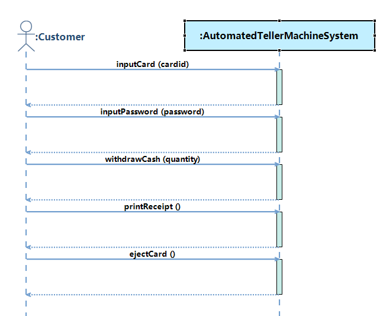
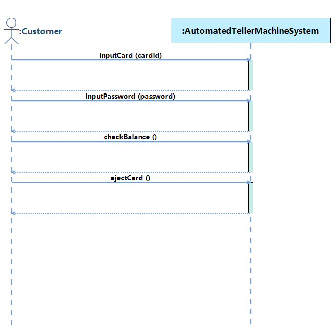
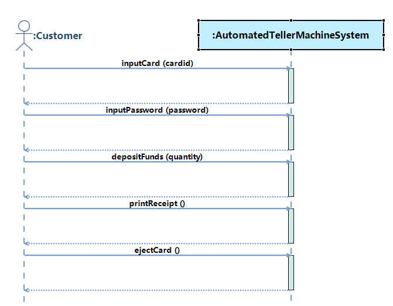

# 1   Introduction
## 1.1   Purpose
This subsection should

- a) Delineate the purpose of the SRS;
- b) Specify the intended audience for the SRS.
## 1.2   Scope
Name of software to be developed: AutomatedTellerMachine System

This subsection should

- b) Explain what the software product(s) will, and, if necessary, will not do;
- c) Describe the application of the software being specifified, including relevant benefifits, objectives, and goals;
- d) Be consistent with similar statements in higher-level specififications (e.g., the system requirements specifification), if they exist.
## 1.3   Definitions, acronyms, and abbreviations
This subsection should provide the defifinitions of all terms, acronyms, and abbreviations required to properly interpret the SRS. This information may be provided by reference to one or more appendixes in the SRS or by reference to other documents.
## 1.4   References
This subsection should

- a) Provide a complete list of all documents referenced elsewhere in the SRS;
- b) Identify each document by title, report number (if applicable), date, and publishing organization;
- c) Specify the sources from which the references can be obtained.

This information may be provided by reference to an appendix or to another document.

## 1.5   Overview
This subsection should

- a) Describe what the rest of the SRS contains;
- b) Explain how the SRS is organized.
# 2  Overall description
## 2.1  Product perspective
This subsection of the SRS should put the product into perspective with other related products. If the product is independent and totally self-contained, it should be so stated here. If the SRS defines a product that is a component of a larger system, as frequently occurs, then this subsection should relate the requirements of that larger system to functionality of the software and should identify interfaces between that system and the software.
## 2.2  Product functions
## 2.3  User characteristics
The applicable objects of this system are Customer, BankClerk.
If they know the basic operation of computer, they can use the system to operate the required functions.
Maybe some users need some relevant training.
## 2.4  Constraints
This subsection of the SRS should provide a general description of any other items that will limit the developer’s options. These include

- a) Regulatory policies;
- b) Hardware limitations (e.g., signal timing requirements);
- c) Interfaces to other applications;
- d) Parallel operation;
- e) Audit functions;
- f) Control functions;
- g) Higher-order language requirements;
- h) Signal handshake protocols (e.g., XON-XOFF, ACK-NACK);
- i) Reliability requirements;
- j) Criticality of the application;
- k) Safety and security considerations.
## 2.5  Assumptions and dependencies
This subsection of the SRS should list each of the factors that affect the requirements stated in the SRS. These factors are not design constraints on the software but are, rather, any changes to them that can affect the requirements in the SRS. For example, an assumption may be that a specific operating system will be available on the hardware designated for the software product. If, in fact, the operating system is not available, the SRS would then have to change accordingly. 
## 2.6  Apportioning of requirements
This subsection of the SRS should identify requirements that may be delayed until future versions of the system.
# 3  Specific requirements
## 3.1  Functional requirements
### 3.1.1   User Requirements
<b>Use Case Diagram</b>



<b>A1 - Customer</b>
<table>
	<tr>
		<td><b>Actor Name:</b></td>
		<td colspan="5"><span name ="ACTORCustomer">Customer</span></td>
	</tr>
	<tr>
		<td><b>Actor ID:</b></td>
		<td colspan="5">A1</td>
	</tr>
	<tr>
		<td><b>Description:</b></td>
		<td colspan="5">The customer is the holder of the bank card</td>
	</tr>				   
<tr>
	<td colspan="5"><b>Required Functions</b></td>
	<td><b>Related Use Case</b></td>
</tr>
<tr>
			<td colspan="5">The customer withdraws cash</td>
			<td><a href="#UCwithdrawCash">withdrawCash</a></td>
	</tr>
<tr>
			<td colspan="5">The customer checks balance</td>
			<td><a href="#UCcheckBalance">checkBalance</a></td>
	</tr>
<tr>
			<td colspan="5">The customer deposits cash</td>
			<td><a href="#UCdepositFunds">depositFunds</a></td>
	</tr>
</table>
<b>A2 - BankClerk</b>
<table>
	<tr>
		<td><b>Actor Name:</b></td>
		<td colspan="5"><span name ="ACTORBankClerk">BankClerk</span></td>
	</tr>
	<tr>
		<td><b>Actor ID:</b></td>
		<td colspan="5">A2</td>
	</tr>
	<tr>
		<td><b>Description:</b></td>
		<td colspan="5">The bank clerk is responsible for managing information, including user(customer) information, bank card information</td>
	</tr>				   
<tr>
	<td colspan="5"><b>Required Functions</b></td>
	<td><b>Related Use Case</b></td>
</tr>
<tr>
			<td colspan="5">The bank clerk manages bank card information, including entering, inquiring, modifying and deleting of bank card information</td>
			<td><a href="#UCmanageBankCard">manageBankCard</a></td>
	</tr>
<tr>
			<td colspan="5">The bank clerk manages bank card information, including entering, inquiring, modifying and deleting of bank card information</td>
			<td><a href="#UCmanageUser">manageUser</a></td>
	</tr>
</table>

### 3.1.2   System Requirement
#### 3.1.2.1 Use Case Description
<b>UC1 - withdrawCash</b>

<table>
	<tr>
		<td><b>UseCase Name:</b></td>
		<td><span name ="UCwithdrawCash">withdrawCash</span></td>
	</tr>
	<tr>
		<td><b>UseCase ID:</b></td>
		<td>UC1</td>
	</tr>
	<tr>
		<td><b>Brief Description:</b></td>
		<td>The customer withdraws cash</td>
	</tr>
	<tr>
		<td><b>Involved Actor:</b></td>
	<td><a href="#ACTORCustomer">Customer</a></td>
	</tr>
	<tr>
		<td><b>Preconditions:</b></td>
		<td><ol></ol></td>
	</tr>
	<tr>
		<td><b>Postconditions:</b></td>
		<td><ol></ol></td>
	</tr>						
	<tr>
		<td><b>Basic Path:</b></td>
	<td><p>1. Customer clicks to execute the operation <a href="#OPinputCard">inputCard</a>, with entering cardid</p><p>2. Customer clicks to execute the operation <a href="#OPinputPassword">inputPassword</a>, with entering password</p><p>3. Customer clicks to execute the operation <a href="#OPwithdrawCash">withdrawCash</a>, with entering quantity</p><p>4. Customer clicks to execute the operation <a href="#OPprintReceipt">printReceipt</a></p><p>5. Customer clicks to execute the operation <a href="#OPejectCard">ejectCard</a></p></td>
	</tr>
	<tr>
		<td><b>Alternative Path:</b></td>
		<td></td>
	</tr>
	</table>



<b>UC2 - checkBalance</b>

<table>
	<tr>
		<td><b>UseCase Name:</b></td>
		<td><span name ="UCcheckBalance">checkBalance</span></td>
	</tr>
	<tr>
		<td><b>UseCase ID:</b></td>
		<td>UC2</td>
	</tr>
	<tr>
		<td><b>Brief Description:</b></td>
		<td>The customer checks balance</td>
	</tr>
	<tr>
		<td><b>Involved Actor:</b></td>
	<td><a href="#ACTORCustomer">Customer</a></td>
	</tr>
	<tr>
		<td><b>Preconditions:</b></td>
		<td><ol></ol></td>
	</tr>
	<tr>
		<td><b>Postconditions:</b></td>
		<td><ol></ol></td>
	</tr>						
	<tr>
		<td><b>Basic Path:</b></td>
	<td><p>1. Customer clicks to execute the operation <a href="#OPinputCard">inputCard</a>, with entering cardid</p><p>2. Customer clicks to execute the operation <a href="#OPinputPassword">inputPassword</a>, with entering password</p><p>3. Customer clicks to execute the operation <a href="#OPcheckBalance">checkBalance</a></p><p>4. Customer clicks to execute the operation <a href="#OPejectCard">ejectCard</a></p></td>
	</tr>
	<tr>
		<td><b>Alternative Path:</b></td>
		<td></td>
	</tr>
	</table>



<b>UC3 - depositFunds</b>

<table>
	<tr>
		<td><b>UseCase Name:</b></td>
		<td><span name ="UCdepositFunds">depositFunds</span></td>
	</tr>
	<tr>
		<td><b>UseCase ID:</b></td>
		<td>UC3</td>
	</tr>
	<tr>
		<td><b>Brief Description:</b></td>
		<td>The customer deposits cash</td>
	</tr>
	<tr>
		<td><b>Involved Actor:</b></td>
	<td><a href="#ACTORCustomer">Customer</a></td>
	</tr>
	<tr>
		<td><b>Preconditions:</b></td>
		<td><ol></ol></td>
	</tr>
	<tr>
		<td><b>Postconditions:</b></td>
		<td><ol></ol></td>
	</tr>						
	<tr>
		<td><b>Basic Path:</b></td>
	<td><p>1. Customer clicks to execute the operation <a href="#OPinputCard">inputCard</a>, with entering cardid</p><p>2. Customer clicks to execute the operation <a href="#OPinputPassword">inputPassword</a>, with entering password</p><p>3. Customer clicks to execute the operation <a href="#OPdepositFunds">depositFunds</a>, with entering quantity</p><p>4. Customer clicks to execute the operation <a href="#OPprintReceipt">printReceipt</a></p><p>5. Customer clicks to execute the operation <a href="#OPejectCard">ejectCard</a></p></td>
	</tr>
	<tr>
		<td><b>Alternative Path:</b></td>
		<td></td>
	</tr>
	</table>



<b>UC4 - manageBankCard</b>

<table>
	<tr>
		<td><b>UseCase Name:</b></td>
		<td><span name ="UCmanageBankCard">manageBankCard</span></td>
	</tr>
	<tr>
		<td><b>UseCase ID:</b></td>
		<td>UC4</td>
	</tr>
	<tr>
		<td><b>Brief Description:</b></td>
		<td>The bank clerk manages bank card information, including entering, inquiring, modifying and deleting of bank card information</td>
	</tr>
	<tr>
		<td><b>Involved Actor:</b></td>
	<td><a href="#ACTORBankClerk">BankClerk</a></td>
	</tr>
	<tr>
		<td><b>Preconditions:</b></td>
		<td><ol></ol></td>
	</tr>
	<tr>
		<td><b>Postconditions:</b></td>
		<td><ol></ol></td>
	</tr>						
	<tr>
		<td><b>Basic Path:</b></td>
	<td></td>
	</tr>
	<tr>
		<td><b>Alternative Path:</b></td>
		<td></td>
	</tr>
	</table>
 

<b>UC5 - manageUser</b>

<table>
	<tr>
		<td><b>UseCase Name:</b></td>
		<td><span name ="UCmanageUser">manageUser</span></td>
	</tr>
	<tr>
		<td><b>UseCase ID:</b></td>
		<td>UC5</td>
	</tr>
	<tr>
		<td><b>Brief Description:</b></td>
		<td>The bank clerk manages bank card information, including entering, inquiring, modifying and deleting of bank card information</td>
	</tr>
	<tr>
		<td><b>Involved Actor:</b></td>
	<td><a href="#ACTORBankClerk">BankClerk</a></td>
	</tr>
	<tr>
		<td><b>Preconditions:</b></td>
		<td><ol></ol></td>
	</tr>
	<tr>
		<td><b>Postconditions:</b></td>
		<td><ol></ol></td>
	</tr>						
	<tr>
		<td><b>Basic Path:</b></td>
	<td></td>
	</tr>
	<tr>
		<td><b>Alternative Path:</b></td>
		<td></td>
	</tr>
	</table>
 

<b>UC6 - cardIdentification</b>

<table>
	<tr>
		<td><b>UseCase Name:</b></td>
		<td><span name ="UCcardIdentification">cardIdentification</span></td>
	</tr>
	<tr>
		<td><b>UseCase ID:</b></td>
		<td>UC6</td>
	</tr>
	<tr>
		<td><b>Brief Description:</b></td>
		<td>The system verifies the card</td>
	</tr>
	<tr>
		<td><b>Involved Actor:</b></td>
	<td></td>
	</tr>
	<tr>
		<td><b>Preconditions:</b></td>
		<td><ol></ol></td>
	</tr>
	<tr>
		<td><b>Postconditions:</b></td>
		<td><ol></ol></td>
	</tr>						
	<tr>
		<td><b>Basic Path:</b></td>
	<td></td>
	</tr>
	<tr>
		<td><b>Alternative Path:</b></td>
		<td></td>
	</tr>
	</table>
 


#### 3.1.2.2   Entity Analysis
<b>Conceptual Class Diagram</b> 


<b>E1 - BankCard</b>

<table>
	<tr>
		<td><b>Entity Name:</b></td>
		   <td colspan="3"><span name ="CLASSBankCard">BankCard</span></td>
	</tr>
	<tr>
		<td><b>Entity ID:</b></td>
		   <td colspan="3">E1</td>
	</tr>
	<tr>
	    <td><b>Entity Description:</b></td>
	    <td colspan="3">The BankCrad is a card that can deposit or withdraw money</td>
	</tr>
	<tr>
	    <td><b>Attribute Name</b></td>
		<td><b>Attribute Type</b></td>
		<td colspan="2"><b>Attribute Description</b></td>
	</tr>
	<tr>
	    <td>CardID</td>
	<td>Integer</td>
	<td colspan="2">The CardID of BankCard</td>
					</tr>
	<tr>
	    <td>CardStatus</td>
	<td>[NORMAL|SUSPEND|CANNEL]</td>
	<td colspan="2">The CardStatus of BankCard</td>
					</tr>
	<tr>
	    <td>Catalog</td>
	<td>[CREDIT|DESPOSIT]</td>
	<td colspan="2">The Catalog of BankCard</td>
					</tr>
	<tr>
	    <td>Password</td>
	<td>Integer</td>
	<td colspan="2">The Password of BankCard</td>
					</tr>
	<tr>
	    <td>Balance</td>
	<td>Real</td>
	<td colspan="2">The Balance of BankCard</td>
					</tr>
	<tr>
	    <td><b>Relationship Name</b></td>
	<td><b>Related Entity</b></td>
	<td><b>Relationship Type</b></td>
	<td><b>Relationship Description</b></td>
	</tr>
		<tr>
			<td>BelongedUser</td>
			<td><a href="#CLASSUser">User</a></td>
			<td>Association</td>
		<td>Many BankCard are linked with one User</td>
	</tr>
	</table>

<b>E2 - User</b>

<table>
	<tr>
		<td><b>Entity Name:</b></td>
		   <td colspan="3"><span name ="CLASSUser">User</span></td>
	</tr>
	<tr>
		<td><b>Entity ID:</b></td>
		   <td colspan="3">E2</td>
	</tr>
	<tr>
	    <td><b>Entity Description:</b></td>
	    <td colspan="3">The user is the holder of the bank card</td>
	</tr>
	<tr>
	    <td><b>Attribute Name</b></td>
		<td><b>Attribute Type</b></td>
		<td colspan="2"><b>Attribute Description</b></td>
	</tr>
	<tr>
	    <td>UserID</td>
	<td>Integer</td>
	<td colspan="2">The UserID of User</td>
					</tr>
	<tr>
	    <td>Name</td>
	<td>String</td>
	<td colspan="2">The Name of User</td>
					</tr>
	<tr>
	    <td>Address</td>
	<td>String</td>
	<td colspan="2">The Address of User</td>
					</tr>
	<tr>
	    <td><b>Relationship Name</b></td>
	<td><b>Related Entity</b></td>
	<td><b>Relationship Type</b></td>
	<td><b>Relationship Description</b></td>
	</tr>
		<tr>
			<td>OwnedCard</td>
			<td><a href="#CLASSBankCard">BankCard</a></td>
			<td>Association</td>
		<td>One User is linked with many BankCard</td>
	</tr>
	</table>
​	 

#### 3.1.2.3   System Interfaces
##### System Interfaces
<b>SI1 - AutomatedTellerMachineSystem</b>
<table>
	<tr>
		<td><b>System Interface Name:</b></td>
		<td><span name ="SERVICEAutomatedTellerMachineSystem">AutomatedTellerMachineSystem</span></td>
	</tr>
	<tr>
		<td><b>System Interface ID:</b></td>
		<td>SI1</td>
	</tr>
	<tr>
		<td><b>Description:</b></td>
		<td></td>
	</tr>
	<tr>
		<td><b>Operation:</b></td>
	<td><ul><li><a href="#OPdepositFunds">depositFunds</a></li><li><a href="#OPinputPassword">inputPassword</a></li><li><a href="#OPinputCard">inputCard</a></li><li><a href="#OPejectCard">ejectCard</a></li><li><a href="#OPwithdrawCash">withdrawCash</a></li><li><a href="#OPprintReceipt">printReceipt</a></li><li><a href="#OPcheckBalance">checkBalance</a></li><li><a href="#OPcardIdentification">cardIdentification</a></li></ul></td>
	</tr>
<tr>
			<td><b>Temporary Variable</b></td>
			<td><b>Variable Description</b></td>
	</tr>
	<tr>
		<td><span name ="AutomatedTellerMachineSystemPasswordValidated">PasswordValidated</span></td>
		<td>the type of PasswordValidated is Boolean</td>
					</tr>
	<tr>
		<td><span name ="AutomatedTellerMachineSystemWithdrawedNumber">WithdrawedNumber</span></td>
		<td>the type of WithdrawedNumber is Real</td>
					</tr>
	<tr>
		<td><span name ="AutomatedTellerMachineSystemInputCard">InputCard</span></td>
		<td>InputCard is a object of <a href="#CLASSBankCard">BankCard</a></td>
					</tr>
	<tr>
		<td><span name ="AutomatedTellerMachineSystemCardIDValidated">CardIDValidated</span></td>
		<td>the type of CardIDValidated is Boolean</td>
					</tr>
	<tr>
		<td><span name ="AutomatedTellerMachineSystemIsDeposit">IsDeposit</span></td>
		<td>the type of IsDeposit is Boolean</td>
					</tr>
	<tr>
		<td><span name ="AutomatedTellerMachineSystemIsWithdraw">IsWithdraw</span></td>
		<td>the type of IsWithdraw is Boolean</td>
					</tr>
	<tr>
		<td><span name ="AutomatedTellerMachineSystemDepositedNumber">DepositedNumber</span></td>
		<td>the type of DepositedNumber is Real</td>
					</tr>
	</table>

<b>SI2 - ManageBankCardCRUDService</b>
<table>
	<tr>
		<td><b>System Interface Name:</b></td>
		<td><span name ="SERVICEManageBankCardCRUDService">ManageBankCardCRUDService</span></td>
	</tr>
	<tr>
		<td><b>System Interface ID:</b></td>
		<td>SI2</td>
	</tr>
	<tr>
		<td><b>Description:</b></td>
		<td></td>
	</tr>
	<tr>
		<td><b>Operation:</b></td>
	<td><ul><li><a href="#OPcreateBankCard">createBankCard</a></li><li><a href="#OPqueryBankCard">queryBankCard</a></li><li><a href="#OPmodifyBankCard">modifyBankCard</a></li><li><a href="#OPdeleteBankCard">deleteBankCard</a></li></ul></td>
	</tr>
	</table>

<b>SI3 - ManageUserCRUDService</b>
<table>
	<tr>
		<td><b>System Interface Name:</b></td>
		<td><span name ="SERVICEManageUserCRUDService">ManageUserCRUDService</span></td>
	</tr>
	<tr>
		<td><b>System Interface ID:</b></td>
		<td>SI3</td>
	</tr>
	<tr>
		<td><b>Description:</b></td>
		<td></td>
	</tr>
	<tr>
		<td><b>Operation:</b></td>
	<td><ul><li><a href="#OPcreateUser">createUser</a></li><li><a href="#OPqueryUser">queryUser</a></li><li><a href="#OPmodifyUser">modifyUser</a></li><li><a href="#OPdeleteUser">deleteUser</a></li></ul></td>
	</tr>
	</table>

<b>SI4 - ThirdPartyServices</b>
<table>
	<tr>
		<td><b>System Interface Name:</b></td>
		<td><span name ="SERVICEThirdPartyServices">ThirdPartyServices</span></td>
	</tr>
	<tr>
		<td><b>System Interface ID:</b></td>
		<td>SI4</td>
	</tr>
	<tr>
		<td><b>Description:</b></td>
		<td></td>
	</tr>
	<tr>
		<td><b>Operation:</b></td>
	<td><ul></ul></td>
	</tr>
	</table>
​	 

##### System Operation Description
<b>OP1 - inputCard</b>
<table>
	<tr>
		<td><b>Operation Name:</b></td>
		<td><span name ="OPinputCard">inputCard</span></td>
	</tr>
	<tr>
		<td><b>Operation ID:</b></td>
		<td>OP1</td>
	</tr>
	<tr>
		<td><b>Description:</b></td>
		<td> </td>
	</tr>
	<tr>
		<td><b>Service:</b></td>
		<td><a href="#SERVICEAutomatedTellerMachineSystem">AutomatedTellerMachineSystem</a></td>
	</tr>
	<tr>
		<td><b>Input:</b></td>
<td><p>name: <i>cardid</i>, type: Integer</p></td>
</tr>
<tr>
	<td><b>Output Type:</b></td>
	<td>Boolean</td>
</tr>
<tr>
			<td><b>Definition:</b></td>
<td><p><i>bc</i> is the object <i>c</i> in the instance set of class <a href="#CLASSBankCard">BankCard</a>. <i>c</i> represents an object of class <a href="#CLASSBankCard">BankCard</a>, and <i>c</i> meets:</p><p>&emsp;&emsp;The attribute <i>CardID</i> of the object <i>c</i> is equal to <i>cardid</i></p></td>
	</tr>
	<tr>
<td><b>Preconditions:</b></td>
		<td><p>None</p></td>
</tr>
	<tr>
		<td><b>Postconditions:</b></td>
	<td><p>If (<i>bc</i> existed), take the following as postcondition(s):</p><p>&emsp;&emsp;The value of temporary variable <a href="#AutomatedTellerMachineSystemCardIDValidated">CardIDValidated</a> became <b>true</b></p><p>&emsp;&emsp;The object <a href="#AutomatedTellerMachineSystemInputCard">InputCard</a> became <i>bc</i></p><p>&emsp;&emsp;The return value was <b>true</b></p><p>Otherwise, take the following as postcondition(s):</p><p>&emsp;&emsp;The value of temporary variable <a href="#AutomatedTellerMachineSystemCardIDValidated">CardIDValidated</a> became <b>false</b></p><p>&emsp;&emsp;The return value was <b>false</b></p></td>
	</tr>
</table>

<p>Contract of inputCard:</p>

```java
Contract AutomatedTellerMachineSystem::inputCard(cardid :Integer) : Boolean {
		/*
		 * Generated by RM2Doc - Definition
		 * bc is the object c in the instance set of class BankCard. c represents an object of class BankCard, and c meets:
		 *     The attribute CardID of the object c is equal to cardid
		 */
		definition:
			bc:BankCard = BankCard.allInstance()->any(c:BankCard | c.CardID = cardid)
		/*
		 * Generated by RM2Doc - Precondition
		 * None
		 */
		precondition:
			true
		/*
		 * Generated by RM2Doc - Postcondition
		 * If (bc existed), take the following as postcondition(s):
		 *     The value of temporary variable CardIDValidated became true
		 *     The object InputCard became bc
		 *     The return value was true
		 * Otherwise, take the following as postcondition(s):
		 *     The value of temporary variable CardIDValidated became false
		 *     The return value was false
		 */
		postcondition:
			if
				(bc.oclIsUndefined() = false)
			then
				self.CardIDValidated = true and
				self.InputCard = bc and
				result = true
			else
				self.CardIDValidated = false and
				result = false
			endif
}
```

<b>OP2 - inputPassword</b>
<table>
	<tr>
		<td><b>Operation Name:</b></td>
		<td><span name ="OPinputPassword">inputPassword</span></td>
	</tr>
	<tr>
		<td><b>Operation ID:</b></td>
		<td>OP2</td>
	</tr>
	<tr>
		<td><b>Description:</b></td>
		<td> </td>
	</tr>
	<tr>
		<td><b>Service:</b></td>
		<td><a href="#SERVICEAutomatedTellerMachineSystem">AutomatedTellerMachineSystem</a></td>
	</tr>
	<tr>
		<td><b>Input:</b></td>
<td><p>name: <i>password</i>, type: Integer</p></td>
</tr>
<tr>
	<td><b>Output Type:</b></td>
	<td>Boolean</td>
</tr>
	<tr>
<td><b>Preconditions:</b></td>
		<td><p>1. The value of temporary variable <a href="#AutomatedTellerMachineSystemCardIDValidated">CardIDValidated</a> is equal to <b>true</b></p><p>2. The object <a href="#AutomatedTellerMachineSystemInputCard">InputCard</a> exists</p></td>
</tr>
	<tr>
		<td><b>Postconditions:</b></td>
	<td><p>If the attribute <i>Password</i> of the object <a href="#AutomatedTellerMachineSystemInputCard">InputCard</a> was equal to <i>password</i>, take the following as postcondition(s):</p><p>&emsp;&emsp;The value of temporary variable <a href="#AutomatedTellerMachineSystemPasswordValidated">PasswordValidated</a> became <b>true</b></p><p>&emsp;&emsp;The return value was <b>true</b></p><p>Otherwise, take the following as postcondition(s):</p><p>&emsp;&emsp;The value of temporary variable <a href="#AutomatedTellerMachineSystemPasswordValidated">PasswordValidated</a> became <b>false</b></p><p>&emsp;&emsp;The return value was <b>false</b></p></td>
	</tr>
</table>

<p>Contract of inputPassword:</p>

```java
Contract AutomatedTellerMachineSystem::inputPassword(password : Integer) : Boolean {
		/*
		 * Generated by RM2Doc - Precondition
		 * The value of temporary variable CardIDValidated is equal to true
		 * The object InputCard exists
		 */
		precondition:
			self.CardIDValidated = true and
			self.InputCard.oclIsUndefined() = false
		/*
		 * Generated by RM2Doc - Postcondition
		 * If the attribute Password of the object InputCard was equal to password, take the following as postcondition(s):
		 *     The value of temporary variable PasswordValidated became true
		 *     The return value was true
		 * Otherwise, take the following as postcondition(s):
		 *     The value of temporary variable PasswordValidated became false
		 *     The return value was false
		 */
		postcondition:
			if
				self.InputCard.Password = password
			then
				self.PasswordValidated = true and
				return = true
			else
				self.PasswordValidated = false and
				return = false
			endif
}
```

<b>OP3 - printReceipt</b>
<table>
	<tr>
		<td><b>Operation Name:</b></td>
		<td><span name ="OPprintReceipt">printReceipt</span></td>
	</tr>
	<tr>
		<td><b>Operation ID:</b></td>
		<td>OP3</td>
	</tr>
	<tr>
		<td><b>Description:</b></td>
		<td> </td>
	</tr>
	<tr>
		<td><b>Service:</b></td>
		<td><a href="#SERVICEAutomatedTellerMachineSystem">AutomatedTellerMachineSystem</a></td>
	</tr>
	<tr>
		<td><b>Input:</b></td>
<td>None</td>
</tr>
<tr>
	<td><b>Output Type:</b></td>
	<td>Real</td>
</tr>
	<tr>
<td><b>Preconditions:</b></td>
		<td><p>1. The value of temporary variable <a href="#AutomatedTellerMachineSystemCardIDValidated">CardIDValidated</a> is equal to <b>true</b></p><p>2. The value of temporary variable <a href="#AutomatedTellerMachineSystemPasswordValidated">PasswordValidated</a> is equal to <b>true</b></p><p>3. The object <a href="#AutomatedTellerMachineSystemInputCard">InputCard</a> exists</p></td>
</tr>
	<tr>
		<td><b>Postconditions:</b></td>
	<td><p>If the value of temporary variable <a href="#AutomatedTellerMachineSystemIsWithdraw">IsWithdraw</a> was equal to <b>true</b>, take the following as postcondition(s):</p><p>&emsp;&emsp;The return value was the value of temporary variable <a href="#AutomatedTellerMachineSystemWithdrawedNumber">WithdrawedNumber</a></p><p>Otherwise, take the following as postcondition(s):</p><p>&emsp;&emsp;If the value of temporary variable <a href="#AutomatedTellerMachineSystemIsDeposit">IsDeposit</a> was equal to <b>true</b>, take the following as postcondition(s):</p><p>&emsp;&emsp;&emsp;&emsp;The return value was the value of temporary variable <a href="#AutomatedTellerMachineSystemDepositedNumber">DepositedNumber</a></p><p>&emsp;&emsp;Otherwise, take the following as postcondition(s):</p><p>&emsp;&emsp;&emsp;&emsp;The return value was <b>0</b></p></td>
	</tr>
</table>

<p>Contract of printReceipt:</p>

```java
Contract AutomatedTellerMachineSystem::printReceipt() : Real {
		/*
		 * Generated by RM2Doc - Precondition
		 * The value of temporary variable CardIDValidated is equal to true
		 * The value of temporary variable PasswordValidated is equal to true
		 * The object InputCard exists
		 */
		precondition:
			self.CardIDValidated = true and
			self.PasswordValidated = true and
			self.InputCard.oclIsUndefined() = false
		/*
		 * Generated by RM2Doc - Postcondition
		 * If the value of temporary variable IsWithdraw was equal to true, take the following as postcondition(s):
		 *     The return value was the value of temporary variable WithdrawedNumber
		 * Otherwise, take the following as postcondition(s):
		 *     If the value of temporary variable IsDeposit was equal to true, take the following as postcondition(s):
		 *         The return value was the value of temporary variable DepositedNumber
		 *     Otherwise, take the following as postcondition(s):
		 *         The return value was 0
		 */
		postcondition:
			if
				self.IsWithdraw = true
			then
				result = self.WithdrawedNumber
			else
				if
					self.IsDeposit = true
				then
					result = self.DepositedNumber
				else
					result = 0
				endif
			endif
}
```

<b>OP4 - checkBalance</b>
<table>
	<tr>
		<td><b>Operation Name:</b></td>
		<td><span name ="OPcheckBalance">checkBalance</span></td>
	</tr>
	<tr>
		<td><b>Operation ID:</b></td>
		<td>OP4</td>
	</tr>
	<tr>
		<td><b>Description:</b></td>
		<td> </td>
	</tr>
	<tr>
		<td><b>Service:</b></td>
		<td><a href="#SERVICEAutomatedTellerMachineSystem">AutomatedTellerMachineSystem</a></td>
	</tr>
	<tr>
		<td><b>Input:</b></td>
<td>None</td>
</tr>
<tr>
	<td><b>Output Type:</b></td>
	<td>Real</td>
</tr>
	<tr>
<td><b>Preconditions:</b></td>
		<td><p>1. The value of temporary variable <a href="#AutomatedTellerMachineSystemPasswordValidated">PasswordValidated</a> is equal to <b>true</b></p><p>2. The value of temporary variable <a href="#AutomatedTellerMachineSystemCardIDValidated">CardIDValidated</a> is equal to <b>true</b></p><p>3. The object <a href="#AutomatedTellerMachineSystemInputCard">InputCard</a> exists</p></td>
</tr>
	<tr>
		<td><b>Postconditions:</b></td>
	<td><p>The return value was the attribute <i>Balance</i> of the object <a href="#AutomatedTellerMachineSystemInputCard">InputCard</a></p></td>
	</tr>
</table>

<p>Contract of checkBalance:</p>

```java
Contract AutomatedTellerMachineSystem::checkBalance() : Real {
		/*
		 * Generated by RM2Doc - Precondition
		 * The value of temporary variable PasswordValidated is equal to true
		 * The value of temporary variable CardIDValidated is equal to true
		 * The object InputCard exists
		 */
		precondition:
			self.PasswordValidated = true and
			self.CardIDValidated = true and
			self.InputCard.oclIsUndefined() = false
		/*
		 * Generated by RM2Doc - Postcondition
		 * The return value was the attribute Balance of the object InputCard
		 */
		postcondition:
			result = self.InputCard.Balance
}
```

<b>OP5 - ejectCard</b>
<table>
	<tr>
		<td><b>Operation Name:</b></td>
		<td><span name ="OPejectCard">ejectCard</span></td>
	</tr>
	<tr>
		<td><b>Operation ID:</b></td>
		<td>OP5</td>
	</tr>
	<tr>
		<td><b>Description:</b></td>
		<td> </td>
	</tr>
	<tr>
		<td><b>Service:</b></td>
		<td><a href="#SERVICEAutomatedTellerMachineSystem">AutomatedTellerMachineSystem</a></td>
	</tr>
	<tr>
		<td><b>Input:</b></td>
<td>None</td>
</tr>
<tr>
	<td><b>Output Type:</b></td>
	<td>Boolean</td>
</tr>
	<tr>
<td><b>Preconditions:</b></td>
		<td><p>1. The value of temporary variable <a href="#AutomatedTellerMachineSystemPasswordValidated">PasswordValidated</a> is equal to <b>true</b></p><p>2. The value of temporary variable <a href="#AutomatedTellerMachineSystemCardIDValidated">CardIDValidated</a> is equal to <b>true</b></p><p>3. The object <a href="#AutomatedTellerMachineSystemInputCard">InputCard</a> exists</p></td>
</tr>
	<tr>
		<td><b>Postconditions:</b></td>
	<td><p>1. The object <a href="#AutomatedTellerMachineSystemInputCard">InputCard</a> became <b>null</b></p><p>2. The value of temporary variable <a href="#AutomatedTellerMachineSystemPasswordValidated">PasswordValidated</a> became <b>false</b></p><p>3. The value of temporary variable <a href="#AutomatedTellerMachineSystemCardIDValidated">CardIDValidated</a> became <b>false</b></p><p>4. The value of temporary variable <a href="#AutomatedTellerMachineSystemIsWithdraw">IsWithdraw</a> became <b>false</b></p><p>5. The value of temporary variable <a href="#AutomatedTellerMachineSystemIsDeposit">IsDeposit</a> became <b>false</b></p><p>6. The value of temporary variable <a href="#AutomatedTellerMachineSystemWithdrawedNumber">WithdrawedNumber</a> became <b>0</b></p><p>7. The value of temporary variable <a href="#AutomatedTellerMachineSystemDepositedNumber">DepositedNumber</a> became <b>0</b></p><p>8. The return value was <b>true</b></p></td>
	</tr>
</table>

<p>Contract of ejectCard:</p>

```java
Contract AutomatedTellerMachineSystem::ejectCard() : Boolean {
		/*
		 * Generated by RM2Doc - Precondition
		 * The value of temporary variable PasswordValidated is equal to true
		 * The value of temporary variable CardIDValidated is equal to true
		 * The object InputCard exists
		 */
		precondition:
			self.PasswordValidated = true and
			self.CardIDValidated = true and
			self.InputCard.oclIsUndefined() = false
		/*
		 * Generated by RM2Doc - Postcondition
		 * The object InputCard became null
		 * The value of temporary variable PasswordValidated became false
		 * The value of temporary variable CardIDValidated became false
		 * The value of temporary variable IsWithdraw became false
		 * The value of temporary variable IsDeposit became false
		 * The value of temporary variable WithdrawedNumber became 0
		 * The value of temporary variable DepositedNumber became 0
		 * The return value was true
		 */
		postcondition:
			self.InputCard = null and
			self.PasswordValidated = false and
			self.CardIDValidated = false and
			self.IsWithdraw = false and
			self.IsDeposit = false and
			self.WithdrawedNumber = 0 and
			self.DepositedNumber = 0 and
			result = true
}
```

<b>OP6 - withdrawCash</b>
<table>
	<tr>
		<td><b>Operation Name:</b></td>
		<td><span name ="OPwithdrawCash">withdrawCash</span></td>
	</tr>
	<tr>
		<td><b>Operation ID:</b></td>
		<td>OP6</td>
	</tr>
	<tr>
		<td><b>Description:</b></td>
		<td> </td>
	</tr>
	<tr>
		<td><b>Service:</b></td>
		<td><a href="#SERVICEAutomatedTellerMachineSystem">AutomatedTellerMachineSystem</a></td>
	</tr>
	<tr>
		<td><b>Input:</b></td>
<td><p>name: <i>quantity</i>, type: Integer</p></td>
</tr>
<tr>
	<td><b>Output Type:</b></td>
	<td>Boolean</td>
</tr>
	<tr>
<td><b>Preconditions:</b></td>
		<td><p>1. The value of temporary variable <a href="#AutomatedTellerMachineSystemPasswordValidated">PasswordValidated</a> is equal to <b>true</b></p><p>2. The value of temporary variable <a href="#AutomatedTellerMachineSystemCardIDValidated">CardIDValidated</a> is equal to <b>true</b></p><p>3. The object <a href="#AutomatedTellerMachineSystemInputCard">InputCard</a> exists</p><p>4. The attribute <i>Balance</i> of the object <a href="#AutomatedTellerMachineSystemInputCard">InputCard</a> is greater than or equal to <i>quantity</i></p></td>
</tr>
	<tr>
		<td><b>Postconditions:</b></td>
	<td><p>1. The attribute <i>Balance</i> of the object <a href="#AutomatedTellerMachineSystemInputCard">InputCard</a> became the previous value of the attribute <i>Balance</i> of the object <a href="#AutomatedTellerMachineSystemInputCard">InputCard</a> minus <i>quantity</i></p><p>2. The value of temporary variable <a href="#AutomatedTellerMachineSystemWithdrawedNumber">WithdrawedNumber</a> became <i>quantity</i></p><p>3. The value of temporary variable <a href="#AutomatedTellerMachineSystemIsWithdraw">IsWithdraw</a> became <b>true</b></p><p>4. The return value was <b>true</b></p></td>
	</tr>
</table>

<p>Contract of withdrawCash:</p>

```java
Contract AutomatedTellerMachineSystem::withdrawCash(quantity : Integer) : Boolean {
		/*
		 * Generated by RM2Doc - Precondition
		 * The value of temporary variable PasswordValidated is equal to true
		 * The value of temporary variable CardIDValidated is equal to true
		 * The object InputCard exists
		 * The attribute Balance of the object InputCard is greater than or equal to quantity
		 */
		precondition:
			self.PasswordValidated = true and
			self.CardIDValidated = true and
			self.InputCard.oclIsUndefined() = false and
			self.InputCard.Balance >= quantity
		/*
		 * Generated by RM2Doc - Postcondition
		 * The attribute Balance of the object InputCard became the previous value of the attribute Balance of the object InputCard minus quantity
		 * The value of temporary variable WithdrawedNumber became quantity
		 * The value of temporary variable IsWithdraw became true
		 * The return value was true
		 */
		postcondition:
			self.InputCard.Balance = self.InputCard.Balance@pre - quantity and
			self.WithdrawedNumber = quantity and
			self.IsWithdraw = true and
			result = true
}
```

<b>OP7 - depositFunds</b>
<table>
	<tr>
		<td><b>Operation Name:</b></td>
		<td><span name ="OPdepositFunds">depositFunds</span></td>
	</tr>
	<tr>
		<td><b>Operation ID:</b></td>
		<td>OP7</td>
	</tr>
	<tr>
		<td><b>Description:</b></td>
		<td> </td>
	</tr>
	<tr>
		<td><b>Service:</b></td>
		<td><a href="#SERVICEAutomatedTellerMachineSystem">AutomatedTellerMachineSystem</a></td>
	</tr>
	<tr>
		<td><b>Input:</b></td>
<td><p>name: <i>quantity</i>, type: Real</p></td>
</tr>
<tr>
	<td><b>Output Type:</b></td>
	<td>Boolean</td>
</tr>
	<tr>
<td><b>Preconditions:</b></td>
		<td><p>1. The value of temporary variable <a href="#AutomatedTellerMachineSystemPasswordValidated">PasswordValidated</a> is equal to <b>true</b></p><p>2. The value of temporary variable <a href="#AutomatedTellerMachineSystemCardIDValidated">CardIDValidated</a> is equal to <b>true</b></p><p>3. The object <a href="#AutomatedTellerMachineSystemInputCard">InputCard</a> exists</p><p>4. The <i>quantity</i> is greater than or equal to <b>100</b></p></td>
</tr>
	<tr>
		<td><b>Postconditions:</b></td>
	<td><p>1. The attribute <i>Balance</i> of the object <a href="#AutomatedTellerMachineSystemInputCard">InputCard</a> became the previous value of the attribute <i>Balance</i> of the object <a href="#AutomatedTellerMachineSystemInputCard">InputCard</a> plus <i>quantity</i></p><p>2. The value of temporary variable <a href="#AutomatedTellerMachineSystemIsDeposit">IsDeposit</a> became <b>true</b></p><p>3. The value of temporary variable <a href="#AutomatedTellerMachineSystemDepositedNumber">DepositedNumber</a> became <i>quantity</i></p><p>4. The return value was <b>true</b></p></td>
	</tr>
</table>

<p>Contract of depositFunds:</p>

```java
Contract AutomatedTellerMachineSystem::depositFunds(quantity : Real) : Boolean {
		/*
		 * Generated by RM2Doc - Precondition
		 * The value of temporary variable PasswordValidated is equal to true
		 * The value of temporary variable CardIDValidated is equal to true
		 * The object InputCard exists
		 * The quantity is greater than or equal to 100
		 */
		precondition:
			self.PasswordValidated = true and
			self.CardIDValidated = true and
			self.InputCard.oclIsUndefined() = false and
			quantity >= 100
		/*
		 * Generated by RM2Doc - Postcondition
		 * The attribute Balance of the object InputCard became the previous value of the attribute Balance of the object InputCard plus quantity
		 * The value of temporary variable IsDeposit became true
		 * The value of temporary variable DepositedNumber became quantity
		 * The return value was true
		 */
		postcondition:
			self.InputCard.Balance = self.InputCard.Balance@pre + quantity and
			self.IsDeposit = true and
			self.DepositedNumber = quantity and
			result = true
}
```

<b>OP8 - createBankCard</b>
<table>
	<tr>
		<td><b>Operation Name:</b></td>
		<td><span name ="OPcreateBankCard">createBankCard</span></td>
	</tr>
	<tr>
		<td><b>Operation ID:</b></td>
		<td>OP8</td>
	</tr>
	<tr>
		<td><b>Description:</b></td>
		<td> </td>
	</tr>
	<tr>
		<td><b>Service:</b></td>
		<td><a href="#SERVICEManageBankCardCRUDService">ManageBankCardCRUDService</a></td>
	</tr>
	<tr>
		<td><b>Input:</b></td>
<td><p>1. name: <i>cardid</i>, type: Integer</p><p>2. name: <i>cardstatus</i>, type: [NORMAL|SUSPEND|CANNEL]</p><p>3. name: <i>catalog</i>, type: [CREDIT|DESPOSIT]</p><p>4. name: <i>password</i>, type: Integer</p><p>5. name: <i>balance</i>, type: Real</p></td>
</tr>
<tr>
	<td><b>Output Type:</b></td>
	<td>Boolean</td>
</tr>
<tr>
			<td><b>Definition:</b></td>
<td><p><i>bankcard</i> is the object <i>ban</i> in the instance set of class <a href="#CLASSBankCard">BankCard</a>. <i>ban</i> represents an object of class <a href="#CLASSBankCard">BankCard</a>, and <i>ban</i> meets:</p><p>&emsp;&emsp;The attribute <i>CardID</i> of the object <i>ban</i> is equal to <i>cardid</i></p></td>
	</tr>
	<tr>
<td><b>Preconditions:</b></td>
		<td><p><i>bankcard</i> doesn't exist</p></td>
</tr>
	<tr>
		<td><b>Postconditions:</b></td>
	<td><p>1. <i>ban</i> represented the object of class <a href="#CLASSBankCard">BankCard</a></p><p>2. The object <i>ban</i> was created</p><p>3. The attribute <i>CardID</i> of the object <i>ban</i> became <i>cardid</i></p><p>4. The attribute <i>CardStatus</i> of the object <i>ban</i> became <i>cardstatus</i></p><p>5. The attribute <i>Catalog</i> of the object <i>ban</i> became <i>catalog</i></p><p>6. The attribute <i>Password</i> of the object <i>ban</i> became <i>password</i></p><p>7. The attribute <i>Balance</i> of the object <i>ban</i> became <i>balance</i></p><p>8. The object <i>ban</i> was put into the instance set of class <a href="#CLASSBankCard">BankCard</a></p><p>9. The return value was <b>true</b></p></td>
	</tr>
</table>

<p>Contract of createBankCard:</p>

```java
Contract  ManageBankCardCRUDService::createBankCard(cardid : Integer, cardstatus : CardStatus[NORMAL|SUSPEND|CANNEL], catalog : CardCatalog[CREDIT|DESPOSIT], password : Integer, balance : Real) : Boolean {
		/*
		 * Generated by RM2Doc - Definition
		 * bankcard is the object ban in the instance set of class BankCard. ban represents an object of class BankCard, and ban meets:
		 *     The attribute CardID of the object ban is equal to cardid
		 */
		definition:
			bankcard:BankCard = BankCard.allInstance()->any(ban:BankCard | ban.CardID = cardid)
		/*
		 * Generated by RM2Doc - Precondition
		 * bankcard doesn't exist
		 */
		precondition:
			bankcard.oclIsUndefined() = true
		/*
		 * Generated by RM2Doc - Postcondition
		 * ban represented the object of class BankCard
		 * The object ban was created
		 * The attribute CardID of the object ban became cardid
		 * The attribute CardStatus of the object ban became cardstatus
		 * The attribute Catalog of the object ban became catalog
		 * The attribute Password of the object ban became password
		 * The attribute Balance of the object ban became balance
		 * The object ban was put into the instance set of class BankCard
		 * The return value was true
		 */
		postcondition:
			let ban:BankCard in
			ban.oclIsNew() and
			ban.CardID = cardid and
			ban.CardStatus = cardstatus and
			ban.Catalog = catalog and
			ban.Password = password and
			ban.Balance = balance and
			BankCard.allInstance()->includes(ban) and
			result = true
}
```

<b>OP9 - queryBankCard</b>
<table>
	<tr>
		<td><b>Operation Name:</b></td>
		<td><span name ="OPqueryBankCard">queryBankCard</span></td>
	</tr>
	<tr>
		<td><b>Operation ID:</b></td>
		<td>OP9</td>
	</tr>
	<tr>
		<td><b>Description:</b></td>
		<td> </td>
	</tr>
	<tr>
		<td><b>Service:</b></td>
		<td><a href="#SERVICEManageBankCardCRUDService">ManageBankCardCRUDService</a></td>
	</tr>
	<tr>
		<td><b>Input:</b></td>
<td><p>name: <i>cardid</i>, type: Integer</p></td>
</tr>
<tr>
	<td><b>Output Type:</b></td>
	<td><a href="#CLASSBankCard">BankCard</a></td>
</tr>
<tr>
			<td><b>Definition:</b></td>
<td><p><i>bankcard</i> is the object <i>ban</i> in the instance set of class <a href="#CLASSBankCard">BankCard</a>. <i>ban</i> represents an object of class <a href="#CLASSBankCard">BankCard</a>, and <i>ban</i> meets:</p><p>&emsp;&emsp;The attribute <i>CardID</i> of the object <i>ban</i> is equal to <i>cardid</i></p></td>
	</tr>
	<tr>
<td><b>Preconditions:</b></td>
		<td><p><i>bankcard</i> exists</p></td>
</tr>
	<tr>
		<td><b>Postconditions:</b></td>
	<td><p>The return value was <i>bankcard</i></p></td>
	</tr>
</table>

<p>Contract of queryBankCard:</p>

```java
Contract  ManageBankCardCRUDService::queryBankCard(cardid : Integer) : BankCard {
		/*
		 * Generated by RM2Doc - Definition
		 * bankcard is the object ban in the instance set of class BankCard. ban represents an object of class BankCard, and ban meets:
		 *     The attribute CardID of the object ban is equal to cardid
		 */
		definition:
			bankcard:BankCard = BankCard.allInstance()->any(ban:BankCard | ban.CardID = cardid)
		/*
		 * Generated by RM2Doc - Precondition
		 * bankcard exists
		 */
		precondition:
			bankcard.oclIsUndefined() = false
		/*
		 * Generated by RM2Doc - Postcondition
		 * The return value was bankcard
		 */
		postcondition:
			result = bankcard
}
```

<b>OP10 - modifyBankCard</b>
<table>
	<tr>
		<td><b>Operation Name:</b></td>
		<td><span name ="OPmodifyBankCard">modifyBankCard</span></td>
	</tr>
	<tr>
		<td><b>Operation ID:</b></td>
		<td>OP10</td>
	</tr>
	<tr>
		<td><b>Description:</b></td>
		<td> </td>
	</tr>
	<tr>
		<td><b>Service:</b></td>
		<td><a href="#SERVICEManageBankCardCRUDService">ManageBankCardCRUDService</a></td>
	</tr>
	<tr>
		<td><b>Input:</b></td>
<td><p>1. name: <i>cardid</i>, type: Integer</p><p>2. name: <i>cardstatus</i>, type: [NORMAL|SUSPEND|CANNEL]</p><p>3. name: <i>catalog</i>, type: [CREDIT|DESPOSIT]</p><p>4. name: <i>password</i>, type: Integer</p><p>5. name: <i>balance</i>, type: Real</p></td>
</tr>
<tr>
	<td><b>Output Type:</b></td>
	<td>Boolean</td>
</tr>
<tr>
			<td><b>Definition:</b></td>
<td><p><i>bankcard</i> is the object <i>ban</i> in the instance set of class <a href="#CLASSBankCard">BankCard</a>. <i>ban</i> represents an object of class <a href="#CLASSBankCard">BankCard</a>, and <i>ban</i> meets:</p><p>&emsp;&emsp;The attribute <i>CardID</i> of the object <i>ban</i> is equal to <i>cardid</i></p></td>
	</tr>
	<tr>
<td><b>Preconditions:</b></td>
		<td><p><i>bankcard</i> exists</p></td>
</tr>
	<tr>
		<td><b>Postconditions:</b></td>
	<td><p>1. The attribute <i>CardID</i> of the object <i>bankcard</i> became <i>cardid</i></p><p>2. The attribute <i>CardStatus</i> of the object <i>bankcard</i> became <i>cardstatus</i></p><p>3. The attribute <i>Catalog</i> of the object <i>bankcard</i> became <i>catalog</i></p><p>4. The attribute <i>Password</i> of the object <i>bankcard</i> became <i>password</i></p><p>5. The attribute <i>Balance</i> of the object <i>bankcard</i> became <i>balance</i></p><p>6. The return value was <b>true</b></p></td>
	</tr>
</table>

<p>Contract of modifyBankCard:</p>

```java
Contract  ManageBankCardCRUDService::modifyBankCard(cardid : Integer, cardstatus : CardStatus[NORMAL|SUSPEND|CANNEL], catalog : CardCatalog[CREDIT|DESPOSIT], password : Integer, balance : Real) : Boolean {
		/*
		 * Generated by RM2Doc - Definition
		 * bankcard is the object ban in the instance set of class BankCard. ban represents an object of class BankCard, and ban meets:
		 *     The attribute CardID of the object ban is equal to cardid
		 */
		definition:
			bankcard:BankCard = BankCard.allInstance()->any(ban:BankCard | ban.CardID = cardid)
		/*
		 * Generated by RM2Doc - Precondition
		 * bankcard exists
		 */
		precondition:
			bankcard.oclIsUndefined() = false
		/*
		 * Generated by RM2Doc - Postcondition
		 * The attribute CardID of the object bankcard became cardid
		 * The attribute CardStatus of the object bankcard became cardstatus
		 * The attribute Catalog of the object bankcard became catalog
		 * The attribute Password of the object bankcard became password
		 * The attribute Balance of the object bankcard became balance
		 * The return value was true
		 */
		postcondition:
			bankcard.CardID = cardid and
			bankcard.CardStatus = cardstatus and
			bankcard.Catalog = catalog and
			bankcard.Password = password and
			bankcard.Balance = balance and
			result = true
}
```

<b>OP11 - deleteBankCard</b>
<table>
	<tr>
		<td><b>Operation Name:</b></td>
		<td><span name ="OPdeleteBankCard">deleteBankCard</span></td>
	</tr>
	<tr>
		<td><b>Operation ID:</b></td>
		<td>OP11</td>
	</tr>
	<tr>
		<td><b>Description:</b></td>
		<td> </td>
	</tr>
	<tr>
		<td><b>Service:</b></td>
		<td><a href="#SERVICEManageBankCardCRUDService">ManageBankCardCRUDService</a></td>
	</tr>
	<tr>
		<td><b>Input:</b></td>
<td><p>name: <i>cardid</i>, type: Integer</p></td>
</tr>
<tr>
	<td><b>Output Type:</b></td>
	<td>Boolean</td>
</tr>
<tr>
			<td><b>Definition:</b></td>
<td><p><i>bankcard</i> is the object <i>ban</i> in the instance set of class <a href="#CLASSBankCard">BankCard</a>. <i>ban</i> represents an object of class <a href="#CLASSBankCard">BankCard</a>, and <i>ban</i> meets:</p><p>&emsp;&emsp;The attribute <i>CardID</i> of the object <i>ban</i> is equal to <i>cardid</i></p></td>
	</tr>
	<tr>
<td><b>Preconditions:</b></td>
		<td><p>1. <i>bankcard</i> exists</p><p>2. The object <i>bankcard</i> is in the instance set of class <a href="#CLASSBankCard">BankCard</a></p></td>
</tr>
	<tr>
		<td><b>Postconditions:</b></td>
	<td><p>1. The object <i>bankcard</i> was deleted from the instance set of class <a href="#CLASSBankCard">BankCard</a></p><p>2. The return value was <b>true</b></p></td>
	</tr>
</table>

<p>Contract of deleteBankCard:</p>

```java
Contract  ManageBankCardCRUDService::deleteBankCard(cardid : Integer) : Boolean {
		/*
		 * Generated by RM2Doc - Definition
		 * bankcard is the object ban in the instance set of class BankCard. ban represents an object of class BankCard, and ban meets:
		 *     The attribute CardID of the object ban is equal to cardid
		 */
		definition:
			bankcard:BankCard = BankCard.allInstance()->any(ban:BankCard | ban.CardID = cardid)
		/*
		 * Generated by RM2Doc - Precondition
		 * bankcard exists
		 * The object bankcard is in the instance set of class BankCard
		 */
		precondition:
			bankcard.oclIsUndefined() = false and
			BankCard.allInstance()->includes(bankcard)
		/*
		 * Generated by RM2Doc - Postcondition
		 * The object bankcard was deleted from the instance set of class BankCard
		 * The return value was true
		 */
		postcondition:
			BankCard.allInstance()->excludes(bankcard) and
			result = true
}
```

<b>OP12 - createUser</b>
<table>
	<tr>
		<td><b>Operation Name:</b></td>
		<td><span name ="OPcreateUser">createUser</span></td>
	</tr>
	<tr>
		<td><b>Operation ID:</b></td>
		<td>OP12</td>
	</tr>
	<tr>
		<td><b>Description:</b></td>
		<td> </td>
	</tr>
	<tr>
		<td><b>Service:</b></td>
		<td><a href="#SERVICEManageUserCRUDService">ManageUserCRUDService</a></td>
	</tr>
	<tr>
		<td><b>Input:</b></td>
<td><p>1. name: <i>userid</i>, type: Integer</p><p>2. name: <i>name</i>, type: String</p><p>3. name: <i>address</i>, type: String</p></td>
</tr>
<tr>
	<td><b>Output Type:</b></td>
	<td>Boolean</td>
</tr>
<tr>
			<td><b>Definition:</b></td>
<td><p><i>user</i> is the object <i>use</i> in the instance set of class <a href="#CLASSUser">User</a>. <i>use</i> represents an object of class <a href="#CLASSUser">User</a>, and <i>use</i> meets:</p><p>&emsp;&emsp;The attribute <i>UserID</i> of the object <i>use</i> is equal to <i>userid</i></p></td>
	</tr>
	<tr>
<td><b>Preconditions:</b></td>
		<td><p><i>user</i> doesn't exist</p></td>
</tr>
	<tr>
		<td><b>Postconditions:</b></td>
	<td><p>1. <i>use</i> represented the object of class <a href="#CLASSUser">User</a></p><p>2. The object <i>use</i> was created</p><p>3. The attribute <i>UserID</i> of the object <i>use</i> became <i>userid</i></p><p>4. The attribute <i>Name</i> of the object <i>use</i> became <i>name</i></p><p>5. The attribute <i>Address</i> of the object <i>use</i> became <i>address</i></p><p>6. The object <i>use</i> was put into the instance set of class <a href="#CLASSUser">User</a></p><p>7. The return value was <b>true</b></p></td>
	</tr>
</table>

<p>Contract of createUser:</p>

```java
Contract  ManageUserCRUDService::createUser(userid : Integer, name : String, address : String) : Boolean {
		/*
		 * Generated by RM2Doc - Definition
		 * user is the object use in the instance set of class User. use represents an object of class User, and use meets:
		 *     The attribute UserID of the object use is equal to userid
		 */
		definition:
			user:User = User.allInstance()->any(use:User | use.UserID = userid)
		/*
		 * Generated by RM2Doc - Precondition
		 * user doesn't exist
		 */
		precondition:
			user.oclIsUndefined() = true
		/*
		 * Generated by RM2Doc - Postcondition
		 * use represented the object of class User
		 * The object use was created
		 * The attribute UserID of the object use became userid
		 * The attribute Name of the object use became name
		 * The attribute Address of the object use became address
		 * The object use was put into the instance set of class User
		 * The return value was true
		 */
		postcondition:
			let use:User in
			use.oclIsNew() and
			use.UserID = userid and
			use.Name = name and
			use.Address = address and
			User.allInstance()->includes(use) and
			result = true
}
```

<b>OP13 - queryUser</b>
<table>
	<tr>
		<td><b>Operation Name:</b></td>
		<td><span name ="OPqueryUser">queryUser</span></td>
	</tr>
	<tr>
		<td><b>Operation ID:</b></td>
		<td>OP13</td>
	</tr>
	<tr>
		<td><b>Description:</b></td>
		<td> </td>
	</tr>
	<tr>
		<td><b>Service:</b></td>
		<td><a href="#SERVICEManageUserCRUDService">ManageUserCRUDService</a></td>
	</tr>
	<tr>
		<td><b>Input:</b></td>
<td><p>name: <i>userid</i>, type: Integer</p></td>
</tr>
<tr>
	<td><b>Output Type:</b></td>
	<td><a href="#CLASSUser">User</a></td>
</tr>
<tr>
			<td><b>Definition:</b></td>
<td><p><i>user</i> is the object <i>use</i> in the instance set of class <a href="#CLASSUser">User</a>. <i>use</i> represents an object of class <a href="#CLASSUser">User</a>, and <i>use</i> meets:</p><p>&emsp;&emsp;The attribute <i>UserID</i> of the object <i>use</i> is equal to <i>userid</i></p></td>
	</tr>
	<tr>
<td><b>Preconditions:</b></td>
		<td><p><i>user</i> exists</p></td>
</tr>
	<tr>
		<td><b>Postconditions:</b></td>
	<td><p>The return value was <i>user</i></p></td>
	</tr>
</table>

<p>Contract of queryUser:</p>

```java
Contract  ManageUserCRUDService::queryUser(userid : Integer) : User {
		/*
		 * Generated by RM2Doc - Definition
		 * user is the object use in the instance set of class User. use represents an object of class User, and use meets:
		 *     The attribute UserID of the object use is equal to userid
		 */
		definition:
			user:User = User.allInstance()->any(use:User | use.UserID = userid)
		/*
		 * Generated by RM2Doc - Precondition
		 * user exists
		 */
		precondition:
			user.oclIsUndefined() = false
		/*
		 * Generated by RM2Doc - Postcondition
		 * The return value was user
		 */
		postcondition:
			result = user
}
```

<b>OP14 - modifyUser</b>
<table>
	<tr>
		<td><b>Operation Name:</b></td>
		<td><span name ="OPmodifyUser">modifyUser</span></td>
	</tr>
	<tr>
		<td><b>Operation ID:</b></td>
		<td>OP14</td>
	</tr>
	<tr>
		<td><b>Description:</b></td>
		<td> </td>
	</tr>
	<tr>
		<td><b>Service:</b></td>
		<td><a href="#SERVICEManageUserCRUDService">ManageUserCRUDService</a></td>
	</tr>
	<tr>
		<td><b>Input:</b></td>
<td><p>1. name: <i>userid</i>, type: Integer</p><p>2. name: <i>name</i>, type: String</p><p>3. name: <i>address</i>, type: String</p></td>
</tr>
<tr>
	<td><b>Output Type:</b></td>
	<td>Boolean</td>
</tr>
<tr>
			<td><b>Definition:</b></td>
<td><p><i>user</i> is the object <i>use</i> in the instance set of class <a href="#CLASSUser">User</a>. <i>use</i> represents an object of class <a href="#CLASSUser">User</a>, and <i>use</i> meets:</p><p>&emsp;&emsp;The attribute <i>UserID</i> of the object <i>use</i> is equal to <i>userid</i></p></td>
	</tr>
	<tr>
<td><b>Preconditions:</b></td>
		<td><p><i>user</i> exists</p></td>
</tr>
	<tr>
		<td><b>Postconditions:</b></td>
	<td><p>1. The attribute <i>UserID</i> of the object <i>user</i> became <i>userid</i></p><p>2. The attribute <i>Name</i> of the object <i>user</i> became <i>name</i></p><p>3. The attribute <i>Address</i> of the object <i>user</i> became <i>address</i></p><p>4. The return value was <b>true</b></p></td>
	</tr>
</table>

<p>Contract of modifyUser:</p>

```java
Contract  ManageUserCRUDService::modifyUser(userid : Integer, name : String, address : String) : Boolean {
		/*
		 * Generated by RM2Doc - Definition
		 * user is the object use in the instance set of class User. use represents an object of class User, and use meets:
		 *     The attribute UserID of the object use is equal to userid
		 */
		definition:
			user:User = User.allInstance()->any(use:User | use.UserID = userid)
		/*
		 * Generated by RM2Doc - Precondition
		 * user exists
		 */
		precondition:
			user.oclIsUndefined() = false
		/*
		 * Generated by RM2Doc - Postcondition
		 * The attribute UserID of the object user became userid
		 * The attribute Name of the object user became name
		 * The attribute Address of the object user became address
		 * The return value was true
		 */
		postcondition:
			user.UserID = userid and
			user.Name = name and
			user.Address = address and
			result = true
}
```

<b>OP15 - deleteUser</b>
<table>
	<tr>
		<td><b>Operation Name:</b></td>
		<td><span name ="OPdeleteUser">deleteUser</span></td>
	</tr>
	<tr>
		<td><b>Operation ID:</b></td>
		<td>OP15</td>
	</tr>
	<tr>
		<td><b>Description:</b></td>
		<td> </td>
	</tr>
	<tr>
		<td><b>Service:</b></td>
		<td><a href="#SERVICEManageUserCRUDService">ManageUserCRUDService</a></td>
	</tr>
	<tr>
		<td><b>Input:</b></td>
<td><p>name: <i>userid</i>, type: Integer</p></td>
</tr>
<tr>
	<td><b>Output Type:</b></td>
	<td>Boolean</td>
</tr>
<tr>
			<td><b>Definition:</b></td>
<td><p><i>user</i> is the object <i>use</i> in the instance set of class <a href="#CLASSUser">User</a>. <i>use</i> represents an object of class <a href="#CLASSUser">User</a>, and <i>use</i> meets:</p><p>&emsp;&emsp;The attribute <i>UserID</i> of the object <i>use</i> is equal to <i>userid</i></p></td>
	</tr>
	<tr>
<td><b>Preconditions:</b></td>
		<td><p>1. <i>user</i> exists</p><p>2. The object <i>user</i> is in the instance set of class <a href="#CLASSUser">User</a></p></td>
</tr>
	<tr>
		<td><b>Postconditions:</b></td>
	<td><p>1. The object <i>user</i> was deleted from the instance set of class <a href="#CLASSUser">User</a></p><p>2. The return value was <b>true</b></p></td>
	</tr>
</table>

<p>Contract of deleteUser:</p>

```java
Contract  ManageUserCRUDService::deleteUser(userid : Integer) : Boolean {
		/*
		 * Generated by RM2Doc - Definition
		 * user is the object use in the instance set of class User. use represents an object of class User, and use meets:
		 *     The attribute UserID of the object use is equal to userid
		 */
		definition:
			user:User = User.allInstance()->any(use:User | use.UserID = userid)
		/*
		 * Generated by RM2Doc - Precondition
		 * user exists
		 * The object user is in the instance set of class User
		 */
		precondition:
			user.oclIsUndefined() = false and
			User.allInstance()->includes(user)
		/*
		 * Generated by RM2Doc - Postcondition
		 * The object user was deleted from the instance set of class User
		 * The return value was true
		 */
		postcondition:
			User.allInstance()->excludes(user) and
			result = true
}
```

<b>OP16 - cardIdentification</b>
<table>
	<tr>
		<td><b>Operation Name:</b></td>
		<td><span name ="OPcardIdentification">cardIdentification</span></td>
	</tr>
	<tr>
		<td><b>Operation ID:</b></td>
		<td>OP16</td>
	</tr>
	<tr>
		<td><b>Description:</b></td>
		<td> </td>
	</tr>
	<tr>
		<td><b>Service:</b></td>
		<td><a href="#SERVICEAutomatedTellerMachineSystem">AutomatedTellerMachineSystem</a></td>
	</tr>
	<tr>
		<td><b>Input:</b></td>
<td>None</td>
</tr>
<tr>
	<td><b>Output Type:</b></td>
	<td>Boolean</td>
</tr>
	<tr>
<td><b>Preconditions:</b></td>
		<td><p>None</p></td>
</tr>
	<tr>
		<td><b>Postconditions:</b></td>
	<td><p>The return value was <b>true</b></p></td>
	</tr>
</table>

<p>Contract of cardIdentification:</p>

```java
Contract AutomatedTellerMachineSystem::cardIdentification() : Boolean {
		/*
		 * Generated by RM2Doc - Precondition
		 * None
		 */
		precondition:
			true
		/*
		 * Generated by RM2Doc - Postcondition
		 * The return value was true
		 */
		postcondition:
			result = true
}
```


## 3.2  External interface requirements
User interfaces
Hardware interfaces
Software interfaces
Communications interfaces
## 3.3  Performance requirements
### 3.3.1  Static numerical requirements
This subsection should specify both the static and the dynamic numerical requirements placed on the software or on human interaction with the software as a whole. Static numerical requirements may include the following:

- a) The number of terminals to be supported;
- b) The number of simultaneous users to be supported;
- c) Amount and type of information to be handled.
### 3.3.2  Dynamic numerical requirements
Dynamic numerical requirements may include, for example, the numbers of transactions and tasks and the amount of data to be processed within certain time periods for both normal and peak workload conditions.

All of these requirements should be stated in measurable terms.

For example, 

- *95% of the transactions shall be processed in less than 1 s.*

rather than,

- *An operator shall not have to wait for the transaction to complete.*

NOTE:Numerical limits applied to one specifific function are normally specifified as part of the processing subparagraph description of that function. 

## 3.4  Design constraints
### 3.4.1  Standards compliance
This subsection should specify the requirements derived from existing standards or regulations. They may include the following:
		
- a) Report format;
- b) Data naming;
- c) Accounting procedures;
- d) Audit tracing.
		

For example, this could specify the requirement for software to trace processing activity. Such traces are needed for some applications to meet minimum regulatory or financial standards. An audit trace requirement may, for example, state that all changes to a payroll database must be recorded in a trace file with before and after values.
		
### 3.4.2  Hardware limitations
## 3.5  Software system attributes
### 3.5.1  Reliability
This should specify the factors required to establish the required reliability of the software system at time of delivery.
### 3.5.2  Availability
This should specify the factors required to guarantee a defined availability level for the entire system such as checkpoint, recovery, and restart.

### 3.5.3  Security
This should specify the factors that protect the software from accidental or malicious access, use, modification, destruction, or disclosure. Specific requirements in this area could include the need to

- a) Utilize certain cryptographical techniques;
- b) Keep specific log or history data sets;
- c) Assign certain functions to different modules;
- d) Restrict communications between some areas of the program;
- e) Check data integrity for critical variables.
### 3.5.4  Maintainability
This should specify attributes of software that relate to the ease of maintenance of the software itself. There may be some requirement for certain modularity, interfaces, complexity, etc. Requirements should not be placed here just because they are thought to be good design practices.

### 3.5.5  Portability
This should specify attributes of software that relate to the ease of porting the software to other host machines and/or operating systems. This may include the following:

- a) Percentage of components with host-dependent code;
- b) Percentage of code that is host dependent;
- c) Use of a proven portable language;
- d) Use of a particular compiler or language subset;
- e) Use of a particular operating system.
## 3.6  Other requirements
### 3.6.1  Logical database requirements
This should specify the logical requirements for any information that is to be placed into a database. This may include the following:

- a) Types of information used by various functions;
- b) Frequency of use;
- c) Accessing capabilities;
- d) Data entities and their relationships;
- e) Integrity constraints;
- f) Data retention requirements.
