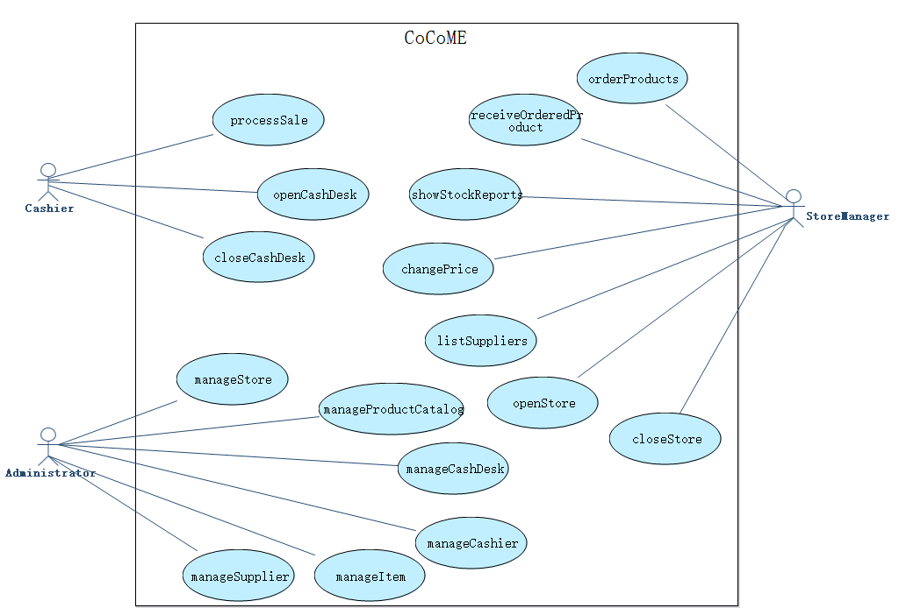
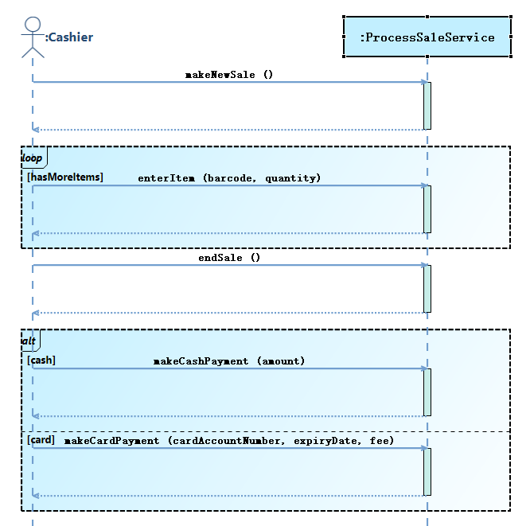
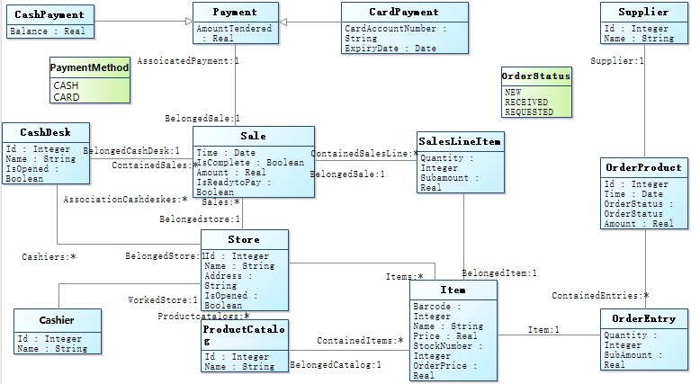

# 1   Introduction
## 1.1   Purpose
This subsection should

- a) Delineate the purpose of the SRS;
- b) Specify the intended audience for the SRS.
## 1.2   Scope
Name of software to be developed: CoCoME System

This subsection should

- b) Explain what the software product(s) will, and, if necessary, will not do;
- c) Describe the application of the software being specifified, including relevant benefifits, objectives, and goals;
- d) Be consistent with similar statements in higher-level specififications (e.g., the system requirements specifification), if they exist.
## 1.3   Definitions, acronyms, and abbreviations
This subsection should provide the defifinitions of all terms, acronyms, and abbreviations required to properly interpret the SRS. This information may be provided by reference to one or more appendixes in the SRS or by reference to other documents.
## 1.4   References
This subsection should

- a) Provide a complete list of all documents referenced elsewhere in the SRS;
- b) Identify each document by title, report number (if applicable), date, and publishing organization;
- c) Specify the sources from which the references can be obtained.

This information may be provided by reference to an appendix or to another document.

## 1.5   Overview
This subsection should

- a) Describe what the rest of the SRS contains;
- b) Explain how the SRS is organized.
# 2  Overall description
## 2.1  Product perspective
This subsection of the SRS should put the product into perspective with other related products. If the product is independent and totally self-contained, it should be so stated here. If the SRS defines a product that is a component of a larger system, as frequently occurs, then this subsection should relate the requirements of that larger system to functionality of the software and should identify interfaces between that system and the software.
## 2.2  Product functions
## 2.3  User characteristics
The applicable objects of this system are Cashier, StoreManager, Administrator.
If they know the basic operation of computer, they can use the system to operate the required functions.
Maybe some users need some relevant training.
## 2.4  Constraints
This subsection of the SRS should provide a general description of any other items that will limit the developer’s options. These include

- a) Regulatory policies;
- b) Hardware limitations (e.g., signal timing requirements);
- c) Interfaces to other applications;
- d) Parallel operation;
- e) Audit functions;
- f) Control functions;
- g) Higher-order language requirements;
- h) Signal handshake protocols (e.g., XON-XOFF, ACK-NACK);
- i) Reliability requirements;
- j) Criticality of the application;
- k) Safety and security considerations.
## 2.5  Assumptions and dependencies
This subsection of the SRS should list each of the factors that affect the requirements stated in the SRS. These factors are not design constraints on the software but are, rather, any changes to them that can affect the requirements in the SRS. For example, an assumption may be that a specific operating system will be available on the hardware designated for the software product. If, in fact, the operating system is not available, the SRS would then have to change accordingly. 
## 2.6  Apportioning of requirements
This subsection of the SRS should identify requirements that may be delayed until future versions of the system.
# 3  Specific requirements
## 3.1  Functional requirements
### 3.1.1   User Requirements
<b>Use Case Diagram</b>



<b>A1 - Cashier</b>
<table>
	<tr>
		<td><b>Actor Name:</b></td>
		<td colspan="5"><span name ="ACTORCashier">Cashier</span></td>
	</tr>
	<tr>
		<td><b>Actor ID:</b></td>
		<td colspan="5">A1</td>
	</tr>
	<tr>
		<td><b>Description:</b></td>
		<td colspan="5">The cashier is responsible for opening or closing the cash desk and the checkout of items</td>
	</tr>				   
<tr>
	<td colspan="5"><b>Required Functions</b></td>
	<td><b>Related Use Case</b></td>
</tr>
<tr>
			<td colspan="5">The cashier checks out items</td>
			<td><a href="#UCprocessSale">processSale</a></td>
	</tr>
<tr>
			<td colspan="5">The cashier opens cash desk</td>
			<td><a href="#UCopenCashDesk">openCashDesk</a></td>
	</tr>
<tr>
			<td colspan="5">The cashier closes cash desk</td>
			<td><a href="#UCcloseCashDesk">closeCashDesk</a></td>
	</tr>
</table>
<b>A2 - StoreManager</b>
<table>
	<tr>
		<td><b>Actor Name:</b></td>
		<td colspan="5"><span name ="ACTORStoreManager">StoreManager</span></td>
	</tr>
	<tr>
		<td><b>Actor ID:</b></td>
		<td colspan="5">A2</td>
	</tr>
	<tr>
		<td><b>Description:</b></td>
		<td colspan="5">The store manager is responsible for procurement and price setting of items,and opening or closing the store</td>
	</tr>				   
<tr>
	<td colspan="5"><b>Required Functions</b></td>
	<td><b>Related Use Case</b></td>
</tr>
<tr>
			<td colspan="5">The store manager places an order for purchase</td>
			<td><a href="#UCorderProducts">orderProducts</a></td>
	</tr>
<tr>
			<td colspan="5">The store manager receives the order for purchase</td>
			<td><a href="#UCreceiveOrderedProduct">receiveOrderedProduct</a></td>
	</tr>
<tr>
			<td colspan="5">The store manager views the stock report</td>
			<td><a href="#UCshowStockReports">showStockReports</a></td>
	</tr>
<tr>
			<td colspan="5">The store manager changes the price of item</td>
			<td><a href="#UCchangePrice">changePrice</a></td>
	</tr>
<tr>
			<td colspan="5">The store manager views all suppliers</td>
			<td><a href="#UClistSuppliers">listSuppliers</a></td>
	</tr>
<tr>
			<td colspan="5">The store manager opens the store</td>
			<td><a href="#UCopenStore">openStore</a></td>
	</tr>
<tr>
			<td colspan="5">The store manager closes the store</td>
			<td><a href="#UCcloseStore">closeStore</a></td>
	</tr>
</table>
<b>A3 - Administrator</b>
<table>
	<tr>
		<td><b>Actor Name:</b></td>
		<td colspan="5"><span name ="ACTORAdministrator">Administrator</span></td>
	</tr>
	<tr>
		<td><b>Actor ID:</b></td>
		<td colspan="5">A3</td>
	</tr>
	<tr>
		<td><b>Description:</b></td>
		<td colspan="5">The system administrator is responsible for managing information, including store information, cash desk information, cashier information, item information, item catalogue information and supplier information</td>
	</tr>				   
<tr>
	<td colspan="5"><b>Required Functions</b></td>
	<td><b>Related Use Case</b></td>
</tr>
<tr>
			<td colspan="5">The administrator manages store information, including entering, inquiring, modifying and deleting of store information</td>
			<td><a href="#UCmanageStore">manageStore</a></td>
	</tr>
<tr>
			<td colspan="5">The administrator manages catalogues of items, including entering, inquiring, modifying and deleting of catalogue information</td>
			<td><a href="#UCmanageProductCatalog">manageProductCatalog</a></td>
	</tr>
<tr>
			<td colspan="5">The administrator manages cash desk information, including entering, inquiring, modifying and deleting of cash desk information</td>
			<td><a href="#UCmanageCashDesk">manageCashDesk</a></td>
	</tr>
<tr>
			<td colspan="5">The administrator manages cashier information, including entering, inquiring, modifying and deleting of cashier information</td>
			<td><a href="#UCmanageCashier">manageCashier</a></td>
	</tr>
<tr>
			<td colspan="5">The administrator manages item information, including entering, inquiring, modifying and deleting of item information</td>
			<td><a href="#UCmanageItem">manageItem</a></td>
	</tr>
<tr>
			<td colspan="5">The administrator manages supplier information, including entering, inquiring, modifying and deleting of supplier information</td>
			<td><a href="#UCmanageSupplier">manageSupplier</a></td>
	</tr>
</table>

### 3.1.2   System Requirement
#### 3.1.2.1 Use Case Description
<b>UC1 - processSale</b>

<table>
	<tr>
		<td><b>UseCase Name:</b></td>
		<td><span name ="UCprocessSale">processSale</span></td>
	</tr>
	<tr>
		<td><b>UseCase ID:</b></td>
		<td>UC1</td>
	</tr>
	<tr>
		<td><b>Brief Description:</b></td>
		<td>The cashier checks out items</td>
	</tr>
	<tr>
		<td><b>Involved Actor:</b></td>
	<td><a href="#ACTORCashier">Cashier</a></td>
	</tr>
	<tr>
		<td><b>Preconditions:</b></td>
		<td><ol></ol></td>
	</tr>
	<tr>
		<td><b>Postconditions:</b></td>
		<td><ol></ol></td>
	</tr>						
	<tr>
		<td><b>Basic Path:</b></td>
	<td><p>1. Cashier clicks to execute the operation <a href="#OPmakeNewSale">makeNewSale</a></p><p>2. Cashier clicks to execute the operation <a href="#OPenterItem">enterItem</a>, with entering barcode, quantity</p><p>&emsp;<i>If hasMoreItems, repeat the step(s) 2 </i></p><p>3. Cashier clicks to execute the operation <a href="#OPendSale">endSale</a></p><p>4.  Execute  paymentMethodAlt</p><p>&emsp;Select cash:</p><p>&emsp;&emsp;Cashier clicks to execute the operation <a href="#OPmakeCashPayment">makeCashPayment</a>, with entering amount</p><p>&emsp;Select card:</p><p>&emsp;&emsp;Cashier clicks to execute the operation <a href="#OPmakeCardPayment">makeCardPayment</a>, with entering cardAccountNumber, expiryDate, fee</p></td>
	</tr>
	<tr>
		<td><b>Alternative Path:</b></td>
		<td></td>
	</tr>
	</table>



<b>UC2 - openCashDesk</b>

<table>
	<tr>
		<td><b>UseCase Name:</b></td>
		<td><span name ="UCopenCashDesk">openCashDesk</span></td>
	</tr>
	<tr>
		<td><b>UseCase ID:</b></td>
		<td>UC2</td>
	</tr>
	<tr>
		<td><b>Brief Description:</b></td>
		<td>The cashier opens cash desk</td>
	</tr>
	<tr>
		<td><b>Involved Actor:</b></td>
	<td><a href="#ACTORCashier">Cashier</a></td>
	</tr>
	<tr>
		<td><b>Preconditions:</b></td>
		<td><ol></ol></td>
	</tr>
	<tr>
		<td><b>Postconditions:</b></td>
		<td><ol></ol></td>
	</tr>						
	<tr>
		<td><b>Basic Path:</b></td>
	<td></td>
	</tr>
	<tr>
		<td><b>Alternative Path:</b></td>
		<td></td>
	</tr>
	</table>
 

<b>UC3 - closeCashDesk</b>

<table>
	<tr>
		<td><b>UseCase Name:</b></td>
		<td><span name ="UCcloseCashDesk">closeCashDesk</span></td>
	</tr>
	<tr>
		<td><b>UseCase ID:</b></td>
		<td>UC3</td>
	</tr>
	<tr>
		<td><b>Brief Description:</b></td>
		<td>The cashier closes cash desk</td>
	</tr>
	<tr>
		<td><b>Involved Actor:</b></td>
	<td><a href="#ACTORCashier">Cashier</a></td>
	</tr>
	<tr>
		<td><b>Preconditions:</b></td>
		<td><ol></ol></td>
	</tr>
	<tr>
		<td><b>Postconditions:</b></td>
		<td><ol></ol></td>
	</tr>						
	<tr>
		<td><b>Basic Path:</b></td>
	<td></td>
	</tr>
	<tr>
		<td><b>Alternative Path:</b></td>
		<td></td>
	</tr>
	</table>
 

<b>UC4 - orderProducts</b>

<table>
	<tr>
		<td><b>UseCase Name:</b></td>
		<td><span name ="UCorderProducts">orderProducts</span></td>
	</tr>
	<tr>
		<td><b>UseCase ID:</b></td>
		<td>UC4</td>
	</tr>
	<tr>
		<td><b>Brief Description:</b></td>
		<td>The store manager places an order for purchase</td>
	</tr>
	<tr>
		<td><b>Involved Actor:</b></td>
	<td><a href="#ACTORStoreManager">StoreManager</a></td>
	</tr>
	<tr>
		<td><b>Preconditions:</b></td>
		<td><ol></ol></td>
	</tr>
	<tr>
		<td><b>Postconditions:</b></td>
		<td><ol></ol></td>
	</tr>						
	<tr>
		<td><b>Basic Path:</b></td>
	<td></td>
	</tr>
	<tr>
		<td><b>Alternative Path:</b></td>
		<td></td>
	</tr>
	</table>
 

<b>UC5 - receiveOrderedProduct</b>

<table>
	<tr>
		<td><b>UseCase Name:</b></td>
		<td><span name ="UCreceiveOrderedProduct">receiveOrderedProduct</span></td>
	</tr>
	<tr>
		<td><b>UseCase ID:</b></td>
		<td>UC5</td>
	</tr>
	<tr>
		<td><b>Brief Description:</b></td>
		<td>The store manager receives the order for purchase</td>
	</tr>
	<tr>
		<td><b>Involved Actor:</b></td>
	<td><a href="#ACTORStoreManager">StoreManager</a></td>
	</tr>
	<tr>
		<td><b>Preconditions:</b></td>
		<td><ol></ol></td>
	</tr>
	<tr>
		<td><b>Postconditions:</b></td>
		<td><ol></ol></td>
	</tr>						
	<tr>
		<td><b>Basic Path:</b></td>
	<td></td>
	</tr>
	<tr>
		<td><b>Alternative Path:</b></td>
		<td></td>
	</tr>
	</table>
 

<b>UC6 - showStockReports</b>

<table>
	<tr>
		<td><b>UseCase Name:</b></td>
		<td><span name ="UCshowStockReports">showStockReports</span></td>
	</tr>
	<tr>
		<td><b>UseCase ID:</b></td>
		<td>UC6</td>
	</tr>
	<tr>
		<td><b>Brief Description:</b></td>
		<td>The store manager views the stock report</td>
	</tr>
	<tr>
		<td><b>Involved Actor:</b></td>
	<td><a href="#ACTORStoreManager">StoreManager</a></td>
	</tr>
	<tr>
		<td><b>Preconditions:</b></td>
		<td><ol></ol></td>
	</tr>
	<tr>
		<td><b>Postconditions:</b></td>
		<td><ol></ol></td>
	</tr>						
	<tr>
		<td><b>Basic Path:</b></td>
	<td></td>
	</tr>
	<tr>
		<td><b>Alternative Path:</b></td>
		<td></td>
	</tr>
	</table>
 

<b>UC7 - changePrice</b>

<table>
	<tr>
		<td><b>UseCase Name:</b></td>
		<td><span name ="UCchangePrice">changePrice</span></td>
	</tr>
	<tr>
		<td><b>UseCase ID:</b></td>
		<td>UC7</td>
	</tr>
	<tr>
		<td><b>Brief Description:</b></td>
		<td>The store manager changes the price of item</td>
	</tr>
	<tr>
		<td><b>Involved Actor:</b></td>
	<td><a href="#ACTORStoreManager">StoreManager</a></td>
	</tr>
	<tr>
		<td><b>Preconditions:</b></td>
		<td><ol></ol></td>
	</tr>
	<tr>
		<td><b>Postconditions:</b></td>
		<td><ol></ol></td>
	</tr>						
	<tr>
		<td><b>Basic Path:</b></td>
	<td></td>
	</tr>
	<tr>
		<td><b>Alternative Path:</b></td>
		<td></td>
	</tr>
	</table>
 

<b>UC8 - listSuppliers</b>

<table>
	<tr>
		<td><b>UseCase Name:</b></td>
		<td><span name ="UClistSuppliers">listSuppliers</span></td>
	</tr>
	<tr>
		<td><b>UseCase ID:</b></td>
		<td>UC8</td>
	</tr>
	<tr>
		<td><b>Brief Description:</b></td>
		<td>The store manager views all suppliers</td>
	</tr>
	<tr>
		<td><b>Involved Actor:</b></td>
	<td><a href="#ACTORStoreManager">StoreManager</a></td>
	</tr>
	<tr>
		<td><b>Preconditions:</b></td>
		<td><ol></ol></td>
	</tr>
	<tr>
		<td><b>Postconditions:</b></td>
		<td><ol></ol></td>
	</tr>						
	<tr>
		<td><b>Basic Path:</b></td>
	<td></td>
	</tr>
	<tr>
		<td><b>Alternative Path:</b></td>
		<td></td>
	</tr>
	</table>
 

<b>UC9 - openStore</b>

<table>
	<tr>
		<td><b>UseCase Name:</b></td>
		<td><span name ="UCopenStore">openStore</span></td>
	</tr>
	<tr>
		<td><b>UseCase ID:</b></td>
		<td>UC9</td>
	</tr>
	<tr>
		<td><b>Brief Description:</b></td>
		<td>The store manager opens the store</td>
	</tr>
	<tr>
		<td><b>Involved Actor:</b></td>
	<td><a href="#ACTORStoreManager">StoreManager</a></td>
	</tr>
	<tr>
		<td><b>Preconditions:</b></td>
		<td><ol></ol></td>
	</tr>
	<tr>
		<td><b>Postconditions:</b></td>
		<td><ol></ol></td>
	</tr>						
	<tr>
		<td><b>Basic Path:</b></td>
	<td></td>
	</tr>
	<tr>
		<td><b>Alternative Path:</b></td>
		<td></td>
	</tr>
	</table>
 

<b>UC10 - closeStore</b>

<table>
	<tr>
		<td><b>UseCase Name:</b></td>
		<td><span name ="UCcloseStore">closeStore</span></td>
	</tr>
	<tr>
		<td><b>UseCase ID:</b></td>
		<td>UC10</td>
	</tr>
	<tr>
		<td><b>Brief Description:</b></td>
		<td>The store manager closes the store</td>
	</tr>
	<tr>
		<td><b>Involved Actor:</b></td>
	<td><a href="#ACTORStoreManager">StoreManager</a></td>
	</tr>
	<tr>
		<td><b>Preconditions:</b></td>
		<td><ol></ol></td>
	</tr>
	<tr>
		<td><b>Postconditions:</b></td>
		<td><ol></ol></td>
	</tr>						
	<tr>
		<td><b>Basic Path:</b></td>
	<td></td>
	</tr>
	<tr>
		<td><b>Alternative Path:</b></td>
		<td></td>
	</tr>
	</table>
 

<b>UC11 - manageStore</b>

<table>
	<tr>
		<td><b>UseCase Name:</b></td>
		<td><span name ="UCmanageStore">manageStore</span></td>
	</tr>
	<tr>
		<td><b>UseCase ID:</b></td>
		<td>UC11</td>
	</tr>
	<tr>
		<td><b>Brief Description:</b></td>
		<td>The administrator manages store information, including entering, inquiring, modifying and deleting of store information</td>
	</tr>
	<tr>
		<td><b>Involved Actor:</b></td>
	<td><a href="#ACTORAdministrator">Administrator</a></td>
	</tr>
	<tr>
		<td><b>Preconditions:</b></td>
		<td><ol></ol></td>
	</tr>
	<tr>
		<td><b>Postconditions:</b></td>
		<td><ol></ol></td>
	</tr>						
	<tr>
		<td><b>Basic Path:</b></td>
	<td></td>
	</tr>
	<tr>
		<td><b>Alternative Path:</b></td>
		<td></td>
	</tr>
	</table>
 

<b>UC12 - manageProductCatalog</b>

<table>
	<tr>
		<td><b>UseCase Name:</b></td>
		<td><span name ="UCmanageProductCatalog">manageProductCatalog</span></td>
	</tr>
	<tr>
		<td><b>UseCase ID:</b></td>
		<td>UC12</td>
	</tr>
	<tr>
		<td><b>Brief Description:</b></td>
		<td>The administrator manages catalogues of items, including entering, inquiring, modifying and deleting of catalogue information</td>
	</tr>
	<tr>
		<td><b>Involved Actor:</b></td>
	<td><a href="#ACTORAdministrator">Administrator</a></td>
	</tr>
	<tr>
		<td><b>Preconditions:</b></td>
		<td><ol></ol></td>
	</tr>
	<tr>
		<td><b>Postconditions:</b></td>
		<td><ol></ol></td>
	</tr>						
	<tr>
		<td><b>Basic Path:</b></td>
	<td></td>
	</tr>
	<tr>
		<td><b>Alternative Path:</b></td>
		<td></td>
	</tr>
	</table>
 

<b>UC13 - manageCashDesk</b>

<table>
	<tr>
		<td><b>UseCase Name:</b></td>
		<td><span name ="UCmanageCashDesk">manageCashDesk</span></td>
	</tr>
	<tr>
		<td><b>UseCase ID:</b></td>
		<td>UC13</td>
	</tr>
	<tr>
		<td><b>Brief Description:</b></td>
		<td>The administrator manages cash desk information, including entering, inquiring, modifying and deleting of cash desk information</td>
	</tr>
	<tr>
		<td><b>Involved Actor:</b></td>
	<td><a href="#ACTORAdministrator">Administrator</a></td>
	</tr>
	<tr>
		<td><b>Preconditions:</b></td>
		<td><ol></ol></td>
	</tr>
	<tr>
		<td><b>Postconditions:</b></td>
		<td><ol></ol></td>
	</tr>						
	<tr>
		<td><b>Basic Path:</b></td>
	<td></td>
	</tr>
	<tr>
		<td><b>Alternative Path:</b></td>
		<td></td>
	</tr>
	</table>
 

<b>UC14 - manageCashier</b>

<table>
	<tr>
		<td><b>UseCase Name:</b></td>
		<td><span name ="UCmanageCashier">manageCashier</span></td>
	</tr>
	<tr>
		<td><b>UseCase ID:</b></td>
		<td>UC14</td>
	</tr>
	<tr>
		<td><b>Brief Description:</b></td>
		<td>The administrator manages cashier information, including entering, inquiring, modifying and deleting of cashier information</td>
	</tr>
	<tr>
		<td><b>Involved Actor:</b></td>
	<td><a href="#ACTORAdministrator">Administrator</a></td>
	</tr>
	<tr>
		<td><b>Preconditions:</b></td>
		<td><ol></ol></td>
	</tr>
	<tr>
		<td><b>Postconditions:</b></td>
		<td><ol></ol></td>
	</tr>						
	<tr>
		<td><b>Basic Path:</b></td>
	<td></td>
	</tr>
	<tr>
		<td><b>Alternative Path:</b></td>
		<td></td>
	</tr>
	</table>
 

<b>UC15 - manageItem</b>

<table>
	<tr>
		<td><b>UseCase Name:</b></td>
		<td><span name ="UCmanageItem">manageItem</span></td>
	</tr>
	<tr>
		<td><b>UseCase ID:</b></td>
		<td>UC15</td>
	</tr>
	<tr>
		<td><b>Brief Description:</b></td>
		<td>The administrator manages item information, including entering, inquiring, modifying and deleting of item information</td>
	</tr>
	<tr>
		<td><b>Involved Actor:</b></td>
	<td><a href="#ACTORAdministrator">Administrator</a></td>
	</tr>
	<tr>
		<td><b>Preconditions:</b></td>
		<td><ol></ol></td>
	</tr>
	<tr>
		<td><b>Postconditions:</b></td>
		<td><ol></ol></td>
	</tr>						
	<tr>
		<td><b>Basic Path:</b></td>
	<td></td>
	</tr>
	<tr>
		<td><b>Alternative Path:</b></td>
		<td></td>
	</tr>
	</table>
 

<b>UC16 - manageSupplier</b>

<table>
	<tr>
		<td><b>UseCase Name:</b></td>
		<td><span name ="UCmanageSupplier">manageSupplier</span></td>
	</tr>
	<tr>
		<td><b>UseCase ID:</b></td>
		<td>UC16</td>
	</tr>
	<tr>
		<td><b>Brief Description:</b></td>
		<td>The administrator manages supplier information, including entering, inquiring, modifying and deleting of supplier information</td>
	</tr>
	<tr>
		<td><b>Involved Actor:</b></td>
	<td><a href="#ACTORAdministrator">Administrator</a></td>
	</tr>
	<tr>
		<td><b>Preconditions:</b></td>
		<td><ol></ol></td>
	</tr>
	<tr>
		<td><b>Postconditions:</b></td>
		<td><ol></ol></td>
	</tr>						
	<tr>
		<td><b>Basic Path:</b></td>
	<td></td>
	</tr>
	<tr>
		<td><b>Alternative Path:</b></td>
		<td></td>
	</tr>
	</table>
 


#### 3.1.2.2   Entity Analysis
<b>Conceptual Class Diagram</b> 



<b>E1 - Store</b>

<table>
	<tr>
		<td><b>Entity Name:</b></td>
		   <td colspan="3"><span name ="CLASSStore">Store</span></td>
	</tr>
	<tr>
		<td><b>Entity ID:</b></td>
		   <td colspan="3">E1</td>
	</tr>
	<tr>
	    <td><b>Entity Description:</b></td>
	    <td colspan="3">The place where items are sold</td>
	</tr>
	<tr>
	    <td><b>Attribute Name</b></td>
		<td><b>Attribute Type</b></td>
		<td colspan="2"><b>Attribute Description</b></td>
	</tr>
	<tr>
	    <td>Id</td>
	<td>Integer</td>
	<td colspan="2">The Id of Store</td>
					</tr>
	<tr>
	    <td>Name</td>
	<td>String</td>
	<td colspan="2">The Name of Store</td>
					</tr>
	<tr>
	    <td>Address</td>
	<td>String</td>
	<td colspan="2">The Address of Store</td>
					</tr>
	<tr>
	    <td>IsOpened</td>
	<td>Boolean</td>
	<td colspan="2">The IsOpened of Store</td>
					</tr>
	<tr>
	    <td><b>Relationship Name</b></td>
	<td><b>Related Entity</b></td>
	<td><b>Relationship Type</b></td>
	<td><b>Relationship Description</b></td>
	</tr>
		<tr>
			<td>AssociationCashdeskes</td>
			<td><a href="#CLASSCashDesk">CashDesk</a></td>
			<td>Association</td>
		<td>One Store is linked with many CashDesk</td>
	</tr>
		<tr>
			<td>Productcatalogs</td>
			<td><a href="#CLASSProductCatalog">ProductCatalog</a></td>
			<td>Association</td>
		<td>One Store is linked to many ProductCatalog</td>
	</tr>
		<tr>
			<td>Items</td>
			<td><a href="#CLASSItem">Item</a></td>
			<td>Association</td>
		<td>One Store is linked to many Item</td>
	</tr>
		<tr>
			<td>Cashiers</td>
			<td><a href="#CLASSCashier">Cashier</a></td>
			<td>Association</td>
		<td>One Store is linked with many Cashier</td>
	</tr>
		<tr>
			<td>Sales</td>
			<td><a href="#CLASSSale">Sale</a></td>
			<td>Association</td>
		<td>One Store is linked with many Sale</td>
	</tr>
	</table>

<b>E2 - ProductCatalog</b>

<table>
	<tr>
		<td><b>Entity Name:</b></td>
		   <td colspan="3"><span name ="CLASSProductCatalog">ProductCatalog</span></td>
	</tr>
	<tr>
		<td><b>Entity ID:</b></td>
		   <td colspan="3">E2</td>
	</tr>
	<tr>
	    <td><b>Entity Description:</b></td>
	    <td colspan="3">The catalogue of items</td>
	</tr>
	<tr>
	    <td><b>Attribute Name</b></td>
		<td><b>Attribute Type</b></td>
		<td colspan="2"><b>Attribute Description</b></td>
	</tr>
	<tr>
	    <td>Id</td>
	<td>Integer</td>
	<td colspan="2">The Id of ProductCatalog</td>
					</tr>
	<tr>
	    <td>Name</td>
	<td>String</td>
	<td colspan="2">The Name of ProductCatalog</td>
					</tr>
	<tr>
	    <td><b>Relationship Name</b></td>
	<td><b>Related Entity</b></td>
	<td><b>Relationship Type</b></td>
	<td><b>Relationship Description</b></td>
	</tr>
		<tr>
			<td>ContainedItems</td>
			<td><a href="#CLASSItem">Item</a></td>
			<td>Association</td>
		<td>One ProductCatalog is linked with many Item</td>
	</tr>
	</table>

<b>E3 - CashDesk</b>

<table>
	<tr>
		<td><b>Entity Name:</b></td>
		   <td colspan="3"><span name ="CLASSCashDesk">CashDesk</span></td>
	</tr>
	<tr>
		<td><b>Entity ID:</b></td>
		   <td colspan="3">E3</td>
	</tr>
	<tr>
	    <td><b>Entity Description:</b></td>
	    <td colspan="3">The cash desk in store</td>
	</tr>
	<tr>
	    <td><b>Attribute Name</b></td>
		<td><b>Attribute Type</b></td>
		<td colspan="2"><b>Attribute Description</b></td>
	</tr>
	<tr>
	    <td>Id</td>
	<td>Integer</td>
	<td colspan="2">The Id of CashDesk</td>
					</tr>
	<tr>
	    <td>Name</td>
	<td>String</td>
	<td colspan="2">The Name of CashDesk</td>
					</tr>
	<tr>
	    <td>IsOpened</td>
	<td>Boolean</td>
	<td colspan="2">The IsOpened of CashDesk</td>
					</tr>
	<tr>
	    <td><b>Relationship Name</b></td>
	<td><b>Related Entity</b></td>
	<td><b>Relationship Type</b></td>
	<td><b>Relationship Description</b></td>
	</tr>
		<tr>
			<td>ContainedSales</td>
			<td><a href="#CLASSSale">Sale</a></td>
			<td>Association</td>
		<td>One CashDesk is linked with many Sale</td>
	</tr>
		<tr>
			<td>BelongedStore</td>
			<td><a href="#CLASSStore">Store</a></td>
			<td>Association</td>
		<td>Many CashDesk are linked with one Store</td>
	</tr>
	</table>

<b>E4 - Sale</b>

<table>
	<tr>
		<td><b>Entity Name:</b></td>
		   <td colspan="3"><span name ="CLASSSale">Sale</span></td>
	</tr>
	<tr>
		<td><b>Entity ID:</b></td>
		   <td colspan="3">E4</td>
	</tr>
	<tr>
	    <td><b>Entity Description:</b></td>
	    <td colspan="3">The sales order for items</td>
	</tr>
	<tr>
	    <td><b>Attribute Name</b></td>
		<td><b>Attribute Type</b></td>
		<td colspan="2"><b>Attribute Description</b></td>
	</tr>
	<tr>
	    <td>Time</td>
	<td>LocalDate</td>
	<td colspan="2">The Time of Sale</td>
					</tr>
	<tr>
	    <td>IsComplete</td>
	<td>Boolean</td>
	<td colspan="2">The IsComplete of Sale</td>
					</tr>
	<tr>
	    <td>Amount</td>
	<td>Real</td>
	<td colspan="2">The Amount of Sale</td>
					</tr>
	<tr>
	    <td>IsReadytoPay</td>
	<td>Boolean</td>
	<td colspan="2">The IsReadytoPay of Sale</td>
					</tr>
	<tr>
	    <td><b>Relationship Name</b></td>
	<td><b>Related Entity</b></td>
	<td><b>Relationship Type</b></td>
	<td><b>Relationship Description</b></td>
	</tr>
		<tr>
			<td>Belongedstore</td>
			<td><a href="#CLASSStore">Store</a></td>
			<td>Association</td>
		<td>Many Sale are linked with one Store</td>
	</tr>
		<tr>
			<td>BelongedCashDesk</td>
			<td><a href="#CLASSCashDesk">CashDesk</a></td>
			<td>Association</td>
		<td>Many Sale are linked with one CashDesk</td>
	</tr>
		<tr>
			<td>ContainedSalesLine</td>
			<td><a href="#CLASSSalesLineItem">SalesLineItem</a></td>
			<td>Association</td>
		<td>One Sale is linked with many SalesLineItem</td>
	</tr>
		<tr>
			<td>AssoicatedPayment</td>
			<td><a href="#CLASSPayment">Payment</a></td>
			<td>Association</td>
		<td>One Sale is linked with one Payment</td>
	</tr>
	</table>

<b>E5 - Cashier</b>

<table>
	<tr>
		<td><b>Entity Name:</b></td>
		   <td colspan="3"><span name ="CLASSCashier">Cashier</span></td>
	</tr>
	<tr>
		<td><b>Entity ID:</b></td>
		   <td colspan="3">E5</td>
	</tr>
	<tr>
	    <td><b>Entity Description:</b></td>
	    <td colspan="3">The cashier in store</td>
	</tr>
	<tr>
	    <td><b>Attribute Name</b></td>
		<td><b>Attribute Type</b></td>
		<td colspan="2"><b>Attribute Description</b></td>
	</tr>
	<tr>
	    <td>Id</td>
	<td>Integer</td>
	<td colspan="2">The Id of Cashier</td>
					</tr>
	<tr>
	    <td>Name</td>
	<td>String</td>
	<td colspan="2">The Name of Cashier</td>
					</tr>
	<tr>
	    <td><b>Relationship Name</b></td>
	<td><b>Related Entity</b></td>
	<td><b>Relationship Type</b></td>
	<td><b>Relationship Description</b></td>
	</tr>
		<tr>
			<td>WorkedStore</td>
			<td><a href="#CLASSStore">Store</a></td>
			<td>Association</td>
		<td>Many Cashier are linked with one Store</td>
	</tr>
	</table>

<b>E6 - SalesLineItem</b>

<table>
	<tr>
		<td><b>Entity Name:</b></td>
		   <td colspan="3"><span name ="CLASSSalesLineItem">SalesLineItem</span></td>
	</tr>
	<tr>
		<td><b>Entity ID:</b></td>
		   <td colspan="3">E6</td>
	</tr>
	<tr>
	    <td><b>Entity Description:</b></td>
	    <td colspan="3">The sales order for a item</td>
	</tr>
	<tr>
	    <td><b>Attribute Name</b></td>
		<td><b>Attribute Type</b></td>
		<td colspan="2"><b>Attribute Description</b></td>
	</tr>
	<tr>
	    <td>Quantity</td>
	<td>Integer</td>
	<td colspan="2">The Quantity of SalesLineItem</td>
					</tr>
	<tr>
	    <td>Subamount</td>
	<td>Real</td>
	<td colspan="2">The Subamount of SalesLineItem</td>
					</tr>
	<tr>
	    <td><b>Relationship Name</b></td>
	<td><b>Related Entity</b></td>
	<td><b>Relationship Type</b></td>
	<td><b>Relationship Description</b></td>
	</tr>
		<tr>
			<td>BelongedSale</td>
			<td><a href="#CLASSSale">Sale</a></td>
			<td>Association</td>
		<td>Many SalesLineItem are linked with one Sale</td>
	</tr>
		<tr>
			<td>BelongedItem</td>
			<td><a href="#CLASSItem">Item</a></td>
			<td>Association</td>
		<td>One SalesLineItem is linked to one Item</td>
	</tr>
	</table>

<b>E7 - Item</b>

<table>
	<tr>
		<td><b>Entity Name:</b></td>
		   <td colspan="3"><span name ="CLASSItem">Item</span></td>
	</tr>
	<tr>
		<td><b>Entity ID:</b></td>
		   <td colspan="3">E7</td>
	</tr>
	<tr>
	    <td><b>Entity Description:</b></td>
	    <td colspan="3">The item to be sold</td>
	</tr>
	<tr>
	    <td><b>Attribute Name</b></td>
		<td><b>Attribute Type</b></td>
		<td colspan="2"><b>Attribute Description</b></td>
	</tr>
	<tr>
	    <td>Barcode</td>
	<td>Integer</td>
	<td colspan="2">The Barcode of Item</td>
					</tr>
	<tr>
	    <td>Name</td>
	<td>String</td>
	<td colspan="2">The Name of Item</td>
					</tr>
	<tr>
	    <td>Price</td>
	<td>Real</td>
	<td colspan="2">The Price of Item</td>
					</tr>
	<tr>
	    <td>StockNumber</td>
	<td>Integer</td>
	<td colspan="2">The StockNumber of Item</td>
					</tr>
	<tr>
	    <td>OrderPrice</td>
	<td>Real</td>
	<td colspan="2">The OrderPrice of Item</td>
					</tr>
	<tr>
	    <td><b>Relationship Name</b></td>
	<td><b>Related Entity</b></td>
	<td><b>Relationship Type</b></td>
	<td><b>Relationship Description</b></td>
	</tr>
		<tr>
			<td>BelongedCatalog</td>
			<td><a href="#CLASSProductCatalog">ProductCatalog</a></td>
			<td>Association</td>
		<td>Many Item are linked with one ProductCatalog</td>
	</tr>
	</table>

<b>E8 - Payment</b>

<table>
	<tr>
		<td><b>Entity Name:</b></td>
		   <td colspan="3"><span name ="CLASSPayment">Payment</span></td>
	</tr>
	<tr>
		<td><b>Entity ID:</b></td>
		   <td colspan="3">E8</td>
	</tr>
	<tr>
	    <td><b>Entity Description:</b></td>
	    <td colspan="3">The bill for the goods sold</td>
	</tr>
	<tr>
	    <td><b>Attribute Name</b></td>
		<td><b>Attribute Type</b></td>
		<td colspan="2"><b>Attribute Description</b></td>
	</tr>
	<tr>
	    <td>AmountTendered</td>
	<td>Real</td>
	<td colspan="2">The AmountTendered of Payment</td>
					</tr>
	<tr>
	    <td><b>Relationship Name</b></td>
	<td><b>Related Entity</b></td>
	<td><b>Relationship Type</b></td>
	<td><b>Relationship Description</b></td>
	</tr>
		<tr>
			<td>BelongedSale</td>
			<td><a href="#CLASSSale">Sale</a></td>
			<td>Association</td>
		<td>One Payment is linked with one Sale</td>
	</tr>
	</table>

<b>E9 - CashPayment</b>

<table>
	<tr>
		<td><b>Entity Name:</b></td>
		   <td colspan="3"><span name ="CLASSCashPayment">CashPayment</span></td>
	</tr>
	<tr>
		<td><b>Entity ID:</b></td>
		   <td colspan="3">E9</td>
	</tr>
	<tr>
	    <td><b>Entity Description:</b></td>
	    <td colspan="3">Pay in cash</td>
	</tr>
	<tr>
		<td><b>Super Entity:</b></td>
		<td colspan="3"><a href="#CLASSPayment">Payment</a></td>
					</tr>
	<tr>
	    <td><b>Attribute Name</b></td>
		<td><b>Attribute Type</b></td>
		<td colspan="2"><b>Attribute Description</b></td>
	</tr>
	<tr>
	    <td>Balance</td>
	<td>Real</td>
	<td colspan="2">The Balance of CashPayment</td>
					</tr>
	</table>

<b>E10 - CardPayment</b>

<table>
	<tr>
		<td><b>Entity Name:</b></td>
		   <td colspan="3"><span name ="CLASSCardPayment">CardPayment</span></td>
	</tr>
	<tr>
		<td><b>Entity ID:</b></td>
		   <td colspan="3">E10</td>
	</tr>
	<tr>
	    <td><b>Entity Description:</b></td>
	    <td colspan="3">Pay in card</td>
	</tr>
	<tr>
		<td><b>Super Entity:</b></td>
		<td colspan="3"><a href="#CLASSPayment">Payment</a></td>
					</tr>
	<tr>
	    <td><b>Attribute Name</b></td>
		<td><b>Attribute Type</b></td>
		<td colspan="2"><b>Attribute Description</b></td>
	</tr>
	<tr>
	    <td>CardAccountNumber</td>
	<td>String</td>
	<td colspan="2">The CardAccountNumber of CardPayment</td>
					</tr>
	<tr>
	    <td>ExpiryDate</td>
	<td>LocalDate</td>
	<td colspan="2">The ExpiryDate of CardPayment</td>
					</tr>
	</table>

<b>E11 - OrderEntry</b>

<table>
	<tr>
		<td><b>Entity Name:</b></td>
		   <td colspan="3"><span name ="CLASSOrderEntry">OrderEntry</span></td>
	</tr>
	<tr>
		<td><b>Entity ID:</b></td>
		   <td colspan="3">E11</td>
	</tr>
	<tr>
	    <td><b>Entity Description:</b></td>
	    <td colspan="3">The purchase order for a item</td>
	</tr>
	<tr>
	    <td><b>Attribute Name</b></td>
		<td><b>Attribute Type</b></td>
		<td colspan="2"><b>Attribute Description</b></td>
	</tr>
	<tr>
	    <td>Quantity</td>
	<td>Integer</td>
	<td colspan="2">The Quantity of OrderEntry</td>
					</tr>
	<tr>
	    <td>SubAmount</td>
	<td>Real</td>
	<td colspan="2">The SubAmount of OrderEntry</td>
					</tr>
	<tr>
	    <td><b>Relationship Name</b></td>
	<td><b>Related Entity</b></td>
	<td><b>Relationship Type</b></td>
	<td><b>Relationship Description</b></td>
	</tr>
		<tr>
			<td>Item</td>
			<td><a href="#CLASSItem">Item</a></td>
			<td>Association</td>
		<td>One OrderEntry is linked to one Item</td>
	</tr>
	</table>

<b>E12 - Supplier</b>

<table>
	<tr>
		<td><b>Entity Name:</b></td>
		   <td colspan="3"><span name ="CLASSSupplier">Supplier</span></td>
	</tr>
	<tr>
		<td><b>Entity ID:</b></td>
		   <td colspan="3">E12</td>
	</tr>
	<tr>
	    <td><b>Entity Description:</b></td>
	    <td colspan="3">The supplier of items</td>
	</tr>
	<tr>
	    <td><b>Attribute Name</b></td>
		<td><b>Attribute Type</b></td>
		<td colspan="2"><b>Attribute Description</b></td>
	</tr>
	<tr>
	    <td>Id</td>
	<td>Integer</td>
	<td colspan="2">The Id of Supplier</td>
					</tr>
	<tr>
	    <td>Name</td>
	<td>String</td>
	<td colspan="2">The Name of Supplier</td>
					</tr>
	</table>

<b>E13 - OrderProduct</b>

<table>
	<tr>
		<td><b>Entity Name:</b></td>
		   <td colspan="3"><span name ="CLASSOrderProduct">OrderProduct</span></td>
	</tr>
	<tr>
		<td><b>Entity ID:</b></td>
		   <td colspan="3">E13</td>
	</tr>
	<tr>
	    <td><b>Entity Description:</b></td>
	    <td colspan="3">The purchase order for items</td>
	</tr>
	<tr>
	    <td><b>Attribute Name</b></td>
		<td><b>Attribute Type</b></td>
		<td colspan="2"><b>Attribute Description</b></td>
	</tr>
	<tr>
	    <td>Id</td>
	<td>Integer</td>
	<td colspan="2">The Id of OrderProduct</td>
					</tr>
	<tr>
	    <td>Time</td>
	<td>LocalDate</td>
	<td colspan="2">The Time of OrderProduct</td>
					</tr>
	<tr>
	    <td>OrderStatus</td>
	<td>[NEW|RECEIVED|REQUESTED]</td>
	<td colspan="2">The OrderStatus of OrderProduct</td>
					</tr>
	<tr>
	    <td>Amount</td>
	<td>Real</td>
	<td colspan="2">The Amount of OrderProduct</td>
					</tr>
	<tr>
	    <td><b>Relationship Name</b></td>
	<td><b>Related Entity</b></td>
	<td><b>Relationship Type</b></td>
	<td><b>Relationship Description</b></td>
	</tr>
		<tr>
			<td>Supplier</td>
			<td><a href="#CLASSSupplier">Supplier</a></td>
			<td>Association</td>
		<td>One OrderProduct is linked to one Supplier</td>
	</tr>
		<tr>
			<td>ContainedEntries</td>
			<td><a href="#CLASSOrderEntry">OrderEntry</a></td>
			<td>Association</td>
		<td>One OrderProduct is linked to many OrderEntry</td>
	</tr>
	</table>
​	 

#### 3.1.2.3   System Interfaces
##### System Interfaces
<b>SI1 - CoCoMESystem</b>
<table>
	<tr>
		<td><b>System Interface Name:</b></td>
		<td><span name ="SERVICECoCoMESystem">CoCoMESystem</span></td>
	</tr>
	<tr>
		<td><b>System Interface ID:</b></td>
		<td>SI1</td>
	</tr>
	<tr>
		<td><b>Description:</b></td>
		<td></td>
	</tr>
	<tr>
		<td><b>Operation:</b></td>
	<td><ul><li><a href="#OPopenCashDesk">openCashDesk</a></li><li><a href="#OPcloseCashDesk">closeCashDesk</a></li><li><a href="#OPopenStore">openStore</a></li><li><a href="#OPcloseStore">closeStore</a></li><li><a href="#OPchangePrice">changePrice</a></li><li><a href="#OPreceiveOrderedProduct">receiveOrderedProduct</a></li><li><a href="#OPlistSuppliers">listSuppliers</a></li><li><a href="#OPshowStockReports">showStockReports</a></li></ul></td>
	</tr>
<tr>
			<td><b>Temporary Variable</b></td>
			<td><b>Variable Description</b></td>
	</tr>
	<tr>
		<td><span name ="CoCoMESystemcurrentCashDesk">currentCashDesk</span></td>
		<td>currentCashDesk is a object of <a href="#CLASSCashDesk">CashDesk</a></td>
					</tr>
	<tr>
		<td><span name ="CoCoMESystemcurrentStore">currentStore</span></td>
		<td>currentStore is a object of <a href="#CLASSStore">Store</a></td>
					</tr>
	</table>

<b>SI2 - ThirdPartyServices</b>
<table>
	<tr>
		<td><b>System Interface Name:</b></td>
		<td><span name ="SERVICEThirdPartyServices">ThirdPartyServices</span></td>
	</tr>
	<tr>
		<td><b>System Interface ID:</b></td>
		<td>SI2</td>
	</tr>
	<tr>
		<td><b>Description:</b></td>
		<td></td>
	</tr>
	<tr>
		<td><b>Operation:</b></td>
	<td><ul><li><a href="#OPthirdPartyCardPaymentService">thirdPartyCardPaymentService</a></li></ul></td>
	</tr>
	</table>

<b>SI3 - ProcessSaleService</b>
<table>
	<tr>
		<td><b>System Interface Name:</b></td>
		<td><span name ="SERVICEProcessSaleService">ProcessSaleService</span></td>
	</tr>
	<tr>
		<td><b>System Interface ID:</b></td>
		<td>SI3</td>
	</tr>
	<tr>
		<td><b>Description:</b></td>
		<td></td>
	</tr>
	<tr>
		<td><b>Operation:</b></td>
	<td><ul><li><a href="#OPmakeNewSale">makeNewSale</a></li><li><a href="#OPenterItem">enterItem</a></li><li><a href="#OPendSale">endSale</a></li><li><a href="#OPmakeCashPayment">makeCashPayment</a></li><li><a href="#OPmakeCardPayment">makeCardPayment</a></li></ul></td>
	</tr>
<tr>
			<td><b>Temporary Variable</b></td>
			<td><b>Variable Description</b></td>
	</tr>
	<tr>
		<td><span name ="ProcessSaleServicecurrentSaleLine">currentSaleLine</span></td>
		<td>currentSaleLine is a object of <a href="#CLASSSalesLineItem">SalesLineItem</a></td>
					</tr>
	<tr>
		<td><span name ="ProcessSaleServicecurrentSale">currentSale</span></td>
		<td>currentSale is a object of <a href="#CLASSSale">Sale</a></td>
					</tr>
	<tr>
		<td><span name ="ProcessSaleServicecurrentPaymentMethod">currentPaymentMethod</span></td>
		<td>currentPaymentMethod has several options: [CASH|CARD]</td>
					</tr>
	</table>

<b>SI4 - ManageStoreCRUDService</b>
<table>
	<tr>
		<td><b>System Interface Name:</b></td>
		<td><span name ="SERVICEManageStoreCRUDService">ManageStoreCRUDService</span></td>
	</tr>
	<tr>
		<td><b>System Interface ID:</b></td>
		<td>SI4</td>
	</tr>
	<tr>
		<td><b>Description:</b></td>
		<td></td>
	</tr>
	<tr>
		<td><b>Operation:</b></td>
	<td><ul><li><a href="#OPcreateStore">createStore</a></li><li><a href="#OPqueryStore">queryStore</a></li><li><a href="#OPmodifyStore">modifyStore</a></li><li><a href="#OPdeleteStore">deleteStore</a></li></ul></td>
	</tr>
	</table>

<b>SI5 - ManageProductCatalogCRUDService</b>
<table>
	<tr>
		<td><b>System Interface Name:</b></td>
		<td><span name ="SERVICEManageProductCatalogCRUDService">ManageProductCatalogCRUDService</span></td>
	</tr>
	<tr>
		<td><b>System Interface ID:</b></td>
		<td>SI5</td>
	</tr>
	<tr>
		<td><b>Description:</b></td>
		<td></td>
	</tr>
	<tr>
		<td><b>Operation:</b></td>
	<td><ul><li><a href="#OPcreateProductCatalog">createProductCatalog</a></li><li><a href="#OPqueryProductCatalog">queryProductCatalog</a></li><li><a href="#OPmodifyProductCatalog">modifyProductCatalog</a></li><li><a href="#OPdeleteProductCatalog">deleteProductCatalog</a></li></ul></td>
	</tr>
	</table>

<b>SI6 - ManageCashDeskCRUDService</b>
<table>
	<tr>
		<td><b>System Interface Name:</b></td>
		<td><span name ="SERVICEManageCashDeskCRUDService">ManageCashDeskCRUDService</span></td>
	</tr>
	<tr>
		<td><b>System Interface ID:</b></td>
		<td>SI6</td>
	</tr>
	<tr>
		<td><b>Description:</b></td>
		<td></td>
	</tr>
	<tr>
		<td><b>Operation:</b></td>
	<td><ul><li><a href="#OPcreateCashDesk">createCashDesk</a></li><li><a href="#OPqueryCashDesk">queryCashDesk</a></li><li><a href="#OPmodifyCashDesk">modifyCashDesk</a></li><li><a href="#OPdeleteCashDesk">deleteCashDesk</a></li></ul></td>
	</tr>
	</table>

<b>SI7 - ManageCashierCRUDService</b>
<table>
	<tr>
		<td><b>System Interface Name:</b></td>
		<td><span name ="SERVICEManageCashierCRUDService">ManageCashierCRUDService</span></td>
	</tr>
	<tr>
		<td><b>System Interface ID:</b></td>
		<td>SI7</td>
	</tr>
	<tr>
		<td><b>Description:</b></td>
		<td></td>
	</tr>
	<tr>
		<td><b>Operation:</b></td>
	<td><ul><li><a href="#OPcreateCashier">createCashier</a></li><li><a href="#OPqueryCashier">queryCashier</a></li><li><a href="#OPmodifyCashier">modifyCashier</a></li><li><a href="#OPdeleteCashier">deleteCashier</a></li></ul></td>
	</tr>
	</table>

<b>SI8 - ManageItemCRUDService</b>
<table>
	<tr>
		<td><b>System Interface Name:</b></td>
		<td><span name ="SERVICEManageItemCRUDService">ManageItemCRUDService</span></td>
	</tr>
	<tr>
		<td><b>System Interface ID:</b></td>
		<td>SI8</td>
	</tr>
	<tr>
		<td><b>Description:</b></td>
		<td></td>
	</tr>
	<tr>
		<td><b>Operation:</b></td>
	<td><ul><li><a href="#OPcreateItem">createItem</a></li><li><a href="#OPqueryItem">queryItem</a></li><li><a href="#OPmodifyItem">modifyItem</a></li><li><a href="#OPdeleteItem">deleteItem</a></li></ul></td>
	</tr>
	</table>

<b>SI9 - ManageSupplierCRUDService</b>
<table>
	<tr>
		<td><b>System Interface Name:</b></td>
		<td><span name ="SERVICEManageSupplierCRUDService">ManageSupplierCRUDService</span></td>
	</tr>
	<tr>
		<td><b>System Interface ID:</b></td>
		<td>SI9</td>
	</tr>
	<tr>
		<td><b>Description:</b></td>
		<td></td>
	</tr>
	<tr>
		<td><b>Operation:</b></td>
	<td><ul><li><a href="#OPcreateSupplier">createSupplier</a></li><li><a href="#OPquerySupplier">querySupplier</a></li><li><a href="#OPmodifySupplier">modifySupplier</a></li><li><a href="#OPdeleteSupplier">deleteSupplier</a></li></ul></td>
	</tr>
	</table>

<b>SI10 - CoCoMEOrderProducts</b>
<table>
	<tr>
		<td><b>System Interface Name:</b></td>
		<td><span name ="SERVICECoCoMEOrderProducts">CoCoMEOrderProducts</span></td>
	</tr>
	<tr>
		<td><b>System Interface ID:</b></td>
		<td>SI10</td>
	</tr>
	<tr>
		<td><b>Description:</b></td>
		<td></td>
	</tr>
	<tr>
		<td><b>Operation:</b></td>
	<td><ul><li><a href="#OPmakeNewOrder">makeNewOrder</a></li><li><a href="#OPlistAllOutOfStoreProducts">listAllOutOfStoreProducts</a></li><li><a href="#OPorderItem">orderItem</a></li><li><a href="#OPchooseSupplier">chooseSupplier</a></li><li><a href="#OPplaceOrder">placeOrder</a></li></ul></td>
	</tr>
<tr>
			<td><b>Temporary Variable</b></td>
			<td><b>Variable Description</b></td>
	</tr>
	<tr>
		<td><span name ="CoCoMEOrderProductscurrentOrderProduct">currentOrderProduct</span></td>
		<td>currentOrderProduct is a object of <a href="#CLASSOrderProduct">OrderProduct</a></td>
					</tr>
	</table>
​	 

##### System Operation Description
<b>OP1 - openStore</b>
<table>
	<tr>
		<td><b>Operation Name:</b></td>
		<td><span name ="OPopenStore">openStore</span></td>
	</tr>
	<tr>
		<td><b>Operation ID:</b></td>
		<td>OP1</td>
	</tr>
	<tr>
		<td><b>Description:</b></td>
		<td> </td>
	</tr>
	<tr>
		<td><b>Service:</b></td>
		<td><a href="#SERVICECoCoMESystem">CoCoMESystem</a></td>
	</tr>
	<tr>
		<td><b>Input:</b></td>
<td><p>name: <i>storeID</i>, type: Integer</p></td>
</tr>
<tr>
	<td><b>Output Type:</b></td>
	<td>Boolean</td>
</tr>
<tr>
			<td><b>Definition:</b></td>
<td><p><i>sto</i> is the object <i>s</i> in the instance set of class <a href="#CLASSStore">Store</a>. <i>s</i> represents an object of class <a href="#CLASSStore">Store</a>, and <i>s</i> meets:</p><p>&emsp;&emsp;The attribute <i>Id</i> of the object <i>s</i> is equal to <i>storeID</i></p></td>
	</tr>
	<tr>
<td><b>Preconditions:</b></td>
		<td><p>1. <i>sto</i> exists</p><p>2. The attribute <i>IsOpened</i> of the object <i>sto</i> is equal to <b>false</b></p></td>
</tr>
	<tr>
		<td><b>Postconditions:</b></td>
	<td><p>1. The object <a href="#CoCoMESystemcurrentStore">currentStore</a> became <i>sto</i></p><p>2. The attribute <i>IsOpened</i> of the object <i>sto</i> became <b>true</b></p><p>3. The return value was <b>true</b></p></td>
	</tr>
</table>

<p>Contract of openStore:</p>

```java
Contract CoCoMESystem::openStore(storeID : Integer) : Boolean {
		/*
		 * Generated by RM2Doc - Definition
		 * sto is the object s in the instance set of class Store. s represents an object of class Store, and s meets:
		 *     The attribute Id of the object s is equal to storeID
		 */
		definition:
			sto:Store = Store.allInstance()->any(s:Store | s.Id = storeID)
		/*
		 * Generated by RM2Doc - Precondition
		 * sto exists
		 * The attribute IsOpened of the object sto is equal to false
		 */
		precondition:
			sto.oclIsUndefined() = false and
			sto.IsOpened = false
		/*
		 * Generated by RM2Doc - Postcondition
		 * The object currentStore became sto
		 * The attribute IsOpened of the object sto became true
		 * The return value was true
		 */
		postcondition:
			self.currentStore = sto and
			sto.IsOpened = true and
			result = true
}
```

<b>OP2 - closeStore</b>
<table>
	<tr>
		<td><b>Operation Name:</b></td>
		<td><span name ="OPcloseStore">closeStore</span></td>
	</tr>
	<tr>
		<td><b>Operation ID:</b></td>
		<td>OP2</td>
	</tr>
	<tr>
		<td><b>Description:</b></td>
		<td> </td>
	</tr>
	<tr>
		<td><b>Service:</b></td>
		<td><a href="#SERVICECoCoMESystem">CoCoMESystem</a></td>
	</tr>
	<tr>
		<td><b>Input:</b></td>
<td><p>name: <i>storeID</i>, type: Integer</p></td>
</tr>
<tr>
	<td><b>Output Type:</b></td>
	<td>Boolean</td>
</tr>
<tr>
			<td><b>Definition:</b></td>
<td><p><i>sto</i> is the object <i>s</i> in the instance set of class <a href="#CLASSStore">Store</a>. <i>s</i> represents an object of class <a href="#CLASSStore">Store</a>, and <i>s</i> meets:</p><p>&emsp;&emsp;The attribute <i>Id</i> of the object <i>s</i> is equal to <i>storeID</i></p></td>
	</tr>
	<tr>
<td><b>Preconditions:</b></td>
		<td><p>1. <i>sto</i> exists</p><p>2. The attribute <i>IsOpened</i> of the object <i>sto</i> is equal to <b>true</b></p></td>
</tr>
	<tr>
		<td><b>Postconditions:</b></td>
	<td><p>1. The attribute <i>IsOpened</i> of the object <i>sto</i> became <b>false</b></p><p>2. The return value was <b>true</b></p></td>
	</tr>
</table>

<p>Contract of closeStore:</p>

```java
Contract CoCoMESystem::closeStore(storeID : Integer) : Boolean {
		/*
		 * Generated by RM2Doc - Definition
		 * sto is the object s in the instance set of class Store. s represents an object of class Store, and s meets:
		 *     The attribute Id of the object s is equal to storeID
		 */
		definition:
			sto:Store = Store.allInstance()->any(s:Store | s.Id = storeID)
		/*
		 * Generated by RM2Doc - Precondition
		 * sto exists
		 * The attribute IsOpened of the object sto is equal to true
		 */
		precondition:
			sto.oclIsUndefined() = false and
			sto.IsOpened = true
		/*
		 * Generated by RM2Doc - Postcondition
		 * The attribute IsOpened of the object sto became false
		 * The return value was true
		 */
		postcondition:
			sto.IsOpened = false and
			result = true
}
```

<b>OP3 - openCashDesk</b>
<table>
	<tr>
		<td><b>Operation Name:</b></td>
		<td><span name ="OPopenCashDesk">openCashDesk</span></td>
	</tr>
	<tr>
		<td><b>Operation ID:</b></td>
		<td>OP3</td>
	</tr>
	<tr>
		<td><b>Description:</b></td>
		<td> </td>
	</tr>
	<tr>
		<td><b>Service:</b></td>
		<td><a href="#SERVICECoCoMESystem">CoCoMESystem</a></td>
	</tr>
	<tr>
		<td><b>Input:</b></td>
<td><p>name: <i>cashDeskID</i>, type: Integer</p></td>
</tr>
<tr>
	<td><b>Output Type:</b></td>
	<td>Boolean</td>
</tr>
<tr>
			<td><b>Definition:</b></td>
<td><p><i>cd</i> is the object <i>s</i> in the instance set of class <a href="#CLASSCashDesk">CashDesk</a>. <i>s</i> represents an object of class <a href="#CLASSCashDesk">CashDesk</a>, and <i>s</i> meets:</p><p>&emsp;&emsp;The attribute <i>Id</i> of the object <i>s</i> is equal to <i>cashDeskID</i></p></td>
	</tr>
	<tr>
<td><b>Preconditions:</b></td>
		<td><p>1. <i>cd</i> exists</p><p>2. The attribute <i>IsOpened</i> of the object <i>cd</i> is equal to <b>false</b></p><p>3. <i>currentStore</i> exists</p><p>4. The attribute <i>IsOpened</i> of the object <i>currentStore</i> is equal to <b>true</b></p></td>
</tr>
	<tr>
		<td><b>Postconditions:</b></td>
	<td><p>1. The object <a href="#CoCoMESystemcurrentCashDesk">currentCashDesk</a> became <i>cd</i></p><p>2. The attribute <i>IsOpened</i> of the object <i>cd</i> became <b>true</b></p><p>3. The return value was <b>true</b></p></td>
	</tr>
</table>

<p>Contract of openCashDesk:</p>

```java
Contract CoCoMESystem::openCashDesk(cashDeskID : Integer) : Boolean {
		/*
		 * Generated by RM2Doc - Definition
		 * cd is the object s in the instance set of class CashDesk. s represents an object of class CashDesk, and s meets:
		 *     The attribute Id of the object s is equal to cashDeskID
		 */
		definition:
			cd:CashDesk = CashDesk.allInstance()->any(s:CashDesk | s.Id = cashDeskID)
		/*
		 * Generated by RM2Doc - Precondition
		 * cd exists
		 * The attribute IsOpened of the object cd is equal to false
		 * currentStore exists
		 * The attribute IsOpened of the object currentStore is equal to true
		 */
		precondition:
			cd.oclIsUndefined() = false and
			cd.IsOpened = false and
			currentStore.oclIsUndefined() = false and
			currentStore.IsOpened = true
		/*
		 * Generated by RM2Doc - Postcondition
		 * The object currentCashDesk became cd
		 * The attribute IsOpened of the object cd became true
		 * The return value was true
		 */
		postcondition:
			self.currentCashDesk = cd and
			cd.IsOpened = true and
			result = true
}
```

<b>OP4 - closeCashDesk</b>
<table>
	<tr>
		<td><b>Operation Name:</b></td>
		<td><span name ="OPcloseCashDesk">closeCashDesk</span></td>
	</tr>
	<tr>
		<td><b>Operation ID:</b></td>
		<td>OP4</td>
	</tr>
	<tr>
		<td><b>Description:</b></td>
		<td> </td>
	</tr>
	<tr>
		<td><b>Service:</b></td>
		<td><a href="#SERVICECoCoMESystem">CoCoMESystem</a></td>
	</tr>
	<tr>
		<td><b>Input:</b></td>
<td><p>name: <i>cashDeskID</i>, type: Integer</p></td>
</tr>
<tr>
	<td><b>Output Type:</b></td>
	<td>Boolean</td>
</tr>
<tr>
			<td><b>Definition:</b></td>
<td><p><i>cd</i> is the object <i>s</i> in the instance set of class <a href="#CLASSCashDesk">CashDesk</a>. <i>s</i> represents an object of class <a href="#CLASSCashDesk">CashDesk</a>, and <i>s</i> meets:</p><p>&emsp;&emsp;The attribute <i>Id</i> of the object <i>s</i> is equal to <i>cashDeskID</i></p></td>
	</tr>
	<tr>
<td><b>Preconditions:</b></td>
		<td><p>1. <i>cd</i> exists</p><p>2. The attribute <i>IsOpened</i> of the object <i>cd</i> is equal to <b>true</b></p><p>3. <i>currentStore</i> exists</p><p>4. The attribute <i>IsOpened</i> of the object <i>currentStore</i> is equal to <b>true</b></p></td>
</tr>
	<tr>
		<td><b>Postconditions:</b></td>
	<td><p>1. The object <a href="#CoCoMESystemcurrentCashDesk">currentCashDesk</a> became <i>cd</i></p><p>2. The attribute <i>IsOpened</i> of the object <i>cd</i> became <b>false</b></p><p>3. The return value was <b>true</b></p></td>
	</tr>
</table>

<p>Contract of closeCashDesk:</p>

```java
Contract CoCoMESystem::closeCashDesk(cashDeskID : Integer) : Boolean {
		/*
		 * Generated by RM2Doc - Definition
		 * cd is the object s in the instance set of class CashDesk. s represents an object of class CashDesk, and s meets:
		 *     The attribute Id of the object s is equal to cashDeskID
		 */
		definition:
			cd:CashDesk = CashDesk.allInstance()->any(s:CashDesk | s.Id = cashDeskID)
		/*
		 * Generated by RM2Doc - Precondition
		 * cd exists
		 * The attribute IsOpened of the object cd is equal to true
		 * currentStore exists
		 * The attribute IsOpened of the object currentStore is equal to true
		 */
		precondition:
			cd.oclIsUndefined() = false and
			cd.IsOpened = true and
			currentStore.oclIsUndefined() = false and
			currentStore.IsOpened = true
		/*
		 * Generated by RM2Doc - Postcondition
		 * The object currentCashDesk became cd
		 * The attribute IsOpened of the object cd became false
		 * The return value was true
		 */
		postcondition:
			self.currentCashDesk = cd and
			cd.IsOpened = false and
			result = true
}
```

<b>OP5 - makeNewSale</b>
<table>
	<tr>
		<td><b>Operation Name:</b></td>
		<td><span name ="OPmakeNewSale">makeNewSale</span></td>
	</tr>
	<tr>
		<td><b>Operation ID:</b></td>
		<td>OP5</td>
	</tr>
	<tr>
		<td><b>Description:</b></td>
		<td> </td>
	</tr>
	<tr>
		<td><b>Service:</b></td>
		<td><a href="#SERVICEProcessSaleService">ProcessSaleService</a></td>
	</tr>
	<tr>
		<td><b>Input:</b></td>
<td>None</td>
</tr>
<tr>
	<td><b>Output Type:</b></td>
	<td>Boolean</td>
</tr>
	<tr>
<td><b>Preconditions:</b></td>
		<td><p>1. <i>currentCashDesk</i> exists</p><p>2. The attribute <i>IsOpened</i> of the object <i>currentCashDesk</i> is equal to <b>true</b></p><p>3. (<i>currentSale</i> doesn't exist, or (<i>currentSale</i> exists, and the attribute <i>IsComplete</i> of the object <i>currentSale</i> is equal to <b>true</b>))</p></td>
</tr>
	<tr>
		<td><b>Postconditions:</b></td>
	<td><p>1. <i>s</i> represented the object of class <a href="#CLASSSale">Sale</a></p><p>2. The object <i>s</i> was created</p><p>3. The object <i>s</i> was linked to the object <i>currentCashDesk</i> by <i>BelongedCashDesk</i></p><p>4. The object <i>currentCashDesk</i> was linked to the object <i>s</i> by <i>ContainedSales</i></p><p>5. The attribute <i>IsComplete</i> of the object <i>s</i> became <b>false</b></p><p>6. The attribute <i>IsReadytoPay</i> of the object <i>s</i> became <b>false</b></p><p>7. The object <i>s</i> was put into the instance set of class <a href="#CLASSSale">Sale</a></p><p>8. The object <a href="#ProcessSaleServicecurrentSale">currentSale</a> became <i>s</i></p><p>9. The return value was <b>true</b></p></td>
	</tr>
</table>

<p>Contract of makeNewSale:</p>

```java
Contract ProcessSaleService::makeNewSale() : Boolean {
		/*
		 * Generated by RM2Doc - Precondition
		 * currentCashDesk exists
		 * The attribute IsOpened of the object currentCashDesk is equal to true
		 * (currentSale doesn't exist, or (currentSale exists, and the attribute IsComplete of the object currentSale is equal to true))
		 */
		precondition:
			currentCashDesk.oclIsUndefined() = false and
			currentCashDesk.IsOpened = true and
			(currentSale.oclIsUndefined() = true or
				(currentSale.oclIsUndefined() = false and
					currentSale.IsComplete = true
				)
			)
		/*
		 * Generated by RM2Doc - Postcondition
		 * s represented the object of class Sale
		 * The object s was created
		 * The object s was linked to the object currentCashDesk by BelongedCashDesk
		 * The object currentCashDesk was linked to the object s by ContainedSales
		 * The attribute IsComplete of the object s became false
		 * The attribute IsReadytoPay of the object s became false
		 * The object s was put into the instance set of class Sale
		 * The object currentSale became s
		 * The return value was true
		 */
		postcondition:
			let s:Sale in
			s.oclIsNew() and
			s.BelongedCashDesk = currentCashDesk and
			currentCashDesk.ContainedSales->includes(s) and
			s.IsComplete = false and
			s.IsReadytoPay = false and
			Sale.allInstance()->includes(s) and
			self.currentSale = s and
			result = true
}
```

<b>OP6 - enterItem</b>
<table>
	<tr>
		<td><b>Operation Name:</b></td>
		<td><span name ="OPenterItem">enterItem</span></td>
	</tr>
	<tr>
		<td><b>Operation ID:</b></td>
		<td>OP6</td>
	</tr>
	<tr>
		<td><b>Description:</b></td>
		<td> </td>
	</tr>
	<tr>
		<td><b>Service:</b></td>
		<td><a href="#SERVICEProcessSaleService">ProcessSaleService</a></td>
	</tr>
	<tr>
		<td><b>Input:</b></td>
<td><p>1. name: <i>barcode</i>, type: Integer</p><p>2. name: <i>quantity</i>, type: Integer</p></td>
</tr>
<tr>
	<td><b>Output Type:</b></td>
	<td>Boolean</td>
</tr>
<tr>
			<td><b>Definition:</b></td>
<td><p><i>item</i> is the object <i>i</i> in the instance set of class <a href="#CLASSItem">Item</a>. <i>i</i> represents an object of class <a href="#CLASSItem">Item</a>, and <i>i</i> meets:</p><p>&emsp;&emsp;The attribute <i>Barcode</i> of the object <i>i</i> is equal to <i>barcode</i></p></td>
	</tr>
	<tr>
<td><b>Preconditions:</b></td>
		<td><p>1. <i>currentSale</i> exists</p><p>2. The attribute <i>IsComplete</i> of the object <i>currentSale</i> is equal to <b>false</b></p><p>3. <i>item</i> exists</p><p>4. The attribute <i>StockNumber</i> of the object <i>item</i> is greater than <b>0</b></p></td>
</tr>
	<tr>
		<td><b>Postconditions:</b></td>
	<td><p>1. <i>sli</i> represented the object of class <a href="#CLASSSalesLineItem">SalesLineItem</a></p><p>2. The object <i>sli</i> was created</p><p>3. The object <a href="#ProcessSaleServicecurrentSaleLine">currentSaleLine</a> became <i>sli</i></p><p>4. The object <i>sli</i> was linked to the object <i>currentSale</i> by <i>BelongedSale</i></p><p>5. The object <i>currentSale</i> was linked to the object <i>sli</i> by <i>ContainedSalesLine</i></p><p>6. The attribute <i>Quantity</i> of the object <i>sli</i> became <i>quantity</i></p><p>7. The object <i>sli</i> was linked to the object <i>item</i> by <i>BelongedItem</i></p><p>8. The attribute <i>StockNumber</i> of the object <i>item</i> became the previous value of the attribute <i>StockNumber</i> of the object <i>item</i> minus <i>quantity</i></p><p>9. The attribute <i>Subamount</i> of the object <i>sli</i> became the attribute <i>Price</i> of the object <i>item</i> times <i>quantity</i></p><p>10. The object <i>sli</i> was put into the instance set of class <a href="#CLASSSalesLineItem">SalesLineItem</a></p><p>11. The return value was <b>true</b></p></td>
	</tr>
</table>

<p>Contract of enterItem:</p>

```java
Contract ProcessSaleService::enterItem(barcode : Integer, quantity : Integer) : Boolean {
		/*
		 * Generated by RM2Doc - Definition
		 * item is the object i in the instance set of class Item. i represents an object of class Item, and i meets:
		 *     The attribute Barcode of the object i is equal to barcode
		 */
		definition:
			item:Item = Item.allInstance()->any(i:Item | i.Barcode = barcode)
		/*
		 * Generated by RM2Doc - Precondition
		 * currentSale exists
		 * The attribute IsComplete of the object currentSale is equal to false
		 * item exists
		 * The attribute StockNumber of the object item is greater than 0
		 */
		precondition:
			currentSale.oclIsUndefined() = false and
			currentSale.IsComplete = false and
			item.oclIsUndefined() = false and
			item.StockNumber > 0
		/*
		 * Generated by RM2Doc - Postcondition
		 * sli represented the object of class SalesLineItem
		 * The object sli was created
		 * The object currentSaleLine became sli
		 * The object sli was linked to the object currentSale by BelongedSale
		 * The object currentSale was linked to the object sli by ContainedSalesLine
		 * The attribute Quantity of the object sli became quantity
		 * The object sli was linked to the object item by BelongedItem
		 * The attribute StockNumber of the object item became the previous value of the attribute StockNumber of the object item minus quantity
		 * The attribute Subamount of the object sli became the attribute Price of the object item times quantity
		 * The object sli was put into the instance set of class SalesLineItem
		 * The return value was true
		 */
		postcondition:
			let sli:SalesLineItem in
			sli.oclIsNew() and
			self.currentSaleLine = sli and
			sli.BelongedSale = currentSale and
			currentSale.ContainedSalesLine->includes(sli) and
			sli.Quantity = quantity and
			sli.BelongedItem = item and
			item.StockNumber = item.StockNumber@pre - quantity and
			sli.Subamount = item.Price * quantity and
			SalesLineItem.allInstance()->includes(sli) and
			result = true
}
```

<b>OP7 - endSale</b>
<table>
	<tr>
		<td><b>Operation Name:</b></td>
		<td><span name ="OPendSale">endSale</span></td>
	</tr>
	<tr>
		<td><b>Operation ID:</b></td>
		<td>OP7</td>
	</tr>
	<tr>
		<td><b>Description:</b></td>
		<td> </td>
	</tr>
	<tr>
		<td><b>Service:</b></td>
		<td><a href="#SERVICEProcessSaleService">ProcessSaleService</a></td>
	</tr>
	<tr>
		<td><b>Input:</b></td>
<td>None</td>
</tr>
<tr>
	<td><b>Output Type:</b></td>
	<td>Real</td>
</tr>
<tr>
			<td><b>Definition:</b></td>
<td><p>1. <i>sls</i> is the Set of class <a href="#CLASSSalesLineItem">SalesLineItem</a>, including  which <i>currentSale</i> is linked to</p><p>2. <i>sub</i> is the Set of Real, including the <i>Subamount</i> of each object in the set <i>sls</i></p></td>
	</tr>
	<tr>
<td><b>Preconditions:</b></td>
		<td><p>1. <i>currentSale</i> exists</p><p>2. The attribute <i>IsComplete</i> of the object <i>currentSale</i> is equal to <b>false</b></p><p>3. The attribute <i>IsReadytoPay</i> of the object <i>currentSale</i> is equal to <b>false</b></p></td>
</tr>
	<tr>
		<td><b>Postconditions:</b></td>
	<td><p>1. The attribute <i>Amount</i> of the object <i>currentSale</i> became the sum of <i>sub</i></p><p>2. The attribute <i>IsReadytoPay</i> of the object <i>currentSale</i> became <b>true</b></p><p>3. The return value was the attribute <i>Amount</i> of the object <i>currentSale</i></p></td>
	</tr>
</table>

<p>Contract of endSale:</p>

```java
Contract ProcessSaleService::endSale() : Real {
		/*
		 * Generated by RM2Doc - Definition
		 * sls is the Set of class SalesLineItem, including  which currentSale is linked to
		 * sub is the Set of Real, including the Subamount of each object in the set sls
		 */
		definition:
			sls:Set(SalesLineItem) = currentSale.ContainedSalesLine,
			sub:Set(Real) = sls->collect(s:SalesLineItem | s.Subamount)
		/*
		 * Generated by RM2Doc - Precondition
		 * currentSale exists
		 * The attribute IsComplete of the object currentSale is equal to false
		 * The attribute IsReadytoPay of the object currentSale is equal to false
		 */
		precondition:
			currentSale.oclIsUndefined() = false and
			currentSale.IsComplete = false and
			currentSale.IsReadytoPay = false
		/*
		 * Generated by RM2Doc - Postcondition
		 * The attribute Amount of the object currentSale became the sum of sub
		 * The attribute IsReadytoPay of the object currentSale became true
		 * The return value was the attribute Amount of the object currentSale
		 */
		postcondition:
			currentSale.Amount = sub.sum() and
			currentSale.IsReadytoPay = true and
			result = currentSale.Amount
}
```

<b>OP8 - makeCashPayment</b>
<table>
	<tr>
		<td><b>Operation Name:</b></td>
		<td><span name ="OPmakeCashPayment">makeCashPayment</span></td>
	</tr>
	<tr>
		<td><b>Operation ID:</b></td>
		<td>OP8</td>
	</tr>
	<tr>
		<td><b>Description:</b></td>
		<td> </td>
	</tr>
	<tr>
		<td><b>Service:</b></td>
		<td><a href="#SERVICEProcessSaleService">ProcessSaleService</a></td>
	</tr>
	<tr>
		<td><b>Input:</b></td>
<td><p>name: <i>amount</i>, type: Real</p></td>
</tr>
<tr>
	<td><b>Output Type:</b></td>
	<td>Boolean</td>
</tr>
	<tr>
<td><b>Preconditions:</b></td>
		<td><p>1. <i>currentSale</i> exists</p><p>2. The attribute <i>IsComplete</i> of the object <i>currentSale</i> is equal to <b>false</b></p><p>3. The attribute <i>IsReadytoPay</i> of the object <i>currentSale</i> is equal to <b>true</b></p><p>4. The <i>amount</i> is greater than or equal to the attribute <i>Amount</i> of the object <i>currentSale</i></p></td>
</tr>
	<tr>
		<td><b>Postconditions:</b></td>
	<td><p>1. <i>cp</i> represented the object of class <a href="#CLASSCashPayment">CashPayment</a></p><p>2. The object <i>cp</i> was created</p><p>3. The attribute <i>AmountTendered</i> of the object <i>cp</i> became <i>amount</i></p><p>4. The object <i>cp</i> was linked to the object <i>currentSale</i> by <i>BelongedSale</i></p><p>5. The object <i>currentSale</i> was linked to the object <i>cp</i> by <i>AssoicatedPayment</i></p><p>6. The object <i>currentSale</i> was linked to the object <i>currentStore</i> by <i>Belongedstore</i></p><p>7. The object <i>currentStore</i> was linked to the object <i>currentSale</i> by <i>Sales</i></p><p>8. The attribute <i>IsComplete</i> of the object <i>currentSale</i> became <b>true</b></p><p>9. The attribute <i>Time</i> of the object <i>currentSale</i> was equal to <i>Now</i></p><p>10. The attribute <i>Balance</i> of the object <i>cp</i> became <i>amount</i> minus the attribute <i>Amount</i> of the object <i>currentSale</i></p><p>11. The object <i>cp</i> was put into the instance set of class <a href="#CLASSCashPayment">CashPayment</a></p><p>12. The return value was <b>true</b></p></td>
	</tr>
</table>

<p>Contract of makeCashPayment:</p>

```java
Contract ProcessSaleService::makeCashPayment(amount : Real) : Boolean {
		/*
		 * Generated by RM2Doc - Precondition
		 * currentSale exists
		 * The attribute IsComplete of the object currentSale is equal to false
		 * The attribute IsReadytoPay of the object currentSale is equal to true
		 * The amount is greater than or equal to the attribute Amount of the object currentSale
		 */
		precondition:
			currentSale.oclIsUndefined() = false and
			currentSale.IsComplete = false and
			currentSale.IsReadytoPay = true and
			amount >= currentSale.Amount
		/*
		 * Generated by RM2Doc - Postcondition
		 * cp represented the object of class CashPayment
		 * The object cp was created
		 * The attribute AmountTendered of the object cp became amount
		 * The object cp was linked to the object currentSale by BelongedSale
		 * The object currentSale was linked to the object cp by AssoicatedPayment
		 * The object currentSale was linked to the object currentStore by Belongedstore
		 * The object currentStore was linked to the object currentSale by Sales
		 * The attribute IsComplete of the object currentSale became true
		 * The attribute Time of the object currentSale was equal to Now
		 * The attribute Balance of the object cp became amount minus the attribute Amount of the object currentSale
		 * The object cp was put into the instance set of class CashPayment
		 * The return value was true
		 */
		postcondition:
			let cp:CashPayment in
			cp.oclIsNew() and
			cp.AmountTendered = amount and
			cp.BelongedSale = currentSale and
			currentSale.AssoicatedPayment = cp and
			currentSale.Belongedstore = currentStore and
			currentStore.Sales->includes(currentSale) and
			currentSale.IsComplete = true and
			currentSale.Time.isEqual(Now) and
			cp.Balance = amount - currentSale.Amount and
			CashPayment.allInstance()->includes(cp) and
			result = true
}
```

<b>OP9 - makeCardPayment</b>
<table>
	<tr>
		<td><b>Operation Name:</b></td>
		<td><span name ="OPmakeCardPayment">makeCardPayment</span></td>
	</tr>
	<tr>
		<td><b>Operation ID:</b></td>
		<td>OP9</td>
	</tr>
	<tr>
		<td><b>Description:</b></td>
		<td> </td>
	</tr>
	<tr>
		<td><b>Service:</b></td>
		<td><a href="#SERVICEProcessSaleService">ProcessSaleService</a></td>
	</tr>
	<tr>
		<td><b>Input:</b></td>
<td><p>1. name: <i>cardAccountNumber</i>, type: String</p><p>2. name: <i>expiryDate</i>, type: LocalDate</p><p>3. name: <i>fee</i>, type: Real</p></td>
</tr>
<tr>
	<td><b>Output Type:</b></td>
	<td>Boolean</td>
</tr>
	<tr>
<td><b>Preconditions:</b></td>
		<td><p>1. <i>currentSale</i> exists</p><p>2. The attribute <i>IsComplete</i> of the object <i>currentSale</i> is equal to <b>false</b></p><p>3. The attribute <i>IsReadytoPay</i> of the object <i>currentSale</i> is equal to <b>true</b></p><p>4. The system operation <a href="#OPthirdPartyCardPaymentService">thirdPartyCardPaymentService</a> is executed</p></td>
</tr>
	<tr>
		<td><b>Postconditions:</b></td>
	<td><p>1. <i>cdp</i> represented the object of class <a href="#CLASSCardPayment">CardPayment</a></p><p>2. The object <i>cdp</i> was created</p><p>3. The attribute <i>AmountTendered</i> of the object <i>cdp</i> became <i>fee</i></p><p>4. The object <i>cdp</i> was linked to the object <i>currentSale</i> by <i>BelongedSale</i></p><p>5. The object <i>currentSale</i> was linked to the object <i>cdp</i> by <i>AssoicatedPayment</i></p><p>6. The attribute <i>CardAccountNumber</i> of the object <i>cdp</i> became <i>cardAccountNumber</i></p><p>7. The attribute <i>ExpiryDate</i> of the object <i>cdp</i> became <i>expiryDate</i></p><p>8. The object <i>cdp</i> was put into the instance set of class <a href="#CLASSCardPayment">CardPayment</a></p><p>9. The object <i>currentSale</i> was linked to the object <i>currentStore</i> by <i>Belongedstore</i></p><p>10. The object <i>currentStore</i> was linked to the object <i>currentSale</i> by <i>Sales</i></p><p>11. The attribute <i>IsComplete</i> of the object <i>currentSale</i> became <b>true</b></p><p>12. The attribute <i>Time</i> of the object <i>currentSale</i> was equal to <i>Now</i></p><p>13. The return value was <b>true</b></p></td>
	</tr>
</table>

<p>Contract of makeCardPayment:</p>

```java
Contract ProcessSaleService::makeCardPayment(cardAccountNumber : String, expiryDate : Date, fee: Real) : Boolean {
		/*
		 * Generated by RM2Doc - Precondition
		 * currentSale exists
		 * The attribute IsComplete of the object currentSale is equal to false
		 * The attribute IsReadytoPay of the object currentSale is equal to true
		 * The system operation thirdPartyCardPaymentService is executed
		 */
		precondition:
			currentSale.oclIsUndefined() = false and
			currentSale.IsComplete = false and
			currentSale.IsReadytoPay = true and
			thirdPartyCardPaymentService(cardAccountNumber, expiryDate, fee)
		/*
		 * Generated by RM2Doc - Postcondition
		 * cdp represented the object of class CardPayment
		 * The object cdp was created
		 * The attribute AmountTendered of the object cdp became fee
		 * The object cdp was linked to the object currentSale by BelongedSale
		 * The object currentSale was linked to the object cdp by AssoicatedPayment
		 * The attribute CardAccountNumber of the object cdp became cardAccountNumber
		 * The attribute ExpiryDate of the object cdp became expiryDate
		 * The object cdp was put into the instance set of class CardPayment
		 * The object currentSale was linked to the object currentStore by Belongedstore
		 * The object currentStore was linked to the object currentSale by Sales
		 * The attribute IsComplete of the object currentSale became true
		 * The attribute Time of the object currentSale was equal to Now
		 * The return value was true
		 */
		postcondition:
			let cdp:CardPayment in
			cdp.oclIsNew() and
			cdp.AmountTendered = fee and
			cdp.BelongedSale = currentSale and
			currentSale.AssoicatedPayment = cdp and
			cdp.CardAccountNumber = cardAccountNumber and
			cdp.ExpiryDate = expiryDate and
			CardPayment.allInstance()->includes(cdp) and
			currentSale.Belongedstore = currentStore and
			currentStore.Sales->includes(currentSale) and
			currentSale.IsComplete = true and
			currentSale.Time.isEqual(Now) and
			result = true
}
```

<b>OP10 - thirdPartyCardPaymentService</b>
<table>
	<tr>
		<td><b>Operation Name:</b></td>
		<td><span name ="OPthirdPartyCardPaymentService">thirdPartyCardPaymentService</span></td>
	</tr>
	<tr>
		<td><b>Operation ID:</b></td>
		<td>OP10</td>
	</tr>
	<tr>
		<td><b>Description:</b></td>
		<td> </td>
	</tr>
	<tr>
		<td><b>Service:</b></td>
		<td><a href="#SERVICEThirdPartyServices">ThirdPartyServices</a></td>
	</tr>
	<tr>
		<td><b>Input:</b></td>
<td><p>1. name: <i>cardAccountNumber</i>, type: String</p><p>2. name: <i>expiryDate</i>, type: LocalDate</p><p>3. name: <i>fee</i>, type: Real</p></td>
</tr>
<tr>
	<td><b>Output Type:</b></td>
	<td>Boolean</td>
</tr>
	<tr>
<td><b>Preconditions:</b></td>
		<td><p>None</p></td>
</tr>
	<tr>
		<td><b>Postconditions:</b></td>
	<td><p>The return value was <b>true</b></p></td>
	</tr>
</table>

<p>Contract of thirdPartyCardPaymentService:</p>

```java
Contract  ThirdPartyServices::thirdPartyCardPaymentService(cardAccountNumber : String, expiryDate : Date, fee : Real) : Boolean {
		/*
		 * Generated by RM2Doc - Precondition
		 * None
		 */
		precondition:
			true
		/*
		 * Generated by RM2Doc - Postcondition
		 * The return value was true
		 */
		postcondition:
			result = true
}
```

<b>OP11 - makeNewOrder</b>
<table>
	<tr>
		<td><b>Operation Name:</b></td>
		<td><span name ="OPmakeNewOrder">makeNewOrder</span></td>
	</tr>
	<tr>
		<td><b>Operation ID:</b></td>
		<td>OP11</td>
	</tr>
	<tr>
		<td><b>Description:</b></td>
		<td> </td>
	</tr>
	<tr>
		<td><b>Service:</b></td>
		<td><a href="#SERVICECoCoMEOrderProducts">CoCoMEOrderProducts</a></td>
	</tr>
	<tr>
		<td><b>Input:</b></td>
<td><p>name: <i>orderid</i>, type: Integer</p></td>
</tr>
<tr>
	<td><b>Output Type:</b></td>
	<td>Boolean</td>
</tr>
	<tr>
<td><b>Preconditions:</b></td>
		<td><p>None</p></td>
</tr>
	<tr>
		<td><b>Postconditions:</b></td>
	<td><p>1. <i>op</i> represented the object of class <a href="#CLASSOrderProduct">OrderProduct</a></p><p>2. The object <i>op</i> was created</p><p>3. The attribute <i>OrderStatus</i> of the object <i>op</i> became <b>NEW</b></p><p>4. The attribute <i>Id</i> of the object <i>op</i> became <i>orderid</i></p><p>5. The attribute <i>Time</i> of the object <i>op</i> was equal to <i>Now</i></p><p>6. The object <i>op</i> was put into the instance set of class <a href="#CLASSOrderProduct">OrderProduct</a></p><p>7. The object <a href="#CoCoMEOrderProductscurrentOrderProduct">currentOrderProduct</a> became <i>op</i></p><p>8. The return value was <b>true</b></p></td>
	</tr>
</table>

<p>Contract of makeNewOrder:</p>

```java
Contract CoCoMEOrderProducts::makeNewOrder(orderid : Integer) : Boolean {
		/*
		 * Generated by RM2Doc - Precondition
		 * None
		 */
		precondition:
			true
		/*
		 * Generated by RM2Doc - Postcondition
		 * op represented the object of class OrderProduct
		 * The object op was created
		 * The attribute OrderStatus of the object op became NEW
		 * The attribute Id of the object op became orderid
		 * The attribute Time of the object op was equal to Now
		 * The object op was put into the instance set of class OrderProduct
		 * The object currentOrderProduct became op
		 * The return value was true
		 */
		postcondition:
			let op:OrderProduct in
			op.oclIsNew() and
			op.OrderStatus = OrderStatus::NEW and
			op.Id = orderid and
			op.Time.isEqual(Now) and
			OrderProduct.allInstance()->includes(op) and
			self.currentOrderProduct = op and
			result = true
}
```

<b>OP12 - listAllOutOfStoreProducts</b>
<table>
	<tr>
		<td><b>Operation Name:</b></td>
		<td><span name ="OPlistAllOutOfStoreProducts">listAllOutOfStoreProducts</span></td>
	</tr>
	<tr>
		<td><b>Operation ID:</b></td>
		<td>OP12</td>
	</tr>
	<tr>
		<td><b>Description:</b></td>
		<td> </td>
	</tr>
	<tr>
		<td><b>Service:</b></td>
		<td><a href="#SERVICECoCoMEOrderProducts">CoCoMEOrderProducts</a></td>
	</tr>
	<tr>
		<td><b>Input:</b></td>
<td>None</td>
</tr>
<tr>
	<td><b>Output Type:</b></td>
	<td>Set of Item</td>
</tr>
	<tr>
<td><b>Preconditions:</b></td>
		<td><p>None</p></td>
</tr>
	<tr>
		<td><b>Postconditions:</b></td>
	<td><p>The return value was the set of class <a href="#CLASSItem">Item</a>, including all <i>item</i> in the instance set of class <a href="#CLASSItem">Item</a>. <i>item</i> represented an object of class <a href="#CLASSItem">Item</a>, and <i>item</i> meet:</p><p>&emsp;&emsp;The attribute <i>StockNumber</i> of the object <i>item</i> was equal to <b>0</b></p></td>
	</tr>
</table>

<p>Contract of listAllOutOfStoreProducts:</p>

```java
Contract CoCoMEOrderProducts::listAllOutOfStoreProducts() : Set(Item) {
		/*
		 * Generated by RM2Doc - Precondition
		 * None
		 */
		precondition:
			true
		/*
		 * Generated by RM2Doc - Postcondition
		 * The return value was the set of class Item, including all item in the instance set of class Item. item represented an object of class Item, and item meet:
		 *     The attribute StockNumber of the object item was equal to 0
		 */
		postcondition:
			result = Item.allInstance()->select(item:Item | item.StockNumber = 0)
}
```

<b>OP13 - orderItem</b>
<table>
	<tr>
		<td><b>Operation Name:</b></td>
		<td><span name ="OPorderItem">orderItem</span></td>
	</tr>
	<tr>
		<td><b>Operation ID:</b></td>
		<td>OP13</td>
	</tr>
	<tr>
		<td><b>Description:</b></td>
		<td> </td>
	</tr>
	<tr>
		<td><b>Service:</b></td>
		<td><a href="#SERVICECoCoMEOrderProducts">CoCoMEOrderProducts</a></td>
	</tr>
	<tr>
		<td><b>Input:</b></td>
<td><p>1. name: <i>barcode</i>, type: Integer</p><p>2. name: <i>quantity</i>, type: Integer</p></td>
</tr>
<tr>
	<td><b>Output Type:</b></td>
	<td>Boolean</td>
</tr>
<tr>
			<td><b>Definition:</b></td>
<td><p><i>item</i> is the object <i>i</i> in the instance set of class <a href="#CLASSItem">Item</a>. <i>i</i> represents an object of class <a href="#CLASSItem">Item</a>, and <i>i</i> meets:</p><p>&emsp;&emsp;The attribute <i>Barcode</i> of the object <i>i</i> is equal to <i>barcode</i></p></td>
	</tr>
	<tr>
<td><b>Preconditions:</b></td>
		<td><p><i>item</i> exists</p></td>
</tr>
	<tr>
		<td><b>Postconditions:</b></td>
	<td><p>1. <i>order</i> represented the object of class <a href="#CLASSOrderEntry">OrderEntry</a></p><p>2. The object <i>order</i> was created</p><p>3. The attribute <i>Quantity</i> of the object <i>order</i> became <i>quantity</i></p><p>4. The attribute <i>subAmount</i> of the object <i>order</i> became the attribute <i>OrderPrice</i> of the object <i>item</i> times <i>quantity</i></p><p>5. The object <i>order</i> was linked to the object <i>item</i> by <i>Item</i></p><p>6. The object <i>order</i> was put into the instance set of class <a href="#CLASSOrderEntry">OrderEntry</a></p><p>7. The object <i>currentOrderProduct</i> was linked to the object <i>order</i> by <i>ContainedEntries</i></p><p>8. The return value was <b>true</b></p></td>
	</tr>
</table>

<p>Contract of orderItem:</p>

```java
Contract CoCoMEOrderProducts::orderItem(barcode: Integer, quantity : Integer) : Boolean {
		/*
		 * Generated by RM2Doc - Definition
		 * item is the object i in the instance set of class Item. i represents an object of class Item, and i meets:
		 *     The attribute Barcode of the object i is equal to barcode
		 */
		definition:
			item:Item = Item.allInstance()->any(i:Item | i.Barcode = barcode)
		/*
		 * Generated by RM2Doc - Precondition
		 * item exists
		 */
		precondition:
			item.oclIsUndefined() = false
		/*
		 * Generated by RM2Doc - Postcondition
		 * order represented the object of class OrderEntry
		 * The object order was created
		 * The attribute Quantity of the object order became quantity
		 * The attribute subAmount of the object order became the attribute OrderPrice of the object item times quantity
		 * The object order was linked to the object item by Item
		 * The object order was put into the instance set of class OrderEntry
		 * The object currentOrderProduct was linked to the object order by ContainedEntries
		 * The return value was true
		 */
		postcondition:
			let order:OrderEntry in
			order.oclIsNew() and
			order.Quantity = quantity and
			order.subAmount = item.OrderPrice * quantity and
			order.Item = item and
			OrderEntry.allInstance()->includes(order) and
			currentOrderProduct.ContainedEntries->includes(order) and
			result = true
}
```

<b>OP14 - chooseSupplier</b>
<table>
	<tr>
		<td><b>Operation Name:</b></td>
		<td><span name ="OPchooseSupplier">chooseSupplier</span></td>
	</tr>
	<tr>
		<td><b>Operation ID:</b></td>
		<td>OP14</td>
	</tr>
	<tr>
		<td><b>Description:</b></td>
		<td> </td>
	</tr>
	<tr>
		<td><b>Service:</b></td>
		<td><a href="#SERVICECoCoMEOrderProducts">CoCoMEOrderProducts</a></td>
	</tr>
	<tr>
		<td><b>Input:</b></td>
<td><p>name: <i>supplierID</i>, type: Integer</p></td>
</tr>
<tr>
	<td><b>Output Type:</b></td>
	<td>Boolean</td>
</tr>
<tr>
			<td><b>Definition:</b></td>
<td><p><i>sup</i> is the object <i>s</i> in the instance set of class <a href="#CLASSSupplier">Supplier</a>. <i>s</i> represents an object of class <a href="#CLASSSupplier">Supplier</a>, and <i>s</i> meets:</p><p>&emsp;&emsp;The attribute <i>Id</i> of the object <i>s</i> is equal to <i>supplierID</i></p></td>
	</tr>
	<tr>
<td><b>Preconditions:</b></td>
		<td><p>1. <i>sup</i> exists</p><p>2. <i>currentOrderProduct</i> exists</p></td>
</tr>
	<tr>
		<td><b>Postconditions:</b></td>
	<td><p>1. The object <i>currentOrderProduct</i> was linked to the object <i>sup</i> by <i>Supplier</i></p><p>2. The return value was <b>true</b></p></td>
	</tr>
</table>

<p>Contract of chooseSupplier:</p>

```java
Contract CoCoMEOrderProducts::chooseSupplier(supplierID : Integer) : Boolean {
		/*
		 * Generated by RM2Doc - Definition
		 * sup is the object s in the instance set of class Supplier. s represents an object of class Supplier, and s meets:
		 *     The attribute Id of the object s is equal to supplierID
		 */
		definition:
			sup:Supplier = Supplier.allInstance()->any(s:Supplier | s.Id = supplierID)
		/*
		 * Generated by RM2Doc - Precondition
		 * sup exists
		 * currentOrderProduct exists
		 */
		precondition:
			sup.oclIsUndefined() = false and
			currentOrderProduct.oclIsUndefined() = false
		/*
		 * Generated by RM2Doc - Postcondition
		 * The object currentOrderProduct was linked to the object sup by Supplier
		 * The return value was true
		 */
		postcondition:
			currentOrderProduct.Supplier = sup and
			result = true
}
```

<b>OP15 - placeOrder</b>
<table>
	<tr>
		<td><b>Operation Name:</b></td>
		<td><span name ="OPplaceOrder">placeOrder</span></td>
	</tr>
	<tr>
		<td><b>Operation ID:</b></td>
		<td>OP15</td>
	</tr>
	<tr>
		<td><b>Description:</b></td>
		<td> </td>
	</tr>
	<tr>
		<td><b>Service:</b></td>
		<td><a href="#SERVICECoCoMEOrderProducts">CoCoMEOrderProducts</a></td>
	</tr>
	<tr>
		<td><b>Input:</b></td>
<td>None</td>
</tr>
<tr>
	<td><b>Output Type:</b></td>
	<td>Boolean</td>
</tr>
	<tr>
<td><b>Preconditions:</b></td>
		<td><p><i>currentOrderProduct</i> exists</p></td>
</tr>
	<tr>
		<td><b>Postconditions:</b></td>
	<td><p>1. The attribute <i>OrderStatus</i> of the object <i>currentOrderProduct</i> became <b>REQUESTED</b></p><p>2. For each object of class <a href="#CLASSOrderEntry">OrderEntry</a> in all objects which <i>currentOrderProduct</i> was linked to by <i>ContainedEntries</i>, <i>o</i> represented it(the object) and the following operations were performed:</p><p>&emsp;&emsp;The attribute <i>Amount</i> of the object <i>currentOrderProduct</i> was equal to the previous value of the attribute <i>Amount</i> of the object <i>currentOrderProduct</i> plus the attribute <i>SubAmount</i> of the object <i>o</i></p><p>3. The return value was <b>true</b></p></td>
	</tr>
</table>

<p>Contract of placeOrder:</p>

```java
Contract CoCoMEOrderProducts::placeOrder() : Boolean {
		/*
		 * Generated by RM2Doc - Precondition
		 * currentOrderProduct exists
		 */
		precondition:
			currentOrderProduct.oclIsUndefined() = false
		/*
		 * Generated by RM2Doc - Postcondition
		 * The attribute OrderStatus of the object currentOrderProduct became REQUESTED
		 * For each object of class OrderEntry in all objects which currentOrderProduct was linked to by ContainedEntries, o represented it(the object) and the following operations were performed:
		 *     The attribute Amount of the object currentOrderProduct was equal to the previous value of the attribute Amount of the object currentOrderProduct plus the attribute SubAmount of the object o
		 * The return value was true
		 */
		postcondition:
			currentOrderProduct.OrderStatus = OrderStatus::REQUESTED and
			currentOrderProduct.ContainedEntries->forAll(o:OrderEntry |
				currentOrderProduct.Amount = currentOrderProduct.Amount@pre + o.SubAmount)
			and
			result = true
}
```

<b>OP16 - changePrice</b>
<table>
	<tr>
		<td><b>Operation Name:</b></td>
		<td><span name ="OPchangePrice">changePrice</span></td>
	</tr>
	<tr>
		<td><b>Operation ID:</b></td>
		<td>OP16</td>
	</tr>
	<tr>
		<td><b>Description:</b></td>
		<td> </td>
	</tr>
	<tr>
		<td><b>Service:</b></td>
		<td><a href="#SERVICECoCoMESystem">CoCoMESystem</a></td>
	</tr>
	<tr>
		<td><b>Input:</b></td>
<td><p>1. name: <i>barcode</i>, type: Integer</p><p>2. name: <i>newPrice</i>, type: Real</p></td>
</tr>
<tr>
	<td><b>Output Type:</b></td>
	<td>Boolean</td>
</tr>
<tr>
			<td><b>Definition:</b></td>
<td><p><i>item</i> is the object <i>i</i> in the instance set of class <a href="#CLASSItem">Item</a>. <i>i</i> represents an object of class <a href="#CLASSItem">Item</a>, and <i>i</i> meets:</p><p>&emsp;&emsp;The attribute <i>Barcode</i> of the object <i>i</i> is equal to <i>barcode</i></p></td>
	</tr>
	<tr>
<td><b>Preconditions:</b></td>
		<td><p><i>item</i> exists</p></td>
</tr>
	<tr>
		<td><b>Postconditions:</b></td>
	<td><p>1. The attribute <i>Price</i> of the object <i>item</i> became <i>newPrice</i></p><p>2. The return value was <b>true</b></p></td>
	</tr>
</table>

<p>Contract of changePrice:</p>

```java
Contract CoCoMESystem::changePrice(barcode : Integer, newPrice : Real) : Boolean {
		/*
		 * Generated by RM2Doc - Definition
		 * item is the object i in the instance set of class Item. i represents an object of class Item, and i meets:
		 *     The attribute Barcode of the object i is equal to barcode
		 */
		definition:
			item:Item = Item.allInstance()->any(i:Item | i.Barcode = barcode)
		/*
		 * Generated by RM2Doc - Precondition
		 * item exists
		 */
		precondition:
			item.oclIsUndefined() = false
		/*
		 * Generated by RM2Doc - Postcondition
		 * The attribute Price of the object item became newPrice
		 * The return value was true
		 */
		postcondition:
			item.Price = newPrice and
			result = true
}
```

<b>OP17 - receiveOrderedProduct</b>
<table>
	<tr>
		<td><b>Operation Name:</b></td>
		<td><span name ="OPreceiveOrderedProduct">receiveOrderedProduct</span></td>
	</tr>
	<tr>
		<td><b>Operation ID:</b></td>
		<td>OP17</td>
	</tr>
	<tr>
		<td><b>Description:</b></td>
		<td> </td>
	</tr>
	<tr>
		<td><b>Service:</b></td>
		<td><a href="#SERVICECoCoMESystem">CoCoMESystem</a></td>
	</tr>
	<tr>
		<td><b>Input:</b></td>
<td><p>name: <i>orderID</i>, type: Integer</p></td>
</tr>
<tr>
	<td><b>Output Type:</b></td>
	<td>Boolean</td>
</tr>
<tr>
			<td><b>Definition:</b></td>
<td><p><i>op</i> is the object <i>i</i> in the instance set of class <a href="#CLASSOrderProduct">OrderProduct</a>. <i>i</i> represents an object of class <a href="#CLASSOrderProduct">OrderProduct</a>, and <i>i</i> meets:</p><p>&emsp;&emsp;The attribute <i>Id</i> of the object <i>i</i> is equal to <i>orderID</i></p></td>
	</tr>
	<tr>
<td><b>Preconditions:</b></td>
		<td><p><i>op</i> exists</p></td>
</tr>
	<tr>
		<td><b>Postconditions:</b></td>
	<td><p>1. The attribute <i>OrderStatus</i> of the object <i>op</i> became <b>RECEIVED</b></p><p>2. For each object of class <a href="#CLASSOrderEntry">OrderEntry</a> in all objects which <i>op</i> was linked to by <i>ContainedEntries</i>, <i>oe</i> represented it(the object) and the following operations were performed:</p><p>&emsp;&emsp;The attribute <i>StockNumber</i> of the object <i>oe</i> was equal to the previous value of the attribute <i>StockNumber</i> of the object <i>oe</i> plus the attribute <i>Quantity</i> of the object <i>oe</i></p><p>3. The return value was <b>true</b></p></td>
	</tr>
</table>

<p>Contract of receiveOrderedProduct:</p>

```java
Contract CoCoMESystem::receiveOrderedProduct(orderID : Integer) : Boolean {
		/*
		 * Generated by RM2Doc - Definition
		 * op is the object i in the instance set of class OrderProduct. i represents an object of class OrderProduct, and i meets:
		 *     The attribute Id of the object i is equal to orderID
		 */
		definition:
			op:OrderProduct = OrderProduct.allInstance()->any(i:OrderProduct | i.Id = orderID)
		/*
		 * Generated by RM2Doc - Precondition
		 * op exists
		 */
		precondition:
			op.oclIsUndefined() = false
		/*
		 * Generated by RM2Doc - Postcondition
		 * The attribute OrderStatus of the object op became RECEIVED
		 * For each object of class OrderEntry in all objects which op was linked to by ContainedEntries, oe represented it(the object) and the following operations were performed:
		 *     The attribute StockNumber of the object oe was equal to the previous value of the attribute StockNumber of the object oe plus the attribute Quantity of the object oe
		 * The return value was true
		 */
		postcondition:
			op.OrderStatus = OrderStatus::RECEIVED and
			op.ContainedEntries->forAll(oe:OrderEntry |
				oe.Item.StockNumber = oe.Item.StockNumber@pre + oe.Quantity)
			and
			result = true
}
```

<b>OP18 - listSuppliers</b>
<table>
	<tr>
		<td><b>Operation Name:</b></td>
		<td><span name ="OPlistSuppliers">listSuppliers</span></td>
	</tr>
	<tr>
		<td><b>Operation ID:</b></td>
		<td>OP18</td>
	</tr>
	<tr>
		<td><b>Description:</b></td>
		<td> </td>
	</tr>
	<tr>
		<td><b>Service:</b></td>
		<td><a href="#SERVICECoCoMESystem">CoCoMESystem</a></td>
	</tr>
	<tr>
		<td><b>Input:</b></td>
<td>None</td>
</tr>
<tr>
	<td><b>Output Type:</b></td>
	<td>Set of Supplier</td>
</tr>
	<tr>
<td><b>Preconditions:</b></td>
		<td><p>None</p></td>
</tr>
	<tr>
		<td><b>Postconditions:</b></td>
	<td><p>The return value was the instance set of class <a href="#CLASSSupplier">Supplier</a></p></td>
	</tr>
</table>

<p>Contract of listSuppliers:</p>

```java
Contract CoCoMESystem::listSuppliers() : Set(Supplier) {
		/*
		 * Generated by RM2Doc - Precondition
		 * None
		 */
		precondition:
			true
		/*
		 * Generated by RM2Doc - Postcondition
		 * The return value was the instance set of class Supplier
		 */
		postcondition:
			result = Supplier.allInstance()
}
```

<b>OP19 - showStockReports</b>
<table>
	<tr>
		<td><b>Operation Name:</b></td>
		<td><span name ="OPshowStockReports">showStockReports</span></td>
	</tr>
	<tr>
		<td><b>Operation ID:</b></td>
		<td>OP19</td>
	</tr>
	<tr>
		<td><b>Description:</b></td>
		<td> </td>
	</tr>
	<tr>
		<td><b>Service:</b></td>
		<td><a href="#SERVICECoCoMESystem">CoCoMESystem</a></td>
	</tr>
	<tr>
		<td><b>Input:</b></td>
<td>None</td>
</tr>
<tr>
	<td><b>Output Type:</b></td>
	<td>Set of Item</td>
</tr>
	<tr>
<td><b>Preconditions:</b></td>
		<td><p>None</p></td>
</tr>
	<tr>
		<td><b>Postconditions:</b></td>
	<td><p>The return value was the instance set of class <a href="#CLASSItem">Item</a></p></td>
	</tr>
</table>

<p>Contract of showStockReports:</p>

```java
Contract CoCoMESystem::showStockReports() : Set(Item) {
		/*
		 * Generated by RM2Doc - Precondition
		 * None
		 */
		precondition:
			true
		/*
		 * Generated by RM2Doc - Postcondition
		 * The return value was the instance set of class Item
		 */
		postcondition:
			result = Item.allInstance()
}
```

<b>OP20 - createStore</b>
<table>
	<tr>
		<td><b>Operation Name:</b></td>
		<td><span name ="OPcreateStore">createStore</span></td>
	</tr>
	<tr>
		<td><b>Operation ID:</b></td>
		<td>OP20</td>
	</tr>
	<tr>
		<td><b>Description:</b></td>
		<td> </td>
	</tr>
	<tr>
		<td><b>Service:</b></td>
		<td><a href="#SERVICEManageStoreCRUDService">ManageStoreCRUDService</a></td>
	</tr>
	<tr>
		<td><b>Input:</b></td>
<td><p>1. name: <i>id</i>, type: Integer</p><p>2. name: <i>name</i>, type: String</p><p>3. name: <i>address</i>, type: String</p><p>4. name: <i>isopened</i>, type: Boolean</p></td>
</tr>
<tr>
	<td><b>Output Type:</b></td>
	<td>Boolean</td>
</tr>
<tr>
			<td><b>Definition:</b></td>
<td><p><i>store</i> is the object <i>sto</i> in the instance set of class <a href="#CLASSStore">Store</a>. <i>sto</i> represents an object of class <a href="#CLASSStore">Store</a>, and <i>sto</i> meets:</p><p>&emsp;&emsp;The attribute <i>Id</i> of the object <i>sto</i> is equal to <i>id</i></p></td>
	</tr>
	<tr>
<td><b>Preconditions:</b></td>
		<td><p><i>store</i> doesn't exist</p></td>
</tr>
	<tr>
		<td><b>Postconditions:</b></td>
	<td><p>1. <i>sto</i> represented the object of class <a href="#CLASSStore">Store</a></p><p>2. The object <i>sto</i> was created</p><p>3. The attribute <i>Id</i> of the object <i>sto</i> became <i>id</i></p><p>4. The attribute <i>Name</i> of the object <i>sto</i> became <i>name</i></p><p>5. The attribute <i>Address</i> of the object <i>sto</i> became <i>address</i></p><p>6. The attribute <i>IsOpened</i> of the object <i>sto</i> became <i>isopened</i></p><p>7. The object <i>sto</i> was put into the instance set of class <a href="#CLASSStore">Store</a></p><p>8. The return value was <b>true</b></p></td>
	</tr>
</table>

<p>Contract of createStore:</p>

```java
Contract  ManageStoreCRUDService::createStore(id : Integer, name : String, address : String, isopened : Boolean) : Boolean {
		/*
		 * Generated by RM2Doc - Definition
		 * store is the object sto in the instance set of class Store. sto represents an object of class Store, and sto meets:
		 *     The attribute Id of the object sto is equal to id
		 */
		definition:
			store:Store = Store.allInstance()->any(sto:Store | sto.Id = id)
		/*
		 * Generated by RM2Doc - Precondition
		 * store doesn't exist
		 */
		precondition:
			store.oclIsUndefined() = true
		/*
		 * Generated by RM2Doc - Postcondition
		 * sto represented the object of class Store
		 * The object sto was created
		 * The attribute Id of the object sto became id
		 * The attribute Name of the object sto became name
		 * The attribute Address of the object sto became address
		 * The attribute IsOpened of the object sto became isopened
		 * The object sto was put into the instance set of class Store
		 * The return value was true
		 */
		postcondition:
			let sto:Store in
			sto.oclIsNew() and
			sto.Id = id and
			sto.Name = name and
			sto.Address = address and
			sto.IsOpened = isopened and
			Store.allInstance()->includes(sto) and
			result = true
}
```

<b>OP21 - queryStore</b>
<table>
	<tr>
		<td><b>Operation Name:</b></td>
		<td><span name ="OPqueryStore">queryStore</span></td>
	</tr>
	<tr>
		<td><b>Operation ID:</b></td>
		<td>OP21</td>
	</tr>
	<tr>
		<td><b>Description:</b></td>
		<td> </td>
	</tr>
	<tr>
		<td><b>Service:</b></td>
		<td><a href="#SERVICEManageStoreCRUDService">ManageStoreCRUDService</a></td>
	</tr>
	<tr>
		<td><b>Input:</b></td>
<td><p>name: <i>id</i>, type: Integer</p></td>
</tr>
<tr>
	<td><b>Output Type:</b></td>
	<td><a href="#CLASSStore">Store</a></td>
</tr>
<tr>
			<td><b>Definition:</b></td>
<td><p><i>store</i> is the object <i>sto</i> in the instance set of class <a href="#CLASSStore">Store</a>. <i>sto</i> represents an object of class <a href="#CLASSStore">Store</a>, and <i>sto</i> meets:</p><p>&emsp;&emsp;The attribute <i>Id</i> of the object <i>sto</i> is equal to <i>id</i></p></td>
	</tr>
	<tr>
<td><b>Preconditions:</b></td>
		<td><p><i>store</i> exists</p></td>
</tr>
	<tr>
		<td><b>Postconditions:</b></td>
	<td><p>The return value was <i>store</i></p></td>
	</tr>
</table>

<p>Contract of queryStore:</p>

```java
Contract  ManageStoreCRUDService::queryStore(id : Integer) : Store {
		/*
		 * Generated by RM2Doc - Definition
		 * store is the object sto in the instance set of class Store. sto represents an object of class Store, and sto meets:
		 *     The attribute Id of the object sto is equal to id
		 */
		definition:
			store:Store = Store.allInstance()->any(sto:Store | sto.Id = id)
		/*
		 * Generated by RM2Doc - Precondition
		 * store exists
		 */
		precondition:
			store.oclIsUndefined() = false
		/*
		 * Generated by RM2Doc - Postcondition
		 * The return value was store
		 */
		postcondition:
			result = store
}
```

<b>OP22 - modifyStore</b>
<table>
	<tr>
		<td><b>Operation Name:</b></td>
		<td><span name ="OPmodifyStore">modifyStore</span></td>
	</tr>
	<tr>
		<td><b>Operation ID:</b></td>
		<td>OP22</td>
	</tr>
	<tr>
		<td><b>Description:</b></td>
		<td> </td>
	</tr>
	<tr>
		<td><b>Service:</b></td>
		<td><a href="#SERVICEManageStoreCRUDService">ManageStoreCRUDService</a></td>
	</tr>
	<tr>
		<td><b>Input:</b></td>
<td><p>1. name: <i>id</i>, type: Integer</p><p>2. name: <i>name</i>, type: String</p><p>3. name: <i>address</i>, type: String</p><p>4. name: <i>isopened</i>, type: Boolean</p></td>
</tr>
<tr>
	<td><b>Output Type:</b></td>
	<td>Boolean</td>
</tr>
<tr>
			<td><b>Definition:</b></td>
<td><p><i>store</i> is the object <i>sto</i> in the instance set of class <a href="#CLASSStore">Store</a>. <i>sto</i> represents an object of class <a href="#CLASSStore">Store</a>, and <i>sto</i> meets:</p><p>&emsp;&emsp;The attribute <i>Id</i> of the object <i>sto</i> is equal to <i>id</i></p></td>
	</tr>
	<tr>
<td><b>Preconditions:</b></td>
		<td><p><i>store</i> exists</p></td>
</tr>
	<tr>
		<td><b>Postconditions:</b></td>
	<td><p>1. The attribute <i>Id</i> of the object <i>store</i> became <i>id</i></p><p>2. The attribute <i>Name</i> of the object <i>store</i> became <i>name</i></p><p>3. The attribute <i>Address</i> of the object <i>store</i> became <i>address</i></p><p>4. The attribute <i>IsOpened</i> of the object <i>store</i> became <i>isopened</i></p><p>5. The return value was <b>true</b></p></td>
	</tr>
</table>

<p>Contract of modifyStore:</p>

```java
Contract  ManageStoreCRUDService::modifyStore(id : Integer, name : String, address : String, isopened : Boolean) : Boolean {
		/*
		 * Generated by RM2Doc - Definition
		 * store is the object sto in the instance set of class Store. sto represents an object of class Store, and sto meets:
		 *     The attribute Id of the object sto is equal to id
		 */
		definition:
			store:Store = Store.allInstance()->any(sto:Store | sto.Id = id)
		/*
		 * Generated by RM2Doc - Precondition
		 * store exists
		 */
		precondition:
			store.oclIsUndefined() = false
		/*
		 * Generated by RM2Doc - Postcondition
		 * The attribute Id of the object store became id
		 * The attribute Name of the object store became name
		 * The attribute Address of the object store became address
		 * The attribute IsOpened of the object store became isopened
		 * The return value was true
		 */
		postcondition:
			store.Id = id and
			store.Name = name and
			store.Address = address and
			store.IsOpened = isopened and
			result = true
}
```

<b>OP23 - deleteStore</b>
<table>
	<tr>
		<td><b>Operation Name:</b></td>
		<td><span name ="OPdeleteStore">deleteStore</span></td>
	</tr>
	<tr>
		<td><b>Operation ID:</b></td>
		<td>OP23</td>
	</tr>
	<tr>
		<td><b>Description:</b></td>
		<td> </td>
	</tr>
	<tr>
		<td><b>Service:</b></td>
		<td><a href="#SERVICEManageStoreCRUDService">ManageStoreCRUDService</a></td>
	</tr>
	<tr>
		<td><b>Input:</b></td>
<td><p>name: <i>id</i>, type: Integer</p></td>
</tr>
<tr>
	<td><b>Output Type:</b></td>
	<td>Boolean</td>
</tr>
<tr>
			<td><b>Definition:</b></td>
<td><p><i>store</i> is the object <i>sto</i> in the instance set of class <a href="#CLASSStore">Store</a>. <i>sto</i> represents an object of class <a href="#CLASSStore">Store</a>, and <i>sto</i> meets:</p><p>&emsp;&emsp;The attribute <i>Id</i> of the object <i>sto</i> is equal to <i>id</i></p></td>
	</tr>
	<tr>
<td><b>Preconditions:</b></td>
		<td><p>1. <i>store</i> exists</p><p>2. The object <i>store</i> is in the instance set of class <a href="#CLASSStore">Store</a></p></td>
</tr>
	<tr>
		<td><b>Postconditions:</b></td>
	<td><p>1. The object <i>store</i> was deleted from the instance set of class <a href="#CLASSStore">Store</a></p><p>2. The return value was <b>true</b></p></td>
	</tr>
</table>

<p>Contract of deleteStore:</p>

```java
Contract  ManageStoreCRUDService::deleteStore(id : Integer) : Boolean {
		/*
		 * Generated by RM2Doc - Definition
		 * store is the object sto in the instance set of class Store. sto represents an object of class Store, and sto meets:
		 *     The attribute Id of the object sto is equal to id
		 */
		definition:
			store:Store = Store.allInstance()->any(sto:Store | sto.Id = id)
		/*
		 * Generated by RM2Doc - Precondition
		 * store exists
		 * The object store is in the instance set of class Store
		 */
		precondition:
			store.oclIsUndefined() = false and
			Store.allInstance()->includes(store)
		/*
		 * Generated by RM2Doc - Postcondition
		 * The object store was deleted from the instance set of class Store
		 * The return value was true
		 */
		postcondition:
			Store.allInstance()->excludes(store) and
			result = true
}
```

<b>OP24 - createProductCatalog</b>
<table>
	<tr>
		<td><b>Operation Name:</b></td>
		<td><span name ="OPcreateProductCatalog">createProductCatalog</span></td>
	</tr>
	<tr>
		<td><b>Operation ID:</b></td>
		<td>OP24</td>
	</tr>
	<tr>
		<td><b>Description:</b></td>
		<td> </td>
	</tr>
	<tr>
		<td><b>Service:</b></td>
		<td><a href="#SERVICEManageProductCatalogCRUDService">ManageProductCatalogCRUDService</a></td>
	</tr>
	<tr>
		<td><b>Input:</b></td>
<td><p>1. name: <i>id</i>, type: Integer</p><p>2. name: <i>name</i>, type: String</p></td>
</tr>
<tr>
	<td><b>Output Type:</b></td>
	<td>Boolean</td>
</tr>
<tr>
			<td><b>Definition:</b></td>
<td><p><i>productcatalog</i> is the object <i>pro</i> in the instance set of class <a href="#CLASSProductCatalog">ProductCatalog</a>. <i>pro</i> represents an object of class <a href="#CLASSProductCatalog">ProductCatalog</a>, and <i>pro</i> meets:</p><p>&emsp;&emsp;The attribute <i>Id</i> of the object <i>pro</i> is equal to <i>id</i></p></td>
	</tr>
	<tr>
<td><b>Preconditions:</b></td>
		<td><p><i>productcatalog</i> doesn't exist</p></td>
</tr>
	<tr>
		<td><b>Postconditions:</b></td>
	<td><p>1. <i>pro</i> represented the object of class <a href="#CLASSProductCatalog">ProductCatalog</a></p><p>2. The object <i>pro</i> was created</p><p>3. The attribute <i>Id</i> of the object <i>pro</i> became <i>id</i></p><p>4. The attribute <i>Name</i> of the object <i>pro</i> became <i>name</i></p><p>5. The object <i>pro</i> was put into the instance set of class <a href="#CLASSProductCatalog">ProductCatalog</a></p><p>6. The return value was <b>true</b></p></td>
	</tr>
</table>

<p>Contract of createProductCatalog:</p>

```java
Contract  ManageProductCatalogCRUDService::createProductCatalog(id : Integer, name : String) : Boolean {
		/*
		 * Generated by RM2Doc - Definition
		 * productcatalog is the object pro in the instance set of class ProductCatalog. pro represents an object of class ProductCatalog, and pro meets:
		 *     The attribute Id of the object pro is equal to id
		 */
		definition:
			productcatalog:ProductCatalog = ProductCatalog.allInstance()->any(pro:ProductCatalog | pro.Id = id)
		/*
		 * Generated by RM2Doc - Precondition
		 * productcatalog doesn't exist
		 */
		precondition:
			productcatalog.oclIsUndefined() = true
		/*
		 * Generated by RM2Doc - Postcondition
		 * pro represented the object of class ProductCatalog
		 * The object pro was created
		 * The attribute Id of the object pro became id
		 * The attribute Name of the object pro became name
		 * The object pro was put into the instance set of class ProductCatalog
		 * The return value was true
		 */
		postcondition:
			let pro:ProductCatalog in
			pro.oclIsNew() and
			pro.Id = id and
			pro.Name = name and
			ProductCatalog.allInstance()->includes(pro) and
			result = true
}
```

<b>OP25 - queryProductCatalog</b>
<table>
	<tr>
		<td><b>Operation Name:</b></td>
		<td><span name ="OPqueryProductCatalog">queryProductCatalog</span></td>
	</tr>
	<tr>
		<td><b>Operation ID:</b></td>
		<td>OP25</td>
	</tr>
	<tr>
		<td><b>Description:</b></td>
		<td> </td>
	</tr>
	<tr>
		<td><b>Service:</b></td>
		<td><a href="#SERVICEManageProductCatalogCRUDService">ManageProductCatalogCRUDService</a></td>
	</tr>
	<tr>
		<td><b>Input:</b></td>
<td><p>name: <i>id</i>, type: Integer</p></td>
</tr>
<tr>
	<td><b>Output Type:</b></td>
	<td><a href="#CLASSProductCatalog">ProductCatalog</a></td>
</tr>
<tr>
			<td><b>Definition:</b></td>
<td><p><i>productcatalog</i> is the object <i>pro</i> in the instance set of class <a href="#CLASSProductCatalog">ProductCatalog</a>. <i>pro</i> represents an object of class <a href="#CLASSProductCatalog">ProductCatalog</a>, and <i>pro</i> meets:</p><p>&emsp;&emsp;The attribute <i>Id</i> of the object <i>pro</i> is equal to <i>id</i></p></td>
	</tr>
	<tr>
<td><b>Preconditions:</b></td>
		<td><p><i>productcatalog</i> exists</p></td>
</tr>
	<tr>
		<td><b>Postconditions:</b></td>
	<td><p>The return value was <i>productcatalog</i></p></td>
	</tr>
</table>

<p>Contract of queryProductCatalog:</p>

```java
Contract  ManageProductCatalogCRUDService::queryProductCatalog(id : Integer) : ProductCatalog {
		/*
		 * Generated by RM2Doc - Definition
		 * productcatalog is the object pro in the instance set of class ProductCatalog. pro represents an object of class ProductCatalog, and pro meets:
		 *     The attribute Id of the object pro is equal to id
		 */
		definition:
			productcatalog:ProductCatalog = ProductCatalog.allInstance()->any(pro:ProductCatalog | pro.Id = id)
		/*
		 * Generated by RM2Doc - Precondition
		 * productcatalog exists
		 */
		precondition:
			productcatalog.oclIsUndefined() = false
		/*
		 * Generated by RM2Doc - Postcondition
		 * The return value was productcatalog
		 */
		postcondition:
			result = productcatalog
}
```

<b>OP26 - modifyProductCatalog</b>
<table>
	<tr>
		<td><b>Operation Name:</b></td>
		<td><span name ="OPmodifyProductCatalog">modifyProductCatalog</span></td>
	</tr>
	<tr>
		<td><b>Operation ID:</b></td>
		<td>OP26</td>
	</tr>
	<tr>
		<td><b>Description:</b></td>
		<td> </td>
	</tr>
	<tr>
		<td><b>Service:</b></td>
		<td><a href="#SERVICEManageProductCatalogCRUDService">ManageProductCatalogCRUDService</a></td>
	</tr>
	<tr>
		<td><b>Input:</b></td>
<td><p>1. name: <i>id</i>, type: Integer</p><p>2. name: <i>name</i>, type: String</p></td>
</tr>
<tr>
	<td><b>Output Type:</b></td>
	<td>Boolean</td>
</tr>
<tr>
			<td><b>Definition:</b></td>
<td><p><i>productcatalog</i> is the object <i>pro</i> in the instance set of class <a href="#CLASSProductCatalog">ProductCatalog</a>. <i>pro</i> represents an object of class <a href="#CLASSProductCatalog">ProductCatalog</a>, and <i>pro</i> meets:</p><p>&emsp;&emsp;The attribute <i>Id</i> of the object <i>pro</i> is equal to <i>id</i></p></td>
	</tr>
	<tr>
<td><b>Preconditions:</b></td>
		<td><p><i>productcatalog</i> exists</p></td>
</tr>
	<tr>
		<td><b>Postconditions:</b></td>
	<td><p>1. The attribute <i>Id</i> of the object <i>productcatalog</i> became <i>id</i></p><p>2. The attribute <i>Name</i> of the object <i>productcatalog</i> became <i>name</i></p><p>3. The return value was <b>true</b></p></td>
	</tr>
</table>

<p>Contract of modifyProductCatalog:</p>

```java
Contract  ManageProductCatalogCRUDService::modifyProductCatalog(id : Integer, name : String) : Boolean {
		/*
		 * Generated by RM2Doc - Definition
		 * productcatalog is the object pro in the instance set of class ProductCatalog. pro represents an object of class ProductCatalog, and pro meets:
		 *     The attribute Id of the object pro is equal to id
		 */
		definition:
			productcatalog:ProductCatalog = ProductCatalog.allInstance()->any(pro:ProductCatalog | pro.Id = id)
		/*
		 * Generated by RM2Doc - Precondition
		 * productcatalog exists
		 */
		precondition:
			productcatalog.oclIsUndefined() = false
		/*
		 * Generated by RM2Doc - Postcondition
		 * The attribute Id of the object productcatalog became id
		 * The attribute Name of the object productcatalog became name
		 * The return value was true
		 */
		postcondition:
			productcatalog.Id = id and
			productcatalog.Name = name and
			result = true
}
```

<b>OP27 - deleteProductCatalog</b>
<table>
	<tr>
		<td><b>Operation Name:</b></td>
		<td><span name ="OPdeleteProductCatalog">deleteProductCatalog</span></td>
	</tr>
	<tr>
		<td><b>Operation ID:</b></td>
		<td>OP27</td>
	</tr>
	<tr>
		<td><b>Description:</b></td>
		<td> </td>
	</tr>
	<tr>
		<td><b>Service:</b></td>
		<td><a href="#SERVICEManageProductCatalogCRUDService">ManageProductCatalogCRUDService</a></td>
	</tr>
	<tr>
		<td><b>Input:</b></td>
<td><p>name: <i>id</i>, type: Integer</p></td>
</tr>
<tr>
	<td><b>Output Type:</b></td>
	<td>Boolean</td>
</tr>
<tr>
			<td><b>Definition:</b></td>
<td><p><i>productcatalog</i> is the object <i>pro</i> in the instance set of class <a href="#CLASSProductCatalog">ProductCatalog</a>. <i>pro</i> represents an object of class <a href="#CLASSProductCatalog">ProductCatalog</a>, and <i>pro</i> meets:</p><p>&emsp;&emsp;The attribute <i>Id</i> of the object <i>pro</i> is equal to <i>id</i></p></td>
	</tr>
	<tr>
<td><b>Preconditions:</b></td>
		<td><p>1. <i>productcatalog</i> exists</p><p>2. The object <i>productcatalog</i> is in the instance set of class <a href="#CLASSProductCatalog">ProductCatalog</a></p></td>
</tr>
	<tr>
		<td><b>Postconditions:</b></td>
	<td><p>1. The object <i>productcatalog</i> was deleted from the instance set of class <a href="#CLASSProductCatalog">ProductCatalog</a></p><p>2. The return value was <b>true</b></p></td>
	</tr>
</table>

<p>Contract of deleteProductCatalog:</p>

```java
Contract  ManageProductCatalogCRUDService::deleteProductCatalog(id : Integer) : Boolean {
		/*
		 * Generated by RM2Doc - Definition
		 * productcatalog is the object pro in the instance set of class ProductCatalog. pro represents an object of class ProductCatalog, and pro meets:
		 *     The attribute Id of the object pro is equal to id
		 */
		definition:
			productcatalog:ProductCatalog = ProductCatalog.allInstance()->any(pro:ProductCatalog | pro.Id = id)
		/*
		 * Generated by RM2Doc - Precondition
		 * productcatalog exists
		 * The object productcatalog is in the instance set of class ProductCatalog
		 */
		precondition:
			productcatalog.oclIsUndefined() = false and
			ProductCatalog.allInstance()->includes(productcatalog)
		/*
		 * Generated by RM2Doc - Postcondition
		 * The object productcatalog was deleted from the instance set of class ProductCatalog
		 * The return value was true
		 */
		postcondition:
			ProductCatalog.allInstance()->excludes(productcatalog) and
			result = true
}
```

<b>OP28 - createCashDesk</b>
<table>
	<tr>
		<td><b>Operation Name:</b></td>
		<td><span name ="OPcreateCashDesk">createCashDesk</span></td>
	</tr>
	<tr>
		<td><b>Operation ID:</b></td>
		<td>OP28</td>
	</tr>
	<tr>
		<td><b>Description:</b></td>
		<td> </td>
	</tr>
	<tr>
		<td><b>Service:</b></td>
		<td><a href="#SERVICEManageCashDeskCRUDService">ManageCashDeskCRUDService</a></td>
	</tr>
	<tr>
		<td><b>Input:</b></td>
<td><p>1. name: <i>id</i>, type: Integer</p><p>2. name: <i>name</i>, type: String</p><p>3. name: <i>isopened</i>, type: Boolean</p></td>
</tr>
<tr>
	<td><b>Output Type:</b></td>
	<td>Boolean</td>
</tr>
<tr>
			<td><b>Definition:</b></td>
<td><p><i>cashdesk</i> is the object <i>cas</i> in the instance set of class <a href="#CLASSCashDesk">CashDesk</a>. <i>cas</i> represents an object of class <a href="#CLASSCashDesk">CashDesk</a>, and <i>cas</i> meets:</p><p>&emsp;&emsp;The attribute <i>Id</i> of the object <i>cas</i> is equal to <i>id</i></p></td>
	</tr>
	<tr>
<td><b>Preconditions:</b></td>
		<td><p><i>cashdesk</i> doesn't exist</p></td>
</tr>
	<tr>
		<td><b>Postconditions:</b></td>
	<td><p>1. <i>cas</i> represented the object of class <a href="#CLASSCashDesk">CashDesk</a></p><p>2. The object <i>cas</i> was created</p><p>3. The attribute <i>Id</i> of the object <i>cas</i> became <i>id</i></p><p>4. The attribute <i>Name</i> of the object <i>cas</i> became <i>name</i></p><p>5. The attribute <i>IsOpened</i> of the object <i>cas</i> became <i>isopened</i></p><p>6. The object <i>cas</i> was put into the instance set of class <a href="#CLASSCashDesk">CashDesk</a></p><p>7. The return value was <b>true</b></p></td>
	</tr>
</table>

<p>Contract of createCashDesk:</p>

```java
Contract  ManageCashDeskCRUDService::createCashDesk(id : Integer, name : String, isopened : Boolean) : Boolean {
		/*
		 * Generated by RM2Doc - Definition
		 * cashdesk is the object cas in the instance set of class CashDesk. cas represents an object of class CashDesk, and cas meets:
		 *     The attribute Id of the object cas is equal to id
		 */
		definition:
			cashdesk:CashDesk = CashDesk.allInstance()->any(cas:CashDesk | cas.Id = id)
		/*
		 * Generated by RM2Doc - Precondition
		 * cashdesk doesn't exist
		 */
		precondition:
			cashdesk.oclIsUndefined() = true
		/*
		 * Generated by RM2Doc - Postcondition
		 * cas represented the object of class CashDesk
		 * The object cas was created
		 * The attribute Id of the object cas became id
		 * The attribute Name of the object cas became name
		 * The attribute IsOpened of the object cas became isopened
		 * The object cas was put into the instance set of class CashDesk
		 * The return value was true
		 */
		postcondition:
			let cas:CashDesk in
			cas.oclIsNew() and
			cas.Id = id and
			cas.Name = name and
			cas.IsOpened = isopened and
			CashDesk.allInstance()->includes(cas) and
			result = true
}
```

<b>OP29 - queryCashDesk</b>
<table>
	<tr>
		<td><b>Operation Name:</b></td>
		<td><span name ="OPqueryCashDesk">queryCashDesk</span></td>
	</tr>
	<tr>
		<td><b>Operation ID:</b></td>
		<td>OP29</td>
	</tr>
	<tr>
		<td><b>Description:</b></td>
		<td> </td>
	</tr>
	<tr>
		<td><b>Service:</b></td>
		<td><a href="#SERVICEManageCashDeskCRUDService">ManageCashDeskCRUDService</a></td>
	</tr>
	<tr>
		<td><b>Input:</b></td>
<td><p>name: <i>id</i>, type: Integer</p></td>
</tr>
<tr>
	<td><b>Output Type:</b></td>
	<td><a href="#CLASSCashDesk">CashDesk</a></td>
</tr>
<tr>
			<td><b>Definition:</b></td>
<td><p><i>cashdesk</i> is the object <i>cas</i> in the instance set of class <a href="#CLASSCashDesk">CashDesk</a>. <i>cas</i> represents an object of class <a href="#CLASSCashDesk">CashDesk</a>, and <i>cas</i> meets:</p><p>&emsp;&emsp;The attribute <i>Id</i> of the object <i>cas</i> is equal to <i>id</i></p></td>
	</tr>
	<tr>
<td><b>Preconditions:</b></td>
		<td><p><i>cashdesk</i> exists</p></td>
</tr>
	<tr>
		<td><b>Postconditions:</b></td>
	<td><p>The return value was <i>cashdesk</i></p></td>
	</tr>
</table>

<p>Contract of queryCashDesk:</p>

```java
Contract  ManageCashDeskCRUDService::queryCashDesk(id : Integer) : CashDesk {
		/*
		 * Generated by RM2Doc - Definition
		 * cashdesk is the object cas in the instance set of class CashDesk. cas represents an object of class CashDesk, and cas meets:
		 *     The attribute Id of the object cas is equal to id
		 */
		definition:
			cashdesk:CashDesk = CashDesk.allInstance()->any(cas:CashDesk | cas.Id = id)
		/*
		 * Generated by RM2Doc - Precondition
		 * cashdesk exists
		 */
		precondition:
			cashdesk.oclIsUndefined() = false
		/*
		 * Generated by RM2Doc - Postcondition
		 * The return value was cashdesk
		 */
		postcondition:
			result = cashdesk
}
```

<b>OP30 - modifyCashDesk</b>
<table>
	<tr>
		<td><b>Operation Name:</b></td>
		<td><span name ="OPmodifyCashDesk">modifyCashDesk</span></td>
	</tr>
	<tr>
		<td><b>Operation ID:</b></td>
		<td>OP30</td>
	</tr>
	<tr>
		<td><b>Description:</b></td>
		<td> </td>
	</tr>
	<tr>
		<td><b>Service:</b></td>
		<td><a href="#SERVICEManageCashDeskCRUDService">ManageCashDeskCRUDService</a></td>
	</tr>
	<tr>
		<td><b>Input:</b></td>
<td><p>1. name: <i>id</i>, type: Integer</p><p>2. name: <i>name</i>, type: String</p><p>3. name: <i>isopened</i>, type: Boolean</p></td>
</tr>
<tr>
	<td><b>Output Type:</b></td>
	<td>Boolean</td>
</tr>
<tr>
			<td><b>Definition:</b></td>
<td><p><i>cashdesk</i> is the object <i>cas</i> in the instance set of class <a href="#CLASSCashDesk">CashDesk</a>. <i>cas</i> represents an object of class <a href="#CLASSCashDesk">CashDesk</a>, and <i>cas</i> meets:</p><p>&emsp;&emsp;The attribute <i>Id</i> of the object <i>cas</i> is equal to <i>id</i></p></td>
	</tr>
	<tr>
<td><b>Preconditions:</b></td>
		<td><p><i>cashdesk</i> exists</p></td>
</tr>
	<tr>
		<td><b>Postconditions:</b></td>
	<td><p>1. The attribute <i>Id</i> of the object <i>cashdesk</i> became <i>id</i></p><p>2. The attribute <i>Name</i> of the object <i>cashdesk</i> became <i>name</i></p><p>3. The attribute <i>IsOpened</i> of the object <i>cashdesk</i> became <i>isopened</i></p><p>4. The return value was <b>true</b></p></td>
	</tr>
</table>

<p>Contract of modifyCashDesk:</p>

```java
Contract  ManageCashDeskCRUDService::modifyCashDesk(id : Integer, name : String, isopened : Boolean) : Boolean {
		/*
		 * Generated by RM2Doc - Definition
		 * cashdesk is the object cas in the instance set of class CashDesk. cas represents an object of class CashDesk, and cas meets:
		 *     The attribute Id of the object cas is equal to id
		 */
		definition:
			cashdesk:CashDesk = CashDesk.allInstance()->any(cas:CashDesk | cas.Id = id)
		/*
		 * Generated by RM2Doc - Precondition
		 * cashdesk exists
		 */
		precondition:
			cashdesk.oclIsUndefined() = false
		/*
		 * Generated by RM2Doc - Postcondition
		 * The attribute Id of the object cashdesk became id
		 * The attribute Name of the object cashdesk became name
		 * The attribute IsOpened of the object cashdesk became isopened
		 * The return value was true
		 */
		postcondition:
			cashdesk.Id = id and
			cashdesk.Name = name and
			cashdesk.IsOpened = isopened and
			result = true
}
```

<b>OP31 - deleteCashDesk</b>
<table>
	<tr>
		<td><b>Operation Name:</b></td>
		<td><span name ="OPdeleteCashDesk">deleteCashDesk</span></td>
	</tr>
	<tr>
		<td><b>Operation ID:</b></td>
		<td>OP31</td>
	</tr>
	<tr>
		<td><b>Description:</b></td>
		<td> </td>
	</tr>
	<tr>
		<td><b>Service:</b></td>
		<td><a href="#SERVICEManageCashDeskCRUDService">ManageCashDeskCRUDService</a></td>
	</tr>
	<tr>
		<td><b>Input:</b></td>
<td><p>name: <i>id</i>, type: Integer</p></td>
</tr>
<tr>
	<td><b>Output Type:</b></td>
	<td>Boolean</td>
</tr>
<tr>
			<td><b>Definition:</b></td>
<td><p><i>cashdesk</i> is the object <i>cas</i> in the instance set of class <a href="#CLASSCashDesk">CashDesk</a>. <i>cas</i> represents an object of class <a href="#CLASSCashDesk">CashDesk</a>, and <i>cas</i> meets:</p><p>&emsp;&emsp;The attribute <i>Id</i> of the object <i>cas</i> is equal to <i>id</i></p></td>
	</tr>
	<tr>
<td><b>Preconditions:</b></td>
		<td><p>1. <i>cashdesk</i> exists</p><p>2. The object <i>cashdesk</i> is in the instance set of class <a href="#CLASSCashDesk">CashDesk</a></p></td>
</tr>
	<tr>
		<td><b>Postconditions:</b></td>
	<td><p>1. The object <i>cashdesk</i> was deleted from the instance set of class <a href="#CLASSCashDesk">CashDesk</a></p><p>2. The return value was <b>true</b></p></td>
	</tr>
</table>

<p>Contract of deleteCashDesk:</p>

```java
Contract  ManageCashDeskCRUDService::deleteCashDesk(id : Integer) : Boolean {
		/*
		 * Generated by RM2Doc - Definition
		 * cashdesk is the object cas in the instance set of class CashDesk. cas represents an object of class CashDesk, and cas meets:
		 *     The attribute Id of the object cas is equal to id
		 */
		definition:
			cashdesk:CashDesk = CashDesk.allInstance()->any(cas:CashDesk | cas.Id = id)
		/*
		 * Generated by RM2Doc - Precondition
		 * cashdesk exists
		 * The object cashdesk is in the instance set of class CashDesk
		 */
		precondition:
			cashdesk.oclIsUndefined() = false and
			CashDesk.allInstance()->includes(cashdesk)
		/*
		 * Generated by RM2Doc - Postcondition
		 * The object cashdesk was deleted from the instance set of class CashDesk
		 * The return value was true
		 */
		postcondition:
			CashDesk.allInstance()->excludes(cashdesk) and
			result = true
}
```

<b>OP32 - createCashier</b>
<table>
	<tr>
		<td><b>Operation Name:</b></td>
		<td><span name ="OPcreateCashier">createCashier</span></td>
	</tr>
	<tr>
		<td><b>Operation ID:</b></td>
		<td>OP32</td>
	</tr>
	<tr>
		<td><b>Description:</b></td>
		<td> </td>
	</tr>
	<tr>
		<td><b>Service:</b></td>
		<td><a href="#SERVICEManageCashierCRUDService">ManageCashierCRUDService</a></td>
	</tr>
	<tr>
		<td><b>Input:</b></td>
<td><p>1. name: <i>id</i>, type: Integer</p><p>2. name: <i>name</i>, type: String</p></td>
</tr>
<tr>
	<td><b>Output Type:</b></td>
	<td>Boolean</td>
</tr>
<tr>
			<td><b>Definition:</b></td>
<td><p><i>cashier</i> is the object <i>cas</i> in the instance set of class <a href="#CLASSCashier">Cashier</a>. <i>cas</i> represents an object of class <a href="#CLASSCashier">Cashier</a>, and <i>cas</i> meets:</p><p>&emsp;&emsp;The attribute <i>Id</i> of the object <i>cas</i> is equal to <i>id</i></p></td>
	</tr>
	<tr>
<td><b>Preconditions:</b></td>
		<td><p><i>cashier</i> doesn't exist</p></td>
</tr>
	<tr>
		<td><b>Postconditions:</b></td>
	<td><p>1. <i>cas</i> represented the object of class <a href="#CLASSCashier">Cashier</a></p><p>2. The object <i>cas</i> was created</p><p>3. The attribute <i>Id</i> of the object <i>cas</i> became <i>id</i></p><p>4. The attribute <i>Name</i> of the object <i>cas</i> became <i>name</i></p><p>5. The object <i>cas</i> was put into the instance set of class <a href="#CLASSCashier">Cashier</a></p><p>6. The return value was <b>true</b></p></td>
	</tr>
</table>

<p>Contract of createCashier:</p>

```java
Contract  ManageCashierCRUDService::createCashier(id : Integer, name : String) : Boolean {
		/*
		 * Generated by RM2Doc - Definition
		 * cashier is the object cas in the instance set of class Cashier. cas represents an object of class Cashier, and cas meets:
		 *     The attribute Id of the object cas is equal to id
		 */
		definition:
			cashier:Cashier = Cashier.allInstance()->any(cas:Cashier | cas.Id = id)
		/*
		 * Generated by RM2Doc - Precondition
		 * cashier doesn't exist
		 */
		precondition:
			cashier.oclIsUndefined() = true
		/*
		 * Generated by RM2Doc - Postcondition
		 * cas represented the object of class Cashier
		 * The object cas was created
		 * The attribute Id of the object cas became id
		 * The attribute Name of the object cas became name
		 * The object cas was put into the instance set of class Cashier
		 * The return value was true
		 */
		postcondition:
			let cas:Cashier in
			cas.oclIsNew() and
			cas.Id = id and
			cas.Name = name and
			Cashier.allInstance()->includes(cas) and
			result = true
}
```

<b>OP33 - queryCashier</b>
<table>
	<tr>
		<td><b>Operation Name:</b></td>
		<td><span name ="OPqueryCashier">queryCashier</span></td>
	</tr>
	<tr>
		<td><b>Operation ID:</b></td>
		<td>OP33</td>
	</tr>
	<tr>
		<td><b>Description:</b></td>
		<td> </td>
	</tr>
	<tr>
		<td><b>Service:</b></td>
		<td><a href="#SERVICEManageCashierCRUDService">ManageCashierCRUDService</a></td>
	</tr>
	<tr>
		<td><b>Input:</b></td>
<td><p>name: <i>id</i>, type: Integer</p></td>
</tr>
<tr>
	<td><b>Output Type:</b></td>
	<td><a href="#CLASSCashier">Cashier</a></td>
</tr>
<tr>
			<td><b>Definition:</b></td>
<td><p><i>cashier</i> is the object <i>cas</i> in the instance set of class <a href="#CLASSCashier">Cashier</a>. <i>cas</i> represents an object of class <a href="#CLASSCashier">Cashier</a>, and <i>cas</i> meets:</p><p>&emsp;&emsp;The attribute <i>Id</i> of the object <i>cas</i> is equal to <i>id</i></p></td>
	</tr>
	<tr>
<td><b>Preconditions:</b></td>
		<td><p><i>cashier</i> exists</p></td>
</tr>
	<tr>
		<td><b>Postconditions:</b></td>
	<td><p>The return value was <i>cashier</i></p></td>
	</tr>
</table>

<p>Contract of queryCashier:</p>

```java
Contract  ManageCashierCRUDService::queryCashier(id : Integer) : Cashier {
		/*
		 * Generated by RM2Doc - Definition
		 * cashier is the object cas in the instance set of class Cashier. cas represents an object of class Cashier, and cas meets:
		 *     The attribute Id of the object cas is equal to id
		 */
		definition:
			cashier:Cashier = Cashier.allInstance()->any(cas:Cashier | cas.Id = id)
		/*
		 * Generated by RM2Doc - Precondition
		 * cashier exists
		 */
		precondition:
			cashier.oclIsUndefined() = false
		/*
		 * Generated by RM2Doc - Postcondition
		 * The return value was cashier
		 */
		postcondition:
			result = cashier
}
```

<b>OP34 - modifyCashier</b>
<table>
	<tr>
		<td><b>Operation Name:</b></td>
		<td><span name ="OPmodifyCashier">modifyCashier</span></td>
	</tr>
	<tr>
		<td><b>Operation ID:</b></td>
		<td>OP34</td>
	</tr>
	<tr>
		<td><b>Description:</b></td>
		<td> </td>
	</tr>
	<tr>
		<td><b>Service:</b></td>
		<td><a href="#SERVICEManageCashierCRUDService">ManageCashierCRUDService</a></td>
	</tr>
	<tr>
		<td><b>Input:</b></td>
<td><p>1. name: <i>id</i>, type: Integer</p><p>2. name: <i>name</i>, type: String</p></td>
</tr>
<tr>
	<td><b>Output Type:</b></td>
	<td>Boolean</td>
</tr>
<tr>
			<td><b>Definition:</b></td>
<td><p><i>cashier</i> is the object <i>cas</i> in the instance set of class <a href="#CLASSCashier">Cashier</a>. <i>cas</i> represents an object of class <a href="#CLASSCashier">Cashier</a>, and <i>cas</i> meets:</p><p>&emsp;&emsp;The attribute <i>Id</i> of the object <i>cas</i> is equal to <i>id</i></p></td>
	</tr>
	<tr>
<td><b>Preconditions:</b></td>
		<td><p><i>cashier</i> exists</p></td>
</tr>
	<tr>
		<td><b>Postconditions:</b></td>
	<td><p>1. The attribute <i>Id</i> of the object <i>cashier</i> became <i>id</i></p><p>2. The attribute <i>Name</i> of the object <i>cashier</i> became <i>name</i></p><p>3. The return value was <b>true</b></p></td>
	</tr>
</table>

<p>Contract of modifyCashier:</p>

```java
Contract  ManageCashierCRUDService::modifyCashier(id : Integer, name : String) : Boolean {
		/*
		 * Generated by RM2Doc - Definition
		 * cashier is the object cas in the instance set of class Cashier. cas represents an object of class Cashier, and cas meets:
		 *     The attribute Id of the object cas is equal to id
		 */
		definition:
			cashier:Cashier = Cashier.allInstance()->any(cas:Cashier | cas.Id = id)
		/*
		 * Generated by RM2Doc - Precondition
		 * cashier exists
		 */
		precondition:
			cashier.oclIsUndefined() = false
		/*
		 * Generated by RM2Doc - Postcondition
		 * The attribute Id of the object cashier became id
		 * The attribute Name of the object cashier became name
		 * The return value was true
		 */
		postcondition:
			cashier.Id = id and
			cashier.Name = name and
			result = true
}
```

<b>OP35 - deleteCashier</b>
<table>
	<tr>
		<td><b>Operation Name:</b></td>
		<td><span name ="OPdeleteCashier">deleteCashier</span></td>
	</tr>
	<tr>
		<td><b>Operation ID:</b></td>
		<td>OP35</td>
	</tr>
	<tr>
		<td><b>Description:</b></td>
		<td> </td>
	</tr>
	<tr>
		<td><b>Service:</b></td>
		<td><a href="#SERVICEManageCashierCRUDService">ManageCashierCRUDService</a></td>
	</tr>
	<tr>
		<td><b>Input:</b></td>
<td><p>name: <i>id</i>, type: Integer</p></td>
</tr>
<tr>
	<td><b>Output Type:</b></td>
	<td>Boolean</td>
</tr>
<tr>
			<td><b>Definition:</b></td>
<td><p><i>cashier</i> is the object <i>cas</i> in the instance set of class <a href="#CLASSCashier">Cashier</a>. <i>cas</i> represents an object of class <a href="#CLASSCashier">Cashier</a>, and <i>cas</i> meets:</p><p>&emsp;&emsp;The attribute <i>Id</i> of the object <i>cas</i> is equal to <i>id</i></p></td>
	</tr>
	<tr>
<td><b>Preconditions:</b></td>
		<td><p>1. <i>cashier</i> exists</p><p>2. The object <i>cashier</i> is in the instance set of class <a href="#CLASSCashier">Cashier</a></p></td>
</tr>
	<tr>
		<td><b>Postconditions:</b></td>
	<td><p>1. The object <i>cashier</i> was deleted from the instance set of class <a href="#CLASSCashier">Cashier</a></p><p>2. The return value was <b>true</b></p></td>
	</tr>
</table>

<p>Contract of deleteCashier:</p>

```java
Contract  ManageCashierCRUDService::deleteCashier(id : Integer) : Boolean {
		/*
		 * Generated by RM2Doc - Definition
		 * cashier is the object cas in the instance set of class Cashier. cas represents an object of class Cashier, and cas meets:
		 *     The attribute Id of the object cas is equal to id
		 */
		definition:
			cashier:Cashier = Cashier.allInstance()->any(cas:Cashier | cas.Id = id)
		/*
		 * Generated by RM2Doc - Precondition
		 * cashier exists
		 * The object cashier is in the instance set of class Cashier
		 */
		precondition:
			cashier.oclIsUndefined() = false and
			Cashier.allInstance()->includes(cashier)
		/*
		 * Generated by RM2Doc - Postcondition
		 * The object cashier was deleted from the instance set of class Cashier
		 * The return value was true
		 */
		postcondition:
			Cashier.allInstance()->excludes(cashier) and
			result = true
}
```

<b>OP36 - createItem</b>
<table>
	<tr>
		<td><b>Operation Name:</b></td>
		<td><span name ="OPcreateItem">createItem</span></td>
	</tr>
	<tr>
		<td><b>Operation ID:</b></td>
		<td>OP36</td>
	</tr>
	<tr>
		<td><b>Description:</b></td>
		<td> </td>
	</tr>
	<tr>
		<td><b>Service:</b></td>
		<td><a href="#SERVICEManageItemCRUDService">ManageItemCRUDService</a></td>
	</tr>
	<tr>
		<td><b>Input:</b></td>
<td><p>1. name: <i>barcode</i>, type: Integer</p><p>2. name: <i>name</i>, type: String</p><p>3. name: <i>price</i>, type: Real</p><p>4. name: <i>stocknumber</i>, type: Integer</p><p>5. name: <i>orderprice</i>, type: Real</p></td>
</tr>
<tr>
	<td><b>Output Type:</b></td>
	<td>Boolean</td>
</tr>
<tr>
			<td><b>Definition:</b></td>
<td><p><i>item</i> is the object <i>ite</i> in the instance set of class <a href="#CLASSItem">Item</a>. <i>ite</i> represents an object of class <a href="#CLASSItem">Item</a>, and <i>ite</i> meets:</p><p>&emsp;&emsp;The attribute <i>Barcode</i> of the object <i>ite</i> is equal to <i>barcode</i></p></td>
	</tr>
	<tr>
<td><b>Preconditions:</b></td>
		<td><p><i>item</i> doesn't exist</p></td>
</tr>
	<tr>
		<td><b>Postconditions:</b></td>
	<td><p>1. <i>ite</i> represented the object of class <a href="#CLASSItem">Item</a></p><p>2. The object <i>ite</i> was created</p><p>3. The attribute <i>Barcode</i> of the object <i>ite</i> became <i>barcode</i></p><p>4. The attribute <i>Name</i> of the object <i>ite</i> became <i>name</i></p><p>5. The attribute <i>Price</i> of the object <i>ite</i> became <i>price</i></p><p>6. The attribute <i>StockNumber</i> of the object <i>ite</i> became <i>stocknumber</i></p><p>7. The attribute <i>OrderPrice</i> of the object <i>ite</i> became <i>orderprice</i></p><p>8. The object <i>ite</i> was put into the instance set of class <a href="#CLASSItem">Item</a></p><p>9. The return value was <b>true</b></p></td>
	</tr>
</table>

<p>Contract of createItem:</p>

```java
Contract  ManageItemCRUDService::createItem(barcode : Integer, name : String, price : Real, stocknumber : Integer, orderprice : Real) : Boolean {
		/*
		 * Generated by RM2Doc - Definition
		 * item is the object ite in the instance set of class Item. ite represents an object of class Item, and ite meets:
		 *     The attribute Barcode of the object ite is equal to barcode
		 */
		definition:
			item:Item = Item.allInstance()->any(ite:Item | ite.Barcode = barcode)
		/*
		 * Generated by RM2Doc - Precondition
		 * item doesn't exist
		 */
		precondition:
			item.oclIsUndefined() = true
		/*
		 * Generated by RM2Doc - Postcondition
		 * ite represented the object of class Item
		 * The object ite was created
		 * The attribute Barcode of the object ite became barcode
		 * The attribute Name of the object ite became name
		 * The attribute Price of the object ite became price
		 * The attribute StockNumber of the object ite became stocknumber
		 * The attribute OrderPrice of the object ite became orderprice
		 * The object ite was put into the instance set of class Item
		 * The return value was true
		 */
		postcondition:
			let ite:Item in
			ite.oclIsNew() and
			ite.Barcode = barcode and
			ite.Name = name and
			ite.Price = price and
			ite.StockNumber = stocknumber and
			ite.OrderPrice = orderprice and
			Item.allInstance()->includes(ite) and
			result = true
}
```

<b>OP37 - queryItem</b>
<table>
	<tr>
		<td><b>Operation Name:</b></td>
		<td><span name ="OPqueryItem">queryItem</span></td>
	</tr>
	<tr>
		<td><b>Operation ID:</b></td>
		<td>OP37</td>
	</tr>
	<tr>
		<td><b>Description:</b></td>
		<td> </td>
	</tr>
	<tr>
		<td><b>Service:</b></td>
		<td><a href="#SERVICEManageItemCRUDService">ManageItemCRUDService</a></td>
	</tr>
	<tr>
		<td><b>Input:</b></td>
<td><p>name: <i>barcode</i>, type: Integer</p></td>
</tr>
<tr>
	<td><b>Output Type:</b></td>
	<td><a href="#CLASSItem">Item</a></td>
</tr>
<tr>
			<td><b>Definition:</b></td>
<td><p><i>item</i> is the object <i>ite</i> in the instance set of class <a href="#CLASSItem">Item</a>. <i>ite</i> represents an object of class <a href="#CLASSItem">Item</a>, and <i>ite</i> meets:</p><p>&emsp;&emsp;The attribute <i>Barcode</i> of the object <i>ite</i> is equal to <i>barcode</i></p></td>
	</tr>
	<tr>
<td><b>Preconditions:</b></td>
		<td><p><i>item</i> exists</p></td>
</tr>
	<tr>
		<td><b>Postconditions:</b></td>
	<td><p>The return value was <i>item</i></p></td>
	</tr>
</table>

<p>Contract of queryItem:</p>

```java
Contract  ManageItemCRUDService::queryItem(barcode : Integer) : Item {
		/*
		 * Generated by RM2Doc - Definition
		 * item is the object ite in the instance set of class Item. ite represents an object of class Item, and ite meets:
		 *     The attribute Barcode of the object ite is equal to barcode
		 */
		definition:
			item:Item = Item.allInstance()->any(ite:Item | ite.Barcode = barcode)
		/*
		 * Generated by RM2Doc - Precondition
		 * item exists
		 */
		precondition:
			item.oclIsUndefined() = false
		/*
		 * Generated by RM2Doc - Postcondition
		 * The return value was item
		 */
		postcondition:
			result = item
}
```

<b>OP38 - modifyItem</b>
<table>
	<tr>
		<td><b>Operation Name:</b></td>
		<td><span name ="OPmodifyItem">modifyItem</span></td>
	</tr>
	<tr>
		<td><b>Operation ID:</b></td>
		<td>OP38</td>
	</tr>
	<tr>
		<td><b>Description:</b></td>
		<td> </td>
	</tr>
	<tr>
		<td><b>Service:</b></td>
		<td><a href="#SERVICEManageItemCRUDService">ManageItemCRUDService</a></td>
	</tr>
	<tr>
		<td><b>Input:</b></td>
<td><p>1. name: <i>barcode</i>, type: Integer</p><p>2. name: <i>name</i>, type: String</p><p>3. name: <i>price</i>, type: Real</p><p>4. name: <i>stocknumber</i>, type: Integer</p><p>5. name: <i>orderprice</i>, type: Real</p></td>
</tr>
<tr>
	<td><b>Output Type:</b></td>
	<td>Boolean</td>
</tr>
<tr>
			<td><b>Definition:</b></td>
<td><p><i>item</i> is the object <i>ite</i> in the instance set of class <a href="#CLASSItem">Item</a>. <i>ite</i> represents an object of class <a href="#CLASSItem">Item</a>, and <i>ite</i> meets:</p><p>&emsp;&emsp;The attribute <i>Barcode</i> of the object <i>ite</i> is equal to <i>barcode</i></p></td>
	</tr>
	<tr>
<td><b>Preconditions:</b></td>
		<td><p><i>item</i> exists</p></td>
</tr>
	<tr>
		<td><b>Postconditions:</b></td>
	<td><p>1. The attribute <i>Barcode</i> of the object <i>item</i> became <i>barcode</i></p><p>2. The attribute <i>Name</i> of the object <i>item</i> became <i>name</i></p><p>3. The attribute <i>Price</i> of the object <i>item</i> became <i>price</i></p><p>4. The attribute <i>StockNumber</i> of the object <i>item</i> became <i>stocknumber</i></p><p>5. The attribute <i>OrderPrice</i> of the object <i>item</i> became <i>orderprice</i></p><p>6. The return value was <b>true</b></p></td>
	</tr>
</table>

<p>Contract of modifyItem:</p>

```java
Contract  ManageItemCRUDService::modifyItem(barcode : Integer, name : String, price : Real, stocknumber : Integer, orderprice : Real) : Boolean {
		/*
		 * Generated by RM2Doc - Definition
		 * item is the object ite in the instance set of class Item. ite represents an object of class Item, and ite meets:
		 *     The attribute Barcode of the object ite is equal to barcode
		 */
		definition:
			item:Item = Item.allInstance()->any(ite:Item | ite.Barcode = barcode)
		/*
		 * Generated by RM2Doc - Precondition
		 * item exists
		 */
		precondition:
			item.oclIsUndefined() = false
		/*
		 * Generated by RM2Doc - Postcondition
		 * The attribute Barcode of the object item became barcode
		 * The attribute Name of the object item became name
		 * The attribute Price of the object item became price
		 * The attribute StockNumber of the object item became stocknumber
		 * The attribute OrderPrice of the object item became orderprice
		 * The return value was true
		 */
		postcondition:
			item.Barcode = barcode and
			item.Name = name and
			item.Price = price and
			item.StockNumber = stocknumber and
			item.OrderPrice = orderprice and
			result = true
}
```

<b>OP39 - deleteItem</b>
<table>
	<tr>
		<td><b>Operation Name:</b></td>
		<td><span name ="OPdeleteItem">deleteItem</span></td>
	</tr>
	<tr>
		<td><b>Operation ID:</b></td>
		<td>OP39</td>
	</tr>
	<tr>
		<td><b>Description:</b></td>
		<td> </td>
	</tr>
	<tr>
		<td><b>Service:</b></td>
		<td><a href="#SERVICEManageItemCRUDService">ManageItemCRUDService</a></td>
	</tr>
	<tr>
		<td><b>Input:</b></td>
<td><p>name: <i>barcode</i>, type: Integer</p></td>
</tr>
<tr>
	<td><b>Output Type:</b></td>
	<td>Boolean</td>
</tr>
<tr>
			<td><b>Definition:</b></td>
<td><p><i>item</i> is the object <i>ite</i> in the instance set of class <a href="#CLASSItem">Item</a>. <i>ite</i> represents an object of class <a href="#CLASSItem">Item</a>, and <i>ite</i> meets:</p><p>&emsp;&emsp;The attribute <i>Barcode</i> of the object <i>ite</i> is equal to <i>barcode</i></p></td>
	</tr>
	<tr>
<td><b>Preconditions:</b></td>
		<td><p>1. <i>item</i> exists</p><p>2. The object <i>item</i> is in the instance set of class <a href="#CLASSItem">Item</a></p></td>
</tr>
	<tr>
		<td><b>Postconditions:</b></td>
	<td><p>1. The object <i>item</i> was deleted from the instance set of class <a href="#CLASSItem">Item</a></p><p>2. The return value was <b>true</b></p></td>
	</tr>
</table>

<p>Contract of deleteItem:</p>

```java
Contract  ManageItemCRUDService::deleteItem(barcode : Integer) : Boolean {
		/*
		 * Generated by RM2Doc - Definition
		 * item is the object ite in the instance set of class Item. ite represents an object of class Item, and ite meets:
		 *     The attribute Barcode of the object ite is equal to barcode
		 */
		definition:
			item:Item = Item.allInstance()->any(ite:Item | ite.Barcode = barcode)
		/*
		 * Generated by RM2Doc - Precondition
		 * item exists
		 * The object item is in the instance set of class Item
		 */
		precondition:
			item.oclIsUndefined() = false and
			Item.allInstance()->includes(item)
		/*
		 * Generated by RM2Doc - Postcondition
		 * The object item was deleted from the instance set of class Item
		 * The return value was true
		 */
		postcondition:
			Item.allInstance()->excludes(item) and
			result = true
}
```

<b>OP40 - createSupplier</b>
<table>
	<tr>
		<td><b>Operation Name:</b></td>
		<td><span name ="OPcreateSupplier">createSupplier</span></td>
	</tr>
	<tr>
		<td><b>Operation ID:</b></td>
		<td>OP40</td>
	</tr>
	<tr>
		<td><b>Description:</b></td>
		<td> </td>
	</tr>
	<tr>
		<td><b>Service:</b></td>
		<td><a href="#SERVICEManageSupplierCRUDService">ManageSupplierCRUDService</a></td>
	</tr>
	<tr>
		<td><b>Input:</b></td>
<td><p>1. name: <i>id</i>, type: Integer</p><p>2. name: <i>name</i>, type: String</p></td>
</tr>
<tr>
	<td><b>Output Type:</b></td>
	<td>Boolean</td>
</tr>
<tr>
			<td><b>Definition:</b></td>
<td><p><i>supplier</i> is the object <i>sup</i> in the instance set of class <a href="#CLASSSupplier">Supplier</a>. <i>sup</i> represents an object of class <a href="#CLASSSupplier">Supplier</a>, and <i>sup</i> meets:</p><p>&emsp;&emsp;The attribute <i>Id</i> of the object <i>sup</i> is equal to <i>id</i></p></td>
	</tr>
	<tr>
<td><b>Preconditions:</b></td>
		<td><p><i>supplier</i> doesn't exist</p></td>
</tr>
	<tr>
		<td><b>Postconditions:</b></td>
	<td><p>1. <i>sup</i> represented the object of class <a href="#CLASSSupplier">Supplier</a></p><p>2. The object <i>sup</i> was created</p><p>3. The attribute <i>Id</i> of the object <i>sup</i> became <i>id</i></p><p>4. The attribute <i>Name</i> of the object <i>sup</i> became <i>name</i></p><p>5. The object <i>sup</i> was put into the instance set of class <a href="#CLASSSupplier">Supplier</a></p><p>6. The return value was <b>true</b></p></td>
	</tr>
</table>

<p>Contract of createSupplier:</p>

```java
Contract  ManageSupplierCRUDService::createSupplier(id : Integer, name : String) : Boolean {
		/*
		 * Generated by RM2Doc - Definition
		 * supplier is the object sup in the instance set of class Supplier. sup represents an object of class Supplier, and sup meets:
		 *     The attribute Id of the object sup is equal to id
		 */
		definition:
			supplier:Supplier = Supplier.allInstance()->any(sup:Supplier | sup.Id = id)
		/*
		 * Generated by RM2Doc - Precondition
		 * supplier doesn't exist
		 */
		precondition:
			supplier.oclIsUndefined() = true
		/*
		 * Generated by RM2Doc - Postcondition
		 * sup represented the object of class Supplier
		 * The object sup was created
		 * The attribute Id of the object sup became id
		 * The attribute Name of the object sup became name
		 * The object sup was put into the instance set of class Supplier
		 * The return value was true
		 */
		postcondition:
			let sup:Supplier in
			sup.oclIsNew() and
			sup.Id = id and
			sup.Name = name and
			Supplier.allInstance()->includes(sup) and
			result = true
}
```

<b>OP41 - querySupplier</b>
<table>
	<tr>
		<td><b>Operation Name:</b></td>
		<td><span name ="OPquerySupplier">querySupplier</span></td>
	</tr>
	<tr>
		<td><b>Operation ID:</b></td>
		<td>OP41</td>
	</tr>
	<tr>
		<td><b>Description:</b></td>
		<td> </td>
	</tr>
	<tr>
		<td><b>Service:</b></td>
		<td><a href="#SERVICEManageSupplierCRUDService">ManageSupplierCRUDService</a></td>
	</tr>
	<tr>
		<td><b>Input:</b></td>
<td><p>name: <i>id</i>, type: Integer</p></td>
</tr>
<tr>
	<td><b>Output Type:</b></td>
	<td><a href="#CLASSSupplier">Supplier</a></td>
</tr>
<tr>
			<td><b>Definition:</b></td>
<td><p><i>supplier</i> is the object <i>sup</i> in the instance set of class <a href="#CLASSSupplier">Supplier</a>. <i>sup</i> represents an object of class <a href="#CLASSSupplier">Supplier</a>, and <i>sup</i> meets:</p><p>&emsp;&emsp;The attribute <i>Id</i> of the object <i>sup</i> is equal to <i>id</i></p></td>
	</tr>
	<tr>
<td><b>Preconditions:</b></td>
		<td><p><i>supplier</i> exists</p></td>
</tr>
	<tr>
		<td><b>Postconditions:</b></td>
	<td><p>The return value was <i>supplier</i></p></td>
	</tr>
</table>

<p>Contract of querySupplier:</p>

```java
Contract  ManageSupplierCRUDService::querySupplier(id : Integer) : Supplier {
		/*
		 * Generated by RM2Doc - Definition
		 * supplier is the object sup in the instance set of class Supplier. sup represents an object of class Supplier, and sup meets:
		 *     The attribute Id of the object sup is equal to id
		 */
		definition:
			supplier:Supplier = Supplier.allInstance()->any(sup:Supplier | sup.Id = id)
		/*
		 * Generated by RM2Doc - Precondition
		 * supplier exists
		 */
		precondition:
			supplier.oclIsUndefined() = false
		/*
		 * Generated by RM2Doc - Postcondition
		 * The return value was supplier
		 */
		postcondition:
			result = supplier
}
```

<b>OP42 - modifySupplier</b>
<table>
	<tr>
		<td><b>Operation Name:</b></td>
		<td><span name ="OPmodifySupplier">modifySupplier</span></td>
	</tr>
	<tr>
		<td><b>Operation ID:</b></td>
		<td>OP42</td>
	</tr>
	<tr>
		<td><b>Description:</b></td>
		<td> </td>
	</tr>
	<tr>
		<td><b>Service:</b></td>
		<td><a href="#SERVICEManageSupplierCRUDService">ManageSupplierCRUDService</a></td>
	</tr>
	<tr>
		<td><b>Input:</b></td>
<td><p>1. name: <i>id</i>, type: Integer</p><p>2. name: <i>name</i>, type: String</p></td>
</tr>
<tr>
	<td><b>Output Type:</b></td>
	<td>Boolean</td>
</tr>
<tr>
			<td><b>Definition:</b></td>
<td><p><i>supplier</i> is the object <i>sup</i> in the instance set of class <a href="#CLASSSupplier">Supplier</a>. <i>sup</i> represents an object of class <a href="#CLASSSupplier">Supplier</a>, and <i>sup</i> meets:</p><p>&emsp;&emsp;The attribute <i>Id</i> of the object <i>sup</i> is equal to <i>id</i></p></td>
	</tr>
	<tr>
<td><b>Preconditions:</b></td>
		<td><p><i>supplier</i> exists</p></td>
</tr>
	<tr>
		<td><b>Postconditions:</b></td>
	<td><p>1. The attribute <i>Id</i> of the object <i>supplier</i> became <i>id</i></p><p>2. The attribute <i>Name</i> of the object <i>supplier</i> became <i>name</i></p><p>3. The return value was <b>true</b></p></td>
	</tr>
</table>

<p>Contract of modifySupplier:</p>

```java
Contract  ManageSupplierCRUDService::modifySupplier(id : Integer, name : String) : Boolean {
		/*
		 * Generated by RM2Doc - Definition
		 * supplier is the object sup in the instance set of class Supplier. sup represents an object of class Supplier, and sup meets:
		 *     The attribute Id of the object sup is equal to id
		 */
		definition:
			supplier:Supplier = Supplier.allInstance()->any(sup:Supplier | sup.Id = id)
		/*
		 * Generated by RM2Doc - Precondition
		 * supplier exists
		 */
		precondition:
			supplier.oclIsUndefined() = false
		/*
		 * Generated by RM2Doc - Postcondition
		 * The attribute Id of the object supplier became id
		 * The attribute Name of the object supplier became name
		 * The return value was true
		 */
		postcondition:
			supplier.Id = id and
			supplier.Name = name and
			result = true
}
```

<b>OP43 - deleteSupplier</b>
<table>
	<tr>
		<td><b>Operation Name:</b></td>
		<td><span name ="OPdeleteSupplier">deleteSupplier</span></td>
	</tr>
	<tr>
		<td><b>Operation ID:</b></td>
		<td>OP43</td>
	</tr>
	<tr>
		<td><b>Description:</b></td>
		<td> </td>
	</tr>
	<tr>
		<td><b>Service:</b></td>
		<td><a href="#SERVICEManageSupplierCRUDService">ManageSupplierCRUDService</a></td>
	</tr>
	<tr>
		<td><b>Input:</b></td>
<td><p>name: <i>id</i>, type: Integer</p></td>
</tr>
<tr>
	<td><b>Output Type:</b></td>
	<td>Boolean</td>
</tr>
<tr>
			<td><b>Definition:</b></td>
<td><p><i>supplier</i> is the object <i>sup</i> in the instance set of class <a href="#CLASSSupplier">Supplier</a>. <i>sup</i> represents an object of class <a href="#CLASSSupplier">Supplier</a>, and <i>sup</i> meets:</p><p>&emsp;&emsp;The attribute <i>Id</i> of the object <i>sup</i> is equal to <i>id</i></p></td>
	</tr>
	<tr>
<td><b>Preconditions:</b></td>
		<td><p>1. <i>supplier</i> exists</p><p>2. The object <i>supplier</i> is in the instance set of class <a href="#CLASSSupplier">Supplier</a></p></td>
</tr>
	<tr>
		<td><b>Postconditions:</b></td>
	<td><p>1. The object <i>supplier</i> was deleted from the instance set of class <a href="#CLASSSupplier">Supplier</a></p><p>2. The return value was <b>true</b></p></td>
	</tr>
</table>

<p>Contract of deleteSupplier:</p>

```java
Contract  ManageSupplierCRUDService::deleteSupplier(id : Integer) : Boolean {
		/*
		 * Generated by RM2Doc - Definition
		 * supplier is the object sup in the instance set of class Supplier. sup represents an object of class Supplier, and sup meets:
		 *     The attribute Id of the object sup is equal to id
		 */
		definition:
			supplier:Supplier = Supplier.allInstance()->any(sup:Supplier | sup.Id = id)
		/*
		 * Generated by RM2Doc - Precondition
		 * supplier exists
		 * The object supplier is in the instance set of class Supplier
		 */
		precondition:
			supplier.oclIsUndefined() = false and
			Supplier.allInstance()->includes(supplier)
		/*
		 * Generated by RM2Doc - Postcondition
		 * The object supplier was deleted from the instance set of class Supplier
		 * The return value was true
		 */
		postcondition:
			Supplier.allInstance()->excludes(supplier) and
			result = true
}
```


## 3.2  External interface requirements
User interfaces
Hardware interfaces
Software interfaces
Communications interfaces
## 3.3  Performance requirements
### 3.3.1  Static numerical requirements
This subsection should specify both the static and the dynamic numerical requirements placed on the software or on human interaction with the software as a whole. Static numerical requirements may include the following:

- a) The number of terminals to be supported;
- b) The number of simultaneous users to be supported;
- c) Amount and type of information to be handled.
### 3.3.2  Dynamic numerical requirements
Dynamic numerical requirements may include, for example, the numbers of transactions and tasks and the amount of data to be processed within certain time periods for both normal and peak workload conditions.

All of these requirements should be stated in measurable terms.

For example, 

- *95% of the transactions shall be processed in less than 1 s.*

rather than,

- *An operator shall not have to wait for the transaction to complete.*

NOTE:Numerical limits applied to one specifific function are normally specifified as part of the processing subparagraph description of that function. 

## 3.4  Design constraints
### 3.4.1  Standards compliance
This subsection should specify the requirements derived from existing standards or regulations. They may include the following:
		
- a) Report format;
- b) Data naming;
- c) Accounting procedures;
- d) Audit tracing.
		

For example, this could specify the requirement for software to trace processing activity. Such traces are needed for some applications to meet minimum regulatory or financial standards. An audit trace requirement may, for example, state that all changes to a payroll database must be recorded in a trace file with before and after values.
		
### 3.4.2  Hardware limitations
## 3.5  Software system attributes
### 3.5.1  Reliability
This should specify the factors required to establish the required reliability of the software system at time of delivery.
### 3.5.2  Availability
This should specify the factors required to guarantee a defined availability level for the entire system such as checkpoint, recovery, and restart.

### 3.5.3  Security
This should specify the factors that protect the software from accidental or malicious access, use, modification, destruction, or disclosure. Specific requirements in this area could include the need to

- a) Utilize certain cryptographical techniques;
- b) Keep specific log or history data sets;
- c) Assign certain functions to different modules;
- d) Restrict communications between some areas of the program;
- e) Check data integrity for critical variables.
### 3.5.4  Maintainability
This should specify attributes of software that relate to the ease of maintenance of the software itself. There may be some requirement for certain modularity, interfaces, complexity, etc. Requirements should not be placed here just because they are thought to be good design practices.

### 3.5.5  Portability
This should specify attributes of software that relate to the ease of porting the software to other host machines and/or operating systems. This may include the following:

- a) Percentage of components with host-dependent code;
- b) Percentage of code that is host dependent;
- c) Use of a proven portable language;
- d) Use of a particular compiler or language subset;
- e) Use of a particular operating system.
## 3.6  Other requirements
### 3.6.1  Logical database requirements
This should specify the logical requirements for any information that is to be placed into a database. This may include the following:

- a) Types of information used by various functions;
- b) Frequency of use;
- c) Accessing capabilities;
- d) Data entities and their relationships;
- e) Integrity constraints;
- f) Data retention requirements.
