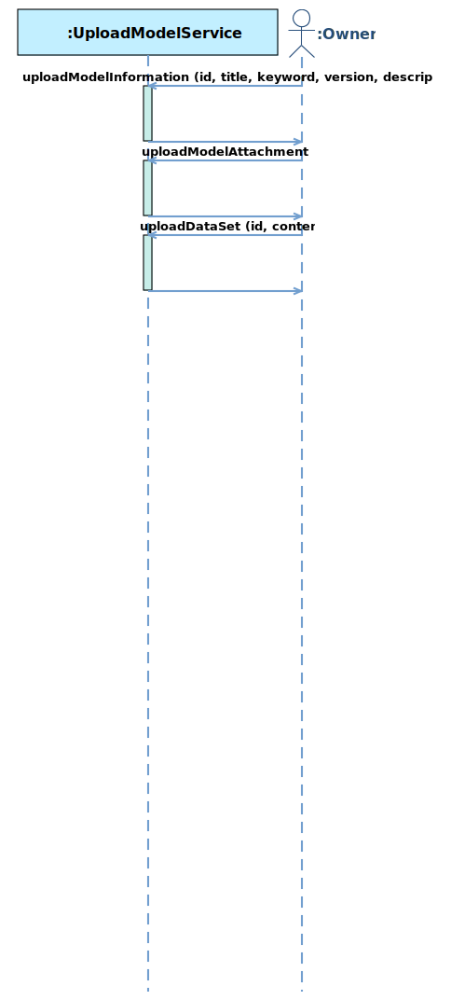
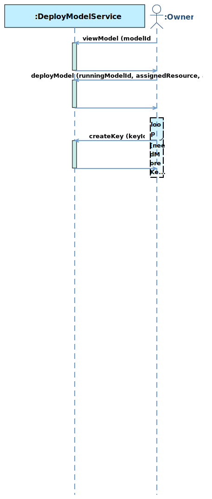
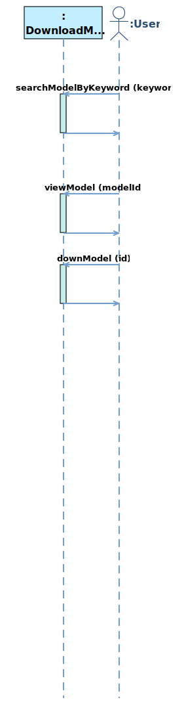
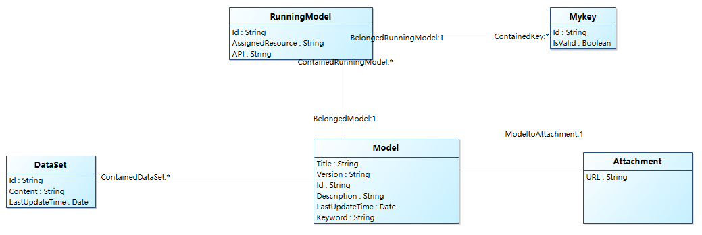

# 1   Introduction
## 1.1   Purpose
This subsection should

- a) Delineate the purpose of the SRS;
- b) Specify the intended audience for the SRS.
## 1.2   Scope
Name of software to be developed: DLModelMS1 System

This subsection should

- b) Explain what the software product(s) will, and, if necessary, will not do;
- c) Describe the application of the software being specifified, including relevant benefifits, objectives, and goals;
- d) Be consistent with similar statements in higher-level specififications (e.g., the system requirements specifification), if they exist.
## 1.3   Product Overview

### 1.3.1  Product perspective
This subsection of the SRS should put the product into perspective with other related products. If the product is independent and totally self-contained, it should be so stated here. If the SRS defines a product that is a component of a larger system, as frequently occurs, then this subsection should relate the requirements of that larger system to functionality of the software and should identify interfaces between that system and the software.

This subsection should also describe how the software operates inside various constraints. For example,
these constraints could include
- a) System interfaces;
- b) User interfaces;
- c) Hardware interfaces;
- d) Software interfaces;
- e) Communications interfaces;
- f) Memory;
- j) Operations;
- k) Site adaptation requirements.
#### 1.3.1.1   System interfaces
<b>SI1 - DLModelMS1System</b>
<table>
	<tr>
		<td><b>Service Name:</b></td>
		<td><span name ="SERVICEDLModelMS1System">DLModelMS1System</span></td>
	</tr>
	<tr>
		<td><b>Service ID:</b></td>
		<td>SI1</td>
	</tr>
	<tr>
		<td><b>Description:</b></td>
		<td></td>
	</tr>
	<tr>
		<td><b>Operation:</b></td>
	<td><ul><li><a href="#OPviewModel">viewModel</a></li><li><a href="#OPcallModel">callModel</a></li></ul></td>
	</tr>
<tr>
			<td><b>Temporary Variable</b></td>
			<td><b>Variable Description</b></td>
	</tr>
	<tr>
		<td><span name ="DLModelMS1SystemCurrentModel">CurrentModel</span></td>
		<td>CurrentModel is a object of <a href="#CLASSModel">Model</a></td>
					</tr>
	<tr>
		<td><span name ="DLModelMS1SystemCurrentRunningModel">CurrentRunningModel</span></td>
		<td>CurrentRunningModel is a object of <a href="#CLASSRunningModel">RunningModel</a></td>
					</tr>
	</table>

<b>SI2 - ManageModelService</b>
<table>
	<tr>
		<td><b>Service Name:</b></td>
		<td><span name ="SERVICEManageModelService">ManageModelService</span></td>
	</tr>
	<tr>
		<td><b>Service ID:</b></td>
		<td>SI2</td>
	</tr>
	<tr>
		<td><b>Description:</b></td>
		<td></td>
	</tr>
	<tr>
		<td><b>Operation:</b></td>
	<td><ul><li><a href="#OPupdateModelInformation">updateModelInformation</a></li><li><a href="#OPupdateDataSet">updateDataSet</a></li></ul></td>
	</tr>
	</table>

<b>SI3 - ManageRunningModelService</b>
<table>
	<tr>
		<td><b>Service Name:</b></td>
		<td><span name ="SERVICEManageRunningModelService">ManageRunningModelService</span></td>
	</tr>
	<tr>
		<td><b>Service ID:</b></td>
		<td>SI3</td>
	</tr>
	<tr>
		<td><b>Description:</b></td>
		<td></td>
	</tr>
	<tr>
		<td><b>Operation:</b></td>
	<td><ul><li><a href="#OPmodifyRunningModel">modifyRunningModel</a></li><li><a href="#OPmodifyKey">modifyKey</a></li></ul></td>
	</tr>
	</table>

<b>SI4 - UploadModelService</b>
<table>
	<tr>
		<td><b>Service Name:</b></td>
		<td><span name ="SERVICEUploadModelService">UploadModelService</span></td>
	</tr>
	<tr>
		<td><b>Service ID:</b></td>
		<td>SI4</td>
	</tr>
	<tr>
		<td><b>Description:</b></td>
		<td></td>
	</tr>
	<tr>
		<td><b>Operation:</b></td>
	<td><ul><li><a href="#OPuploadModelInformation">uploadModelInformation</a></li><li><a href="#OPuploadModelAttachment">uploadModelAttachment</a></li><li><a href="#OPuploadDataSet">uploadDataSet</a></li></ul></td>
	</tr>
	</table>

<b>SI5 - DeployModelService</b>
<table>
	<tr>
		<td><b>Service Name:</b></td>
		<td><span name ="SERVICEDeployModelService">DeployModelService</span></td>
	</tr>
	<tr>
		<td><b>Service ID:</b></td>
		<td>SI5</td>
	</tr>
	<tr>
		<td><b>Description:</b></td>
		<td></td>
	</tr>
	<tr>
		<td><b>Operation:</b></td>
	<td><ul><li><a href="#OPviewModel">viewModel</a></li><li><a href="#OPdeployModel">deployModel</a></li><li><a href="#OPcreateKey">createKey</a></li></ul></td>
	</tr>
	</table>

<b>SI6 - DownloadModelService</b>
<table>
	<tr>
		<td><b>Service Name:</b></td>
		<td><span name ="SERVICEDownloadModelService">DownloadModelService</span></td>
	</tr>
	<tr>
		<td><b>Service ID:</b></td>
		<td>SI6</td>
	</tr>
	<tr>
		<td><b>Description:</b></td>
		<td></td>
	</tr>
	<tr>
		<td><b>Operation:</b></td>
	<td><ul><li><a href="#OPsearchModelByKeyword">searchModelByKeyword</a></li><li><a href="#OPviewModel">viewModel</a></li><li><a href="#OPdownModel">downModel</a></li></ul></td>
	</tr>
	</table>

<b>SI7 - AskForAPIService</b>
<table>
	<tr>
		<td><b>Service Name:</b></td>
		<td><span name ="SERVICEAskForAPIService">AskForAPIService</span></td>
	</tr>
	<tr>
		<td><b>Service ID:</b></td>
		<td>SI7</td>
	</tr>
	<tr>
		<td><b>Description:</b></td>
		<td></td>
	</tr>
	<tr>
		<td><b>Operation:</b></td>
	<td><ul><li><a href="#OPlistRunningModel">listRunningModel</a></li><li><a href="#OPaskForAPI">askForAPI</a></li></ul></td>
	</tr>
	</table>

<b>SI8 - ThirdPartyServices</b>
<table>
	<tr>
		<td><b>Service Name:</b></td>
		<td><span name ="SERVICEThirdPartyServices">ThirdPartyServices</span></td>
	</tr>
	<tr>
		<td><b>Service ID:</b></td>
		<td>SI8</td>
	</tr>
	<tr>
		<td><b>Description:</b></td>
		<td></td>
	</tr>
	<tr>
		<td><b>Operation:</b></td>
	<td><ul><li><a href="#OPgenerateURL">generateURL</a></li><li><a href="#OPdownload">download</a></li><li><a href="#OPsendEmail">sendEmail</a></li></ul></td>
	</tr>
	</table>
​	 

### 1.3.2  Product functions
<b>Use Case Diagram</b>


<table>
	<tr>
		<td><b>ID</b></td>
		<td><b>Use Case Name</b></td>
		<td><b>Use Case Description</b></td>
		<td><b>Subfunction</b></td>
	</tr>
	<tr>
		<td>UC1</td>
		<td><a href="#UCuploadModel">uploadModel</a></td>
		<td></td>
		<td>
		<p><a href="#OPuploadModelInformation">uploadModelInformation</a></p><p><a href="#OPuploadModelAttachment">uploadModelAttachment</a></p><p><a href="#OPuploadDataSet">uploadDataSet</a></p>
		</td>
	</tr>
	<tr>
		<td>UC2</td>
		<td><a href="#UCdeployModel">deployModel</a></td>
		<td></td>
		<td>
		<p><a href="#OPviewModel">viewModel</a></p><p><a href="#OPdeployModel">deployModel</a></p><p><a href="#OPcreateKey">createKey</a></p>
		</td>
	</tr>
	<tr>
		<td>UC3</td>
		<td><a href="#UCdownloadModel">downloadModel</a></td>
		<td></td>
		<td>
		<p><a href="#OPsearchModelByKeyword">searchModelByKeyword</a></p><p><a href="#OPviewModel">viewModel</a></p><p><a href="#OPdownModel">downModel</a></p>
		</td>
	</tr>
	<tr>
		<td>UC4</td>
		<td><a href="#UCcallModel">callModel</a></td>
		<td></td>
		<td>
		</td>
	</tr>
	<tr>
		<td>UC5</td>
		<td><a href="#UCmanageModel">manageModel</a></td>
		<td></td>
		<td>
		<p><a href="#OPupdateModelInformation">updateModelInformation</a></p><p><a href="#OPupdateDataSet">updateDataSet</a></p>
		</td>
	</tr>
	<tr>
		<td>UC6</td>
		<td><a href="#UCmanageRunningModel">manageRunningModel</a></td>
		<td></td>
		<td>
		<p><a href="#OPmodifyRunningModel">modifyRunningModel</a></p><p><a href="#OPmodifyKey">modifyKey</a></p>
		</td>
	</tr>
</table>
### 1.3.3  User characteristics

<table>
	<tr>
		<td><b>ID</b></td>
		<td><b>Actor</b></td>
		<td><b>Description</b></td>
		<td><b>Super Actor</b></td>
	</tr>
	<tr>
		<td>A1</td>
		<td><span name ="ACTOROwner">Owner</span></td>
		<td></td>
		<td></td>
	</tr><tr>
		<td>A2</td>
		<td><span name ="ACTORUser">User</span></td>
		<td></td>
		<td></td>
	</tr>
</table>

### 1.3.4 Limitations
This subsection of the SRS should provide a general description of any other items that will limit the developer’s options. These include

- a) Regulatory policies;
- b) Hardware limitations (e.g., signal timing requirements);
- c) Interfaces to other applications;
- d) Parallel operation;
- e) Audit functions;
- f) Control functions;
- g) Higher-order language requirements;
- h) Signal handshake protocols (e.g., XON-XOFF, ACK-NACK);
- i) Reliability requirements;
- j) Criticality of the application;
- k) Safety and security considerations.
- l) physical/mental considerations; and
- m) limitations that are sourced from other systems, including real-time requirements from the controlled system through interfaces.

## 1.4   Definitions
This subsection should provide the defifinitions of all terms required to properly interpret the SRS. This information may be provided by reference to one or more appendixes in the SRS or by reference to other documents.

# 2  References
This subsection should

- a) Provide a complete list of all documents referenced elsewhere in the SRS;
- b) Identify each document by title, report number (if applicable), date, and publishing organization;
- c) Specify the sources from which the references can be obtained.

This information may be provided by reference to an appendix or to another document.

# 3  Requirements
## 3.1  Functions
### 3.1.1   Use Case
<b>UC1 - uploadModel</b>
<p>System Sequence Diagram:</p>



<p>Use Case Description:</p>

<table>
	<tr>
		<td><b>UseCase Name:</b></td>
		<td><span name ="UCuploadModel">uploadModel</span></td>
	</tr>
	<tr>
		<td><b>UseCase ID:</b></td>
		<td>UC1</td>
	</tr>
	<tr>
		<td><b>Brief Description:</b></td>
		<td></td>
	</tr>
	<tr>
		<td><b>Involved Actor:</b></td>
	<td><a href="#ACTOROwner">Owner</a></td>
	</tr>
	<tr>
		<td><b>Preconditions:</b></td>
		<td><ol></ol></td>
	</tr>
	<tr>
		<td><b>Postconditions:</b></td>
		<td><ol></ol></td>
	</tr>						
	<tr>
		<td><b>Basic Path:</b></td>
	<td><p>1. Owner clicks to execute the operation <a href="#OPuploadModelInformation">uploadModelInformation</a>, with entering id, title, keyword, version, description</p><p>2. Owner clicks to execute the operation <a href="#OPuploadModelAttachment">uploadModelAttachment</a></p><p>3. Owner clicks to execute the operation <a href="#OPuploadDataSet">uploadDataSet</a>, with entering id, content</p></td>
	</tr>
	<tr>
		<td><b>Alternative Path:</b></td>
		<td></td>
	</tr>
	</table>

<b>UC2 - deployModel</b>
<p>System Sequence Diagram:</p>



<p>Use Case Description:</p>

<table>
	<tr>
		<td><b>UseCase Name:</b></td>
		<td><span name ="UCdeployModel">deployModel</span></td>
	</tr>
	<tr>
		<td><b>UseCase ID:</b></td>
		<td>UC2</td>
	</tr>
	<tr>
		<td><b>Brief Description:</b></td>
		<td></td>
	</tr>
	<tr>
		<td><b>Involved Actor:</b></td>
	<td><a href="#ACTOROwner">Owner</a></td>
	</tr>
	<tr>
		<td><b>Preconditions:</b></td>
		<td><ol></ol></td>
	</tr>
	<tr>
		<td><b>Postconditions:</b></td>
		<td><ol></ol></td>
	</tr>						
	<tr>
		<td><b>Basic Path:</b></td>
	<td><p>1. Owner clicks to execute the operation <a href="#OPviewModel">viewModel</a>, with entering modelId</p><p>2. Owner clicks to execute the operation <a href="#OPdeployModel">deployModel</a>, with entering runningModelId, assignedResource, api</p><p>3. Owner clicks to execute the operation <a href="#OPcreateKey">createKey</a>, with entering keyId</p><p>&emsp;<i>If needMoreKeys, repeat the step(s) 3 </i></p></td>
	</tr>
	<tr>
		<td><b>Alternative Path:</b></td>
		<td></td>
	</tr>
	</table>

<b>UC3 - downloadModel</b>
<p>System Sequence Diagram:</p>



<p>Use Case Description:</p>

<table>
	<tr>
		<td><b>UseCase Name:</b></td>
		<td><span name ="UCdownloadModel">downloadModel</span></td>
	</tr>
	<tr>
		<td><b>UseCase ID:</b></td>
		<td>UC3</td>
	</tr>
	<tr>
		<td><b>Brief Description:</b></td>
		<td></td>
	</tr>
	<tr>
		<td><b>Involved Actor:</b></td>
	<td><a href="#ACTORUser">User</a></td>
	</tr>
	<tr>
		<td><b>Preconditions:</b></td>
		<td><ol></ol></td>
	</tr>
	<tr>
		<td><b>Postconditions:</b></td>
		<td><ol></ol></td>
	</tr>						
	<tr>
		<td><b>Basic Path:</b></td>
	<td><p>1. User clicks to execute the operation <a href="#OPsearchModelByKeyword">searchModelByKeyword</a>, with entering keyword</p><p>2. User clicks to execute the operation <a href="#OPviewModel">viewModel</a>, with entering modelId</p><p>3. User clicks to execute the operation <a href="#OPdownModel">downModel</a>, with entering id</p></td>
	</tr>
	<tr>
		<td><b>Alternative Path:</b></td>
		<td></td>
	</tr>
	</table>

<b>UC4 - callModel</b>

<p>Use Case Description:</p>

<table>
	<tr>
		<td><b>UseCase Name:</b></td>
		<td><span name ="UCcallModel">callModel</span></td>
	</tr>
	<tr>
		<td><b>UseCase ID:</b></td>
		<td>UC4</td>
	</tr>
	<tr>
		<td><b>Brief Description:</b></td>
		<td></td>
	</tr>
	<tr>
		<td><b>Involved Actor:</b></td>
	<td><a href="#ACTORUser">User</a></td>
	</tr>
	<tr>
		<td><b>Preconditions:</b></td>
		<td><ol></ol></td>
	</tr>
	<tr>
		<td><b>Postconditions:</b></td>
		<td><ol></ol></td>
	</tr>						
	<tr>
		<td><b>Basic Path:</b></td>
	<td></td>
	</tr>
	<tr>
		<td><b>Alternative Path:</b></td>
		<td></td>
	</tr>
	</table>

<b>UC5 - manageModel</b>

<p>Use Case Description:</p>

<table>
	<tr>
		<td><b>UseCase Name:</b></td>
		<td><span name ="UCmanageModel">manageModel</span></td>
	</tr>
	<tr>
		<td><b>UseCase ID:</b></td>
		<td>UC5</td>
	</tr>
	<tr>
		<td><b>Brief Description:</b></td>
		<td></td>
	</tr>
	<tr>
		<td><b>Involved Actor:</b></td>
	<td><a href="#ACTOROwner">Owner</a></td>
	</tr>
	<tr>
		<td><b>Preconditions:</b></td>
		<td><ol></ol></td>
	</tr>
	<tr>
		<td><b>Postconditions:</b></td>
		<td><ol></ol></td>
	</tr>						
	<tr>
		<td><b>Basic Path:</b></td>
	<td></td>
	</tr>
	<tr>
		<td><b>Alternative Path:</b></td>
		<td></td>
	</tr>
	</table>

<b>UC6 - manageRunningModel</b>

<p>Use Case Description:</p>

<table>
	<tr>
		<td><b>UseCase Name:</b></td>
		<td><span name ="UCmanageRunningModel">manageRunningModel</span></td>
	</tr>
	<tr>
		<td><b>UseCase ID:</b></td>
		<td>UC6</td>
	</tr>
	<tr>
		<td><b>Brief Description:</b></td>
		<td></td>
	</tr>
	<tr>
		<td><b>Involved Actor:</b></td>
	<td><a href="#ACTOROwner">Owner</a></td>
	</tr>
	<tr>
		<td><b>Preconditions:</b></td>
		<td><ol></ol></td>
	</tr>
	<tr>
		<td><b>Postconditions:</b></td>
		<td><ol></ol></td>
	</tr>						
	<tr>
		<td><b>Basic Path:</b></td>
	<td></td>
	</tr>
	<tr>
		<td><b>Alternative Path:</b></td>
		<td></td>
	</tr>
	</table>


### 3.1.2   System Operation
<b>OP1 - uploadModelInformation</b>
<table>
	<tr>
		<td><b>Operation Name:</b></td>
		<td><span name ="OPuploadModelInformation">uploadModelInformation</span></td>
	</tr>
	<tr>
		<td><b>Operation ID:</b></td>
		<td>OP1</td>
	</tr>
	<tr>
		<td><b>Description:</b></td>
		<td> </td>
	</tr>
	<tr>
		<td><b>Service:</b></td>
		<td><a href="#SERVICEUploadModelService">UploadModelService</a></td>
	</tr>
	<tr>
		<td><b>Input:</b></td>
<td><p>1. name: <i>id</i>, type: String</p><p>2. name: <i>title</i>, type: String</p><p>3. name: <i>keyword</i>, type: String</p><p>4. name: <i>version</i>, type: String</p><p>5. name: <i>description</i>, type: String</p></td>
</tr>
<tr>
	<td><b>Output Type:</b></td>
	<td>Boolean</td>
</tr>
<tr>
			<td><b>Definition:</b></td>
<td><p><i>a</i> is the object <i>b</i> in the instance set of class <a href="#CLASSModel">Model</a>. <i>b</i> represents an object of class <a href="#CLASSModel">Model</a>, and <i>b</i> meets:</p><p>&emsp;&emsp;The attribute <i>Id</i> of the object <i>b</i> is equal to <i>id</i></p></td>
	</tr>
	<tr>
<td><b>Preconditions:</b></td>
		<td><p>The object <i>a</i> doesn't exist</p></td>
</tr>
	<tr>
		<td><b>Postconditions:</b></td>
	<td><p>1. <i>e</i> represented the object of class <a href="#CLASSModel">Model</a></p><p>2. The object <i>e</i> was created</p><p>3. The attribute <i>Id</i> of the object <i>e</i> became <i>id</i></p><p>4. The attribute <i>Title</i> of the object <i>e</i> became <i>title</i></p><p>5. The attribute <i>Keyword</i> of the object <i>e</i> became <i>keyword</i></p><p>6. The attribute <i>Version</i> of the object <i>e</i> became <i>version</i></p><p>7. The attribute <i>Description</i> of the object <i>e</i> became <i>description</i></p><p>8. The attribute <i>LastUpdateTime</i> of the object <i>e</i> was equal to <i>Now</i></p><p>9. The object <i>e</i> was put into the instance set of class <a href="#CLASSModel">Model</a></p><p>10. The object <a href="#UploadModelServiceCurrentModel">CurrentModel</a> became <i>e</i></p><p>11. The return value was <b>true</b></p></td>
	</tr>
</table>

<p>Contract of <b>uploadModelInformation</b>:</p>

```java
Contract UploadModelService::uploadModelInformation(id : String, title : String, keyword:String, version : String, description : String) : Boolean {
		definition:
			a:Model = Model.allInstance()->any(b:Model| b.Id = id)
		precondition:
			a.oclIsUndefined() = true
		postcondition:
			let e:Model in
			e.oclIsNew() and
			e.Id = id and
			e.Title = title and
			e.Keyword = keyword and
			e.Version = version and
			e.Description = description and
			e.LastUpdateTime.isEqual(Now) and
			Model.allInstance()->includes(e) and
			self.CurrentModel = e and
			result = true
}
```

<b>OP2 - uploadModelAttachment</b>
<table>
	<tr>
		<td><b>Operation Name:</b></td>
		<td><span name ="OPuploadModelAttachment">uploadModelAttachment</span></td>
	</tr>
	<tr>
		<td><b>Operation ID:</b></td>
		<td>OP2</td>
	</tr>
	<tr>
		<td><b>Description:</b></td>
		<td> </td>
	</tr>
	<tr>
		<td><b>Service:</b></td>
		<td><a href="#SERVICEUploadModelService">UploadModelService</a></td>
	</tr>
	<tr>
		<td><b>Input:</b></td>
<td>None</td>
</tr>
<tr>
	<td><b>Output Type:</b></td>
	<td>Boolean</td>
</tr>
	<tr>
<td><b>Preconditions:</b></td>
		<td><p>1. The object <i>CurrentModel</i> exists</p><p>2. The object <i>CurrentModel</i> doesn't exist</p></td>
</tr>
	<tr>
		<td><b>Postconditions:</b></td>
	<td><p>1. <i>c</i> represented the object of class <a href="#CLASSAttachment">Attachment</a></p><p>2. The object <i>c</i> was created</p><p>3. The attribute <i>URL</i> of the object <i>c</i> became the return value of system operation <a href="#OPgenerateURL">generateURL</a></p><p>4. The object <i>CurrentModel</i> was linked to the object <i>c</i> by <i>ModeltoAttachment</i></p><p>5. The object <i>c</i> was put into the instance set of class <a href="#CLASSAttachment">Attachment</a></p><p>6. The return value was <b>true</b></p></td>
	</tr>
</table>

<p>Contract of <b>uploadModelAttachment</b>:</p>

```java
Contract UploadModelService::uploadModelAttachment() : Boolean {
		precondition:
			CurrentModel.oclIsUndefined() = false and
			CurrentModel.ModeltoAttachment.oclIsUndefined() = true
		postcondition:
			let c:Attachment in
			c.oclIsNew() and
			c.URL = generateURL() and
			CurrentModel.ModeltoAttachment = c and
			Attachment.allInstance()->includes(c) and
			result = true
}
```

<b>OP3 - uploadDataSet</b>
<table>
	<tr>
		<td><b>Operation Name:</b></td>
		<td><span name ="OPuploadDataSet">uploadDataSet</span></td>
	</tr>
	<tr>
		<td><b>Operation ID:</b></td>
		<td>OP3</td>
	</tr>
	<tr>
		<td><b>Description:</b></td>
		<td> </td>
	</tr>
	<tr>
		<td><b>Service:</b></td>
		<td><a href="#SERVICEUploadModelService">UploadModelService</a></td>
	</tr>
	<tr>
		<td><b>Input:</b></td>
<td><p>1. name: <i>id</i>, type: String</p><p>2. name: <i>content</i>, type: String</p></td>
</tr>
<tr>
	<td><b>Output Type:</b></td>
	<td>Boolean</td>
</tr>
<tr>
			<td><b>Definition:</b></td>
<td><p><i>a</i> is the object <i>b</i> in the instance set of class <a href="#CLASSDataSet">DataSet</a>. <i>b</i> represents an object of class <a href="#CLASSDataSet">DataSet</a>, and <i>b</i> meets:</p><p>&emsp;&emsp;The attribute <i>Id</i> of the object <i>b</i> is equal to <i>id</i></p></td>
	</tr>
	<tr>
<td><b>Preconditions:</b></td>
		<td><p>1. The object <i>a</i> doesn't exist</p><p>2. The object <i>CurrentModel</i> exists</p></td>
</tr>
	<tr>
		<td><b>Postconditions:</b></td>
	<td><p>1. <i>c</i> represented the object of class <a href="#CLASSDataSet">DataSet</a></p><p>2. The object <i>c</i> was created</p><p>3. The attribute <i>Id</i> of the object <i>c</i> became <i>id</i></p><p>4. The attribute <i>Content</i> of the object <i>c</i> became <i>content</i></p><p>5. The attribute <i>LastUpdateTime</i> of the object <i>c</i> was equal to <i>Now</i></p><p>6. The object <i>c</i> was put into the instance set of class <a href="#CLASSDataSet">DataSet</a></p><p>7. The object <i>CurrentModel</i> was linked to the object <i>c</i> by <i>ContainedDataSet</i></p><p>8. The return value was <b>true</b></p></td>
	</tr>
</table>

<p>Contract of <b>uploadDataSet</b>:</p>

```java
Contract UploadModelService::uploadDataSet(id : String, content : String) : Boolean {
		definition:
			a:DataSet = DataSet.allInstance()->any(b:DataSet| b.Id = id)
		precondition:
			a.oclIsUndefined() = true and
			CurrentModel.oclIsUndefined() = false
		postcondition:
			let c:DataSet in
			c.oclIsNew() and
			c.Id = id and
			c.Content = content and
			c.LastUpdateTime.isEqual(Now) and
			DataSet.allInstance()->includes(c) and
			CurrentModel.ContainedDataSet->includes(c) and
			result = true
}
```

<b>OP4 - deployModel</b>
<table>
	<tr>
		<td><b>Operation Name:</b></td>
		<td><span name ="OPdeployModel">deployModel</span></td>
	</tr>
	<tr>
		<td><b>Operation ID:</b></td>
		<td>OP4</td>
	</tr>
	<tr>
		<td><b>Description:</b></td>
		<td> </td>
	</tr>
	<tr>
		<td><b>Service:</b></td>
		<td><a href="#SERVICEDeployModelService">DeployModelService</a></td>
	</tr>
	<tr>
		<td><b>Input:</b></td>
<td><p>1. name: <i>runningModelId</i>, type: String</p><p>2. name: <i>assignedResource</i>, type: String</p><p>3. name: <i>api</i>, type: String</p></td>
</tr>
<tr>
	<td><b>Output Type:</b></td>
	<td>Boolean</td>
</tr>
<tr>
			<td><b>Definition:</b></td>
<td><p><i>a</i> is the object <i>e</i> in the instance set of class <a href="#CLASSRunningModel">RunningModel</a>. <i>e</i> represents an object of class <a href="#CLASSRunningModel">RunningModel</a>, and <i>e</i> meets:</p><p>&emsp;&emsp;The attribute <i>Id</i> of the object <i>e</i> is equal to <i>runningModelId</i></p></td>
	</tr>
	<tr>
<td><b>Preconditions:</b></td>
		<td><p>1. The object <i>CurrentModel</i> exists</p><p>2. The object <i>a</i> doesn't exist</p></td>
</tr>
	<tr>
		<td><b>Postconditions:</b></td>
	<td><p>1. <i>b</i> represented the object of class <a href="#CLASSRunningModel">RunningModel</a></p><p>2. The object <i>b</i> was created</p><p>3. The attribute <i>Id</i> of the object <i>b</i> became <i>runningModelId</i></p><p>4. The attribute <i>AssignedResource</i> of the object <i>b</i> became <i>assignedResource</i></p><p>5. The attribute <i>API</i> of the object <i>b</i> became <i>api</i></p><p>6. The object <i>b</i> was put into the instance set of class <a href="#CLASSRunningModel">RunningModel</a></p><p>7. The object <i>b</i> was linked to the object <i>CurrentModel</i> by <i>BelongedModel</i></p><p>8. The object <i>CurrentModel</i> was linked to the object <i>b</i> by <i>ContainedRunningModel</i></p><p>9. The object <a href="#DeployModelServiceCurrentRunningModel">CurrentRunningModel</a> became <i>b</i></p><p>10. The return value was <b>true</b></p></td>
	</tr>
</table>

<p>Contract of <b>deployModel</b>:</p>

```java
Contract DeployModelService::deployModel(runningModelId : String, assignedResource : String, api : String) : Boolean {
		definition:
			a:RunningModel = RunningModel.allInstance()->any(e:RunningModel| e.Id = runningModelId)
		precondition:
			CurrentModel.oclIsUndefined() = false and
			a.oclIsUndefined() = true
		postcondition:
			let b:RunningModel in
			b.oclIsNew() and
			b.Id = runningModelId and
			b.AssignedResource = assignedResource and
			b.API = api and
			RunningModel.allInstance()->includes(b) and
			b.BelongedModel = CurrentModel and
			CurrentModel.ContainedRunningModel->includes(b) and
			self.CurrentRunningModel = b and
			result = true
}
```

<b>OP5 - createKey</b>
<table>
	<tr>
		<td><b>Operation Name:</b></td>
		<td><span name ="OPcreateKey">createKey</span></td>
	</tr>
	<tr>
		<td><b>Operation ID:</b></td>
		<td>OP5</td>
	</tr>
	<tr>
		<td><b>Description:</b></td>
		<td> </td>
	</tr>
	<tr>
		<td><b>Service:</b></td>
		<td><a href="#SERVICEDeployModelService">DeployModelService</a></td>
	</tr>
	<tr>
		<td><b>Input:</b></td>
<td><p>name: <i>keyId</i>, type: String</p></td>
</tr>
<tr>
	<td><b>Output Type:</b></td>
	<td>Boolean</td>
</tr>
<tr>
			<td><b>Definition:</b></td>
<td><p><i>key</i> is the object <i>e</i> in the instance set of class <a href="#CLASSKey">Key</a>. <i>e</i> represents an object of class <a href="#CLASSKey">Key</a>, and <i>e</i> meets:</p><p>&emsp;&emsp;The attribute <i>Id</i> of the object <i>e</i> is equal to <i>keyId</i></p></td>
	</tr>
	<tr>
<td><b>Preconditions:</b></td>
		<td><p>The object <i>key</i> doesn't exist</p></td>
</tr>
	<tr>
		<td><b>Postconditions:</b></td>
	<td><p>1. <i>b</i> represented the object of class <a href="#CLASSKey">Key</a></p><p>2. The object <i>b</i> was created</p><p>3. The attribute <i>Id</i> of the object <i>b</i> became <i>keyId</i></p><p>4. The attribute <i>IsValid</i> of the object <i>b</i> became <b>true</b></p><p>5. The object <i>b</i> was put into the instance set of class <a href="#CLASSKey">Key</a></p><p>6. The object <i>b</i> was linked to the object <i>CurrentRunningModel</i> by <i>BelongedRunningModel</i></p><p>7. The object <i>CurrentRunningModel</i> was linked to the object <i>b</i> by <i>ContainedKey</i></p><p>8. The return value was <b>true</b></p></td>
	</tr>
</table>

<p>Contract of <b>createKey</b>:</p>

```java
Contract DeployModelService::createKey(keyId : String) : Boolean {
		definition:
			key:Key = Key.allInstance()->any(e:Key| e.Id = keyId)
		precondition:
			key.oclIsUndefined() = true
		postcondition:
			let b:Key in
			b.oclIsNew() and
			b.Id = keyId and
			b.IsValid = true and
			Key.allInstance()->includes(b) and
			b.BelongedRunningModel = CurrentRunningModel and
			CurrentRunningModel.ContainedKey->includes(b) and
			result = true
}
```

<b>OP6 - callModel</b>
<table>
	<tr>
		<td><b>Operation Name:</b></td>
		<td><span name ="OPcallModel">callModel</span></td>
	</tr>
	<tr>
		<td><b>Operation ID:</b></td>
		<td>OP6</td>
	</tr>
	<tr>
		<td><b>Description:</b></td>
		<td> </td>
	</tr>
	<tr>
		<td><b>Service:</b></td>
		<td><a href="#SERVICEDLModelMS1System">DLModelMS1System</a></td>
	</tr>
	<tr>
		<td><b>Input:</b></td>
<td><p>name: <i>keyId</i>, type: String</p></td>
</tr>
<tr>
	<td><b>Output Type:</b></td>
	<td>String</td>
</tr>
<tr>
			<td><b>Definition:</b></td>
<td><p><i>key</i> is the object <i>e</i> in the instance set of class <a href="#CLASSKey">Key</a>. <i>e</i> represents an object of class <a href="#CLASSKey">Key</a>, and <i>e</i> meets:</p><p>&emsp;&emsp;The attribute <i>Id</i> of the object <i>e</i> is equal to <i>keyId</i></p></td>
	</tr>
	<tr>
<td><b>Preconditions:</b></td>
		<td><p>1. The object <i>key</i> exists</p><p>2. The attribute <i>IsValid</i> of the object <i>key</i> is equal to <b>true</b></p></td>
</tr>
	<tr>
		<td><b>Postconditions:</b></td>
	<td><p>The return value was the attribute <i>API</i> of the object <i>key</i></p></td>
	</tr>
</table>

<p>Contract of <b>callModel</b>:</p>

```java
Contract DLModelMS1System::callModel(keyId : String) : String {
		definition:
			key:Key = Key.allInstance()->any(e:Key| e.Id = keyId)
//			,a:RunningModel = key.BelongedRunningModel
		precondition:
			key.oclIsUndefined() = false and
//			a.oclIsUndefined() = false and
			key.IsValid = true
		postcondition:
			result = key.BelongedRunningModel.API
}
```

<b>OP7 - searchModelByKeyword</b>
<table>
	<tr>
		<td><b>Operation Name:</b></td>
		<td><span name ="OPsearchModelByKeyword">searchModelByKeyword</span></td>
	</tr>
	<tr>
		<td><b>Operation ID:</b></td>
		<td>OP7</td>
	</tr>
	<tr>
		<td><b>Description:</b></td>
		<td> </td>
	</tr>
	<tr>
		<td><b>Service:</b></td>
		<td><a href="#SERVICEDownloadModelService">DownloadModelService</a></td>
	</tr>
	<tr>
		<td><b>Input:</b></td>
<td><p>name: <i>keyword</i>, type: String</p></td>
</tr>
<tr>
	<td><b>Output Type:</b></td>
	<td>Set of Model</td>
</tr>
	<tr>
<td><b>Preconditions:</b></td>
		<td><p>The <i>keyword</i> is not equal to <b>null</b></p></td>
</tr>
	<tr>
		<td><b>Postconditions:</b></td>
	<td><p>The return value was the set of class <a href="#CLASSModel">Model</a>, including all <i>m</i> in the instance set of class <a href="#CLASSModel">Model</a>. <i>m</i> represented an object of class <a href="#CLASSModel">Model</a>, and <i>m</i> meet:</p><p>&emsp;&emsp;The attribute <i>Keyword</i> of the object <i>m</i> was equal to <i>keyword</i></p></td>
	</tr>
</table>

<p>Contract of <b>searchModelByKeyword</b>:</p>

```java
Contract DownloadModelService::searchModelByKeyword(keyword : String) : Set(Model) {
		precondition:
			keyword <> ""
		postcondition:
			result = Model.allInstance()->select(m:Model| m.Keyword = keyword)
}
```

<b>OP8 - viewModel</b>
<table>
	<tr>
		<td><b>Operation Name:</b></td>
		<td><span name ="OPviewModel">viewModel</span></td>
	</tr>
	<tr>
		<td><b>Operation ID:</b></td>
		<td>OP8</td>
	</tr>
	<tr>
		<td><b>Description:</b></td>
		<td> </td>
	</tr>
	<tr>
		<td><b>Service:</b></td>
		<td><a href="#SERVICEDLModelMS1System">DLModelMS1System</a></td>
	</tr>
	<tr>
		<td><b>Input:</b></td>
<td><p>name: <i>modelId</i>, type: String</p></td>
</tr>
<tr>
	<td><b>Output Type:</b></td>
	<td><a href="#CLASSModel">Model</a></td>
</tr>
<tr>
			<td><b>Definition:</b></td>
<td><p><i>a</i> is the object <i>b</i> in the instance set of class <a href="#CLASSModel">Model</a>. <i>b</i> represents an object of class <a href="#CLASSModel">Model</a>, and <i>b</i> meets:</p><p>&emsp;&emsp;The attribute <i>Id</i> of the object <i>b</i> is equal to <i>modelId</i></p></td>
	</tr>
	<tr>
<td><b>Preconditions:</b></td>
		<td><p>The object <i>a</i> exists</p></td>
</tr>
	<tr>
		<td><b>Postconditions:</b></td>
	<td><p>1. The object <a href="#DLModelMS1SystemCurrentModel">CurrentModel</a> became <i>a</i></p><p>2. The return value was <i>a</i></p></td>
	</tr>
</table>

<p>Contract of <b>viewModel</b>:</p>

```java
Contract DLModelMS1System::viewModel(modelId : String) : Model {
		definition:
			a:Model = Model.allInstance()->any(b:Model| b.Id = modelId)
		precondition:
			a.oclIsUndefined() = false
		postcondition:
			self.CurrentModel = a and
			result = a
}
```

<b>OP9 - downModel</b>
<table>
	<tr>
		<td><b>Operation Name:</b></td>
		<td><span name ="OPdownModel">downModel</span></td>
	</tr>
	<tr>
		<td><b>Operation ID:</b></td>
		<td>OP9</td>
	</tr>
	<tr>
		<td><b>Description:</b></td>
		<td> </td>
	</tr>
	<tr>
		<td><b>Service:</b></td>
		<td><a href="#SERVICEDownloadModelService">DownloadModelService</a></td>
	</tr>
	<tr>
		<td><b>Input:</b></td>
<td><p>name: <i>id</i>, type: String</p></td>
</tr>
<tr>
	<td><b>Output Type:</b></td>
	<td>Boolean</td>
</tr>
<tr>
			<td><b>Definition:</b></td>
<td><p><i>a</i> is the object <i>b</i> in the instance set of class <a href="#CLASSModel">Model</a>. <i>b</i> represents an object of class <a href="#CLASSModel">Model</a>, and <i>b</i> meets:</p><p>&emsp;&emsp;The attribute <i>Id</i> of the object <i>b</i> is equal to <i>id</i></p></td>
	</tr>
	<tr>
<td><b>Preconditions:</b></td>
		<td><p>The object <i>a</i> exists</p></td>
</tr>
	<tr>
		<td><b>Postconditions:</b></td>
	<td><p>1. The system operation <a href="#OPdownload">download</a> was executed</p><p>2. The return value was <b>true</b></p></td>
	</tr>
</table>

<p>Contract of <b>downModel</b>:</p>

```java
Contract DownloadModelService::downModel(id : String): Boolean {
		definition:
			a:Model = Model.allInstance()->any(b:Model| b.Id = id)
		precondition:
			a.oclIsUndefined() = false
		postcondition:
			download(a.ModeltoAttachment.URL) and
			result = true
}
```

<b>OP10 - updateModelInformation</b>
<table>
	<tr>
		<td><b>Operation Name:</b></td>
		<td><span name ="OPupdateModelInformation">updateModelInformation</span></td>
	</tr>
	<tr>
		<td><b>Operation ID:</b></td>
		<td>OP10</td>
	</tr>
	<tr>
		<td><b>Description:</b></td>
		<td> </td>
	</tr>
	<tr>
		<td><b>Service:</b></td>
		<td><a href="#SERVICEManageModelService">ManageModelService</a></td>
	</tr>
	<tr>
		<td><b>Input:</b></td>
<td><p>1. name: <i>id</i>, type: String</p><p>2. name: <i>title</i>, type: String</p><p>3. name: <i>keyword</i>, type: String</p><p>4. name: <i>version</i>, type: String</p><p>5. name: <i>description</i>, type: String</p></td>
</tr>
<tr>
	<td><b>Output Type:</b></td>
	<td>Boolean</td>
</tr>
<tr>
			<td><b>Definition:</b></td>
<td><p><i>e</i> is the object <i>b</i> in the instance set of class <a href="#CLASSModel">Model</a>. <i>b</i> represents an object of class <a href="#CLASSModel">Model</a>, and <i>b</i> meets:</p><p>&emsp;&emsp;The attribute <i>Id</i> of the object <i>b</i> is equal to <i>id</i></p></td>
	</tr>
	<tr>
<td><b>Preconditions:</b></td>
		<td><p>The object <i>e</i> exists</p></td>
</tr>
	<tr>
		<td><b>Postconditions:</b></td>
	<td><p>1. The attribute <i>Id</i> of the object <i>e</i> became <i>id</i></p><p>2. The attribute <i>Title</i> of the object <i>e</i> became <i>title</i></p><p>3. The attribute <i>Keyword</i> of the object <i>e</i> became <i>keyword</i></p><p>4. The attribute <i>Version</i> of the object <i>e</i> became <i>version</i></p><p>5. The attribute <i>Description</i> of the object <i>e</i> became <i>description</i></p><p>6. The attribute <i>LastUpdateTime</i> of the object <i>e</i> was equal to <i>Now</i></p><p>7. The return value was <b>true</b></p></td>
	</tr>
</table>

<p>Contract of <b>updateModelInformation</b>:</p>

```java
Contract ManageModelService::updateModelInformation(id : String, title : String, keyword : String, version : String, description : String) : Boolean {
		definition:
			e:Model = Model.allInstance()->any(b:Model| b.Id = id)
		precondition:
			e.oclIsUndefined() = false
		postcondition:
			e.Id = id and
			e.Title = title and
			e.Keyword = keyword and
			e.Version = version and
			e.Description = description and
			e.LastUpdateTime.isEqual(Now) and
			result = true
}
```

<b>OP11 - updateDataSet</b>
<table>
	<tr>
		<td><b>Operation Name:</b></td>
		<td><span name ="OPupdateDataSet">updateDataSet</span></td>
	</tr>
	<tr>
		<td><b>Operation ID:</b></td>
		<td>OP11</td>
	</tr>
	<tr>
		<td><b>Description:</b></td>
		<td> </td>
	</tr>
	<tr>
		<td><b>Service:</b></td>
		<td><a href="#SERVICEManageModelService">ManageModelService</a></td>
	</tr>
	<tr>
		<td><b>Input:</b></td>
<td><p>1. name: <i>id</i>, type: String</p><p>2. name: <i>content</i>, type: String</p></td>
</tr>
<tr>
	<td><b>Output Type:</b></td>
	<td>Boolean</td>
</tr>
<tr>
			<td><b>Definition:</b></td>
<td><p><i>c</i> is the object <i>b</i> in the instance set of class <a href="#CLASSDataSet">DataSet</a>. <i>b</i> represents an object of class <a href="#CLASSDataSet">DataSet</a>, and <i>b</i> meets:</p><p>&emsp;&emsp;The attribute <i>Id</i> of the object <i>b</i> is equal to <i>id</i></p></td>
	</tr>
	<tr>
<td><b>Preconditions:</b></td>
		<td><p>The object <i>c</i> exists</p></td>
</tr>
	<tr>
		<td><b>Postconditions:</b></td>
	<td><p>1. The attribute <i>Id</i> of the object <i>c</i> became <i>id</i></p><p>2. The attribute <i>Content</i> of the object <i>c</i> became <i>content</i></p><p>3. The attribute <i>LastUpdateTime</i> of the object <i>c</i> was equal to <i>Now</i></p><p>4. The return value was <b>true</b></p></td>
	</tr>
</table>

<p>Contract of <b>updateDataSet</b>:</p>

```java
Contract ManageModelService::updateDataSet(id : String, content : String) : Boolean {
		definition:
			c:DataSet = DataSet.allInstance()->any(b:DataSet| b.Id = id)
		precondition:
			c.oclIsUndefined() = false
		postcondition:
			c.Id = id and
			c.Content = content and
			c.LastUpdateTime.isEqual(Now) and
			result = true
}
```

<b>OP12 - modifyRunningModel</b>
<table>
	<tr>
		<td><b>Operation Name:</b></td>
		<td><span name ="OPmodifyRunningModel">modifyRunningModel</span></td>
	</tr>
	<tr>
		<td><b>Operation ID:</b></td>
		<td>OP12</td>
	</tr>
	<tr>
		<td><b>Description:</b></td>
		<td> </td>
	</tr>
	<tr>
		<td><b>Service:</b></td>
		<td><a href="#SERVICEManageRunningModelService">ManageRunningModelService</a></td>
	</tr>
	<tr>
		<td><b>Input:</b></td>
<td><p>1. name: <i>runningModelId</i>, type: String</p><p>2. name: <i>assignedResource</i>, type: String</p><p>3. name: <i>api</i>, type: String</p></td>
</tr>
<tr>
	<td><b>Output Type:</b></td>
	<td>Boolean</td>
</tr>
<tr>
			<td><b>Definition:</b></td>
<td><p><i>a</i> is the object <i>e</i> in the instance set of class <a href="#CLASSRunningModel">RunningModel</a>. <i>e</i> represents an object of class <a href="#CLASSRunningModel">RunningModel</a>, and <i>e</i> meets:</p><p>&emsp;&emsp;The attribute <i>Id</i> of the object <i>e</i> is equal to <i>runningModelId</i></p></td>
	</tr>
	<tr>
<td><b>Preconditions:</b></td>
		<td><p>The object <i>a</i> exists</p></td>
</tr>
	<tr>
		<td><b>Postconditions:</b></td>
	<td><p>1. The attribute <i>Id</i> of the object <i>a</i> became <i>runningModelId</i></p><p>2. The attribute <i>AssignedResource</i> of the object <i>a</i> became <i>assignedResource</i></p><p>3. The attribute <i>API</i> of the object <i>a</i> became <i>api</i></p><p>4. The return value was <b>true</b></p></td>
	</tr>
</table>

<p>Contract of <b>modifyRunningModel</b>:</p>

```java
Contract ManageRunningModelService::modifyRunningModel(runningModelId : String, assignedResource : String, api : String) : Boolean {
		definition:
			a:RunningModel = RunningModel.allInstance()->any(e:RunningModel| e.Id = runningModelId)
		precondition:
			a.oclIsUndefined() = false
		postcondition:
			a.Id = runningModelId and
			a.AssignedResource = assignedResource and
			a.API = api and
			result = true
}
```

<b>OP13 - modifyKey</b>
<table>
	<tr>
		<td><b>Operation Name:</b></td>
		<td><span name ="OPmodifyKey">modifyKey</span></td>
	</tr>
	<tr>
		<td><b>Operation ID:</b></td>
		<td>OP13</td>
	</tr>
	<tr>
		<td><b>Description:</b></td>
		<td> </td>
	</tr>
	<tr>
		<td><b>Service:</b></td>
		<td><a href="#SERVICEManageRunningModelService">ManageRunningModelService</a></td>
	</tr>
	<tr>
		<td><b>Input:</b></td>
<td><p>1. name: <i>keyId</i>, type: String</p><p>2. name: <i>isValid</i>, type: Boolean</p></td>
</tr>
<tr>
	<td><b>Output Type:</b></td>
	<td>Boolean</td>
</tr>
<tr>
			<td><b>Definition:</b></td>
<td><p><i>key</i> is the object <i>e</i> in the instance set of class <a href="#CLASSKey">Key</a>. <i>e</i> represents an object of class <a href="#CLASSKey">Key</a>, and <i>e</i> meets:</p><p>&emsp;&emsp;The attribute <i>Id</i> of the object <i>e</i> is equal to <i>keyId</i></p></td>
	</tr>
	<tr>
<td><b>Preconditions:</b></td>
		<td><p>The object <i>key</i> exists</p></td>
</tr>
	<tr>
		<td><b>Postconditions:</b></td>
	<td><p>1. The attribute <i>Id</i> of the object <i>key</i> became <i>keyId</i></p><p>2. The attribute <i>IsValid</i> of the object <i>key</i> became <i>isValid</i></p><p>3. The return value was <b>true</b></p></td>
	</tr>
</table>

<p>Contract of <b>modifyKey</b>:</p>

```java
Contract ManageRunningModelService::modifyKey(keyId : String, isValid : Boolean) : Boolean {
		definition:
			key:Key = Key.allInstance()->any(e:Key| e.Id = keyId)
		precondition:
			key.oclIsUndefined() = false
		postcondition:
			key.Id = keyId and
			key.IsValid = isValid and
			result = true
}
```

<b>OP14 - generateURL</b>
<table>
	<tr>
		<td><b>Operation Name:</b></td>
		<td><span name ="OPgenerateURL">generateURL</span></td>
	</tr>
	<tr>
		<td><b>Operation ID:</b></td>
		<td>OP14</td>
	</tr>
	<tr>
		<td><b>Description:</b></td>
		<td> </td>
	</tr>
	<tr>
		<td><b>Service:</b></td>
		<td><a href="#SERVICEThirdPartyServices">ThirdPartyServices</a></td>
	</tr>
	<tr>
		<td><b>Input:</b></td>
<td>None</td>
</tr>
<tr>
	<td><b>Output Type:</b></td>
	<td>String</td>
</tr>
	<tr>
<td><b>Preconditions:</b></td>
		<td><p>None</p></td>
</tr>
	<tr>
		<td><b>Postconditions:</b></td>
	<td><p>The return value was <b>null</b></p></td>
	</tr>
</table>

<p>Contract of <b>generateURL</b>:</p>

```java
Contract ThirdPartyServices::generateURL() : String {
		precondition:
			true
		postcondition:
			result = ""
}
```

<b>OP15 - download</b>
<table>
	<tr>
		<td><b>Operation Name:</b></td>
		<td><span name ="OPdownload">download</span></td>
	</tr>
	<tr>
		<td><b>Operation ID:</b></td>
		<td>OP15</td>
	</tr>
	<tr>
		<td><b>Description:</b></td>
		<td> </td>
	</tr>
	<tr>
		<td><b>Service:</b></td>
		<td><a href="#SERVICEThirdPartyServices">ThirdPartyServices</a></td>
	</tr>
	<tr>
		<td><b>Input:</b></td>
<td><p>name: <i>url</i>, type: String</p></td>
</tr>
<tr>
	<td><b>Output Type:</b></td>
	<td>Boolean</td>
</tr>
	<tr>
<td><b>Preconditions:</b></td>
		<td><p>The <i>url</i> is not equal to <b>null</b></p></td>
</tr>
	<tr>
		<td><b>Postconditions:</b></td>
	<td><p>The return value was <b>true</b></p></td>
	</tr>
</table>

<p>Contract of <b>download</b>:</p>

```java
Contract ThirdPartyServices::download(url : String) : Boolean {
		precondition:
			url <> ""
		postcondition:
			result = true
}
```


## 3.2  Database requirements
#### 3.2.1   Entity Analysis
<b>Conceptual Class Diagram</b> 



<b>E1 - Model</b>

<table>
	<tr>
		<td><b>Entity Name:</b></td>
		   <td colspan="2"><span name ="CLASSModel">Model</span></td>
	</tr>
	<tr>
		<td><b>Entity ID:</b></td>
		   <td colspan="2">E1</td>
	</tr>
	<tr>
	    <td><b>Entity Description:</b></td>
	    <td colspan="2"></td>
	</tr>
	<tr>
	    <td><b>Attribute Name</b></td>
		<td><b>Attribute Type</b></td>
		<td><b>Attribute Description</b></td>
	</tr>
	<tr>
	    <td>Title</td>
	<td>String</td>
	<td>The Title of Model</td>
					</tr>
	<tr>
	    <td>Version</td>
	<td>String</td>
	<td>The Version of Model</td>
					</tr>
	<tr>
	    <td>Id</td>
	<td>String</td>
	<td>The Id of Model</td>
					</tr>
	<tr>
	    <td>Description</td>
	<td>String</td>
	<td>The Description of Model</td>
					</tr>
	<tr>
	    <td>LastUpdateTime</td>
	<td>LocalDate</td>
	<td>The LastUpdateTime of Model</td>
					</tr>
	<tr>
	    <td>Keyword</td>
	<td>String</td>
	<td>The Keyword of Model</td>
					</tr>
	<tr>
	    <td><b>Relationship Name</b></td>
	<td><b>Related Entity</b></td>
	<td><b>Relationship Type</b></td>
	</tr>
	<tr>
		<td>ContainedRunningModel</td>
		<td><a href="#CLASSRunningModel">RunningModel</a></td>
		<td>Association: One-to-Many</td>
	</tr>
	<tr>
		<td>ContainedDataSet</td>
		<td><a href="#CLASSDataSet">DataSet</a></td>
		<td>Association: One-to-Many</td>
	</tr>
	<tr>
		<td>ModeltoAttachment</td>
		<td><a href="#CLASSAttachment">Attachment</a></td>
		<td>Association: One-to-One</td>
	</tr>
	</table>

<b>E2 - RunningModel</b>

<table>
	<tr>
		<td><b>Entity Name:</b></td>
		   <td colspan="2"><span name ="CLASSRunningModel">RunningModel</span></td>
	</tr>
	<tr>
		<td><b>Entity ID:</b></td>
		   <td colspan="2">E2</td>
	</tr>
	<tr>
	    <td><b>Entity Description:</b></td>
	    <td colspan="2"></td>
	</tr>
	<tr>
	    <td><b>Attribute Name</b></td>
		<td><b>Attribute Type</b></td>
		<td><b>Attribute Description</b></td>
	</tr>
	<tr>
	    <td>Id</td>
	<td>String</td>
	<td>The Id of RunningModel</td>
					</tr>
	<tr>
	    <td>AssignedResource</td>
	<td>String</td>
	<td>The AssignedResource of RunningModel</td>
					</tr>
	<tr>
	    <td>API</td>
	<td>String</td>
	<td>The API of RunningModel</td>
					</tr>
	<tr>
	    <td><b>Relationship Name</b></td>
	<td><b>Related Entity</b></td>
	<td><b>Relationship Type</b></td>
	</tr>
	<tr>
		<td>ContainedKey</td>
		<td><a href="#CLASSKey">Key</a></td>
		<td>Association: One-to-Many</td>
	</tr>
	<tr>
		<td>BelongedModel</td>
		<td><a href="#CLASSModel">Model</a></td>
		<td>Association: One-to-One</td>
	</tr>
	</table>

<b>E3 - Key</b>

<table>
	<tr>
		<td><b>Entity Name:</b></td>
		   <td colspan="2"><span name ="CLASSKey">Key</span></td>
	</tr>
	<tr>
		<td><b>Entity ID:</b></td>
		   <td colspan="2">E3</td>
	</tr>
	<tr>
	    <td><b>Entity Description:</b></td>
	    <td colspan="2"></td>
	</tr>
	<tr>
	    <td><b>Attribute Name</b></td>
		<td><b>Attribute Type</b></td>
		<td><b>Attribute Description</b></td>
	</tr>
	<tr>
	    <td>Id</td>
	<td>String</td>
	<td>The Id of Key</td>
					</tr>
	<tr>
	    <td>IsValid</td>
	<td>Boolean</td>
	<td>The IsValid of Key</td>
					</tr>
	<tr>
	    <td><b>Relationship Name</b></td>
	<td><b>Related Entity</b></td>
	<td><b>Relationship Type</b></td>
	</tr>
	<tr>
		<td>BelongedRunningModel</td>
		<td><a href="#CLASSRunningModel">RunningModel</a></td>
		<td>Association: One-to-One</td>
	</tr>
	</table>

<b>E4 - DataSet</b>

<table>
	<tr>
		<td><b>Entity Name:</b></td>
		   <td colspan="2"><span name ="CLASSDataSet">DataSet</span></td>
	</tr>
	<tr>
		<td><b>Entity ID:</b></td>
		   <td colspan="2">E4</td>
	</tr>
	<tr>
	    <td><b>Entity Description:</b></td>
	    <td colspan="2"></td>
	</tr>
	<tr>
	    <td><b>Attribute Name</b></td>
		<td><b>Attribute Type</b></td>
		<td><b>Attribute Description</b></td>
	</tr>
	<tr>
	    <td>Id</td>
	<td>String</td>
	<td>The Id of DataSet</td>
					</tr>
	<tr>
	    <td>Content</td>
	<td>String</td>
	<td>The Content of DataSet</td>
					</tr>
	<tr>
	    <td>LastUpdateTime</td>
	<td>LocalDate</td>
	<td>The LastUpdateTime of DataSet</td>
					</tr>
	</table>

<b>E5 - Attachment</b>

<table>
	<tr>
		<td><b>Entity Name:</b></td>
		   <td colspan="2"><span name ="CLASSAttachment">Attachment</span></td>
	</tr>
	<tr>
		<td><b>Entity ID:</b></td>
		   <td colspan="2">E5</td>
	</tr>
	<tr>
	    <td><b>Entity Description:</b></td>
	    <td colspan="2"></td>
	</tr>
	<tr>
	    <td><b>Attribute Name</b></td>
		<td><b>Attribute Type</b></td>
		<td><b>Attribute Description</b></td>
	</tr>
	<tr>
	    <td>URL</td>
	<td>String</td>
	<td>The URL of Attachment</td>
					</tr>
	</table>
​	 

#### 3.2.2   Other database requirements
This should specify the logical requirements for any information that is to be placed into a database. This may include the following:

- a) Types of information used by various functions;
- b) Frequency of use;
- c) Accessing capabilities;
- d) Integrity constraints;
- e) Data retention requirements.			


## 3.3  Performance requirements
### 3.3.1  Static numerical requirements
This subsection should specify both the static and the dynamic numerical requirements placed on the software or on human interaction with the software as a whole. Static numerical requirements may include the following:

- a) The number of terminals to be supported;
- b) The number of simultaneous users to be supported;
- c) Amount and type of information to be handled.
### 3.3.2  Dynamic numerical requirements
Dynamic numerical requirements may include, for example, the numbers of transactions and tasks and the amount of data to be processed within certain time periods for both normal and peak workload conditions.

All of these requirements should be stated in measurable terms.

For example, 

- *95% of the transactions shall be processed in less than 1 s.*

rather than,

- *An operator shall not have to wait for the transaction to complete.*

NOTE:Numerical limits applied to one specifific function are normally specifified as part of the processing subparagraph description of that function. 

## 3.4  Usability requirements
Define usability and quality in use requirements and objectives for the software system that can include measurable effectiveness, efficiency, satisfaction criteria and avoidance of harm that could arise from use in specific contexts of use.
## 3.5  Interface requirements
### 3.5.1  User interfaces
This should specify the following:
- a) The logical characteristics of each interface between the software product and its users. This includes those configuration characteristics (e.g., required screen formats, page or window layouts, content of any reports or menus, or availability of programmable function keys) necessary to accomplish the software requirements.
- b) All the aspects of optimizing the interface with the person who must use the system. This may simply comprise a list of do’s and don’ts on how the system will appear to the user. One example may be a requirement for the option of long or short error messages. Like all others, these requirements should be verifiable, e.g., “a clerk typist grade 4 can do function X in Z min after 1 h of training” rather than “a typist can do function X.” (This may also be specified in the Software System Attributes under a section titled Ease of Use.) 
### 3.5.2  Hardware interfaces
This should specify the logical characteristics of each interface between the software product and the hardware components of the system. This includes configuration characteristics (number of ports, instruction sets, etc.). It also covers such matters as what devices are to be supported, how they are to be supported, and protocols. For example, terminal support may specify full-screen support as opposed to line-by-line support.
### 3.5.3  Software interfaces
This should specify the use of other required software products (e.g., a data management system, an operating system, or a mathematical package), and interfaces with other application systems (e.g., the linkage between an accounts receivable system and a general ledger system). For each required software product, the following should be provided:
- a) Name;
- b) Mnemonic;
- c) Specification number;
- d) Version number;
- e) Source.

For each interface, the following should be provided:
- a) Discussion of the purpose of the interfacing software as related to this software product.
- b) Definition of the interface in terms of message content and format. It is not necessary to detail any well-documented interface, but a reference to the document defining the interface is required.
### 3.5.4  Communications interfaces
This should specify the various interfaces to communications such as local network protocols, etc.

## 3.6  Design constraints
Specify constraints on the system design imposed by external standards, regulatory requirements or project limitations.
### 3.6.1  Standards compliance
This subsection should specify the requirements derived from existing standards or regulations. They may include the following:
		
- a) Report format;
- b) Data naming;
- c) Accounting procedures;
- d) Audit tracing.
		

For example, this could specify the requirement for software to trace processing activity. Such traces are needed for some applications to meet minimum regulatory or financial standards. An audit trace requirement may, for example, state that all changes to a payroll database must be recorded in a trace file with before and after values.

## 3.7  Software system attributes
### 3.7.1  Reliability
This should specify the factors required to establish the required reliability of the software system at time of delivery.
### 3.7.2  Availability
This should specify the factors required to guarantee a defined availability level for the entire system such as checkpoint, recovery, and restart.

### 3.7.3  Security
This should specify the factors that protect the software from accidental or malicious access, use, modification, destruction, or disclosure. Specific requirements in this area could include the need to

- a) Utilize certain cryptographical techniques;
- b) Keep specific log or history data sets;
- c) Assign certain functions to different modules;
- d) Restrict communications between some areas of the program;
- e) Check data integrity for critical variables.
### 3.7.4  Maintainability
This should specify attributes of software that relate to the ease of maintenance of the software itself. There may be some requirement for certain modularity, interfaces, complexity, etc. Requirements should not be placed here just because they are thought to be good design practices.

### 3.7.5  Portability
This should specify attributes of software that relate to the ease of porting the software to other host machines and/or operating systems. This may include the following:

- a) Percentage of components with host-dependent code;
- b) Percentage of code that is host dependent;
- c) Use of a proven portable language;
- d) Use of a particular compiler or language subset;
- e) Use of a particular operating system.
## 3.8  Supporting information
Additional supporting information to be considered includes:

- a) sample input/output formats, descriptions of cost analysis studies or results of user surveys;
- b) supporting or background information that can help the readers of the SRS;
- c) a description of the problems to be solved by the software; and
- d) special packaging instructions for the code and the media to meet security, export, initial loading or other requirements.

The SRS should explicitly state whether or not these information items are to be considered part of the requirements.
			
# 4  Verification
Provide the verification approaches and methods planned to qualify the software. The information items for verification are recommended to be given in a parallel manner with the information items in 	Section 3.
# 5  Appendices
## 5.1  Assumptions and dependencies
This subsection of the SRS should list each of the factors that affect the requirements stated in the SRS. These factors are not design constraints on the software but are, rather, any changes to them that can affect the requirements in the SRS. For example, an assumption may be that a specific operating system will be available on the hardware designated for the software product. If, in fact, the operating system is not available, the SRS would then have to change accordingly. 
## 5.2 Apportioning of requirements
Apportion the software requirements to software elements. For requirements that will require implementation over multiple software elements, or when allocation to a software element is initially undefined, this should be so stated. A cross-reference table by function and software element should be used to summarize the apportionments.

Identify requirements that may be delayed until future versions of the system (e.g., blocks and/or increments).
## 5.3  Acronyms and abbreviations
This subsection should provide the acronyms and abbreviations required to properly interpret the SRS. This information may be provided by reference to one or more appendixes in the SRS or by reference to other documents.
