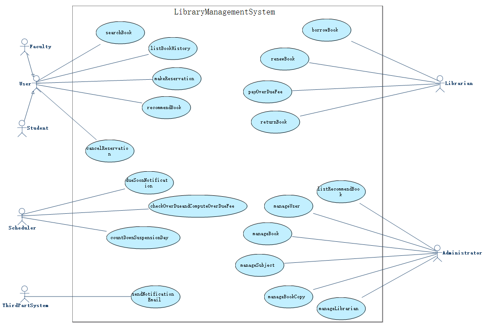
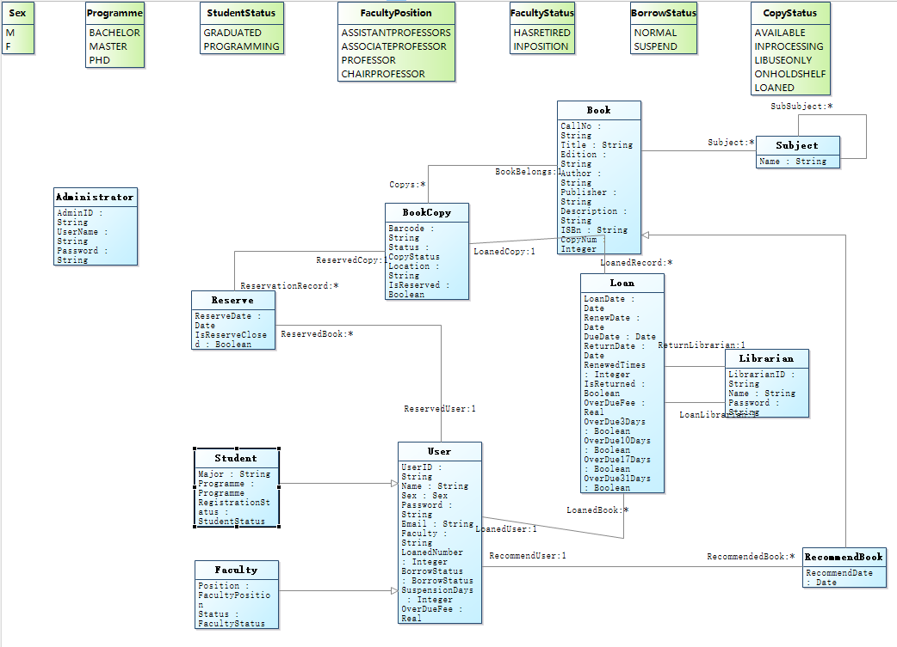

# 1   Introduction
## 1.1   Purpose
This subsection should

- a) Delineate the purpose of the SRS;
- b) Specify the intended audience for the SRS.
## 1.2   Scope
Name of software to be developed: LibraryManagementSystem System

This subsection should

- b) Explain what the software product(s) will, and, if necessary, will not do;
- c) Describe the application of the software being specifified, including relevant benefifits, objectives, and goals;
- d) Be consistent with similar statements in higher-level specififications (e.g., the system requirements specifification), if they exist.
## 1.3   Definitions, acronyms, and abbreviations
This subsection should provide the defifinitions of all terms, acronyms, and abbreviations required to properly interpret the SRS. This information may be provided by reference to one or more appendixes in the SRS or by reference to other documents.
## 1.4   References
This subsection should

- a) Provide a complete list of all documents referenced elsewhere in the SRS;
- b) Identify each document by title, report number (if applicable), date, and publishing organization;
- c) Specify the sources from which the references can be obtained.

This information may be provided by reference to an appendix or to another document.

## 1.5   Overview
This subsection should

- a) Describe what the rest of the SRS contains;
- b) Explain how the SRS is organized.
# 2  Overall description
## 2.1  Product perspective
This subsection of the SRS should put the product into perspective with other related products. If the product is independent and totally self-contained, it should be so stated here. If the SRS defines a product that is a component of a larger system, as frequently occurs, then this subsection should relate the requirements of that larger system to functionality of the software and should identify interfaces between that system and the software.
## 2.2  Product functions
## 2.3  User characteristics
The applicable objects of this system are User, Faculty, Student, Administrator, Librarian, Scheduler, ThirdPartSystem.
If they know the basic operation of computer, they can use the system to operate the required functions.
Maybe some users need some relevant training.
## 2.4  Constraints
This subsection of the SRS should provide a general description of any other items that will limit the developer’s options. These include

- a) Regulatory policies;
- b) Hardware limitations (e.g., signal timing requirements);
- c) Interfaces to other applications;
- d) Parallel operation;
- e) Audit functions;
- f) Control functions;
- g) Higher-order language requirements;
- h) Signal handshake protocols (e.g., XON-XOFF, ACK-NACK);
- i) Reliability requirements;
- j) Criticality of the application;
- k) Safety and security considerations.
## 2.5  Assumptions and dependencies
This subsection of the SRS should list each of the factors that affect the requirements stated in the SRS. These factors are not design constraints on the software but are, rather, any changes to them that can affect the requirements in the SRS. For example, an assumption may be that a specific operating system will be available on the hardware designated for the software product. If, in fact, the operating system is not available, the SRS would then have to change accordingly. 
## 2.6  Apportioning of requirements
This subsection of the SRS should identify requirements that may be delayed until future versions of the system.
# 3  Specific requirements
## 3.1  Functional requirements
### 3.1.1   User Requirements
<b>Use Case Diagram</b>



<b>A1 - User</b>
<table>
	<tr>
		<td><b>Actor Name:</b></td>
		<td colspan="5"><span name ="ACTORUser">User</span></td>
	</tr>
	<tr>
		<td><b>Actor ID:</b></td>
		<td colspan="5">A1</td>
	</tr>
	<tr>
		<td><b>Description:</b></td>
		<td colspan="5">The user</td>
	</tr>				   
<tr>
	<td colspan="5"><b>Required Functions</b></td>
	<td><b>Related Use Case</b></td>
</tr>
<tr>
			<td colspan="5">The user searchs books</td>
			<td><a href="#UCsearchBook">searchBook</a></td>
	</tr>
<tr>
			<td colspan="5">The user views book history</td>
			<td><a href="#UClistBookHistory">listBookHistory</a></td>
	</tr>
<tr>
			<td colspan="5">The user makes a book reservation</td>
			<td><a href="#UCmakeReservation">makeReservation</a></td>
	</tr>
<tr>
			<td colspan="5">The user recommends books to the library</td>
			<td><a href="#UCrecommendBook">recommendBook</a></td>
	</tr>
<tr>
			<td colspan="5">The user cancels reservation</td>
			<td><a href="#UCcancelReservation">cancelReservation</a></td>
	</tr>
</table>
<b>A2 - Faculty</b>
<table>
	<tr>
		<td><b>Actor Name:</b></td>
		<td colspan="5"><span name ="ACTORFaculty">Faculty</span></td>
	</tr>
	<tr>
		<td><b>Actor ID:</b></td>
		<td colspan="5">A2</td>
	</tr>
	<tr>
		<td><b>Description:</b></td>
		<td colspan="5">The faculty user</td>
	</tr>				   
<tr>
			<td><b>Super Actor:</b></td>
			<td colspan="5"><a href="#ACTORUser">User</a></td>
</tr>
<tr>
	<td colspan="5"><b>Required Functions</b></td>
	<td><b>Related Use Case</b></td>
</tr>
<tr>
			<td colspan="5">The user searchs books</td>
			<td><a href="#UCsearchBook">searchBook</a></td>
</tr><tr>
			<td colspan="5">The user views book history</td>
			<td><a href="#UClistBookHistory">listBookHistory</a></td>
</tr><tr>
			<td colspan="5">The user makes a book reservation</td>
			<td><a href="#UCmakeReservation">makeReservation</a></td>
</tr><tr>
			<td colspan="5">The user recommends books to the library</td>
			<td><a href="#UCrecommendBook">recommendBook</a></td>
</tr><tr>
			<td colspan="5">The user cancels reservation</td>
			<td><a href="#UCcancelReservation">cancelReservation</a></td>
</tr>
</table>
<b>A3 - Student</b>
<table>
	<tr>
		<td><b>Actor Name:</b></td>
		<td colspan="5"><span name ="ACTORStudent">Student</span></td>
	</tr>
	<tr>
		<td><b>Actor ID:</b></td>
		<td colspan="5">A3</td>
	</tr>
	<tr>
		<td><b>Description:</b></td>
		<td colspan="5">The student user</td>
	</tr>				   
<tr>
			<td><b>Super Actor:</b></td>
			<td colspan="5"><a href="#ACTORUser">User</a></td>
</tr>
<tr>
	<td colspan="5"><b>Required Functions</b></td>
	<td><b>Related Use Case</b></td>
</tr>
<tr>
			<td colspan="5">The user searchs books</td>
			<td><a href="#UCsearchBook">searchBook</a></td>
</tr><tr>
			<td colspan="5">The user views book history</td>
			<td><a href="#UClistBookHistory">listBookHistory</a></td>
</tr><tr>
			<td colspan="5">The user makes a book reservation</td>
			<td><a href="#UCmakeReservation">makeReservation</a></td>
</tr><tr>
			<td colspan="5">The user recommends books to the library</td>
			<td><a href="#UCrecommendBook">recommendBook</a></td>
</tr><tr>
			<td colspan="5">The user cancels reservation</td>
			<td><a href="#UCcancelReservation">cancelReservation</a></td>
</tr>
</table>
<b>A4 - Administrator</b>
<table>
	<tr>
		<td><b>Actor Name:</b></td>
		<td colspan="5"><span name ="ACTORAdministrator">Administrator</span></td>
	</tr>
	<tr>
		<td><b>Actor ID:</b></td>
		<td colspan="5">A4</td>
	</tr>
	<tr>
		<td><b>Description:</b></td>
		<td colspan="5">The administrator</td>
	</tr>				   
<tr>
	<td colspan="5"><b>Required Functions</b></td>
	<td><b>Related Use Case</b></td>
</tr>
<tr>
			<td colspan="5">The administrator manages user information, including entering, inquiring, modifying and deleting of user information</td>
			<td><a href="#UCmanageUser">manageUser</a></td>
	</tr>
<tr>
			<td colspan="5">The administrator manages book information, including entering, inquiring, modifying and deleting of book information</td>
			<td><a href="#UCmanageBook">manageBook</a></td>
	</tr>
<tr>
			<td colspan="5">The administrator manages subject information, including entering, inquiring, modifying and deleting of sunject information</td>
			<td><a href="#UCmanageSubject">manageSubject</a></td>
	</tr>
<tr>
			<td colspan="5">The administrator manages book's copy information, including entering, inquiring, modifying and deleting of  book's copy information</td>
			<td><a href="#UCmanageBookCopy">manageBookCopy</a></td>
	</tr>
<tr>
			<td colspan="5">The administrator manages librarian information, including entering, inquiring, modifying and deleting of librarian information</td>
			<td><a href="#UCmanageLibrarian">manageLibrarian</a></td>
	</tr>
<tr>
			<td colspan="5">The administrator views books recommended by users</td>
			<td><a href="#UClistRecommendBook">listRecommendBook</a></td>
	</tr>
</table>
<b>A5 - Librarian</b>
<table>
	<tr>
		<td><b>Actor Name:</b></td>
		<td colspan="5"><span name ="ACTORLibrarian">Librarian</span></td>
	</tr>
	<tr>
		<td><b>Actor ID:</b></td>
		<td colspan="5">A5</td>
	</tr>
	<tr>
		<td><b>Description:</b></td>
		<td colspan="5"></td>
	</tr>				   
<tr>
	<td colspan="5"><b>Required Functions</b></td>
	<td><b>Related Use Case</b></td>
</tr>
<tr>
			<td colspan="5"></td>
			<td><a href="#UCborrowBook">borrowBook</a></td>
	</tr>
<tr>
			<td colspan="5"></td>
			<td><a href="#UCrenewBook">renewBook</a></td>
	</tr>
<tr>
			<td colspan="5"></td>
			<td><a href="#UCpayOverDueFee">payOverDueFee</a></td>
	</tr>
<tr>
			<td colspan="5"></td>
			<td><a href="#UCreturnBook">returnBook</a></td>
	</tr>
</table>
<b>A6 - Scheduler</b>
<table>
	<tr>
		<td><b>Actor Name:</b></td>
		<td colspan="5"><span name ="ACTORScheduler">Scheduler</span></td>
	</tr>
	<tr>
		<td><b>Actor ID:</b></td>
		<td colspan="5">A6</td>
	</tr>
	<tr>
		<td><b>Description:</b></td>
		<td colspan="5">The scheduler</td>
	</tr>				   
<tr>
	<td colspan="5"><b>Required Functions</b></td>
	<td><b>Related Use Case</b></td>
</tr>
<tr>
			<td colspan="5">check over due and compute over due fee</td>
			<td><a href="#UCcheckOverDueandComputeOverDueFee">checkOverDueandComputeOverDueFee</a></td>
	</tr>
<tr>
			<td colspan="5">due soon notification</td>
			<td><a href="#UCdueSoonNotification">dueSoonNotification</a></td>
	</tr>
<tr>
			<td colspan="5">count down suspension day</td>
			<td><a href="#UCcountDownSuspensionDay">countDownSuspensionDay</a></td>
	</tr>
</table>
<b>A7 - ThirdPartSystem</b>
<table>
	<tr>
		<td><b>Actor Name:</b></td>
		<td colspan="5"><span name ="ACTORThirdPartSystem">ThirdPartSystem</span></td>
	</tr>
	<tr>
		<td><b>Actor ID:</b></td>
		<td colspan="5">A7</td>
	</tr>
	<tr>
		<td><b>Description:</b></td>
		<td colspan="5">The third part system</td>
	</tr>				   
<tr>
	<td colspan="5"><b>Required Functions</b></td>
	<td><b>Related Use Case</b></td>
</tr>
<tr>
			<td colspan="5">The third part system sends notification email</td>
			<td><a href="#UCsendNotificationEmail">sendNotificationEmail</a></td>
	</tr>
</table>

### 3.1.2   System Requirement
#### 3.1.2.1 Use Case Description
<b>UC1 - searchBook</b>

<table>
	<tr>
		<td><b>UseCase Name:</b></td>
		<td><span name ="UCsearchBook">searchBook</span></td>
	</tr>
	<tr>
		<td><b>UseCase ID:</b></td>
		<td>UC1</td>
	</tr>
	<tr>
		<td><b>Brief Description:</b></td>
		<td>The user searchs books</td>
	</tr>
	<tr>
		<td><b>Involved Actor:</b></td>
	<td><a href="#ACTORUser">User</a></td>
	</tr>
	<tr>
		<td><b>Preconditions:</b></td>
		<td><ol></ol></td>
	</tr>
	<tr>
		<td><b>Postconditions:</b></td>
		<td><ol></ol></td>
	</tr>						
	<tr>
		<td><b>Basic Path:</b></td>
	<td></td>
	</tr>
	<tr>
		<td><b>Alternative Path:</b></td>
		<td></td>
	</tr>
	</table>
 

<b>UC2 - listBookHistory</b>

<table>
	<tr>
		<td><b>UseCase Name:</b></td>
		<td><span name ="UClistBookHistory">listBookHistory</span></td>
	</tr>
	<tr>
		<td><b>UseCase ID:</b></td>
		<td>UC2</td>
	</tr>
	<tr>
		<td><b>Brief Description:</b></td>
		<td>The user views book history</td>
	</tr>
	<tr>
		<td><b>Involved Actor:</b></td>
	<td><a href="#ACTORUser">User</a></td>
	</tr>
	<tr>
		<td><b>Preconditions:</b></td>
		<td><ol></ol></td>
	</tr>
	<tr>
		<td><b>Postconditions:</b></td>
		<td><ol></ol></td>
	</tr>						
	<tr>
		<td><b>Basic Path:</b></td>
	<td></td>
	</tr>
	<tr>
		<td><b>Alternative Path:</b></td>
		<td></td>
	</tr>
	</table>
 

<b>UC3 - makeReservation</b>

<table>
	<tr>
		<td><b>UseCase Name:</b></td>
		<td><span name ="UCmakeReservation">makeReservation</span></td>
	</tr>
	<tr>
		<td><b>UseCase ID:</b></td>
		<td>UC3</td>
	</tr>
	<tr>
		<td><b>Brief Description:</b></td>
		<td>The user makes a book reservation</td>
	</tr>
	<tr>
		<td><b>Involved Actor:</b></td>
	<td><a href="#ACTORUser">User</a></td>
	</tr>
	<tr>
		<td><b>Preconditions:</b></td>
		<td><ol></ol></td>
	</tr>
	<tr>
		<td><b>Postconditions:</b></td>
		<td><ol></ol></td>
	</tr>						
	<tr>
		<td><b>Basic Path:</b></td>
	<td></td>
	</tr>
	<tr>
		<td><b>Alternative Path:</b></td>
		<td></td>
	</tr>
	</table>
 

<b>UC4 - recommendBook</b>

<table>
	<tr>
		<td><b>UseCase Name:</b></td>
		<td><span name ="UCrecommendBook">recommendBook</span></td>
	</tr>
	<tr>
		<td><b>UseCase ID:</b></td>
		<td>UC4</td>
	</tr>
	<tr>
		<td><b>Brief Description:</b></td>
		<td>The user recommends books to the library</td>
	</tr>
	<tr>
		<td><b>Involved Actor:</b></td>
	<td><a href="#ACTORUser">User</a></td>
	</tr>
	<tr>
		<td><b>Preconditions:</b></td>
		<td><ol></ol></td>
	</tr>
	<tr>
		<td><b>Postconditions:</b></td>
		<td><ol></ol></td>
	</tr>						
	<tr>
		<td><b>Basic Path:</b></td>
	<td></td>
	</tr>
	<tr>
		<td><b>Alternative Path:</b></td>
		<td></td>
	</tr>
	</table>
 

<b>UC5 - cancelReservation</b>

<table>
	<tr>
		<td><b>UseCase Name:</b></td>
		<td><span name ="UCcancelReservation">cancelReservation</span></td>
	</tr>
	<tr>
		<td><b>UseCase ID:</b></td>
		<td>UC5</td>
	</tr>
	<tr>
		<td><b>Brief Description:</b></td>
		<td>The user cancels reservation</td>
	</tr>
	<tr>
		<td><b>Involved Actor:</b></td>
	<td><a href="#ACTORUser">User</a></td>
	</tr>
	<tr>
		<td><b>Preconditions:</b></td>
		<td><ol></ol></td>
	</tr>
	<tr>
		<td><b>Postconditions:</b></td>
		<td><ol></ol></td>
	</tr>						
	<tr>
		<td><b>Basic Path:</b></td>
	<td></td>
	</tr>
	<tr>
		<td><b>Alternative Path:</b></td>
		<td></td>
	</tr>
	</table>
 

<b>UC6 - manageUser</b>

<table>
	<tr>
		<td><b>UseCase Name:</b></td>
		<td><span name ="UCmanageUser">manageUser</span></td>
	</tr>
	<tr>
		<td><b>UseCase ID:</b></td>
		<td>UC6</td>
	</tr>
	<tr>
		<td><b>Brief Description:</b></td>
		<td>The administrator manages user information, including entering, inquiring, modifying and deleting of user information</td>
	</tr>
	<tr>
		<td><b>Involved Actor:</b></td>
	<td><a href="#ACTORAdministrator">Administrator</a></td>
	</tr>
	<tr>
		<td><b>Preconditions:</b></td>
		<td><ol></ol></td>
	</tr>
	<tr>
		<td><b>Postconditions:</b></td>
		<td><ol></ol></td>
	</tr>						
	<tr>
		<td><b>Basic Path:</b></td>
	<td></td>
	</tr>
	<tr>
		<td><b>Alternative Path:</b></td>
		<td></td>
	</tr>
	</table>
 

<b>UC7 - manageBook</b>

<table>
	<tr>
		<td><b>UseCase Name:</b></td>
		<td><span name ="UCmanageBook">manageBook</span></td>
	</tr>
	<tr>
		<td><b>UseCase ID:</b></td>
		<td>UC7</td>
	</tr>
	<tr>
		<td><b>Brief Description:</b></td>
		<td>The administrator manages book information, including entering, inquiring, modifying and deleting of book information</td>
	</tr>
	<tr>
		<td><b>Involved Actor:</b></td>
	<td><a href="#ACTORAdministrator">Administrator</a></td>
	</tr>
	<tr>
		<td><b>Preconditions:</b></td>
		<td><ol></ol></td>
	</tr>
	<tr>
		<td><b>Postconditions:</b></td>
		<td><ol></ol></td>
	</tr>						
	<tr>
		<td><b>Basic Path:</b></td>
	<td></td>
	</tr>
	<tr>
		<td><b>Alternative Path:</b></td>
		<td></td>
	</tr>
	</table>
 

<b>UC8 - manageSubject</b>

<table>
	<tr>
		<td><b>UseCase Name:</b></td>
		<td><span name ="UCmanageSubject">manageSubject</span></td>
	</tr>
	<tr>
		<td><b>UseCase ID:</b></td>
		<td>UC8</td>
	</tr>
	<tr>
		<td><b>Brief Description:</b></td>
		<td>The administrator manages subject information, including entering, inquiring, modifying and deleting of sunject information</td>
	</tr>
	<tr>
		<td><b>Involved Actor:</b></td>
	<td><a href="#ACTORAdministrator">Administrator</a></td>
	</tr>
	<tr>
		<td><b>Preconditions:</b></td>
		<td><ol></ol></td>
	</tr>
	<tr>
		<td><b>Postconditions:</b></td>
		<td><ol></ol></td>
	</tr>						
	<tr>
		<td><b>Basic Path:</b></td>
	<td></td>
	</tr>
	<tr>
		<td><b>Alternative Path:</b></td>
		<td></td>
	</tr>
	</table>
 

<b>UC9 - manageBookCopy</b>

<table>
	<tr>
		<td><b>UseCase Name:</b></td>
		<td><span name ="UCmanageBookCopy">manageBookCopy</span></td>
	</tr>
	<tr>
		<td><b>UseCase ID:</b></td>
		<td>UC9</td>
	</tr>
	<tr>
		<td><b>Brief Description:</b></td>
		<td>The administrator manages book's copy information, including entering, inquiring, modifying and deleting of  book's copy information</td>
	</tr>
	<tr>
		<td><b>Involved Actor:</b></td>
	<td><a href="#ACTORAdministrator">Administrator</a></td>
	</tr>
	<tr>
		<td><b>Preconditions:</b></td>
		<td><ol></ol></td>
	</tr>
	<tr>
		<td><b>Postconditions:</b></td>
		<td><ol></ol></td>
	</tr>						
	<tr>
		<td><b>Basic Path:</b></td>
	<td></td>
	</tr>
	<tr>
		<td><b>Alternative Path:</b></td>
		<td></td>
	</tr>
	</table>
 

<b>UC10 - manageLibrarian</b>

<table>
	<tr>
		<td><b>UseCase Name:</b></td>
		<td><span name ="UCmanageLibrarian">manageLibrarian</span></td>
	</tr>
	<tr>
		<td><b>UseCase ID:</b></td>
		<td>UC10</td>
	</tr>
	<tr>
		<td><b>Brief Description:</b></td>
		<td>The administrator manages librarian information, including entering, inquiring, modifying and deleting of librarian information</td>
	</tr>
	<tr>
		<td><b>Involved Actor:</b></td>
	<td><a href="#ACTORAdministrator">Administrator</a></td>
	</tr>
	<tr>
		<td><b>Preconditions:</b></td>
		<td><ol></ol></td>
	</tr>
	<tr>
		<td><b>Postconditions:</b></td>
		<td><ol></ol></td>
	</tr>						
	<tr>
		<td><b>Basic Path:</b></td>
	<td></td>
	</tr>
	<tr>
		<td><b>Alternative Path:</b></td>
		<td></td>
	</tr>
	</table>
 

<b>UC11 - listRecommendBook</b>

<table>
	<tr>
		<td><b>UseCase Name:</b></td>
		<td><span name ="UClistRecommendBook">listRecommendBook</span></td>
	</tr>
	<tr>
		<td><b>UseCase ID:</b></td>
		<td>UC11</td>
	</tr>
	<tr>
		<td><b>Brief Description:</b></td>
		<td>The administrator views books recommended by users</td>
	</tr>
	<tr>
		<td><b>Involved Actor:</b></td>
	<td><a href="#ACTORAdministrator">Administrator</a></td>
	</tr>
	<tr>
		<td><b>Preconditions:</b></td>
		<td><ol></ol></td>
	</tr>
	<tr>
		<td><b>Postconditions:</b></td>
		<td><ol></ol></td>
	</tr>						
	<tr>
		<td><b>Basic Path:</b></td>
	<td></td>
	</tr>
	<tr>
		<td><b>Alternative Path:</b></td>
		<td></td>
	</tr>
	</table>
 

<b>UC12 - borrowBook</b>

<table>
	<tr>
		<td><b>UseCase Name:</b></td>
		<td><span name ="UCborrowBook">borrowBook</span></td>
	</tr>
	<tr>
		<td><b>UseCase ID:</b></td>
		<td>UC12</td>
	</tr>
	<tr>
		<td><b>Brief Description:</b></td>
		<td></td>
	</tr>
	<tr>
		<td><b>Involved Actor:</b></td>
	<td><a href="#ACTORLibrarian">Librarian</a></td>
	</tr>
	<tr>
		<td><b>Preconditions:</b></td>
		<td><ol></ol></td>
	</tr>
	<tr>
		<td><b>Postconditions:</b></td>
		<td><ol></ol></td>
	</tr>						
	<tr>
		<td><b>Basic Path:</b></td>
	<td></td>
	</tr>
	<tr>
		<td><b>Alternative Path:</b></td>
		<td></td>
	</tr>
	</table>
 

<b>UC13 - renewBook</b>

<table>
	<tr>
		<td><b>UseCase Name:</b></td>
		<td><span name ="UCrenewBook">renewBook</span></td>
	</tr>
	<tr>
		<td><b>UseCase ID:</b></td>
		<td>UC13</td>
	</tr>
	<tr>
		<td><b>Brief Description:</b></td>
		<td></td>
	</tr>
	<tr>
		<td><b>Involved Actor:</b></td>
	<td><a href="#ACTORLibrarian">Librarian</a></td>
	</tr>
	<tr>
		<td><b>Preconditions:</b></td>
		<td><ol></ol></td>
	</tr>
	<tr>
		<td><b>Postconditions:</b></td>
		<td><ol></ol></td>
	</tr>						
	<tr>
		<td><b>Basic Path:</b></td>
	<td></td>
	</tr>
	<tr>
		<td><b>Alternative Path:</b></td>
		<td></td>
	</tr>
	</table>
 

<b>UC14 - payOverDueFee</b>

<table>
	<tr>
		<td><b>UseCase Name:</b></td>
		<td><span name ="UCpayOverDueFee">payOverDueFee</span></td>
	</tr>
	<tr>
		<td><b>UseCase ID:</b></td>
		<td>UC14</td>
	</tr>
	<tr>
		<td><b>Brief Description:</b></td>
		<td></td>
	</tr>
	<tr>
		<td><b>Involved Actor:</b></td>
	<td><a href="#ACTORLibrarian">Librarian</a></td>
	</tr>
	<tr>
		<td><b>Preconditions:</b></td>
		<td><ol></ol></td>
	</tr>
	<tr>
		<td><b>Postconditions:</b></td>
		<td><ol></ol></td>
	</tr>						
	<tr>
		<td><b>Basic Path:</b></td>
	<td></td>
	</tr>
	<tr>
		<td><b>Alternative Path:</b></td>
		<td></td>
	</tr>
	</table>
 

<b>UC15 - returnBook</b>

<table>
	<tr>
		<td><b>UseCase Name:</b></td>
		<td><span name ="UCreturnBook">returnBook</span></td>
	</tr>
	<tr>
		<td><b>UseCase ID:</b></td>
		<td>UC15</td>
	</tr>
	<tr>
		<td><b>Brief Description:</b></td>
		<td></td>
	</tr>
	<tr>
		<td><b>Involved Actor:</b></td>
	<td><a href="#ACTORLibrarian">Librarian</a></td>
	</tr>
	<tr>
		<td><b>Preconditions:</b></td>
		<td><ol></ol></td>
	</tr>
	<tr>
		<td><b>Postconditions:</b></td>
		<td><ol></ol></td>
	</tr>						
	<tr>
		<td><b>Basic Path:</b></td>
	<td></td>
	</tr>
	<tr>
		<td><b>Alternative Path:</b></td>
		<td></td>
	</tr>
	</table>
 

<b>UC16 - checkOverDueandComputeOverDueFee</b>

<table>
	<tr>
		<td><b>UseCase Name:</b></td>
		<td><span name ="UCcheckOverDueandComputeOverDueFee">checkOverDueandComputeOverDueFee</span></td>
	</tr>
	<tr>
		<td><b>UseCase ID:</b></td>
		<td>UC16</td>
	</tr>
	<tr>
		<td><b>Brief Description:</b></td>
		<td>check over due and compute over due fee</td>
	</tr>
	<tr>
		<td><b>Involved Actor:</b></td>
	<td><a href="#ACTORScheduler">Scheduler</a></td>
	</tr>
	<tr>
		<td><b>Preconditions:</b></td>
		<td><ol></ol></td>
	</tr>
	<tr>
		<td><b>Postconditions:</b></td>
		<td><ol></ol></td>
	</tr>						
	<tr>
		<td><b>Basic Path:</b></td>
	<td></td>
	</tr>
	<tr>
		<td><b>Alternative Path:</b></td>
		<td></td>
	</tr>
	</table>
 

<b>UC17 - dueSoonNotification</b>

<table>
	<tr>
		<td><b>UseCase Name:</b></td>
		<td><span name ="UCdueSoonNotification">dueSoonNotification</span></td>
	</tr>
	<tr>
		<td><b>UseCase ID:</b></td>
		<td>UC17</td>
	</tr>
	<tr>
		<td><b>Brief Description:</b></td>
		<td>due soon notification</td>
	</tr>
	<tr>
		<td><b>Involved Actor:</b></td>
	<td><a href="#ACTORScheduler">Scheduler</a></td>
	</tr>
	<tr>
		<td><b>Preconditions:</b></td>
		<td><ol></ol></td>
	</tr>
	<tr>
		<td><b>Postconditions:</b></td>
		<td><ol></ol></td>
	</tr>						
	<tr>
		<td><b>Basic Path:</b></td>
	<td></td>
	</tr>
	<tr>
		<td><b>Alternative Path:</b></td>
		<td></td>
	</tr>
	</table>
 

<b>UC18 - countDownSuspensionDay</b>

<table>
	<tr>
		<td><b>UseCase Name:</b></td>
		<td><span name ="UCcountDownSuspensionDay">countDownSuspensionDay</span></td>
	</tr>
	<tr>
		<td><b>UseCase ID:</b></td>
		<td>UC18</td>
	</tr>
	<tr>
		<td><b>Brief Description:</b></td>
		<td>count down suspension day</td>
	</tr>
	<tr>
		<td><b>Involved Actor:</b></td>
	<td><a href="#ACTORScheduler">Scheduler</a></td>
	</tr>
	<tr>
		<td><b>Preconditions:</b></td>
		<td><ol></ol></td>
	</tr>
	<tr>
		<td><b>Postconditions:</b></td>
		<td><ol></ol></td>
	</tr>						
	<tr>
		<td><b>Basic Path:</b></td>
	<td></td>
	</tr>
	<tr>
		<td><b>Alternative Path:</b></td>
		<td></td>
	</tr>
	</table>
 

<b>UC19 - sendNotificationEmail</b>

<table>
	<tr>
		<td><b>UseCase Name:</b></td>
		<td><span name ="UCsendNotificationEmail">sendNotificationEmail</span></td>
	</tr>
	<tr>
		<td><b>UseCase ID:</b></td>
		<td>UC19</td>
	</tr>
	<tr>
		<td><b>Brief Description:</b></td>
		<td>The third part system sends notification email</td>
	</tr>
	<tr>
		<td><b>Involved Actor:</b></td>
	<td><a href="#ACTORThirdPartSystem">ThirdPartSystem</a></td>
	</tr>
	<tr>
		<td><b>Preconditions:</b></td>
		<td><ol></ol></td>
	</tr>
	<tr>
		<td><b>Postconditions:</b></td>
		<td><ol></ol></td>
	</tr>						
	<tr>
		<td><b>Basic Path:</b></td>
	<td></td>
	</tr>
	<tr>
		<td><b>Alternative Path:</b></td>
		<td></td>
	</tr>
	</table>
 


#### 3.1.2.2   Entity Analysis
<b>Conceptual Class Diagram</b> 



<b>E1 - User</b>

<table>
	<tr>
		<td><b>Entity Name:</b></td>
		   <td colspan="3"><span name ="CLASSUser">User</span></td>
	</tr>
	<tr>
		<td><b>Entity ID:</b></td>
		   <td colspan="3">E1</td>
	</tr>
	<tr>
	    <td><b>Entity Description:</b></td>
	    <td colspan="3">The user account</td>
	</tr>
	<tr>
	    <td><b>Attribute Name</b></td>
		<td><b>Attribute Type</b></td>
		<td colspan="2"><b>Attribute Description</b></td>
	</tr>
	<tr>
	    <td>UserID</td>
	<td>String</td>
	<td colspan="2">The UserID of User</td>
					</tr>
	<tr>
	    <td>Name</td>
	<td>String</td>
	<td colspan="2">The Name of User</td>
					</tr>
	<tr>
	    <td>Sex</td>
	<td>[M|F]</td>
	<td colspan="2">The Sex of User</td>
					</tr>
	<tr>
	    <td>Password</td>
	<td>String</td>
	<td colspan="2">The Password of User</td>
					</tr>
	<tr>
	    <td>Email</td>
	<td>String</td>
	<td colspan="2">The Email of User</td>
					</tr>
	<tr>
	    <td>Faculty</td>
	<td>String</td>
	<td colspan="2">The Faculty of User</td>
					</tr>
	<tr>
	    <td>LoanedNumber</td>
	<td>Integer</td>
	<td colspan="2">The LoanedNumber of User</td>
					</tr>
	<tr>
	    <td>BorrowStatus</td>
	<td>[NORMAL|SUSPEND]</td>
	<td colspan="2">The BorrowStatus of User</td>
					</tr>
	<tr>
	    <td>SuspensionDays</td>
	<td>Integer</td>
	<td colspan="2">The SuspensionDays of User</td>
					</tr>
	<tr>
	    <td>OverDueFee</td>
	<td>Real</td>
	<td colspan="2">The OverDueFee of User</td>
					</tr>
	<tr>
	    <td><b>Relationship Name</b></td>
	<td><b>Related Entity</b></td>
	<td><b>Relationship Type</b></td>
	<td><b>Relationship Description</b></td>
	</tr>
		<tr>
			<td>LoanedBook</td>
			<td><a href="#CLASSLoan">Loan</a></td>
			<td>Association</td>
		<td>One User is linked with many Loan</td>
	</tr>
		<tr>
			<td>ReservedBook</td>
			<td><a href="#CLASSReserve">Reserve</a></td>
			<td>Association</td>
		<td>One User is linked with many Reserve</td>
	</tr>
		<tr>
			<td>RecommendedBook</td>
			<td><a href="#CLASSRecommendBook">RecommendBook</a></td>
			<td>Association</td>
		<td>One User is linked with many RecommendBook</td>
	</tr>
	</table>

<b>E2 - Student</b>

<table>
	<tr>
		<td><b>Entity Name:</b></td>
		   <td colspan="3"><span name ="CLASSStudent">Student</span></td>
	</tr>
	<tr>
		<td><b>Entity ID:</b></td>
		   <td colspan="3">E2</td>
	</tr>
	<tr>
	    <td><b>Entity Description:</b></td>
	    <td colspan="3">The student account</td>
	</tr>
	<tr>
		<td><b>Super Entity:</b></td>
		<td colspan="3"><a href="#CLASSUser">User</a></td>
					</tr>
	<tr>
	    <td><b>Attribute Name</b></td>
		<td><b>Attribute Type</b></td>
		<td colspan="2"><b>Attribute Description</b></td>
	</tr>
	<tr>
	    <td>Major</td>
	<td>String</td>
	<td colspan="2">The Major of Student</td>
					</tr>
	<tr>
	    <td>Programme</td>
	<td>[BACHELOR|MASTER|PHD]</td>
	<td colspan="2">The Programme of Student</td>
					</tr>
	<tr>
	    <td>RegistrationStatus</td>
	<td>[GRADUATED|PROGRAMMING]</td>
	<td colspan="2">The RegistrationStatus of Student</td>
					</tr>
	</table>

<b>E3 - Faculty</b>

<table>
	<tr>
		<td><b>Entity Name:</b></td>
		   <td colspan="3"><span name ="CLASSFaculty">Faculty</span></td>
	</tr>
	<tr>
		<td><b>Entity ID:</b></td>
		   <td colspan="3">E3</td>
	</tr>
	<tr>
	    <td><b>Entity Description:</b></td>
	    <td colspan="3">The facuity account</td>
	</tr>
	<tr>
		<td><b>Super Entity:</b></td>
		<td colspan="3"><a href="#CLASSUser">User</a></td>
					</tr>
	<tr>
	    <td><b>Attribute Name</b></td>
		<td><b>Attribute Type</b></td>
		<td colspan="2"><b>Attribute Description</b></td>
	</tr>
	<tr>
	    <td>Position</td>
	<td>[ASSISTANTPROFESSORS|ASSOCIATEPROFESSOR|PROFESSOR|CHAIRPROFESSOR]</td>
	<td colspan="2">The Position of Faculty</td>
					</tr>
	<tr>
	    <td>Status</td>
	<td>[HASRETIRED|INPOSITION]</td>
	<td colspan="2">The Status of Faculty</td>
					</tr>
	</table>

<b>E4 - Book</b>

<table>
	<tr>
		<td><b>Entity Name:</b></td>
		   <td colspan="3"><span name ="CLASSBook">Book</span></td>
	</tr>
	<tr>
		<td><b>Entity ID:</b></td>
		   <td colspan="3">E4</td>
	</tr>
	<tr>
	    <td><b>Entity Description:</b></td>
	    <td colspan="3">Books owned by the library</td>
	</tr>
	<tr>
	    <td><b>Attribute Name</b></td>
		<td><b>Attribute Type</b></td>
		<td colspan="2"><b>Attribute Description</b></td>
	</tr>
	<tr>
	    <td>CallNo</td>
	<td>String</td>
	<td colspan="2">The CallNo of Book</td>
					</tr>
	<tr>
	    <td>Title</td>
	<td>String</td>
	<td colspan="2">The Title of Book</td>
					</tr>
	<tr>
	    <td>Edition</td>
	<td>String</td>
	<td colspan="2">The Edition of Book</td>
					</tr>
	<tr>
	    <td>Author</td>
	<td>String</td>
	<td colspan="2">The Author of Book</td>
					</tr>
	<tr>
	    <td>Publisher</td>
	<td>String</td>
	<td colspan="2">The Publisher of Book</td>
					</tr>
	<tr>
	    <td>Description</td>
	<td>String</td>
	<td colspan="2">The Description of Book</td>
					</tr>
	<tr>
	    <td>ISBn</td>
	<td>String</td>
	<td colspan="2">The ISBn of Book</td>
					</tr>
	<tr>
	    <td>CopyNum</td>
	<td>Integer</td>
	<td colspan="2">The CopyNum of Book</td>
					</tr>
	<tr>
	    <td><b>Relationship Name</b></td>
	<td><b>Related Entity</b></td>
	<td><b>Relationship Type</b></td>
	<td><b>Relationship Description</b></td>
	</tr>
		<tr>
			<td>Copys</td>
			<td><a href="#CLASSBookCopy">BookCopy</a></td>
			<td>Association</td>
		<td>One Book is linked with many BookCopy</td>
	</tr>
		<tr>
			<td>Subject</td>
			<td><a href="#CLASSSubject">Subject</a></td>
			<td>Association</td>
		<td>One Book is linked to many Subject</td>
	</tr>
	</table>

<b>E5 - Subject</b>

<table>
	<tr>
		<td><b>Entity Name:</b></td>
		   <td colspan="3"><span name ="CLASSSubject">Subject</span></td>
	</tr>
	<tr>
		<td><b>Entity ID:</b></td>
		   <td colspan="3">E5</td>
	</tr>
	<tr>
	    <td><b>Entity Description:</b></td>
	    <td colspan="3">The subject of books</td>
	</tr>
	<tr>
	    <td><b>Attribute Name</b></td>
		<td><b>Attribute Type</b></td>
		<td colspan="2"><b>Attribute Description</b></td>
	</tr>
	<tr>
	    <td>Name</td>
	<td>String</td>
	<td colspan="2">The Name of Subject</td>
					</tr>
	<tr>
	    <td><b>Relationship Name</b></td>
	<td><b>Related Entity</b></td>
	<td><b>Relationship Type</b></td>
	<td><b>Relationship Description</b></td>
	</tr>
		<tr>
			<td>SuperSubject</td>
			<td><a href="#CLASSSubject">Subject</a></td>
			<td>Association</td>
		<td>One Subject is linked with one Subject</td>Many Subject are linked with one Subject</td>
	</tr>
		<tr>
			<td>SubSubject</td>
			<td><a href="#CLASSSubject">Subject</a></td>
			<td>Association</td>
		<td>One Subject is linked with many Subject</td>Many Subject are linked with many Subject</td>
	</tr>
	</table>

<b>E6 - BookCopy</b>

<table>
	<tr>
		<td><b>Entity Name:</b></td>
		   <td colspan="3"><span name ="CLASSBookCopy">BookCopy</span></td>
	</tr>
	<tr>
		<td><b>Entity ID:</b></td>
		   <td colspan="3">E6</td>
	</tr>
	<tr>
	    <td><b>Entity Description:</b></td>
	    <td colspan="3">The copy of a book for borrowing</td>
	</tr>
	<tr>
	    <td><b>Attribute Name</b></td>
		<td><b>Attribute Type</b></td>
		<td colspan="2"><b>Attribute Description</b></td>
	</tr>
	<tr>
	    <td>Barcode</td>
	<td>String</td>
	<td colspan="2">The Barcode of BookCopy</td>
					</tr>
	<tr>
	    <td>Status</td>
	<td>[AVAILABLE|INPROCESSING|LIBUSEONLY|ONHOLDSHELF|LOANED]</td>
	<td colspan="2">The Status of BookCopy</td>
					</tr>
	<tr>
	    <td>Location</td>
	<td>String</td>
	<td colspan="2">The Location of BookCopy</td>
					</tr>
	<tr>
	    <td>IsReserved</td>
	<td>Boolean</td>
	<td colspan="2">The IsReserved of BookCopy</td>
					</tr>
	<tr>
	    <td><b>Relationship Name</b></td>
	<td><b>Related Entity</b></td>
	<td><b>Relationship Type</b></td>
	<td><b>Relationship Description</b></td>
	</tr>
		<tr>
			<td>BookBelongs</td>
			<td><a href="#CLASSBook">Book</a></td>
			<td>Association</td>
		<td>Many BookCopy are linked with one Book</td>
	</tr>
		<tr>
			<td>LoanedRecord</td>
			<td><a href="#CLASSLoan">Loan</a></td>
			<td>Association</td>
		<td>One BookCopy is linked with many Loan</td>
	</tr>
		<tr>
			<td>ReservationRecord</td>
			<td><a href="#CLASSReserve">Reserve</a></td>
			<td>Association</td>
		<td>One BookCopy is linked with many Reserve</td>
	</tr>
	</table>

<b>E7 - Loan</b>

<table>
	<tr>
		<td><b>Entity Name:</b></td>
		   <td colspan="3"><span name ="CLASSLoan">Loan</span></td>
	</tr>
	<tr>
		<td><b>Entity ID:</b></td>
		   <td colspan="3">E7</td>
	</tr>
	<tr>
	    <td><b>Entity Description:</b></td>
	    <td colspan="3">The record of borrowing books</td>
	</tr>
	<tr>
	    <td><b>Attribute Name</b></td>
		<td><b>Attribute Type</b></td>
		<td colspan="2"><b>Attribute Description</b></td>
	</tr>
	<tr>
	    <td>LoanDate</td>
	<td>LocalDate</td>
	<td colspan="2">The LoanDate of Loan</td>
					</tr>
	<tr>
	    <td>RenewDate</td>
	<td>LocalDate</td>
	<td colspan="2">The RenewDate of Loan</td>
					</tr>
	<tr>
	    <td>DueDate</td>
	<td>LocalDate</td>
	<td colspan="2">The DueDate of Loan</td>
					</tr>
	<tr>
	    <td>ReturnDate</td>
	<td>LocalDate</td>
	<td colspan="2">The ReturnDate of Loan</td>
					</tr>
	<tr>
	    <td>RenewedTimes</td>
	<td>Integer</td>
	<td colspan="2">The RenewedTimes of Loan</td>
					</tr>
	<tr>
	    <td>IsReturned</td>
	<td>Boolean</td>
	<td colspan="2">The IsReturned of Loan</td>
					</tr>
	<tr>
	    <td>OverDueFee</td>
	<td>Real</td>
	<td colspan="2">The OverDueFee of Loan</td>
					</tr>
	<tr>
	    <td>OverDue3Days</td>
	<td>Boolean</td>
	<td colspan="2">The OverDue3Days of Loan</td>
					</tr>
	<tr>
	    <td>OverDue10Days</td>
	<td>Boolean</td>
	<td colspan="2">The OverDue10Days of Loan</td>
					</tr>
	<tr>
	    <td>OverDue17Days</td>
	<td>Boolean</td>
	<td colspan="2">The OverDue17Days of Loan</td>
					</tr>
	<tr>
	    <td>OverDue31Days</td>
	<td>Boolean</td>
	<td colspan="2">The OverDue31Days of Loan</td>
					</tr>
	<tr>
	    <td><b>Relationship Name</b></td>
	<td><b>Related Entity</b></td>
	<td><b>Relationship Type</b></td>
	<td><b>Relationship Description</b></td>
	</tr>
		<tr>
			<td>LoanedUser</td>
			<td><a href="#CLASSUser">User</a></td>
			<td>Association</td>
		<td>Many Loan are linked with one User</td>
	</tr>
		<tr>
			<td>LoanedCopy</td>
			<td><a href="#CLASSBookCopy">BookCopy</a></td>
			<td>Association</td>
		<td>Many Loan are linked with one BookCopy</td>
	</tr>
		<tr>
			<td>LoanLibrarian</td>
			<td><a href="#CLASSLibrarian">Librarian</a></td>
			<td>Association</td>
		<td>One Loan is linked to one Librarian</td>
	</tr>
		<tr>
			<td>ReturnLibrarian</td>
			<td><a href="#CLASSLibrarian">Librarian</a></td>
			<td>Association</td>
		<td>One Loan is linked to one Librarian</td>
	</tr>
	</table>

<b>E8 - Reserve</b>

<table>
	<tr>
		<td><b>Entity Name:</b></td>
		   <td colspan="3"><span name ="CLASSReserve">Reserve</span></td>
	</tr>
	<tr>
		<td><b>Entity ID:</b></td>
		   <td colspan="3">E8</td>
	</tr>
	<tr>
	    <td><b>Entity Description:</b></td>
	    <td colspan="3">The record of book reservation</td>
	</tr>
	<tr>
	    <td><b>Attribute Name</b></td>
		<td><b>Attribute Type</b></td>
		<td colspan="2"><b>Attribute Description</b></td>
	</tr>
	<tr>
	    <td>ReserveDate</td>
	<td>LocalDate</td>
	<td colspan="2">The ReserveDate of Reserve</td>
					</tr>
	<tr>
	    <td>IsReserveClosed</td>
	<td>Boolean</td>
	<td colspan="2">The IsReserveClosed of Reserve</td>
					</tr>
	<tr>
	    <td><b>Relationship Name</b></td>
	<td><b>Related Entity</b></td>
	<td><b>Relationship Type</b></td>
	<td><b>Relationship Description</b></td>
	</tr>
		<tr>
			<td>ReservedCopy</td>
			<td><a href="#CLASSBookCopy">BookCopy</a></td>
			<td>Association</td>
		<td>Many Reserve are linked with one BookCopy</td>
	</tr>
		<tr>
			<td>ReservedUser</td>
			<td><a href="#CLASSUser">User</a></td>
			<td>Association</td>
		<td>Many Reserve are linked with one User</td>
	</tr>
	</table>

<b>E9 - RecommendBook</b>

<table>
	<tr>
		<td><b>Entity Name:</b></td>
		   <td colspan="3"><span name ="CLASSRecommendBook">RecommendBook</span></td>
	</tr>
	<tr>
		<td><b>Entity ID:</b></td>
		   <td colspan="3">E9</td>
	</tr>
	<tr>
	    <td><b>Entity Description:</b></td>
	    <td colspan="3">The book recommended by users to the library</td>
	</tr>
	<tr>
		<td><b>Super Entity:</b></td>
		<td colspan="3"><a href="#CLASSBook">Book</a></td>
					</tr>
	<tr>
	    <td><b>Attribute Name</b></td>
		<td><b>Attribute Type</b></td>
		<td colspan="2"><b>Attribute Description</b></td>
	</tr>
	<tr>
	    <td>RecommendDate</td>
	<td>LocalDate</td>
	<td colspan="2">The RecommendDate of RecommendBook</td>
					</tr>
	<tr>
	    <td><b>Relationship Name</b></td>
	<td><b>Related Entity</b></td>
	<td><b>Relationship Type</b></td>
	<td><b>Relationship Description</b></td>
	</tr>
		<tr>
			<td>RecommendUser</td>
			<td><a href="#CLASSUser">User</a></td>
			<td>Association</td>
		<td>Many RecommendBook are linked with one User</td>
	</tr>
	</table>

<b>E10 - Administrator</b>

<table>
	<tr>
		<td><b>Entity Name:</b></td>
		   <td colspan="3"><span name ="CLASSAdministrator">Administrator</span></td>
	</tr>
	<tr>
		<td><b>Entity ID:</b></td>
		   <td colspan="3">E10</td>
	</tr>
	<tr>
	    <td><b>Entity Description:</b></td>
	    <td colspan="3">The administrator account</td>
	</tr>
	<tr>
	    <td><b>Attribute Name</b></td>
		<td><b>Attribute Type</b></td>
		<td colspan="2"><b>Attribute Description</b></td>
	</tr>
	<tr>
	    <td>AdminID</td>
	<td>String</td>
	<td colspan="2">The AdminID of Administrator</td>
					</tr>
	<tr>
	    <td>UserName</td>
	<td>String</td>
	<td colspan="2">The UserName of Administrator</td>
					</tr>
	<tr>
	    <td>Password</td>
	<td>String</td>
	<td colspan="2">The Password of Administrator</td>
					</tr>
	</table>

<b>E11 - Librarian</b>

<table>
	<tr>
		<td><b>Entity Name:</b></td>
		   <td colspan="3"><span name ="CLASSLibrarian">Librarian</span></td>
	</tr>
	<tr>
		<td><b>Entity ID:</b></td>
		   <td colspan="3">E11</td>
	</tr>
	<tr>
	    <td><b>Entity Description:</b></td>
	    <td colspan="3">The librarian account</td>
	</tr>
	<tr>
	    <td><b>Attribute Name</b></td>
		<td><b>Attribute Type</b></td>
		<td colspan="2"><b>Attribute Description</b></td>
	</tr>
	<tr>
	    <td>LibrarianID</td>
	<td>String</td>
	<td colspan="2">The LibrarianID of Librarian</td>
					</tr>
	<tr>
	    <td>Name</td>
	<td>String</td>
	<td colspan="2">The Name of Librarian</td>
					</tr>
	<tr>
	    <td>Password</td>
	<td>String</td>
	<td colspan="2">The Password of Librarian</td>
					</tr>
	</table>
​	 

#### 3.1.2.3   System Interfaces
##### System Interfaces
<b>SI1 - LibraryManagementSystemSystem</b>
<table>
	<tr>
		<td><b>System Interface Name:</b></td>
		<td><span name ="SERVICELibraryManagementSystemSystem">LibraryManagementSystemSystem</span></td>
	</tr>
	<tr>
		<td><b>System Interface ID:</b></td>
		<td>SI1</td>
	</tr>
	<tr>
		<td><b>Description:</b></td>
		<td></td>
	</tr>
	<tr>
		<td><b>Operation:</b></td>
	<td><ul><li><a href="#OPrecommendBook">recommendBook</a></li><li><a href="#OPqueryBookCopy">queryBookCopy</a></li><li><a href="#OPaddBookCopy">addBookCopy</a></li><li><a href="#OPdeleteBookCopy">deleteBookCopy</a></li><li><a href="#OPmakeReservation">makeReservation</a></li><li><a href="#OPcancelReservation">cancelReservation</a></li><li><a href="#OPborrowBook">borrowBook</a></li><li><a href="#OPrenewBook">renewBook</a></li><li><a href="#OPreturnBook">returnBook</a></li><li><a href="#OPpayOverDueFee">payOverDueFee</a></li><li><a href="#OPcheckOverDueandComputeOverDueFee">checkOverDueandComputeOverDueFee</a></li><li><a href="#OPdueSoonNotification">dueSoonNotification</a></li><li><a href="#OPcountDownSuspensionDay">countDownSuspensionDay</a></li></ul></td>
	</tr>
	</table>

<b>SI2 - ListBookHistory</b>
<table>
	<tr>
		<td><b>System Interface Name:</b></td>
		<td><span name ="SERVICEListBookHistory">ListBookHistory</span></td>
	</tr>
	<tr>
		<td><b>System Interface ID:</b></td>
		<td>SI2</td>
	</tr>
	<tr>
		<td><b>Description:</b></td>
		<td></td>
	</tr>
	<tr>
		<td><b>Operation:</b></td>
	<td><ul><li><a href="#OPlistBorrowHistory">listBorrowHistory</a></li><li><a href="#OPlistHodingBook">listHodingBook</a></li><li><a href="#OPlistOverDueBook">listOverDueBook</a></li><li><a href="#OPlistReservationBook">listReservationBook</a></li><li><a href="#OPlistRecommendBook">listRecommendBook</a></li></ul></td>
	</tr>
	</table>

<b>SI3 - SearchBook</b>
<table>
	<tr>
		<td><b>System Interface Name:</b></td>
		<td><span name ="SERVICESearchBook">SearchBook</span></td>
	</tr>
	<tr>
		<td><b>System Interface ID:</b></td>
		<td>SI3</td>
	</tr>
	<tr>
		<td><b>Description:</b></td>
		<td></td>
	</tr>
	<tr>
		<td><b>Operation:</b></td>
	<td><ul><li><a href="#OPsearchBookByBarCode">searchBookByBarCode</a></li><li><a href="#OPsearchBookByTitle">searchBookByTitle</a></li><li><a href="#OPsearchBookByAuthor">searchBookByAuthor</a></li><li><a href="#OPsearchBookByISBN">searchBookByISBN</a></li><li><a href="#OPsearchBookBySubject">searchBookBySubject</a></li></ul></td>
	</tr>
	</table>

<b>SI4 - ManageUserCRUDService</b>
<table>
	<tr>
		<td><b>System Interface Name:</b></td>
		<td><span name ="SERVICEManageUserCRUDService">ManageUserCRUDService</span></td>
	</tr>
	<tr>
		<td><b>System Interface ID:</b></td>
		<td>SI4</td>
	</tr>
	<tr>
		<td><b>Description:</b></td>
		<td></td>
	</tr>
	<tr>
		<td><b>Operation:</b></td>
	<td><ul><li><a href="#OPcreateUser">createUser</a></li><li><a href="#OPqueryUser">queryUser</a></li><li><a href="#OPmodifyUser">modifyUser</a></li><li><a href="#OPdeleteUser">deleteUser</a></li><li><a href="#OPcreateStudent">createStudent</a></li><li><a href="#OPcreateFaculty">createFaculty</a></li><li><a href="#OPmodifyStudent">modifyStudent</a></li><li><a href="#OPmodifyFaculty">modifyFaculty</a></li></ul></td>
	</tr>
	</table>

<b>SI5 - ManageBookCRUDService</b>
<table>
	<tr>
		<td><b>System Interface Name:</b></td>
		<td><span name ="SERVICEManageBookCRUDService">ManageBookCRUDService</span></td>
	</tr>
	<tr>
		<td><b>System Interface ID:</b></td>
		<td>SI5</td>
	</tr>
	<tr>
		<td><b>Description:</b></td>
		<td></td>
	</tr>
	<tr>
		<td><b>Operation:</b></td>
	<td><ul><li><a href="#OPcreateBook">createBook</a></li><li><a href="#OPqueryBook">queryBook</a></li><li><a href="#OPmodifyBook">modifyBook</a></li><li><a href="#OPdeleteBook">deleteBook</a></li></ul></td>
	</tr>
	</table>

<b>SI6 - ManageSubjectCRUDService</b>
<table>
	<tr>
		<td><b>System Interface Name:</b></td>
		<td><span name ="SERVICEManageSubjectCRUDService">ManageSubjectCRUDService</span></td>
	</tr>
	<tr>
		<td><b>System Interface ID:</b></td>
		<td>SI6</td>
	</tr>
	<tr>
		<td><b>Description:</b></td>
		<td></td>
	</tr>
	<tr>
		<td><b>Operation:</b></td>
	<td><ul><li><a href="#OPcreateSubject">createSubject</a></li><li><a href="#OPquerySubject">querySubject</a></li><li><a href="#OPmodifySubject">modifySubject</a></li><li><a href="#OPdeleteSubject">deleteSubject</a></li></ul></td>
	</tr>
	</table>

<b>SI7 - ManageBookCopyCRUDService</b>
<table>
	<tr>
		<td><b>System Interface Name:</b></td>
		<td><span name ="SERVICEManageBookCopyCRUDService">ManageBookCopyCRUDService</span></td>
	</tr>
	<tr>
		<td><b>System Interface ID:</b></td>
		<td>SI7</td>
	</tr>
	<tr>
		<td><b>Description:</b></td>
		<td></td>
	</tr>
	<tr>
		<td><b>Operation:</b></td>
	<td><ul><li><a href="#OPaddBookCopy">addBookCopy</a></li><li><a href="#OPqueryBookCopy">queryBookCopy</a></li><li><a href="#OPmodifyBookCopy">modifyBookCopy</a></li><li><a href="#OPdeleteBookCopy">deleteBookCopy</a></li></ul></td>
	</tr>
	</table>

<b>SI8 - ManageLibrarianCRUDService</b>
<table>
	<tr>
		<td><b>System Interface Name:</b></td>
		<td><span name ="SERVICEManageLibrarianCRUDService">ManageLibrarianCRUDService</span></td>
	</tr>
	<tr>
		<td><b>System Interface ID:</b></td>
		<td>SI8</td>
	</tr>
	<tr>
		<td><b>Description:</b></td>
		<td></td>
	</tr>
	<tr>
		<td><b>Operation:</b></td>
	<td><ul><li><a href="#OPcreateLibrarian">createLibrarian</a></li><li><a href="#OPqueryLibrarian">queryLibrarian</a></li><li><a href="#OPmodifyLibrarian">modifyLibrarian</a></li><li><a href="#OPdeleteLibrarian">deleteLibrarian</a></li></ul></td>
	</tr>
	</table>

<b>SI9 - ThirdPartyServices</b>
<table>
	<tr>
		<td><b>System Interface Name:</b></td>
		<td><span name ="SERVICEThirdPartyServices">ThirdPartyServices</span></td>
	</tr>
	<tr>
		<td><b>System Interface ID:</b></td>
		<td>SI9</td>
	</tr>
	<tr>
		<td><b>Description:</b></td>
		<td></td>
	</tr>
	<tr>
		<td><b>Operation:</b></td>
	<td><ul><li><a href="#OPsendNotificationEmail">sendNotificationEmail</a></li></ul></td>
	</tr>
	</table>
​	 

##### System Operation Description
<b>OP1 - searchBookByBarCode</b>
<table>
	<tr>
		<td><b>Operation Name:</b></td>
		<td><span name ="OPsearchBookByBarCode">searchBookByBarCode</span></td>
	</tr>
	<tr>
		<td><b>Operation ID:</b></td>
		<td>OP1</td>
	</tr>
	<tr>
		<td><b>Description:</b></td>
		<td> </td>
	</tr>
	<tr>
		<td><b>Service:</b></td>
		<td><a href="#SERVICESearchBook">SearchBook</a></td>
	</tr>
	<tr>
		<td><b>Input:</b></td>
<td><p>name: <i>barcode</i>, type: String</p></td>
</tr>
<tr>
	<td><b>Output Type:</b></td>
	<td>Set of Book</td>
</tr>
	<tr>
<td><b>Preconditions:</b></td>
		<td><p>The type of parameter <i>barcode</i> is equal to String</p></td>
</tr>
	<tr>
		<td><b>Postconditions:</b></td>
	<td><p>The return value was the set of class <a href="#CLASSBook">Book</a>, including all <i>book</i> in the instance set of class <a href="#CLASSBook">Book</a>. <i>book</i> represented an object of class <a href="#CLASSBook">Book</a>, and <i>book</i> meet:</p><p>&emsp;&emsp;At least one <i>c</i> existed in all objects which <i>book</i> was linked to by <i>Copys</i>. <i>c</i> represented an object of class <a href="#CLASSBookCopy">BookCopy</a>, and <i>c</i> meet:</p><p>&emsp;&emsp;&emsp;&emsp;The attribute <i>Barcode</i> of the object <i>c</i> was equal to <i>barcode</i></p></td>
	</tr>
</table>

<p>Contract of searchBookByBarCode:</p>

```java
Contract SearchBook::searchBookByBarCode(barcode:String): Set(Book) {
		/*
		 * Generated by RM2Doc - Precondition
		 * The type of parameter barcode is equal to String
		 */
		precondition:
			barcode.oclIsTypeOf(String)
		/*
		 * Generated by RM2Doc - Postcondition
		 * The return value was the set of class Book, including all book in the instance set of class Book. book represented an object of class Book, and book meet:
		 *     At least one c existed in all objects which book was linked to by Copys. c represented an object of class BookCopy, and c meet:
		 *         The attribute Barcode of the object c was equal to barcode
		 */
		postcondition:
			result = Book.allInstance()->select(book:Book | book.Copys->exists(c:BookCopy | c.Barcode = barcode))
}
```

<b>OP2 - searchBookByTitle</b>
<table>
	<tr>
		<td><b>Operation Name:</b></td>
		<td><span name ="OPsearchBookByTitle">searchBookByTitle</span></td>
	</tr>
	<tr>
		<td><b>Operation ID:</b></td>
		<td>OP2</td>
	</tr>
	<tr>
		<td><b>Description:</b></td>
		<td> </td>
	</tr>
	<tr>
		<td><b>Service:</b></td>
		<td><a href="#SERVICESearchBook">SearchBook</a></td>
	</tr>
	<tr>
		<td><b>Input:</b></td>
<td><p>name: <i>title</i>, type: String</p></td>
</tr>
<tr>
	<td><b>Output Type:</b></td>
	<td>Set of Book</td>
</tr>
	<tr>
<td><b>Preconditions:</b></td>
		<td><p>The <i>title</i> is not equal to <b>null</b></p></td>
</tr>
	<tr>
		<td><b>Postconditions:</b></td>
	<td><p>The return value was the set of class <a href="#CLASSBook">Book</a>, including all <i>book</i> in the instance set of class <a href="#CLASSBook">Book</a>. <i>book</i> represented an object of class <a href="#CLASSBook">Book</a>, and <i>book</i> meet:</p><p>&emsp;&emsp;The attribute <i>Title</i> of the object <i>book</i> was equal to <i>title</i></p></td>
	</tr>
</table>

<p>Contract of searchBookByTitle:</p>

```java
Contract SearchBook::searchBookByTitle(title:String): Set(Book) {
		/*
		 * Generated by RM2Doc - Precondition
		 * The title is not equal to null
		 */
		precondition:
			title <> ""
		/*
		 * Generated by RM2Doc - Postcondition
		 * The return value was the set of class Book, including all book in the instance set of class Book. book represented an object of class Book, and book meet:
		 *     The attribute Title of the object book was equal to title
		 */
		postcondition:
			result = Book.allInstance()->select(book:Book | book.Title = title)
}
```

<b>OP3 - searchBookByAuthor</b>
<table>
	<tr>
		<td><b>Operation Name:</b></td>
		<td><span name ="OPsearchBookByAuthor">searchBookByAuthor</span></td>
	</tr>
	<tr>
		<td><b>Operation ID:</b></td>
		<td>OP3</td>
	</tr>
	<tr>
		<td><b>Description:</b></td>
		<td> </td>
	</tr>
	<tr>
		<td><b>Service:</b></td>
		<td><a href="#SERVICESearchBook">SearchBook</a></td>
	</tr>
	<tr>
		<td><b>Input:</b></td>
<td><p>name: <i>authorname</i>, type: String</p></td>
</tr>
<tr>
	<td><b>Output Type:</b></td>
	<td>Set of Book</td>
</tr>
	<tr>
<td><b>Preconditions:</b></td>
		<td><p>The <i>authorname</i> is not equal to <b>null</b></p></td>
</tr>
	<tr>
		<td><b>Postconditions:</b></td>
	<td><p>The return value was the set of class <a href="#CLASSBook">Book</a>, including all <i>book</i> in the instance set of class <a href="#CLASSBook">Book</a>. <i>book</i> represented an object of class <a href="#CLASSBook">Book</a>, and <i>book</i> meet:</p><p>&emsp;&emsp;The attribute <i>Author</i> of the object <i>book</i> was equal to <i>authorname</i></p></td>
	</tr>
</table>

<p>Contract of searchBookByAuthor:</p>

```java
Contract SearchBook::searchBookByAuthor(authorname:String) : Set(Book) {
		/*
		 * Generated by RM2Doc - Precondition
		 * The authorname is not equal to null
		 */
		precondition:
			authorname <> ""
		/*
		 * Generated by RM2Doc - Postcondition
		 * The return value was the set of class Book, including all book in the instance set of class Book. book represented an object of class Book, and book meet:
		 *     The attribute Author of the object book was equal to authorname
		 */
		postcondition:
			result = Book.allInstance()->select(book:Book | book.Author = authorname)
}
```

<b>OP4 - searchBookByISBN</b>
<table>
	<tr>
		<td><b>Operation Name:</b></td>
		<td><span name ="OPsearchBookByISBN">searchBookByISBN</span></td>
	</tr>
	<tr>
		<td><b>Operation ID:</b></td>
		<td>OP4</td>
	</tr>
	<tr>
		<td><b>Description:</b></td>
		<td> </td>
	</tr>
	<tr>
		<td><b>Service:</b></td>
		<td><a href="#SERVICESearchBook">SearchBook</a></td>
	</tr>
	<tr>
		<td><b>Input:</b></td>
<td><p>name: <i>iSBNnumber</i>, type: String</p></td>
</tr>
<tr>
	<td><b>Output Type:</b></td>
	<td>Set of Book</td>
</tr>
	<tr>
<td><b>Preconditions:</b></td>
		<td><p>The type of parameter <i>iSBNnumber</i> is equal to String</p></td>
</tr>
	<tr>
		<td><b>Postconditions:</b></td>
	<td><p>The return value was the set of class <a href="#CLASSBook">Book</a>, including all <i>book</i> in the instance set of class <a href="#CLASSBook">Book</a>. <i>book</i> represented an object of class <a href="#CLASSBook">Book</a>, and <i>book</i> meet:</p><p>&emsp;&emsp;The attribute <i>ISBn</i> of the object <i>book</i> was equal to <i>iSBNnumber</i></p></td>
	</tr>
</table>

<p>Contract of searchBookByISBN:</p>

```java
Contract SearchBook::searchBookByISBN(iSBNnumber:String): Set(Book) {
		/*
		 * Generated by RM2Doc - Precondition
		 * The type of parameter iSBNnumber is equal to String
		 */
		precondition:
			iSBNnumber.oclIsTypeOf(String)
		/*
		 * Generated by RM2Doc - Postcondition
		 * The return value was the set of class Book, including all book in the instance set of class Book. book represented an object of class Book, and book meet:
		 *     The attribute ISBn of the object book was equal to iSBNnumber
		 */
		postcondition:
			result = Book.allInstance()->select(book:Book | book.ISBn = iSBNnumber)
}
```

<b>OP5 - searchBookBySubject</b>
<table>
	<tr>
		<td><b>Operation Name:</b></td>
		<td><span name ="OPsearchBookBySubject">searchBookBySubject</span></td>
	</tr>
	<tr>
		<td><b>Operation ID:</b></td>
		<td>OP5</td>
	</tr>
	<tr>
		<td><b>Description:</b></td>
		<td> </td>
	</tr>
	<tr>
		<td><b>Service:</b></td>
		<td><a href="#SERVICESearchBook">SearchBook</a></td>
	</tr>
	<tr>
		<td><b>Input:</b></td>
<td><p>name: <i>subject</i>, type: String</p></td>
</tr>
<tr>
	<td><b>Output Type:</b></td>
	<td>Set of Book</td>
</tr>
	<tr>
<td><b>Preconditions:</b></td>
		<td><p>The type of parameter <i>subject</i> is equal to String</p></td>
</tr>
	<tr>
		<td><b>Postconditions:</b></td>
	<td><p>The return value was the set of class <a href="#CLASSBook">Book</a>, including all <i>book</i> in the instance set of class <a href="#CLASSBook">Book</a>. <i>book</i> represented an object of class <a href="#CLASSBook">Book</a>, and <i>book</i> meet:</p><p>&emsp;&emsp;At least one <i>s</i> existed in all objects which <i>book</i> was linked to by <i>Subject</i>. <i>s</i> represented an object of class <a href="#CLASSSubject">Subject</a>, and <i>s</i> meet:</p><p>&emsp;&emsp;&emsp;&emsp;The attribute <i>Name</i> of the object <i>s</i> was equal to <i>subject</i></p></td>
	</tr>
</table>

<p>Contract of searchBookBySubject:</p>

```java
Contract SearchBook::searchBookBySubject(subject:String): Set(Book) {
		/*
		 * Generated by RM2Doc - Precondition
		 * The type of parameter subject is equal to String
		 */
		precondition:
			subject.oclIsTypeOf(String)
		/*
		 * Generated by RM2Doc - Postcondition
		 * The return value was the set of class Book, including all book in the instance set of class Book. book represented an object of class Book, and book meet:
		 *     At least one s existed in all objects which book was linked to by Subject. s represented an object of class Subject, and s meet:
		 *         The attribute Name of the object s was equal to subject
		 */
		postcondition:
			result = Book.allInstance()->select(book:Book | book.Subject->exists(s:Subject | s.Name = subject))
}
```

<b>OP6 - makeReservation</b>
<table>
	<tr>
		<td><b>Operation Name:</b></td>
		<td><span name ="OPmakeReservation">makeReservation</span></td>
	</tr>
	<tr>
		<td><b>Operation ID:</b></td>
		<td>OP6</td>
	</tr>
	<tr>
		<td><b>Description:</b></td>
		<td> </td>
	</tr>
	<tr>
		<td><b>Service:</b></td>
		<td><a href="#SERVICELibraryManagementSystemSystem">LibraryManagementSystemSystem</a></td>
	</tr>
	<tr>
		<td><b>Input:</b></td>
<td><p>1. name: <i>uid</i>, type: String</p><p>2. name: <i>barcode</i>, type: String</p></td>
</tr>
<tr>
	<td><b>Output Type:</b></td>
	<td>Boolean</td>
</tr>
<tr>
			<td><b>Definition:</b></td>
<td><p>1. <i>user</i> is the object <i>u</i> in the instance set of class <a href="#CLASSUser">User</a>. <i>u</i> represents an object of class <a href="#CLASSUser">User</a>, and <i>u</i> meets:</p><p>&emsp;&emsp;The attribute <i>UserID</i> of the object <i>u</i> is equal to <i>uid</i></p><p>2. <i>copy</i> is the object <i>bc</i> in the instance set of class <a href="#CLASSBookCopy">BookCopy</a>. <i>bc</i> represents an object of class <a href="#CLASSBookCopy">BookCopy</a>, and <i>bc</i> meets:</p><p>&emsp;&emsp;The attribute <i>Barcode</i> of the object <i>bc</i> is equal to <i>barcode</i></p></td>
	</tr>
	<tr>
<td><b>Preconditions:</b></td>
		<td><p>1. <i>user</i> exists</p><p>2. <i>copy</i> exists</p><p>3. The attribute <i>Status</i> of the object <i>copy</i> is equal to <b>LOANED</b></p><p>4. The attribute <i>IsReserved</i> of the object <i>copy</i> is equal to <b>false</b></p></td>
</tr>
	<tr>
		<td><b>Postconditions:</b></td>
	<td><p>1. <i>res</i> represented the object of class <a href="#CLASSReserve">Reserve</a></p><p>2. The object <i>res</i> was created</p><p>3. The attribute <i>IsReserved</i> of the object <i>copy</i> became <b>true</b></p><p>4. The attribute <i>IsReserveClosed</i> of the object <i>res</i> became <b>false</b></p><p>5. The attribute <i>ReserveDate</i> of the object <i>res</i> was equal to <i>Today</i></p><p>6. The object <i>res</i> was linked to the object <i>user</i> by <i>ReservedUser</i></p><p>7. The object <i>res</i> was linked to the object <i>copy</i> by <i>ReservedCopy</i></p><p>8. The object <i>user</i> was linked to the object <i>res</i> by <i>ReservedBook</i></p><p>9. The object <i>copy</i> was linked to the object <i>res</i> by <i>ReservationRecord</i></p><p>10. The object <i>res</i> was put into the instance set of class <a href="#CLASSReserve">Reserve</a></p><p>11. The return value was <b>true</b></p></td>
	</tr>
</table>

<p>Contract of makeReservation:</p>

```java
Contract LibraryManagementSystemSystem::makeReservation(uid:String, barcode:String) : Boolean {
		/*
		 * Generated by RM2Doc - Definition
		 * user is the object u in the instance set of class User. u represents an object of class User, and u meets:
		 *     The attribute UserID of the object u is equal to uid
		 * copy is the object bc in the instance set of class BookCopy. bc represents an object of class BookCopy, and bc meets:
		 *     The attribute Barcode of the object bc is equal to barcode
		 */
		definition:
			user:User = User.allInstance()->any(u:User | u.UserID = uid),
			copy:BookCopy = BookCopy.allInstance()->any(bc:BookCopy | bc.Barcode = barcode)
		/*
		 * Generated by RM2Doc - Precondition
		 * user exists
		 * copy exists
		 * The attribute Status of the object copy is equal to LOANED
		 * The attribute IsReserved of the object copy is equal to false
		 */
		precondition:
			user.oclIsUndefined() = false and
			copy.oclIsUndefined() = false and
			copy.Status = CopyStatus::LOANED and
			copy.IsReserved = false
		/*
		 * Generated by RM2Doc - Postcondition
		 * res represented the object of class Reserve
		 * The object res was created
		 * The attribute IsReserved of the object copy became true
		 * The attribute IsReserveClosed of the object res became false
		 * The attribute ReserveDate of the object res was equal to Today
		 * The object res was linked to the object user by ReservedUser
		 * The object res was linked to the object copy by ReservedCopy
		 * The object user was linked to the object res by ReservedBook
		 * The object copy was linked to the object res by ReservationRecord
		 * The object res was put into the instance set of class Reserve
		 * The return value was true
		 */
		postcondition:
			let res:Reserve in
			res.oclIsNew() and
			copy.IsReserved = true and
			res.IsReserveClosed = false and
			res.ReserveDate.isEqual(Today) and
			res.ReservedUser = user and
			res.ReservedCopy = copy and
			user.ReservedBook->includes(res) and
			copy.ReservationRecord->includes(res) and
			Reserve.allInstance()->includes(res) and
			result = true
}
```

<b>OP7 - cancelReservation</b>
<table>
	<tr>
		<td><b>Operation Name:</b></td>
		<td><span name ="OPcancelReservation">cancelReservation</span></td>
	</tr>
	<tr>
		<td><b>Operation ID:</b></td>
		<td>OP7</td>
	</tr>
	<tr>
		<td><b>Description:</b></td>
		<td> </td>
	</tr>
	<tr>
		<td><b>Service:</b></td>
		<td><a href="#SERVICELibraryManagementSystemSystem">LibraryManagementSystemSystem</a></td>
	</tr>
	<tr>
		<td><b>Input:</b></td>
<td><p>1. name: <i>uid</i>, type: String</p><p>2. name: <i>barcode</i>, type: String</p></td>
</tr>
<tr>
	<td><b>Output Type:</b></td>
	<td>Boolean</td>
</tr>
<tr>
			<td><b>Definition:</b></td>
<td><p>1. <i>user</i> is the object <i>u</i> in the instance set of class <a href="#CLASSUser">User</a>. <i>u</i> represents an object of class <a href="#CLASSUser">User</a>, and <i>u</i> meets:</p><p>&emsp;&emsp;The attribute <i>UserID</i> of the object <i>u</i> is equal to <i>uid</i></p><p>2. <i>copy</i> is the object <i>bc</i> in the instance set of class <a href="#CLASSBookCopy">BookCopy</a>. <i>bc</i> represents an object of class <a href="#CLASSBookCopy">BookCopy</a>, and <i>bc</i> meets:</p><p>&emsp;&emsp;The attribute <i>Barcode</i> of the object <i>bc</i> is equal to <i>barcode</i></p><p>3. <i>res</i> is the object <i>r</i> in the instance set of class <a href="#CLASSReserve">Reserve</a>. <i>r</i> represents an object of class <a href="#CLASSReserve">Reserve</a>, and <i>r</i> meets:</p><p>&emsp;&emsp;The object <i>r</i> is linked to the object <i>copy</i> by <i>ReservedCopy</i></p><p>&emsp;&emsp;The object <i>r</i> is linked to the object <i>user</i> by <i>ReservedUser</i></p></td>
	</tr>
	<tr>
<td><b>Preconditions:</b></td>
		<td><p>1. <i>user</i> exists</p><p>2. <i>copy</i> exists</p><p>3. The attribute <i>Status</i> of the object <i>copy</i> is equal to <b>LOANED</b></p><p>4. The attribute <i>IsReserved</i> of the object <i>copy</i> is equal to <b>true</b></p><p>5. <i>res</i> exists</p><p>6. The attribute <i>IsReserveClosed</i> of the object <i>res</i> is equal to <b>false</b></p></td>
</tr>
	<tr>
		<td><b>Postconditions:</b></td>
	<td><p>1. The attribute <i>IsReserved</i> of the object <i>copy</i> became <b>false</b></p><p>2. The attribute <i>IsReserveClosed</i> of the object <i>res</i> became <b>true</b></p><p>3. The return value was <b>true</b></p></td>
	</tr>
</table>

<p>Contract of cancelReservation:</p>

```java
Contract LibraryManagementSystemSystem::cancelReservation(uid:String, barcode:String) : Boolean {
		/*
		 * Generated by RM2Doc - Definition
		 * user is the object u in the instance set of class User. u represents an object of class User, and u meets:
		 *     The attribute UserID of the object u is equal to uid
		 * copy is the object bc in the instance set of class BookCopy. bc represents an object of class BookCopy, and bc meets:
		 *     The attribute Barcode of the object bc is equal to barcode
		 * res is the object r in the instance set of class Reserve. r represents an object of class Reserve, and r meets:
		 *     The object r is linked to the object copy by ReservedCopy
		 *     The object r is linked to the object user by ReservedUser
		 */
		definition:
			user:User = User.allInstance()->any(u:User | u.UserID = uid),
			copy:BookCopy = BookCopy.allInstance()->any(bc:BookCopy | bc.Barcode = barcode),
			res:Reserve = Reserve.allInstance()->any(r:Reserve | r.ReservedCopy = copy and r.ReservedUser = user)
		/*
		 * Generated by RM2Doc - Precondition
		 * user exists
		 * copy exists
		 * The attribute Status of the object copy is equal to LOANED
		 * The attribute IsReserved of the object copy is equal to true
		 * res exists
		 * The attribute IsReserveClosed of the object res is equal to false
		 */
		precondition:
			user.oclIsUndefined() = false and
			copy.oclIsUndefined() = false and
			copy.Status = CopyStatus::LOANED and
			copy.IsReserved = true and
			res.oclIsUndefined() = false and
			res.IsReserveClosed = false
		/*
		 * Generated by RM2Doc - Postcondition
		 * The attribute IsReserved of the object copy became false
		 * The attribute IsReserveClosed of the object res became true
		 * The return value was true
		 */
		postcondition:
			copy.IsReserved = false and
			res.IsReserveClosed = true and
			result = true
}
```

<b>OP8 - borrowBook</b>
<table>
	<tr>
		<td><b>Operation Name:</b></td>
		<td><span name ="OPborrowBook">borrowBook</span></td>
	</tr>
	<tr>
		<td><b>Operation ID:</b></td>
		<td>OP8</td>
	</tr>
	<tr>
		<td><b>Description:</b></td>
		<td> </td>
	</tr>
	<tr>
		<td><b>Service:</b></td>
		<td><a href="#SERVICELibraryManagementSystemSystem">LibraryManagementSystemSystem</a></td>
	</tr>
	<tr>
		<td><b>Input:</b></td>
<td><p>1. name: <i>uid</i>, type: String</p><p>2. name: <i>barcode</i>, type: String</p></td>
</tr>
<tr>
	<td><b>Output Type:</b></td>
	<td>Boolean</td>
</tr>
<tr>
			<td><b>Definition:</b></td>
<td><p>1. <i>user</i> is the object <i>u</i> in the instance set of class <a href="#CLASSUser">User</a>. <i>u</i> represents an object of class <a href="#CLASSUser">User</a>, and <i>u</i> meets:</p><p>&emsp;&emsp;The attribute <i>UserID</i> of the object <i>u</i> is equal to <i>uid</i></p><p>2. <i>stu</i> is the object <i>s</i> in the instance set of class <a href="#CLASSStudent">Student</a>. <i>s</i> represents an object of class <a href="#CLASSStudent">Student</a>, and <i>s</i> meets:</p><p>&emsp;&emsp;The attribute <i>UserID</i> of the object <i>s</i> is equal to <i>uid</i></p><p>3. <i>fac</i> is the object <i>f</i> in the instance set of class <a href="#CLASSFaculty">Faculty</a>. <i>f</i> represents an object of class <a href="#CLASSFaculty">Faculty</a>, and <i>f</i> meets:</p><p>&emsp;&emsp;The attribute <i>UserID</i> of the object <i>f</i> is equal to <i>uid</i></p><p>4. <i>copy</i> is the object <i>bc</i> in the instance set of class <a href="#CLASSBookCopy">BookCopy</a>. <i>bc</i> represents an object of class <a href="#CLASSBookCopy">BookCopy</a>, and <i>bc</i> meets:</p><p>&emsp;&emsp;The attribute <i>Barcode</i> of the object <i>bc</i> is equal to <i>barcode</i></p><p>5. <i>res</i> is the object <i>r</i> in the instance set of class <a href="#CLASSReserve">Reserve</a>. <i>r</i> represents an object of class <a href="#CLASSReserve">Reserve</a>, and <i>r</i> meets:</p><p>&emsp;&emsp;The object <i>r</i> is linked to the object <i>copy</i> by <i>ReservedCopy</i></p><p>&emsp;&emsp;The object <i>r</i> is linked to the object <i>user</i> by <i>ReservedUser</i></p><p>&emsp;&emsp;The attribute <i>IsReserveClosed</i> of the object <i>r</i> is equal to <b>false</b></p></td>
	</tr>
	<tr>
<td><b>Preconditions:</b></td>
		<td><p>1. <i>user</i> exists</p><p>2. <i>copy</i> exists</p><p>3. The attribute <i>BorrowStatus</i> of the object <i>user</i> is equal to <b>NORMAL</b></p><p>4. The attribute <i>SuspensionDays</i> of the object <i>user</i> is equal to <b>0</b></p><p>5. If the type of parameter <i>user</i> is equal to <a href="#CLASSStudent">Student</a>, take the following as precondition(s):</p><p>&emsp;&emsp;If the attribute <i>Programme</i> of the object <i>stu</i> is equal to <b>BACHELOR</b>, take the following as precondition(s):</p><p>&emsp;&emsp;&emsp;&emsp;The attribute <i>LoanedNumber</i> of the object <i>stu</i> is less than <b>20</b></p><p>&emsp;&emsp;Otherwise, take the following as precondition(s):</p><p>&emsp;&emsp;&emsp;&emsp;If the attribute <i>Programme</i> of the object <i>stu</i> is equal to <b>MASTER</b>, take the following as precondition(s):</p><p>&emsp;&emsp;&emsp;&emsp;&emsp;&emsp;The attribute <i>LoanedNumber</i> of the object <i>stu</i> is less than <b>40</b></p><p>&emsp;&emsp;&emsp;&emsp;Otherwise, take the following as precondition(s):</p><p>&emsp;&emsp;&emsp;&emsp;&emsp;&emsp;The attribute <i>LoanedNumber</i> of the object <i>stu</i> is less than <b>60</b></p><p>Otherwise, take the following as precondition(s):</p><p>&emsp;&emsp;The attribute <i>LoanedNumber</i> of the object <i>fac</i> is less than <b>60</b></p><p>6. (the attribute <i>Status</i> of the object <i>copy</i> is equal to <b>AVAILABLE</b>, or (the attribute <i>Status</i> of the object <i>copy</i> is equal to <b>ONHOLDSHELF</b>, and the attribute <i>IsReserved</i> of the object <i>copy</i> is equal to <b>true</b>, and <i>res</i> exists, and the attribute <i>IsReserveClosed</i> of the object <i>res</i> is equal to <b>false</b>))</p></td>
</tr>
	<tr>
		<td><b>Postconditions:</b></td>
	<td><p>1. <i>loan</i> represented the object of class <a href="#CLASSLoan">Loan</a></p><p>2. The object <i>loan</i> was created</p><p>3. The object <i>loan</i> was linked to the object <i>user</i> by <i>LoanedUser</i></p><p>4. The object <i>loan</i> was linked to the object <i>copy</i> by <i>LoanedCopy</i></p><p>5. The attribute <i>IsReturned</i> of the object <i>loan</i> became <b>false</b></p><p>6. The attribute <i>LoanDate</i> of the object <i>loan</i> became <i>Today</i></p><p>7. The attribute <i>LoanedNumber</i> of the object <i>user</i> became the previous value of the attribute <i>LoanedNumber</i> of the object <i>user</i> plus <b>1</b></p><p>8. The object <i>user</i> was linked to the object <i>loan</i> by <i>LoanedBook</i></p><p>9. The object <i>copy</i> was linked to the object <i>loan</i> by <i>LoanedRecord</i></p><p>10. If the type of parameter <i>user</i> was equal to <a href="#CLASSStudent">Student</a>, take the following as postcondition(s):</p><p>&emsp;&emsp;The attribute <i>DueDate</i> of the object <i>loan</i> became the day <b>30</b> days after <i>Today</i></p><p>Otherwise, take the following as postcondition(s):</p><p>&emsp;&emsp;The attribute <i>DueDate</i> of the object <i>loan</i> became the day <b>60</b> days after <i>Today</i></p><p>11. If the previous value of the attribute <i>Status</i> of the object <i>copy</i> was equal to <b>ONHOLDSHELF</b>, take the following as postcondition(s):</p><p>&emsp;&emsp;The attribute <i>IsReserved</i> of the object <i>copy</i> became <b>false</b></p><p>&emsp;&emsp;The attribute <i>IsReserveClosed</i> of the object <i>res</i> became <b>true</b></p><p>12. The attribute <i>Status</i> of the object <i>copy</i> became <b>LOANED</b></p><p>13. The attribute <i>OverDue3Days</i> of the object <i>loan</i> became <b>false</b></p><p>14. The attribute <i>OverDue10Days</i> of the object <i>loan</i> became <b>false</b></p><p>15. The attribute <i>OverDue17Days</i> of the object <i>loan</i> became <b>false</b></p><p>16. The attribute <i>OverDue31Days</i> of the object <i>loan</i> became <b>false</b></p><p>17. The object <i>loan</i> was put into the instance set of class <a href="#CLASSLoan">Loan</a></p><p>18. The return value was <b>true</b></p></td>
	</tr>
</table>

<p>Contract of borrowBook:</p>

```java
Contract LibraryManagementSystemSystem::borrowBook(uid:String, barcode:String) : Boolean {
		/*
		 * Generated by RM2Doc - Definition
		 * user is the object u in the instance set of class User. u represents an object of class User, and u meets:
		 *     The attribute UserID of the object u is equal to uid
		 * stu is the object s in the instance set of class Student. s represents an object of class Student, and s meets:
		 *     The attribute UserID of the object s is equal to uid
		 * fac is the object f in the instance set of class Faculty. f represents an object of class Faculty, and f meets:
		 *     The attribute UserID of the object f is equal to uid
		 * copy is the object bc in the instance set of class BookCopy. bc represents an object of class BookCopy, and bc meets:
		 *     The attribute Barcode of the object bc is equal to barcode
		 * res is the object r in the instance set of class Reserve. r represents an object of class Reserve, and r meets:
		 *     The object r is linked to the object copy by ReservedCopy
		 *     The object r is linked to the object user by ReservedUser
		 *     The attribute IsReserveClosed of the object r is equal to false
		 */
		definition:
			user:User = User.allInstance()->any(u:User | u.UserID = uid),
			stu:Student = Student.allInstance()->any(s:Student | s.UserID = uid),
			fac:Faculty = Faculty.allInstance()->any(f:Faculty | f.UserID = uid),
			copy:BookCopy = BookCopy.allInstance()->any(bc:BookCopy | bc.Barcode = barcode),
			res:Reserve = Reserve.allInstance()->any(r:Reserve | r.ReservedCopy = copy and r.ReservedUser = user and r.IsReserveClosed = false)
		/*
		 * Generated by RM2Doc - Precondition
		 * user exists
		 * copy exists
		 * The attribute BorrowStatus of the object user is equal to NORMAL
		 * The attribute SuspensionDays of the object user is equal to 0
		 * If the type of parameter user is equal to Student, take the following as precondition(s):
		 *     If the attribute Programme of the object stu is equal to BACHELOR, take the following as precondition(s):
		 *         The attribute LoanedNumber of the object stu is less than 20
		 *     Otherwise, take the following as precondition(s):
		 *         If the attribute Programme of the object stu is equal to MASTER, take the following as precondition(s):
		 *             The attribute LoanedNumber of the object stu is less than 40
		 *         Otherwise, take the following as precondition(s):
		 *             The attribute LoanedNumber of the object stu is less than 60
		 * Otherwise, take the following as precondition(s):
		 *     The attribute LoanedNumber of the object fac is less than 60
		 * (the attribute Status of the object copy is equal to AVAILABLE, or (the attribute Status of the object copy is equal to ONHOLDSHELF, and the attribute IsReserved of the object copy is equal to true, and res exists, and the attribute IsReserveClosed of the object res is equal to false))
		 */
		precondition:
			user.oclIsUndefined() = false and
			copy.oclIsUndefined() = false and
			user.BorrowStatus = BorrowStatus::NORMAL and
			user.SuspensionDays = 0 and
			if
				user.oclIsTypeOf(Student)
			then
				if
					stu.Programme = Programme::BACHELOR
				then
					stu.LoanedNumber < 20
				else
					if
						stu.Programme = Programme::MASTER
					then
						stu.LoanedNumber < 40
					else
						stu.LoanedNumber < 60
					endif
				endif
			else
				fac.LoanedNumber < 60
			endif and
			(copy.Status = CopyStatus::AVAILABLE or
				(copy.Status = CopyStatus::ONHOLDSHELF and
					copy.IsReserved = true and
					res.oclIsUndefined() = false and
					res.IsReserveClosed = false
				)
			)
		/*
		 * Generated by RM2Doc - Postcondition
		 * loan represented the object of class Loan
		 * The object loan was created
		 * The object loan was linked to the object user by LoanedUser
		 * The object loan was linked to the object copy by LoanedCopy
		 * The attribute IsReturned of the object loan became false
		 * The attribute LoanDate of the object loan became Today
		 * The attribute LoanedNumber of the object user became the previous value of the attribute LoanedNumber of the object user plus 1
		 * The object user was linked to the object loan by LoanedBook
		 * The object copy was linked to the object loan by LoanedRecord
		 * If the type of parameter user was equal to Student, take the following as postcondition(s):
		 *     The attribute DueDate of the object loan became the day 30 days after Today
		 * Otherwise, take the following as postcondition(s):
		 *     The attribute DueDate of the object loan became the day 60 days after Today
		 * If the previous value of the attribute Status of the object copy was equal to ONHOLDSHELF, take the following as postcondition(s):
		 *     The attribute IsReserved of the object copy became false
		 *     The attribute IsReserveClosed of the object res became true
		 * The attribute Status of the object copy became LOANED
		 * The attribute OverDue3Days of the object loan became false
		 * The attribute OverDue10Days of the object loan became false
		 * The attribute OverDue17Days of the object loan became false
		 * The attribute OverDue31Days of the object loan became false
		 * The object loan was put into the instance set of class Loan
		 * The return value was true
		 */
		postcondition:
			let loan:Loan in
			loan.oclIsNew() and
			loan.LoanedUser = user and
			loan.LoanedCopy = copy and
			loan.IsReturned = false and
			loan.LoanDate = Today and
			user.LoanedNumber = user.LoanedNumber@pre + 1 and
			user.LoanedBook->includes(loan) and
			copy.LoanedRecord->includes(loan) and
			if
				user.oclIsTypeOf(Student)
			then
				loan.DueDate = Today.After(30)
			else
				loan.DueDate = Today.After(60)
			endif and
			if
				copy.Status@pre = CopyStatus::ONHOLDSHELF
			then
				copy.IsReserved = false and
				res.IsReserveClosed = true
			endif and
			copy.Status = CopyStatus::LOANED and
			loan.OverDue3Days = false and
			loan.OverDue10Days = false and
			loan.OverDue17Days = false and
			loan.OverDue31Days = false and
			Loan.allInstance()->includes(loan) and
			result = true
}
```

<b>OP9 - returnBook</b>
<table>
	<tr>
		<td><b>Operation Name:</b></td>
		<td><span name ="OPreturnBook">returnBook</span></td>
	</tr>
	<tr>
		<td><b>Operation ID:</b></td>
		<td>OP9</td>
	</tr>
	<tr>
		<td><b>Description:</b></td>
		<td> </td>
	</tr>
	<tr>
		<td><b>Service:</b></td>
		<td><a href="#SERVICELibraryManagementSystemSystem">LibraryManagementSystemSystem</a></td>
	</tr>
	<tr>
		<td><b>Input:</b></td>
<td><p>name: <i>barcode</i>, type: String</p></td>
</tr>
<tr>
	<td><b>Output Type:</b></td>
	<td>Boolean</td>
</tr>
<tr>
			<td><b>Definition:</b></td>
<td><p>1. <i>copy</i> is the object <i>bc</i> in the instance set of class <a href="#CLASSBookCopy">BookCopy</a>. <i>bc</i> represents an object of class <a href="#CLASSBookCopy">BookCopy</a>, and <i>bc</i> meets:</p><p>&emsp;&emsp;The attribute <i>Barcode</i> of the object <i>bc</i> is equal to <i>barcode</i></p><p>&emsp;&emsp;The attribute <i>Status</i> of the object <i>bc</i> is equal to <b>LOANED</b></p><p>2. <i>loan</i> is the object <i>l</i> in the instance set of class <a href="#CLASSLoan">Loan</a>. <i>l</i> represents an object of class <a href="#CLASSLoan">Loan</a>, and <i>l</i> meets:</p><p>&emsp;&emsp;The object <i>l</i> is linked to the object <i>copy</i> by <i>LoanedCopy</i></p><p>&emsp;&emsp;The attribute <i>IsReturned</i> of the object <i>l</i> is equal to <b>false</b></p><p>3. <i>loans</i> is the set of class <a href="#CLASSLoan">Loan</a>, including all <i>l</i> in the instance set of class <a href="#CLASSLoan">Loan</a>. <i>l</i> represents an object of class <a href="#CLASSLoan">Loan</a>, and <i>l</i> meets:</p><p>&emsp;&emsp;The object <i>l</i> is linked to the object the object which <i>loan</i> is linked to by <i>LoanedUser</i> by <i>LoanedUser</i></p><p>&emsp;&emsp;The attribute <i>IsReturned</i> of the object <i>l</i> is equal to <b>false</b></p><p>&emsp;&emsp;The attribute <i>DueDate</i> of the object <i>l</i> is after <i>Today</i></p><p>4. <i>res</i> is the object <i>r</i> in all objects which <i>copy</i> is linked to by <i>ReservationRecord</i>. <i>r</i> represents an object of class <a href="#CLASSReserve">Reserve</a>, and <i>r</i> meets:</p><p>&emsp;&emsp;The object <i>r</i> is linked to the object <i>copy</i> by <i>ReservedCopy</i></p></td>
	</tr>
	<tr>
<td><b>Preconditions:</b></td>
		<td><p>1. <i>copy</i> exists</p><p>2. <i>loan</i> exists</p></td>
</tr>
	<tr>
		<td><b>Postconditions:</b></td>
	<td><p>1. The attribute <i>LoanedNumber</i> of the object <i>loan</i> became the previous value of the attribute <i>LoanedNumber</i> of the object <i>loan</i> minus <b>1</b></p><p>2. The attribute <i>IsReturned</i> of the object <i>loan</i> became <b>true</b></p><p>3. The attribute <i>ReturnDate</i> of the object <i>loan</i> became <i>Today</i></p><p>4. If the attribute <i>IsReserved</i> of the object <i>copy</i> was equal to <b>true</b>, take the following as postcondition(s):</p><p>&emsp;&emsp;The attribute <i>Status</i> of the object <i>copy</i> became <b>ONHOLDSHELF</b></p><p>&emsp;&emsp;The system operation <a href="#OPsendNotificationEmail">sendNotificationEmail</a> was executed</p><p>Otherwise, take the following as postcondition(s):</p><p>&emsp;&emsp;The attribute <i>Status</i> of the object <i>copy</i> became <b>AVAILABLE</b></p><p>5. The return value was <b>true</b></p></td>
	</tr>
</table>

<p>Contract of returnBook:</p>

```java
Contract LibraryManagementSystemSystem::returnBook(barcode:String) : Boolean {
		/*
		 * Generated by RM2Doc - Definition
		 * copy is the object bc in the instance set of class BookCopy. bc represents an object of class BookCopy, and bc meets:
		 *     The attribute Barcode of the object bc is equal to barcode
		 *     The attribute Status of the object bc is equal to LOANED
		 * loan is the object l in the instance set of class Loan. l represents an object of class Loan, and l meets:
		 *     The object l is linked to the object copy by LoanedCopy
		 *     The attribute IsReturned of the object l is equal to false
		 * loans is the set of class Loan, including all l in the instance set of class Loan. l represents an object of class Loan, and l meets:
		 *     The object l is linked to the object the object which loan is linked to by LoanedUser by LoanedUser
		 *     The attribute IsReturned of the object l is equal to false
		 *     The attribute DueDate of the object l is after Today
		 * res is the object r in all objects which copy is linked to by ReservationRecord. r represents an object of class Reserve, and r meets:
		 *     The object r is linked to the object copy by ReservedCopy
		 */
		definition:
			copy:BookCopy = BookCopy.allInstance()->any(bc:BookCopy | bc.Barcode = barcode and bc.Status = CopyStatus::LOANED),
			loan:Loan = Loan.allInstance()->any(l:Loan | l.LoanedCopy = copy and l.IsReturned = false),
			loans:Set(Loan) = Loan.allInstance()->select(l:Loan | l.LoanedUser = loan.LoanedUser and l.IsReturned = false and l.DueDate.isAfter(Today)),
			res:Reserve = copy.ReservationRecord->any(r:Reserve | r.ReservedCopy = copy)
		/*
		 * Generated by RM2Doc - Precondition
		 * copy exists
		 * loan exists
		 */
		precondition:
			copy.oclIsUndefined() = false and
			loan.oclIsUndefined() = false
		/*
		 * Generated by RM2Doc - Postcondition
		 * The attribute LoanedNumber of the object loan became the previous value of the attribute LoanedNumber of the object loan minus 1
		 * The attribute IsReturned of the object loan became true
		 * The attribute ReturnDate of the object loan became Today
		 * If the attribute IsReserved of the object copy was equal to true, take the following as postcondition(s):
		 *     The attribute Status of the object copy became ONHOLDSHELF
		 *     The system operation sendNotificationEmail was executed
		 * Otherwise, take the following as postcondition(s):
		 *     The attribute Status of the object copy became AVAILABLE
		 * The return value was true
		 */
		postcondition:
			loan.LoanedUser.LoanedNumber = loan.LoanedUser.LoanedNumber@pre - 1 and
			loan.IsReturned = true and
			loan.ReturnDate = Today and
			if
				copy.IsReserved = true
			then
				copy.Status = CopyStatus::ONHOLDSHELF and
				sendNotificationEmail(res.ReservedUser.Email)
			else
				copy.Status = CopyStatus::AVAILABLE
			endif and
			result = true
}
```

<b>OP10 - renewBook</b>
<table>
	<tr>
		<td><b>Operation Name:</b></td>
		<td><span name ="OPrenewBook">renewBook</span></td>
	</tr>
	<tr>
		<td><b>Operation ID:</b></td>
		<td>OP10</td>
	</tr>
	<tr>
		<td><b>Description:</b></td>
		<td> </td>
	</tr>
	<tr>
		<td><b>Service:</b></td>
		<td><a href="#SERVICELibraryManagementSystemSystem">LibraryManagementSystemSystem</a></td>
	</tr>
	<tr>
		<td><b>Input:</b></td>
<td><p>1. name: <i>uid</i>, type: String</p><p>2. name: <i>barcode</i>, type: String</p></td>
</tr>
<tr>
	<td><b>Output Type:</b></td>
	<td>Boolean</td>
</tr>
<tr>
			<td><b>Definition:</b></td>
<td><p>1. <i>user</i> is the object <i>u</i> in the instance set of class <a href="#CLASSUser">User</a>. <i>u</i> represents an object of class <a href="#CLASSUser">User</a>, and <i>u</i> meets:</p><p>&emsp;&emsp;The attribute <i>UserID</i> of the object <i>u</i> is equal to <i>uid</i></p><p>2. <i>stu</i> is the object <i>s</i> in the instance set of class <a href="#CLASSStudent">Student</a>. <i>s</i> represents an object of class <a href="#CLASSStudent">Student</a>, and <i>s</i> meets:</p><p>&emsp;&emsp;The attribute <i>UserID</i> of the object <i>s</i> is equal to <i>uid</i></p><p>3. <i>fac</i> is the object <i>f</i> in the instance set of class <a href="#CLASSFaculty">Faculty</a>. <i>f</i> represents an object of class <a href="#CLASSFaculty">Faculty</a>, and <i>f</i> meets:</p><p>&emsp;&emsp;The attribute <i>UserID</i> of the object <i>f</i> is equal to <i>uid</i></p><p>4. <i>copy</i> is the object <i>bc</i> in the instance set of class <a href="#CLASSBookCopy">BookCopy</a>. <i>bc</i> represents an object of class <a href="#CLASSBookCopy">BookCopy</a>, and <i>bc</i> meets:</p><p>&emsp;&emsp;The attribute <i>Barcode</i> of the object <i>bc</i> is equal to <i>barcode</i></p><p>&emsp;&emsp;The attribute <i>Status</i> of the object <i>bc</i> is equal to <b>LOANED</b></p><p>5. <i>loan</i> is the object <i>l</i> in the instance set of class <a href="#CLASSLoan">Loan</a>. <i>l</i> represents an object of class <a href="#CLASSLoan">Loan</a>, and <i>l</i> meets:</p><p>&emsp;&emsp;The object <i>l</i> is linked to the object <i>user</i> by <i>LoanedUser</i></p><p>&emsp;&emsp;The object <i>l</i> is linked to the object <i>copy</i> by <i>LoanedCopy</i></p></td>
	</tr>
	<tr>
<td><b>Preconditions:</b></td>
		<td><p>1. The attribute <i>BorrowStatus</i> of the object <i>user</i> is equal to <b>NORMAL</b></p><p>2. <i>user</i> exists</p><p>3. <i>copy</i> exists</p><p>4. <i>loan</i> exists</p><p>5. The attribute <i>IsReserved</i> of the object <i>copy</i> is equal to <b>false</b></p><p>6. The attribute <i>DueDate</i> of the object <i>loan</i> is after <i>Today</i></p><p>7. If the type of parameter <i>user</i> is equal to <a href="#CLASSStudent">Student</a>, take the following as precondition(s):</p><p>&emsp;&emsp;The attribute <i>RenewedTimes</i> of the object <i>loan</i> is less than <b>3</b></p><p>Otherwise, take the following as precondition(s):</p><p>&emsp;&emsp;The attribute <i>RenewedTimes</i> of the object <i>loan</i> is less than <b>6</b></p><p>8. The attribute <i>OverDueFee</i> of the object <i>loan</i> is equal to <b>0</b></p></td>
</tr>
	<tr>
		<td><b>Postconditions:</b></td>
	<td><p>1. The attribute <i>RenewedTimes</i> of the object <i>loan</i> became the previous value of the attribute <i>RenewedTimes</i> of the object <i>loan</i> plus <b>1</b></p><p>2. The attribute <i>RenewDate</i> of the object <i>loan</i> became <i>Today</i></p><p>3. If the type of parameter <i>user</i> was equal to <a href="#CLASSStudent">Student</a>, take the following as postcondition(s):</p><p>&emsp;&emsp;If the attribute <i>Programme</i> of the object <i>stu</i> was equal to <b>BACHELOR</b>, take the following as postcondition(s):</p><p>&emsp;&emsp;&emsp;&emsp;The attribute <i>DueDate</i> of the object <i>loan</i> became the day <b>20</b> days after previous value of the attribute <i>DueDate</i> of the object <i>loan</i></p><p>&emsp;&emsp;Otherwise, take the following as postcondition(s):</p><p>&emsp;&emsp;&emsp;&emsp;If the attribute <i>Programme</i> of the object <i>stu</i> was equal to <b>MASTER</b>, take the following as postcondition(s):</p><p>&emsp;&emsp;&emsp;&emsp;&emsp;&emsp;The attribute <i>DueDate</i> of the object <i>loan</i> became the day <b>40</b> days after previous value of the attribute <i>DueDate</i> of the object <i>loan</i></p><p>&emsp;&emsp;&emsp;&emsp;Otherwise, take the following as postcondition(s):</p><p>&emsp;&emsp;&emsp;&emsp;&emsp;&emsp;The attribute <i>DueDate</i> of the object <i>loan</i> became the day <b>60</b> days after previous value of the attribute <i>DueDate</i> of the object <i>loan</i></p><p>Otherwise, take the following as postcondition(s):</p><p>&emsp;&emsp;The attribute <i>DueDate</i> of the object <i>loan</i> became the day <b>60</b> days after previous value of the attribute <i>DueDate</i> of the object <i>loan</i></p><p>4. The return value was <b>true</b></p></td>
	</tr>
</table>

<p>Contract of renewBook:</p>

```java
Contract LibraryManagementSystemSystem::renewBook(uid:String, barcode:String) : Boolean {
		/*
		 * Generated by RM2Doc - Definition
		 * user is the object u in the instance set of class User. u represents an object of class User, and u meets:
		 *     The attribute UserID of the object u is equal to uid
		 * stu is the object s in the instance set of class Student. s represents an object of class Student, and s meets:
		 *     The attribute UserID of the object s is equal to uid
		 * fac is the object f in the instance set of class Faculty. f represents an object of class Faculty, and f meets:
		 *     The attribute UserID of the object f is equal to uid
		 * copy is the object bc in the instance set of class BookCopy. bc represents an object of class BookCopy, and bc meets:
		 *     The attribute Barcode of the object bc is equal to barcode
		 *     The attribute Status of the object bc is equal to LOANED
		 * loan is the object l in the instance set of class Loan. l represents an object of class Loan, and l meets:
		 *     The object l is linked to the object user by LoanedUser
		 *     The object l is linked to the object copy by LoanedCopy
		 */
		definition:
			user:User = User.allInstance()->any(u:User | u.UserID = uid),
			stu:Student = Student.allInstance()->any(s:Student | s.UserID = uid),
			fac:Faculty = Faculty.allInstance()->any(f:Faculty | f.UserID = uid),
			copy:BookCopy = BookCopy.allInstance()->any(bc:BookCopy | bc.Barcode = barcode and bc.Status = CopyStatus::LOANED),
			loan:Loan = Loan.allInstance()->any(l:Loan | l.LoanedUser = user and l.LoanedCopy = copy)
		/*
		 * Generated by RM2Doc - Precondition
		 * The attribute BorrowStatus of the object user is equal to NORMAL
		 * user exists
		 * copy exists
		 * loan exists
		 * The attribute IsReserved of the object copy is equal to false
		 * The attribute DueDate of the object loan is after Today
		 * If the type of parameter user is equal to Student, take the following as precondition(s):
		 *     The attribute RenewedTimes of the object loan is less than 3
		 * Otherwise, take the following as precondition(s):
		 *     The attribute RenewedTimes of the object loan is less than 6
		 * The attribute OverDueFee of the object loan is equal to 0
		 */
		precondition:
			user.BorrowStatus = BorrowStatus::NORMAL and
			user.oclIsUndefined() = false and
			copy.oclIsUndefined() = false and
			loan.oclIsUndefined() = false and
			copy.IsReserved = false and
			loan.DueDate.isAfter(Today) and
			if
				user.oclIsTypeOf(Student)
			then
				loan.RenewedTimes < 3
			else
				loan.RenewedTimes < 6
			endif and
			loan.OverDueFee = 0
		/*
		 * Generated by RM2Doc - Postcondition
		 * The attribute RenewedTimes of the object loan became the previous value of the attribute RenewedTimes of the object loan plus 1
		 * The attribute RenewDate of the object loan became Today
		 * If the type of parameter user was equal to Student, take the following as postcondition(s):
		 *     If the attribute Programme of the object stu was equal to BACHELOR, take the following as postcondition(s):
		 *         The attribute DueDate of the object loan became the day 20 days after previous value of the attribute DueDate of the object loan
		 *     Otherwise, take the following as postcondition(s):
		 *         If the attribute Programme of the object stu was equal to MASTER, take the following as postcondition(s):
		 *             The attribute DueDate of the object loan became the day 40 days after previous value of the attribute DueDate of the object loan
		 *         Otherwise, take the following as postcondition(s):
		 *             The attribute DueDate of the object loan became the day 60 days after previous value of the attribute DueDate of the object loan
		 * Otherwise, take the following as postcondition(s):
		 *     The attribute DueDate of the object loan became the day 60 days after previous value of the attribute DueDate of the object loan
		 * The return value was true
		 */
		postcondition:
			loan.RenewedTimes = loan.RenewedTimes@pre + 1 and
			loan.RenewDate = Today and
			if
				user.oclIsTypeOf(Student)
			then
				if
					stu.Programme = Programme::BACHELOR
				then
					loan.DueDate = loan.DueDate@pre.After(20)
				else
					if
						stu.Programme = Programme::MASTER
					then
						loan.DueDate = loan.DueDate@pre.After(40)
					else
						loan.DueDate = loan.DueDate@pre.After(60)
					endif
				endif
			else
				loan.DueDate = loan.DueDate@pre.After(60)
			endif and
			result = true
}
```

<b>OP11 - payOverDueFee</b>
<table>
	<tr>
		<td><b>Operation Name:</b></td>
		<td><span name ="OPpayOverDueFee">payOverDueFee</span></td>
	</tr>
	<tr>
		<td><b>Operation ID:</b></td>
		<td>OP11</td>
	</tr>
	<tr>
		<td><b>Description:</b></td>
		<td> </td>
	</tr>
	<tr>
		<td><b>Service:</b></td>
		<td><a href="#SERVICELibraryManagementSystemSystem">LibraryManagementSystemSystem</a></td>
	</tr>
	<tr>
		<td><b>Input:</b></td>
<td><p>1. name: <i>uid</i>, type: String</p><p>2. name: <i>fee</i>, type: Real</p></td>
</tr>
<tr>
	<td><b>Output Type:</b></td>
	<td>Boolean</td>
</tr>
<tr>
			<td><b>Definition:</b></td>
<td><p>1. <i>user</i> is the object <i>u</i> in the instance set of class <a href="#CLASSUser">User</a>. <i>u</i> represents an object of class <a href="#CLASSUser">User</a>, and <i>u</i> meets:</p><p>&emsp;&emsp;The attribute <i>UserID</i> of the object <i>u</i> is equal to <i>uid</i></p><p>2. <i>loans</i> is the set of class <a href="#CLASSLoan">Loan</a>, including all <i>l</i> in the instance set of class <a href="#CLASSLoan">Loan</a>. <i>l</i> represents an object of class <a href="#CLASSLoan">Loan</a>, and <i>l</i> meets:</p><p>&emsp;&emsp;The object <i>l</i> is linked to the object <i>user</i> by <i>LoanedUser</i></p><p>&emsp;&emsp;The attribute <i>DueDate</i> of the object <i>l</i> is before <i>Today</i></p><p>&emsp;&emsp;The attribute <i>IsReturned</i> of the object <i>l</i> is equal to <b>true</b></p><p>&emsp;&emsp;The attribute <i>OverDueFee</i> of the object <i>l</i> is greater than <b>0</b></p></td>
	</tr>
	<tr>
<td><b>Preconditions:</b></td>
		<td><p>1. <i>user</i> exists</p><p>2. The set <i>loans</i> is not empty</p><p>3. The <i>fee</i> is greater than or equal to the attribute <i>OverDueFee</i> of the object <i>user</i></p></td>
</tr>
	<tr>
		<td><b>Postconditions:</b></td>
	<td><p>1. The attribute <i>OverDueFee</i> of the object <i>user</i> became <b>0</b></p><p>2. For each object of class <a href="#CLASSLoan">Loan</a> in the set <i>loans</i>, <i>l</i> represented it(the object) and the following operations were performed:</p><p>&emsp;&emsp;The attribute <i>OverDueFee</i> of the object <i>l</i> was equal to <b>0</b></p><p>3. The return value was <b>true</b></p></td>
	</tr>
</table>

<p>Contract of payOverDueFee:</p>

```java
Contract LibraryManagementSystemSystem::payOverDueFee(uid:String, fee:Real) : Boolean {
		/*
		 * Generated by RM2Doc - Definition
		 * user is the object u in the instance set of class User. u represents an object of class User, and u meets:
		 *     The attribute UserID of the object u is equal to uid
		 * loans is the set of class Loan, including all l in the instance set of class Loan. l represents an object of class Loan, and l meets:
		 *     The object l is linked to the object user by LoanedUser
		 *     The attribute DueDate of the object l is before Today
		 *     The attribute IsReturned of the object l is equal to true
		 *     The attribute OverDueFee of the object l is greater than 0
		 */
		definition:
			user:User = User.allInstance()->any(u:User | u.UserID = uid),
			loans:Set(Loan) = Loan.allInstance()->select(l:Loan | l.LoanedUser = user and l.DueDate.isBefore(Today)and l.IsReturned = true and l.OverDueFee > 0)
		/*
		 * Generated by RM2Doc - Precondition
		 * user exists
		 * The set loans is not empty
		 * The fee is greater than or equal to the attribute OverDueFee of the object user
		 */
		precondition:
			user.oclIsUndefined() = false and
			loans.notEmpty() and
			fee >= user.OverDueFee
		/*
		 * Generated by RM2Doc - Postcondition
		 * The attribute OverDueFee of the object user became 0
		 * For each object of class Loan in the set loans, l represented it(the object) and the following operations were performed:
		 *     The attribute OverDueFee of the object l was equal to 0
		 * The return value was true
		 */
		postcondition:
			user.OverDueFee = 0 and
			loans->forAll(l:Loan |
				l.OverDueFee = 0)
			and
			result = true
}
```

<b>OP12 - dueSoonNotification</b>
<table>
	<tr>
		<td><b>Operation Name:</b></td>
		<td><span name ="OPdueSoonNotification">dueSoonNotification</span></td>
	</tr>
	<tr>
		<td><b>Operation ID:</b></td>
		<td>OP12</td>
	</tr>
	<tr>
		<td><b>Description:</b></td>
		<td> </td>
	</tr>
	<tr>
		<td><b>Service:</b></td>
		<td><a href="#SERVICELibraryManagementSystemSystem">LibraryManagementSystemSystem</a></td>
	</tr>
	<tr>
		<td><b>Input:</b></td>
<td>None</td>
</tr>
<tr>
	<td><b>Output Type:</b></td>
	<td></td>
</tr>
<tr>
			<td><b>Definition:</b></td>
<td><p><i>users</i> is the set of class <a href="#CLASSUser">User</a>, including all <i>user</i> in the instance set of class <a href="#CLASSUser">User</a>. <i>user</i> represents an object of class <a href="#CLASSUser">User</a>, and <i>user</i> meets:</p><p>&emsp;&emsp;At least one <i>loan</i> exists in all objects which <i>user</i> is linked to by <i>LoanedBook</i>. <i>loan</i> represents an object of class <a href="#CLASSLoan">Loan</a>, and <i>loan</i> meets:</p><p>&emsp;&emsp;&emsp;&emsp;The attribute <i>IsReturned</i> of the object <i>loan</i> is equal to <b>false</b></p><p>&emsp;&emsp;&emsp;&emsp;The day <b>3</b> days after <i>Today</i> is after the attribute <i>DueDate</i> of the object <i>loan</i></p></td>
	</tr>
	<tr>
<td><b>Preconditions:</b></td>
		<td><p>None</p></td>
</tr>
	<tr>
		<td><b>Postconditions:</b></td>
	<td><p>For each object of class <a href="#CLASSUser">User</a> in the set <i>users</i>, <i>u</i> represented it(the object) and the following operations were performed:</p><p>&emsp;&emsp;The system operation <a href="#OPsendNotificationEmail">sendNotificationEmail</a> was executed</p></td>
	</tr>
</table>

<p>Contract of dueSoonNotification:</p>

```java
Contract LibraryManagementSystemSystem::dueSoonNotification()  {
		/*
		 * Generated by RM2Doc - Definition
		 * users is the set of class User, including all user in the instance set of class User. user represents an object of class User, and user meets:
		 *     At least one loan exists in all objects which user is linked to by LoanedBook. loan represents an object of class Loan, and loan meets:
		 *         The attribute IsReturned of the object loan is equal to false
		 *         The day 3 days after Today is after the attribute DueDate of the object loan
		 */
		definition:
			users:Set(User) = User.allInstance()->select(user:User | user.LoanedBook->exists(loan:Loan | loan.IsReturned = false and Today.After(3).isAfter(loan.DueDate)))
		/*
		 * Generated by RM2Doc - Precondition
		 * None
		 */
		precondition:
			true
		/*
		 * Generated by RM2Doc - Postcondition
		 * For each object of class User in the set users, u represented it(the object) and the following operations were performed:
		 *     The system operation sendNotificationEmail was executed
		 */
		postcondition:
			users->forAll(u:User |
				sendNotificationEmail(u.Email))
}
```

<b>OP13 - checkOverDueandComputeOverDueFee</b>
<table>
	<tr>
		<td><b>Operation Name:</b></td>
		<td><span name ="OPcheckOverDueandComputeOverDueFee">checkOverDueandComputeOverDueFee</span></td>
	</tr>
	<tr>
		<td><b>Operation ID:</b></td>
		<td>OP13</td>
	</tr>
	<tr>
		<td><b>Description:</b></td>
		<td> </td>
	</tr>
	<tr>
		<td><b>Service:</b></td>
		<td><a href="#SERVICELibraryManagementSystemSystem">LibraryManagementSystemSystem</a></td>
	</tr>
	<tr>
		<td><b>Input:</b></td>
<td>None</td>
</tr>
<tr>
	<td><b>Output Type:</b></td>
	<td></td>
</tr>
<tr>
			<td><b>Definition:</b></td>
<td><p><i>loans</i> is the set of class <a href="#CLASSLoan">Loan</a>, including all <i>loan</i> in the instance set of class <a href="#CLASSLoan">Loan</a>. <i>loan</i> represents an object of class <a href="#CLASSLoan">Loan</a>, and <i>loan</i> meets:</p><p>&emsp;&emsp;The attribute <i>IsReturned</i> of the object <i>loan</i> is equal to <b>false</b></p><p>&emsp;&emsp;The attribute <i>DueDate</i> of the object <i>loan</i> is before <i>Today</i></p></td>
	</tr>
	<tr>
<td><b>Preconditions:</b></td>
		<td><p>None</p></td>
</tr>
	<tr>
		<td><b>Postconditions:</b></td>
	<td><p>For each object of class <a href="#CLASSLoan">Loan</a> in the set <i>loans</i>, <i>loan</i> represented it(the object) and the following operations were performed:</p><p>&emsp;&emsp;The attribute <i>IsReturned</i> of the object <i>loan</i> was equal to <b>false</b></p><p>&emsp;&emsp;If the day <b>3</b> days before <i>Today</i> was after the attribute <i>DueDate</i> of the object <i>loan</i>, and the attribute <i>OverDue3Days</i> of the object <i>loan</i> was equal to <b>false</b>, take the following as postcondition(s):</p><p>&emsp;&emsp;&emsp;&emsp;The attribute <i>BorrowStatus</i> of the object <i>loan</i> became <b>SUSPEND</b></p><p>&emsp;&emsp;&emsp;&emsp;The system operation <a href="#OPsendNotificationEmail">sendNotificationEmail</a> was executed</p><p>&emsp;&emsp;&emsp;&emsp;The attribute <i>OverDue3Days</i> of the object <i>loan</i> became <b>true</b></p><p>&emsp;&emsp;If the day <b>10</b> days before <i>Today</i> was after the attribute <i>DueDate</i> of the object <i>loan</i>, and the attribute <i>OverDue10Days</i> of the object <i>loan</i> was equal to <b>false</b>, take the following as postcondition(s):</p><p>&emsp;&emsp;&emsp;&emsp;The attribute <i>SuspensionDays</i> of the object <i>loan</i> became the previous value of the attribute <i>SuspensionDays</i> of the object <i>loan</i> plus <b>14</b></p><p>&emsp;&emsp;&emsp;&emsp;The system operation <a href="#OPsendNotificationEmail">sendNotificationEmail</a> was executed</p><p>&emsp;&emsp;&emsp;&emsp;The attribute <i>OverDue10Days</i> of the object <i>loan</i> became <b>true</b></p><p>&emsp;&emsp;If the day <b>17</b> days before <i>Today</i> was after the attribute <i>DueDate</i> of the object <i>loan</i>, and the attribute <i>OverDue17Days</i> of the object <i>loan</i> was equal to <b>false</b>, take the following as postcondition(s):</p><p>&emsp;&emsp;&emsp;&emsp;The attribute <i>SuspensionDays</i> of the object <i>loan</i> became the previous value of the attribute <i>SuspensionDays</i> of the object <i>loan</i> plus <b>30</b></p><p>&emsp;&emsp;&emsp;&emsp;The system operation <a href="#OPsendNotificationEmail">sendNotificationEmail</a> was executed</p><p>&emsp;&emsp;&emsp;&emsp;The attribute <i>OverDue17Days</i> of the object <i>loan</i> became <b>true</b></p><p>&emsp;&emsp;If the day <b>31</b> days before <i>Today</i> was after the attribute <i>DueDate</i> of the object <i>loan</i>, and the attribute <i>OverDue31Days</i> of the object <i>loan</i> was equal to <b>false</b>, take the following as postcondition(s):</p><p>&emsp;&emsp;&emsp;&emsp;The attribute <i>OverDueFee</i> of the object <i>loan</i> became <b>60</b></p><p>&emsp;&emsp;&emsp;&emsp;The system operation <a href="#OPsendNotificationEmail">sendNotificationEmail</a> was executed</p><p>&emsp;&emsp;&emsp;&emsp;The attribute <i>OverDue31Days</i> of the object <i>loan</i> became <b>true</b></p><p>&emsp;&emsp;&emsp;&emsp;The attribute <i>OverDueFee</i> of the object <i>loan</i> became the previous value of the attribute <i>OverDueFee</i> of the object <i>loan</i> plus the attribute <i>OverDueFee</i> of the object <i>loan</i></p></td>
	</tr>
</table>

<p>Contract of checkOverDueandComputeOverDueFee:</p>

```java
Contract LibraryManagementSystemSystem::checkOverDueandComputeOverDueFee() {
		/*
		 * Generated by RM2Doc - Definition
		 * loans is the set of class Loan, including all loan in the instance set of class Loan. loan represents an object of class Loan, and loan meets:
		 *     The attribute IsReturned of the object loan is equal to false
		 *     The attribute DueDate of the object loan is before Today
		 */
		definition:
			loans:Set(Loan) = Loan.allInstance()->select(loan:Loan | loan.IsReturned = false and loan.DueDate.isBefore(Today))
		/*
		 * Generated by RM2Doc - Precondition
		 * None
		 */
		precondition:
			true
		/*
		 * Generated by RM2Doc - Postcondition
		 * For each object of class Loan in the set loans, loan represented it(the object) and the following operations were performed:
		 *     The attribute IsReturned of the object loan was equal to false
		 *     If the day 3 days before Today was after the attribute DueDate of the object loan, and the attribute OverDue3Days of the object loan was equal to false, take the following as postcondition(s):
		 *         The attribute BorrowStatus of the object loan became SUSPEND
		 *         The system operation sendNotificationEmail was executed
		 *         The attribute OverDue3Days of the object loan became true
		 *     If the day 10 days before Today was after the attribute DueDate of the object loan, and the attribute OverDue10Days of the object loan was equal to false, take the following as postcondition(s):
		 *         The attribute SuspensionDays of the object loan became the previous value of the attribute SuspensionDays of the object loan plus 14
		 *         The system operation sendNotificationEmail was executed
		 *         The attribute OverDue10Days of the object loan became true
		 *     If the day 17 days before Today was after the attribute DueDate of the object loan, and the attribute OverDue17Days of the object loan was equal to false, take the following as postcondition(s):
		 *         The attribute SuspensionDays of the object loan became the previous value of the attribute SuspensionDays of the object loan plus 30
		 *         The system operation sendNotificationEmail was executed
		 *         The attribute OverDue17Days of the object loan became true
		 *     If the day 31 days before Today was after the attribute DueDate of the object loan, and the attribute OverDue31Days of the object loan was equal to false, take the following as postcondition(s):
		 *         The attribute OverDueFee of the object loan became 60
		 *         The system operation sendNotificationEmail was executed
		 *         The attribute OverDue31Days of the object loan became true
		 *         The attribute OverDueFee of the object loan became the previous value of the attribute OverDueFee of the object loan plus the attribute OverDueFee of the object loan
		 */
		postcondition:
			loans->forAll(loan:Loan |
				loan.IsReturned = false and
				if
					Today.Before(3).isAfter(loan.DueDate) and
					loan.OverDue3Days = false
				then
					loan.LoanedUser.BorrowStatus = BorrowStatus::SUSPEND and
					sendNotificationEmail(loan.LoanedUser.Email) and
					loan.OverDue3Days = true
				endif and
				if
					Today.Before(10).isAfter(loan.DueDate) and
					loan.OverDue10Days = false
				then
					loan.LoanedUser.SuspensionDays = loan.LoanedUser.SuspensionDays@pre + 14 and
					sendNotificationEmail(loan.LoanedUser.Email) and
					loan.OverDue10Days = true
				endif and
				if
					Today.Before(17).isAfter(loan.DueDate) and
					loan.OverDue17Days = false
				then
					loan.LoanedUser.SuspensionDays = loan.LoanedUser.SuspensionDays@pre + 30 and
					sendNotificationEmail(loan.LoanedUser.Email) and
					loan.OverDue17Days = true
				endif and
				if
					Today.Before(31).isAfter(loan.DueDate) and
					loan.OverDue31Days = false
				then
					loan.OverDueFee = 60 and
					sendNotificationEmail(loan.LoanedUser.Email) and
					loan.OverDue31Days = true and
					loan.LoanedUser.OverDueFee = loan.LoanedUser.OverDueFee@pre + loan.OverDueFee
				endif
			)
}
```

<b>OP14 - countDownSuspensionDay</b>
<table>
	<tr>
		<td><b>Operation Name:</b></td>
		<td><span name ="OPcountDownSuspensionDay">countDownSuspensionDay</span></td>
	</tr>
	<tr>
		<td><b>Operation ID:</b></td>
		<td>OP14</td>
	</tr>
	<tr>
		<td><b>Description:</b></td>
		<td> </td>
	</tr>
	<tr>
		<td><b>Service:</b></td>
		<td><a href="#SERVICELibraryManagementSystemSystem">LibraryManagementSystemSystem</a></td>
	</tr>
	<tr>
		<td><b>Input:</b></td>
<td>None</td>
</tr>
<tr>
	<td><b>Output Type:</b></td>
	<td></td>
</tr>
<tr>
			<td><b>Definition:</b></td>
<td><p><i>users</i> is the set of class <a href="#CLASSUser">User</a>, including all <i>u</i> in the instance set of class <a href="#CLASSUser">User</a>. <i>u</i> represents an object of class <a href="#CLASSUser">User</a>, and <i>u</i> meets:</p><p>&emsp;&emsp;The attribute <i>SuspensionDays</i> of the object <i>u</i> is greater than <b>0</b></p></td>
	</tr>
	<tr>
<td><b>Preconditions:</b></td>
		<td><p>None</p></td>
</tr>
	<tr>
		<td><b>Postconditions:</b></td>
	<td><p>For each object of class <a href="#CLASSUser">User</a> in the set <i>users</i>, <i>u</i> represented it(the object) and the following operations were performed:</p><p>&emsp;&emsp;The attribute <i>SuspensionDays</i> of the object <i>u</i> was equal to the previous value of the attribute <i>SuspensionDays</i> of the object <i>u</i> minus <b>1</b></p><p>&emsp;&emsp;If the attribute <i>BorrowStatus</i> of the object <i>u</i> was equal to <b>SUSPEND</b>, and the attribute <i>OverDueFee</i> of the object <i>u</i> was equal to <b>0</b>, and the attribute <i>SuspensionDays</i> of the object <i>u</i> was equal to <b>0</b>, take the following as postcondition(s):</p><p>&emsp;&emsp;&emsp;&emsp;The attribute <i>BorrowStatus</i> of the object <i>u</i> became <b>NORMAL</b></p></td>
	</tr>
</table>

<p>Contract of countDownSuspensionDay:</p>

```java
Contract LibraryManagementSystemSystem::countDownSuspensionDay() {
		/*
		 * Generated by RM2Doc - Definition
		 * users is the set of class User, including all u in the instance set of class User. u represents an object of class User, and u meets:
		 *     The attribute SuspensionDays of the object u is greater than 0
		 */
		definition:
			users:Set(User) = User.allInstance()->select(u:User | u.SuspensionDays > 0)
		/*
		 * Generated by RM2Doc - Precondition
		 * None
		 */
		precondition:
			true
		/*
		 * Generated by RM2Doc - Postcondition
		 * For each object of class User in the set users, u represented it(the object) and the following operations were performed:
		 *     The attribute SuspensionDays of the object u was equal to the previous value of the attribute SuspensionDays of the object u minus 1
		 *     If the attribute BorrowStatus of the object u was equal to SUSPEND, and the attribute OverDueFee of the object u was equal to 0, and the attribute SuspensionDays of the object u was equal to 0, take the following as postcondition(s):
		 *         The attribute BorrowStatus of the object u became NORMAL
		 */
		postcondition:
			users->forAll(u:User |
				u.SuspensionDays = u.SuspensionDays@pre - 1 and
				if
					u.BorrowStatus = BorrowStatus::SUSPEND and
					u.OverDueFee = 0 and
					u.SuspensionDays = 0
				then
					u.BorrowStatus = BorrowStatus::NORMAL
				endif
			)
}
```

<b>OP15 - listBorrowHistory</b>
<table>
	<tr>
		<td><b>Operation Name:</b></td>
		<td><span name ="OPlistBorrowHistory">listBorrowHistory</span></td>
	</tr>
	<tr>
		<td><b>Operation ID:</b></td>
		<td>OP15</td>
	</tr>
	<tr>
		<td><b>Description:</b></td>
		<td> </td>
	</tr>
	<tr>
		<td><b>Service:</b></td>
		<td><a href="#SERVICEListBookHistory">ListBookHistory</a></td>
	</tr>
	<tr>
		<td><b>Input:</b></td>
<td><p>name: <i>uid</i>, type: String</p></td>
</tr>
<tr>
	<td><b>Output Type:</b></td>
	<td>Set of Loan</td>
</tr>
<tr>
			<td><b>Definition:</b></td>
<td><p><i>user</i> is the object <i>u</i> in the instance set of class <a href="#CLASSUser">User</a>. <i>u</i> represents an object of class <a href="#CLASSUser">User</a>, and <i>u</i> meets:</p><p>&emsp;&emsp;The attribute <i>UserID</i> of the object <i>u</i> is equal to <i>uid</i></p></td>
	</tr>
	<tr>
<td><b>Preconditions:</b></td>
		<td><p><i>user</i> exists</p></td>
</tr>
	<tr>
		<td><b>Postconditions:</b></td>
	<td><p>The return value was the object which <i>user</i> was linked to by <i>LoanedBook</i></p></td>
	</tr>
</table>

<p>Contract of listBorrowHistory:</p>

```java
Contract ListBookHistory::listBorrowHistory(uid:String): Set(Loan) {
		/*
		 * Generated by RM2Doc - Definition
		 * user is the object u in the instance set of class User. u represents an object of class User, and u meets:
		 *     The attribute UserID of the object u is equal to uid
		 */
		definition:
			user:User = User.allInstance()->any(u:User | u.UserID = uid)
		/*
		 * Generated by RM2Doc - Precondition
		 * user exists
		 */
		precondition:
			user.oclIsUndefined() = false
		// postcondition: result = user.LoanedBook->collect(l:Loan| l.LoanedCopy)
		/*
		 * Generated by RM2Doc - Postcondition
		 * The return value was the object which user was linked to by LoanedBook
		 */
		postcondition:
			result = user.LoanedBook
}
```

<b>OP16 - listHodingBook</b>
<table>
	<tr>
		<td><b>Operation Name:</b></td>
		<td><span name ="OPlistHodingBook">listHodingBook</span></td>
	</tr>
	<tr>
		<td><b>Operation ID:</b></td>
		<td>OP16</td>
	</tr>
	<tr>
		<td><b>Description:</b></td>
		<td> </td>
	</tr>
	<tr>
		<td><b>Service:</b></td>
		<td><a href="#SERVICEListBookHistory">ListBookHistory</a></td>
	</tr>
	<tr>
		<td><b>Input:</b></td>
<td><p>name: <i>uid</i>, type: String</p></td>
</tr>
<tr>
	<td><b>Output Type:</b></td>
	<td>Set of Loan</td>
</tr>
<tr>
			<td><b>Definition:</b></td>
<td><p><i>user</i> is the object <i>u</i> in the instance set of class <a href="#CLASSUser">User</a>. <i>u</i> represents an object of class <a href="#CLASSUser">User</a>, and <i>u</i> meets:</p><p>&emsp;&emsp;The attribute <i>UserID</i> of the object <i>u</i> is equal to <i>uid</i></p></td>
	</tr>
	<tr>
<td><b>Preconditions:</b></td>
		<td><p><i>user</i> exists</p></td>
</tr>
	<tr>
		<td><b>Postconditions:</b></td>
	<td><p>The return value was the set of class <a href="#CLASSLoan">Loan</a>, including all <i>l</i> in all objects which <i>user</i> was linked to by <i>LoanedBook</i>. <i>l</i> represented an object of class <a href="#CLASSLoan">Loan</a>, and <i>l</i> meet:</p><p>&emsp;&emsp;The attribute <i>IsReturned</i> of the object <i>l</i> was equal to <b>false</b></p></td>
	</tr>
</table>

<p>Contract of listHodingBook:</p>

```java
Contract ListBookHistory::listHodingBook(uid:String): Set(Loan) {
		/*
		 * Generated by RM2Doc - Definition
		 * user is the object u in the instance set of class User. u represents an object of class User, and u meets:
		 *     The attribute UserID of the object u is equal to uid
		 */
		definition:
			user:User = User.allInstance()->any(u:User | u.UserID = uid)
		/*
		 * Generated by RM2Doc - Precondition
		 * user exists
		 */
		precondition:
			user.oclIsUndefined() = false
		/*
		 * Generated by RM2Doc - Postcondition
		 * The return value was the set of class Loan, including all l in all objects which user was linked to by LoanedBook. l represented an object of class Loan, and l meet:
		 *     The attribute IsReturned of the object l was equal to false
		 */
		postcondition:
			result = user.LoanedBook->select(l:Loan | l.IsReturned = false)
}
```

<b>OP17 - listOverDueBook</b>
<table>
	<tr>
		<td><b>Operation Name:</b></td>
		<td><span name ="OPlistOverDueBook">listOverDueBook</span></td>
	</tr>
	<tr>
		<td><b>Operation ID:</b></td>
		<td>OP17</td>
	</tr>
	<tr>
		<td><b>Description:</b></td>
		<td> </td>
	</tr>
	<tr>
		<td><b>Service:</b></td>
		<td><a href="#SERVICEListBookHistory">ListBookHistory</a></td>
	</tr>
	<tr>
		<td><b>Input:</b></td>
<td><p>name: <i>uid</i>, type: String</p></td>
</tr>
<tr>
	<td><b>Output Type:</b></td>
	<td>Set of BookCopy</td>
</tr>
<tr>
			<td><b>Definition:</b></td>
<td><p>1. <i>user</i> is the object <i>u</i> in the instance set of class <a href="#CLASSUser">User</a>. <i>u</i> represents an object of class <a href="#CLASSUser">User</a>, and <i>u</i> meets:</p><p>&emsp;&emsp;The attribute <i>UserID</i> of the object <i>u</i> is equal to <i>uid</i></p><p>2. <i>loans</i> is the set of class <a href="#CLASSLoan">Loan</a>, including all <i>l</i> in all objects which <i>user</i> is linked to by <i>LoanedBook</i>. <i>l</i> represents an object of class <a href="#CLASSLoan">Loan</a>, and <i>l</i> meets:</p><p>&emsp;&emsp;The attribute <i>IsReturned</i> of the object <i>l</i> is equal to <b>false</b></p><p>&emsp;&emsp;The attribute <i>OverDueFee</i> of the object <i>l</i> is greater than <b>0</b></p></td>
	</tr>
	<tr>
<td><b>Preconditions:</b></td>
		<td><p>1. <i>user</i> exists</p><p>2. <i>loans</i> exists</p></td>
</tr>
	<tr>
		<td><b>Postconditions:</b></td>
	<td><p>The return value was all objects which each object in the set <i>loans</i> was linked to by <i>LoanedCopy</i></p></td>
	</tr>
</table>

<p>Contract of listOverDueBook:</p>

```java
Contract ListBookHistory::listOverDueBook(uid:String): Set(BookCopy) {
		/*
		 * Generated by RM2Doc - Definition
		 * user is the object u in the instance set of class User. u represents an object of class User, and u meets:
		 *     The attribute UserID of the object u is equal to uid
		 * loans is the set of class Loan, including all l in all objects which user is linked to by LoanedBook. l represents an object of class Loan, and l meets:
		 *     The attribute IsReturned of the object l is equal to false
		 *     The attribute OverDueFee of the object l is greater than 0
		 */
		definition:
			user:User = User.allInstance()->any(u:User | u.UserID = uid),
			loans:Set(Loan) = user.LoanedBook->select(l:Loan | l.IsReturned = false and l.OverDueFee > 0)
		/*
		 * Generated by RM2Doc - Precondition
		 * user exists
		 * loans exists
		 */
		precondition:
			user.oclIsUndefined() = false and
			loans.oclIsUndefined() = false
		/*
		 * Generated by RM2Doc - Postcondition
		 * The return value was all objects which each object in the set loans was linked to by LoanedCopy
		 */
		postcondition:
			result = loans->collect(l:Loan | l.LoanedCopy)
}
```

<b>OP18 - listReservationBook</b>
<table>
	<tr>
		<td><b>Operation Name:</b></td>
		<td><span name ="OPlistReservationBook">listReservationBook</span></td>
	</tr>
	<tr>
		<td><b>Operation ID:</b></td>
		<td>OP18</td>
	</tr>
	<tr>
		<td><b>Description:</b></td>
		<td> </td>
	</tr>
	<tr>
		<td><b>Service:</b></td>
		<td><a href="#SERVICEListBookHistory">ListBookHistory</a></td>
	</tr>
	<tr>
		<td><b>Input:</b></td>
<td><p>name: <i>uid</i>, type: String</p></td>
</tr>
<tr>
	<td><b>Output Type:</b></td>
	<td>Set of BookCopy</td>
</tr>
<tr>
			<td><b>Definition:</b></td>
<td><p>1. <i>user</i> is the object <i>u</i> in the instance set of class <a href="#CLASSUser">User</a>. <i>u</i> represents an object of class <a href="#CLASSUser">User</a>, and <i>u</i> meets:</p><p>&emsp;&emsp;The attribute <i>UserID</i> of the object <i>u</i> is equal to <i>uid</i></p><p>2. <i>res</i> is the Set of class <a href="#CLASSReserve">Reserve</a>, including  which <i>user</i> is linked to</p></td>
	</tr>
	<tr>
<td><b>Preconditions:</b></td>
		<td><p>1. <i>user</i> exists</p><p>2. <i>res</i> exists</p></td>
</tr>
	<tr>
		<td><b>Postconditions:</b></td>
	<td><p>The return value was all objects which each object in the set <i>res</i> was linked to by <i>ReservedCopy</i></p></td>
	</tr>
</table>

<p>Contract of listReservationBook:</p>

```java
Contract ListBookHistory::listReservationBook(uid:String): Set(BookCopy) {
		/*
		 * Generated by RM2Doc - Definition
		 * user is the object u in the instance set of class User. u represents an object of class User, and u meets:
		 *     The attribute UserID of the object u is equal to uid
		 * res is the Set of class Reserve, including  which user is linked to
		 */
		definition:
			user:User = User.allInstance()->any(u:User | u.UserID = uid),
			res:Set(Reserve) = user.ReservedBook
		/*
		 * Generated by RM2Doc - Precondition
		 * user exists
		 * res exists
		 */
		precondition:
			user.oclIsUndefined() = false and
			res.oclIsUndefined() = false
		/*
		 * Generated by RM2Doc - Postcondition
		 * The return value was all objects which each object in the set res was linked to by ReservedCopy
		 */
		postcondition:
			result = res->collect(r:Reserve | r.ReservedCopy)
}
```

<b>OP19 - listRecommendBook</b>
<table>
	<tr>
		<td><b>Operation Name:</b></td>
		<td><span name ="OPlistRecommendBook">listRecommendBook</span></td>
	</tr>
	<tr>
		<td><b>Operation ID:</b></td>
		<td>OP19</td>
	</tr>
	<tr>
		<td><b>Description:</b></td>
		<td> </td>
	</tr>
	<tr>
		<td><b>Service:</b></td>
		<td><a href="#SERVICEListBookHistory">ListBookHistory</a></td>
	</tr>
	<tr>
		<td><b>Input:</b></td>
<td><p>name: <i>uid</i>, type: String</p></td>
</tr>
<tr>
	<td><b>Output Type:</b></td>
	<td>Set of RecommendBook</td>
</tr>
<tr>
			<td><b>Definition:</b></td>
<td><p>1. <i>user</i> is the object <i>u</i> in the instance set of class <a href="#CLASSUser">User</a>. <i>u</i> represents an object of class <a href="#CLASSUser">User</a>, and <i>u</i> meets:</p><p>&emsp;&emsp;The attribute <i>UserID</i> of the object <i>u</i> is equal to <i>uid</i></p><p>2. <i>rBooks</i> is the Set of class <a href="#CLASSRecommendBook">RecommendBook</a>, including  which <i>user</i> is linked to</p></td>
	</tr>
	<tr>
<td><b>Preconditions:</b></td>
		<td><p>1. <i>user</i> exists</p><p>2. <i>rBooks</i> exists</p></td>
</tr>
	<tr>
		<td><b>Postconditions:</b></td>
	<td><p>The return value was <i>rBooks</i></p></td>
	</tr>
</table>

<p>Contract of listRecommendBook:</p>

```java
Contract ListBookHistory::listRecommendBook(uid:String): Set(RecommendBook) {
		/*
		 * Generated by RM2Doc - Definition
		 * user is the object u in the instance set of class User. u represents an object of class User, and u meets:
		 *     The attribute UserID of the object u is equal to uid
		 * rBooks is the Set of class RecommendBook, including  which user is linked to
		 */
		definition:
			user:User = User.allInstance()->any(u:User | u.UserID = uid),
			rBooks:Set(RecommendBook) = user.RecommendedBook
		/*
		 * Generated by RM2Doc - Precondition
		 * user exists
		 * rBooks exists
		 */
		precondition:
			user.oclIsUndefined() = false and
			rBooks.oclIsUndefined() = false
		/*
		 * Generated by RM2Doc - Postcondition
		 * The return value was rBooks
		 */
		postcondition:
			result = rBooks
}
```

<b>OP20 - recommendBook</b>
<table>
	<tr>
		<td><b>Operation Name:</b></td>
		<td><span name ="OPrecommendBook">recommendBook</span></td>
	</tr>
	<tr>
		<td><b>Operation ID:</b></td>
		<td>OP20</td>
	</tr>
	<tr>
		<td><b>Description:</b></td>
		<td> </td>
	</tr>
	<tr>
		<td><b>Service:</b></td>
		<td><a href="#SERVICELibraryManagementSystemSystem">LibraryManagementSystemSystem</a></td>
	</tr>
	<tr>
		<td><b>Input:</b></td>
<td><p>1. name: <i>uid</i>, type: String</p><p>2. name: <i>callNo</i>, type: String</p><p>3. name: <i>title</i>, type: String</p><p>4. name: <i>edition</i>, type: String</p><p>5. name: <i>author</i>, type: String</p><p>6. name: <i>publisher</i>, type: String</p><p>7. name: <i>description</i>, type: String</p><p>8. name: <i>isbn</i>, type: String</p></td>
</tr>
<tr>
	<td><b>Output Type:</b></td>
	<td>Boolean</td>
</tr>
<tr>
			<td><b>Definition:</b></td>
<td><p>1. <i>user</i> is the object <i>u</i> in the instance set of class <a href="#CLASSUser">User</a>. <i>u</i> represents an object of class <a href="#CLASSUser">User</a>, and <i>u</i> meets:</p><p>&emsp;&emsp;The attribute <i>UserID</i> of the object <i>u</i> is equal to <i>uid</i></p><p>2. <i>rb</i> is the object <i>r</i> in the instance set of class <a href="#CLASSRecommendBook">RecommendBook</a>. <i>r</i> represents an object of class <a href="#CLASSRecommendBook">RecommendBook</a>, and <i>r</i> meets:</p><p>&emsp;&emsp;The attribute <i>CallNo</i> of the object <i>r</i> is equal to <i>callNo</i></p></td>
	</tr>
	<tr>
<td><b>Preconditions:</b></td>
		<td><p>1. <i>user</i> exists</p><p>2. <i>rb</i> doesn't exist</p></td>
</tr>
	<tr>
		<td><b>Postconditions:</b></td>
	<td><p>1. <i>r</i> represented the object of class <a href="#CLASSRecommendBook">RecommendBook</a></p><p>2. The object <i>r</i> was created</p><p>3. The attribute <i>CallNo</i> of the object <i>r</i> became <i>callNo</i></p><p>4. The attribute <i>Title</i> of the object <i>r</i> became <i>title</i></p><p>5. The attribute <i>Edition</i> of the object <i>r</i> became <i>edition</i></p><p>6. The attribute <i>Author</i> of the object <i>r</i> became <i>author</i></p><p>7. The attribute <i>Publisher</i> of the object <i>r</i> became <i>publisher</i></p><p>8. The attribute <i>Description</i> of the object <i>r</i> became <i>description</i></p><p>9. The attribute <i>ISBn</i> of the object <i>r</i> became <i>isbn</i></p><p>10. The attribute <i>RecommendDate</i> of the object <i>r</i> became <i>Today</i></p><p>11. The object <i>r</i> was linked to the object <i>user</i> by <i>RecommendUser</i></p><p>12. The object <i>user</i> was linked to the object <i>r</i> by <i>RecommendedBook</i></p><p>13. The object <i>r</i> was put into the instance set of class <a href="#CLASSRecommendBook">RecommendBook</a></p><p>14. The return value was <b>true</b></p></td>
	</tr>
</table>

<p>Contract of recommendBook:</p>

```java
Contract LibraryManagementSystemSystem::recommendBook(uid:String, callNo : String, title : String, edition : String, author : String, publisher : String, description : String, isbn : String) : Boolean {
		/*
		 * Generated by RM2Doc - Definition
		 * user is the object u in the instance set of class User. u represents an object of class User, and u meets:
		 *     The attribute UserID of the object u is equal to uid
		 * rb is the object r in the instance set of class RecommendBook. r represents an object of class RecommendBook, and r meets:
		 *     The attribute CallNo of the object r is equal to callNo
		 */
		definition:
			user:User = User.allInstance()->any(u:User | u.UserID = uid),
			rb:RecommendBook = RecommendBook.allInstance()->any(r:RecommendBook | r.CallNo = callNo)
		/*
		 * Generated by RM2Doc - Precondition
		 * user exists
		 * rb doesn't exist
		 */
		precondition:
			user.oclIsUndefined() = false and
			rb.oclIsUndefined() = true
		/*
		 * Generated by RM2Doc - Postcondition
		 * r represented the object of class RecommendBook
		 * The object r was created
		 * The attribute CallNo of the object r became callNo
		 * The attribute Title of the object r became title
		 * The attribute Edition of the object r became edition
		 * The attribute Author of the object r became author
		 * The attribute Publisher of the object r became publisher
		 * The attribute Description of the object r became description
		 * The attribute ISBn of the object r became isbn
		 * The attribute RecommendDate of the object r became Today
		 * The object r was linked to the object user by RecommendUser
		 * The object user was linked to the object r by RecommendedBook
		 * The object r was put into the instance set of class RecommendBook
		 * The return value was true
		 */
		postcondition:
			let r:RecommendBook in
			r.oclIsNew() and
			r.CallNo = callNo and
			r.Title = title and
			r.Edition = edition and
			r.Author = author and
			r.Publisher = publisher and
			r.Description = description and
			r.ISBn = isbn and
			r.RecommendDate = Today and
			r.RecommendUser = user and
			user.RecommendedBook->includes(r) and
			RecommendBook.allInstance()->includes(r) and
			result = true
}
```

<b>OP21 - createStudent</b>
<table>
	<tr>
		<td><b>Operation Name:</b></td>
		<td><span name ="OPcreateStudent">createStudent</span></td>
	</tr>
	<tr>
		<td><b>Operation ID:</b></td>
		<td>OP21</td>
	</tr>
	<tr>
		<td><b>Description:</b></td>
		<td> </td>
	</tr>
	<tr>
		<td><b>Service:</b></td>
		<td><a href="#SERVICEManageUserCRUDService">ManageUserCRUDService</a></td>
	</tr>
	<tr>
		<td><b>Input:</b></td>
<td><p>1. name: <i>userID</i>, type: String</p><p>2. name: <i>name</i>, type: String</p><p>3. name: <i>sex</i>, type: [M|F]</p><p>4. name: <i>password</i>, type: String</p><p>5. name: <i>email</i>, type: String</p><p>6. name: <i>faculty</i>, type: String</p><p>7. name: <i>major</i>, type: String</p><p>8. name: <i>programme</i>, type: [BACHELOR|MASTER|PHD]</p><p>9. name: <i>registrationStatus</i>, type: [GRADUATED|PROGRAMMING]</p></td>
</tr>
<tr>
	<td><b>Output Type:</b></td>
	<td>Boolean</td>
</tr>
<tr>
			<td><b>Definition:</b></td>
<td><p><i>user</i> is the object <i>u</i> in the instance set of class <a href="#CLASSStudent">Student</a>. <i>u</i> represents an object of class <a href="#CLASSStudent">Student</a>, and <i>u</i> meets:</p><p>&emsp;&emsp;The attribute <i>UserID</i> of the object <i>u</i> is equal to <i>userID</i></p></td>
	</tr>
	<tr>
<td><b>Preconditions:</b></td>
		<td><p><i>user</i> doesn't exist</p></td>
</tr>
	<tr>
		<td><b>Postconditions:</b></td>
	<td><p>1. <i>u</i> represented the object of class <a href="#CLASSStudent">Student</a></p><p>2. The object <i>u</i> was created</p><p>3. The attribute <i>UserID</i> of the object <i>u</i> became <i>userID</i></p><p>4. The attribute <i>Name</i> of the object <i>u</i> became <i>name</i></p><p>5. The attribute <i>Email</i> of the object <i>u</i> became <i>email</i></p><p>6. The attribute <i>Password</i> of the object <i>u</i> became <i>password</i></p><p>7. The attribute <i>Sex</i> of the object <i>u</i> became <i>sex</i></p><p>8. The attribute <i>Faculty</i> of the object <i>u</i> became <i>faculty</i></p><p>9. The attribute <i>LoanedNumber</i> of the object <i>u</i> became <b>0</b></p><p>10. The attribute <i>BorrowStatus</i> of the object <i>u</i> became <b>NORMAL</b></p><p>11. The attribute <i>SuspensionDays</i> of the object <i>u</i> became <b>0</b></p><p>12. The attribute <i>OverDueFee</i> of the object <i>u</i> became <b>0</b></p><p>13. The attribute <i>Major</i> of the object <i>u</i> became <i>major</i></p><p>14. The attribute <i>Programme</i> of the object <i>u</i> became <i>programme</i></p><p>15. The attribute <i>RegistrationStatus</i> of the object <i>u</i> became <i>registrationStatus</i></p><p>16. The object <i>u</i> was put into the instance set of class <a href="#CLASSUser">User</a></p><p>17. The object <i>u</i> was put into the instance set of class <a href="#CLASSStudent">Student</a></p><p>18. The return value was <b>true</b></p></td>
	</tr>
</table>

<p>Contract of createStudent:</p>

```java
Contract ManageUserCRUDService::createStudent(userID : String, name : String, sex : Sex[M|F], password : String, email : String, faculty : String, major : String, programme : Programme[BACHELOR|MASTER|PHD], registrationStatus : StudentStatus[GRADUATED|PROGRAMMING]) : Boolean {
		/*
		 * Generated by RM2Doc - Definition
		 * user is the object u in the instance set of class Student. u represents an object of class Student, and u meets:
		 *     The attribute UserID of the object u is equal to userID
		 */
		definition:
			user:Student = Student.allInstance()->any(u:Student | u.UserID = userID)
		/*
		 * Generated by RM2Doc - Precondition
		 * user doesn't exist
		 */
		precondition:
			user.oclIsUndefined() = true
		/*
		 * Generated by RM2Doc - Postcondition
		 * u represented the object of class Student
		 * The object u was created
		 * The attribute UserID of the object u became userID
		 * The attribute Name of the object u became name
		 * The attribute Email of the object u became email
		 * The attribute Password of the object u became password
		 * The attribute Sex of the object u became sex
		 * The attribute Faculty of the object u became faculty
		 * The attribute LoanedNumber of the object u became 0
		 * The attribute BorrowStatus of the object u became NORMAL
		 * The attribute SuspensionDays of the object u became 0
		 * The attribute OverDueFee of the object u became 0
		 * The attribute Major of the object u became major
		 * The attribute Programme of the object u became programme
		 * The attribute RegistrationStatus of the object u became registrationStatus
		 * The object u was put into the instance set of class User
		 * The object u was put into the instance set of class Student
		 * The return value was true
		 */
		postcondition:
			let u:Student in
			u.oclIsNew() and
			u.UserID = userID and
			u.Name = name and
			u.Email = email and
			u.Password = password and
			u.Sex = sex and
			u.Faculty = faculty and
			u.LoanedNumber = 0 and
			u.BorrowStatus = BorrowStatus::NORMAL and
			u.SuspensionDays = 0 and
			u.OverDueFee = 0 and
			u.Major = major and
			u.Programme = programme and
			u.RegistrationStatus = registrationStatus and
			User.allInstance()->includes(u) and
			Student.allInstance()->includes(u) and
			result = true
}
```

<b>OP22 - modifyStudent</b>
<table>
	<tr>
		<td><b>Operation Name:</b></td>
		<td><span name ="OPmodifyStudent">modifyStudent</span></td>
	</tr>
	<tr>
		<td><b>Operation ID:</b></td>
		<td>OP22</td>
	</tr>
	<tr>
		<td><b>Description:</b></td>
		<td> </td>
	</tr>
	<tr>
		<td><b>Service:</b></td>
		<td><a href="#SERVICEManageUserCRUDService">ManageUserCRUDService</a></td>
	</tr>
	<tr>
		<td><b>Input:</b></td>
<td><p>1. name: <i>userID</i>, type: String</p><p>2. name: <i>name</i>, type: String</p><p>3. name: <i>sex</i>, type: [M|F]</p><p>4. name: <i>password</i>, type: String</p><p>5. name: <i>email</i>, type: String</p><p>6. name: <i>faculty</i>, type: String</p><p>7. name: <i>major</i>, type: String</p><p>8. name: <i>programme</i>, type: [BACHELOR|MASTER|PHD]</p><p>9. name: <i>registrationStatus</i>, type: [GRADUATED|PROGRAMMING]</p></td>
</tr>
<tr>
	<td><b>Output Type:</b></td>
	<td>Boolean</td>
</tr>
<tr>
			<td><b>Definition:</b></td>
<td><p><i>user</i> is the object <i>u</i> in the instance set of class <a href="#CLASSStudent">Student</a>. <i>u</i> represents an object of class <a href="#CLASSStudent">Student</a>, and <i>u</i> meets:</p><p>&emsp;&emsp;The attribute <i>UserID</i> of the object <i>u</i> is equal to <i>userID</i></p></td>
	</tr>
	<tr>
<td><b>Preconditions:</b></td>
		<td><p><i>user</i> exists</p></td>
</tr>
	<tr>
		<td><b>Postconditions:</b></td>
	<td><p>1. The attribute <i>UserID</i> of the object <i>user</i> became <i>userID</i></p><p>2. The attribute <i>Name</i> of the object <i>user</i> became <i>name</i></p><p>3. The attribute <i>Email</i> of the object <i>user</i> became <i>email</i></p><p>4. The attribute <i>Password</i> of the object <i>user</i> became <i>password</i></p><p>5. The attribute <i>Sex</i> of the object <i>user</i> became <i>sex</i></p><p>6. The attribute <i>Faculty</i> of the object <i>user</i> became <i>faculty</i></p><p>7. The attribute <i>LoanedNumber</i> of the object <i>user</i> became <b>0</b></p><p>8. The attribute <i>BorrowStatus</i> of the object <i>user</i> became <b>NORMAL</b></p><p>9. The attribute <i>SuspensionDays</i> of the object <i>user</i> became <b>0</b></p><p>10. The attribute <i>OverDueFee</i> of the object <i>user</i> became <b>0</b></p><p>11. The attribute <i>Major</i> of the object <i>user</i> became <i>major</i></p><p>12. The attribute <i>Programme</i> of the object <i>user</i> became <i>programme</i></p><p>13. The attribute <i>RegistrationStatus</i> of the object <i>user</i> became <i>registrationStatus</i></p><p>14. The return value was <b>true</b></p></td>
	</tr>
</table>

<p>Contract of modifyStudent:</p>

```java
Contract ManageUserCRUDService::modifyStudent(userID : String, name : String, sex : Sex[M|F], password : String, email : String, faculty : String, major : String, programme : Programme[BACHELOR|MASTER|PHD], registrationStatus : StudentStatus[GRADUATED|PROGRAMMING]) : Boolean {
		/*
		 * Generated by RM2Doc - Definition
		 * user is the object u in the instance set of class Student. u represents an object of class Student, and u meets:
		 *     The attribute UserID of the object u is equal to userID
		 */
		definition:
			user:Student = Student.allInstance()->any(u:Student | u.UserID = userID)
		/*
		 * Generated by RM2Doc - Precondition
		 * user exists
		 */
		precondition:
			user.oclIsUndefined() = false
		/*
		 * Generated by RM2Doc - Postcondition
		 * The attribute UserID of the object user became userID
		 * The attribute Name of the object user became name
		 * The attribute Email of the object user became email
		 * The attribute Password of the object user became password
		 * The attribute Sex of the object user became sex
		 * The attribute Faculty of the object user became faculty
		 * The attribute LoanedNumber of the object user became 0
		 * The attribute BorrowStatus of the object user became NORMAL
		 * The attribute SuspensionDays of the object user became 0
		 * The attribute OverDueFee of the object user became 0
		 * The attribute Major of the object user became major
		 * The attribute Programme of the object user became programme
		 * The attribute RegistrationStatus of the object user became registrationStatus
		 * The return value was true
		 */
		postcondition:
			user.UserID = userID and
			user.Name = name and
			user.Email = email and
			user.Password = password and
			user.Sex = sex and
			user.Faculty = faculty and
			user.LoanedNumber = 0 and
			user.BorrowStatus = BorrowStatus::NORMAL and
			user.SuspensionDays = 0 and
			user.OverDueFee = 0 and
			user.Major = major and
			user.Programme = programme and
			user.RegistrationStatus = registrationStatus and
			result = true
}
```

<b>OP23 - createFaculty</b>
<table>
	<tr>
		<td><b>Operation Name:</b></td>
		<td><span name ="OPcreateFaculty">createFaculty</span></td>
	</tr>
	<tr>
		<td><b>Operation ID:</b></td>
		<td>OP23</td>
	</tr>
	<tr>
		<td><b>Description:</b></td>
		<td> </td>
	</tr>
	<tr>
		<td><b>Service:</b></td>
		<td><a href="#SERVICEManageUserCRUDService">ManageUserCRUDService</a></td>
	</tr>
	<tr>
		<td><b>Input:</b></td>
<td><p>1. name: <i>userID</i>, type: String</p><p>2. name: <i>name</i>, type: String</p><p>3. name: <i>sex</i>, type: [M|F]</p><p>4. name: <i>password</i>, type: String</p><p>5. name: <i>email</i>, type: String</p><p>6. name: <i>faculty</i>, type: String</p><p>7. name: <i>position</i>, type: [ASSISTANTPROFESSORS|ASSOCIATEPROFESSOR|PROFESSOR|CHAIRPROFESSOR]</p><p>8. name: <i>status</i>, type: [HASRETIRED|INPOSITION]</p></td>
</tr>
<tr>
	<td><b>Output Type:</b></td>
	<td>Boolean</td>
</tr>
<tr>
			<td><b>Definition:</b></td>
<td><p><i>user</i> is the object <i>u</i> in the instance set of class <a href="#CLASSFaculty">Faculty</a>. <i>u</i> represents an object of class <a href="#CLASSFaculty">Faculty</a>, and <i>u</i> meets:</p><p>&emsp;&emsp;The attribute <i>UserID</i> of the object <i>u</i> is equal to <i>userID</i></p></td>
	</tr>
	<tr>
<td><b>Preconditions:</b></td>
		<td><p><i>user</i> doesn't exist</p></td>
</tr>
	<tr>
		<td><b>Postconditions:</b></td>
	<td><p>1. <i>u</i> represented the object of class <a href="#CLASSFaculty">Faculty</a></p><p>2. The object <i>u</i> was created</p><p>3. The attribute <i>UserID</i> of the object <i>u</i> became <i>userID</i></p><p>4. The attribute <i>Name</i> of the object <i>u</i> became <i>name</i></p><p>5. The attribute <i>Email</i> of the object <i>u</i> became <i>email</i></p><p>6. The attribute <i>Password</i> of the object <i>u</i> became <i>password</i></p><p>7. The attribute <i>Sex</i> of the object <i>u</i> became <i>sex</i></p><p>8. The attribute <i>Faculty</i> of the object <i>u</i> became <i>faculty</i></p><p>9. The attribute <i>LoanedNumber</i> of the object <i>u</i> became <b>0</b></p><p>10. The attribute <i>BorrowStatus</i> of the object <i>u</i> became <b>NORMAL</b></p><p>11. The attribute <i>SuspensionDays</i> of the object <i>u</i> became <b>0</b></p><p>12. The attribute <i>OverDueFee</i> of the object <i>u</i> became <b>0</b></p><p>13. The attribute <i>Position</i> of the object <i>u</i> became <i>position</i></p><p>14. The attribute <i>Status</i> of the object <i>u</i> became <i>status</i></p><p>15. The object <i>u</i> was put into the instance set of class <a href="#CLASSUser">User</a></p><p>16. The object <i>u</i> was put into the instance set of class <a href="#CLASSFaculty">Faculty</a></p><p>17. The return value was <b>true</b></p></td>
	</tr>
</table>

<p>Contract of createFaculty:</p>

```java
Contract ManageUserCRUDService::createFaculty(userID : String, name : String, sex : Sex[M|F], password : String, email : String, faculty : String, position : FacultyPosition[ASSISTANTPROFESSORS|ASSOCIATEPROFESSOR|PROFESSOR|CHAIRPROFESSOR], status : FacultyStatus[HASRETIRED|INPOSITION]) : Boolean {
		/*
		 * Generated by RM2Doc - Definition
		 * user is the object u in the instance set of class Faculty. u represents an object of class Faculty, and u meets:
		 *     The attribute UserID of the object u is equal to userID
		 */
		definition:
			user:Faculty = Faculty.allInstance()->any(u:Faculty | u.UserID = userID)
		/*
		 * Generated by RM2Doc - Precondition
		 * user doesn't exist
		 */
		precondition:
			user.oclIsUndefined() = true
		/*
		 * Generated by RM2Doc - Postcondition
		 * u represented the object of class Faculty
		 * The object u was created
		 * The attribute UserID of the object u became userID
		 * The attribute Name of the object u became name
		 * The attribute Email of the object u became email
		 * The attribute Password of the object u became password
		 * The attribute Sex of the object u became sex
		 * The attribute Faculty of the object u became faculty
		 * The attribute LoanedNumber of the object u became 0
		 * The attribute BorrowStatus of the object u became NORMAL
		 * The attribute SuspensionDays of the object u became 0
		 * The attribute OverDueFee of the object u became 0
		 * The attribute Position of the object u became position
		 * The attribute Status of the object u became status
		 * The object u was put into the instance set of class User
		 * The object u was put into the instance set of class Faculty
		 * The return value was true
		 */
		postcondition:
			let u:Faculty in
			u.oclIsNew() and
			u.UserID = userID and
			u.Name = name and
			u.Email = email and
			u.Password = password and
			u.Sex = sex and
			u.Faculty = faculty and
			u.LoanedNumber = 0 and
			u.BorrowStatus = BorrowStatus::NORMAL and
			u.SuspensionDays = 0 and
			u.OverDueFee = 0 and
			u.Position = position and
			u.Status = status and
			User.allInstance()->includes(u) and
			Faculty.allInstance()->includes(u) and
			result = true
}
```

<b>OP24 - modifyFaculty</b>
<table>
	<tr>
		<td><b>Operation Name:</b></td>
		<td><span name ="OPmodifyFaculty">modifyFaculty</span></td>
	</tr>
	<tr>
		<td><b>Operation ID:</b></td>
		<td>OP24</td>
	</tr>
	<tr>
		<td><b>Description:</b></td>
		<td> </td>
	</tr>
	<tr>
		<td><b>Service:</b></td>
		<td><a href="#SERVICEManageUserCRUDService">ManageUserCRUDService</a></td>
	</tr>
	<tr>
		<td><b>Input:</b></td>
<td><p>1. name: <i>userID</i>, type: String</p><p>2. name: <i>name</i>, type: String</p><p>3. name: <i>sex</i>, type: [M|F]</p><p>4. name: <i>password</i>, type: String</p><p>5. name: <i>email</i>, type: String</p><p>6. name: <i>faculty</i>, type: String</p><p>7. name: <i>major</i>, type: String</p><p>8. name: <i>position</i>, type: [ASSISTANTPROFESSORS|ASSOCIATEPROFESSOR|PROFESSOR|CHAIRPROFESSOR]</p><p>9. name: <i>status</i>, type: [HASRETIRED|INPOSITION]</p></td>
</tr>
<tr>
	<td><b>Output Type:</b></td>
	<td>Boolean</td>
</tr>
<tr>
			<td><b>Definition:</b></td>
<td><p><i>user</i> is the object <i>u</i> in the instance set of class <a href="#CLASSFaculty">Faculty</a>. <i>u</i> represents an object of class <a href="#CLASSFaculty">Faculty</a>, and <i>u</i> meets:</p><p>&emsp;&emsp;The attribute <i>UserID</i> of the object <i>u</i> is equal to <i>userID</i></p></td>
	</tr>
	<tr>
<td><b>Preconditions:</b></td>
		<td><p><i>user</i> exists</p></td>
</tr>
	<tr>
		<td><b>Postconditions:</b></td>
	<td><p>1. The attribute <i>UserID</i> of the object <i>user</i> became <i>userID</i></p><p>2. The attribute <i>Name</i> of the object <i>user</i> became <i>name</i></p><p>3. The attribute <i>Email</i> of the object <i>user</i> became <i>email</i></p><p>4. The attribute <i>Password</i> of the object <i>user</i> became <i>password</i></p><p>5. The attribute <i>Sex</i> of the object <i>user</i> became <i>sex</i></p><p>6. The attribute <i>Faculty</i> of the object <i>user</i> became <i>faculty</i></p><p>7. The attribute <i>LoanedNumber</i> of the object <i>user</i> became <b>0</b></p><p>8. The attribute <i>BorrowStatus</i> of the object <i>user</i> became <b>NORMAL</b></p><p>9. The attribute <i>SuspensionDays</i> of the object <i>user</i> became <b>0</b></p><p>10. The attribute <i>OverDueFee</i> of the object <i>user</i> became <b>0</b></p><p>11. The attribute <i>Position</i> of the object <i>user</i> became <i>position</i></p><p>12. The attribute <i>Status</i> of the object <i>user</i> became <i>status</i></p><p>13. The return value was <b>true</b></p></td>
	</tr>
</table>

<p>Contract of modifyFaculty:</p>

```java
Contract ManageUserCRUDService::modifyFaculty(userID : String, name : String, sex : Sex[M|F], password : String, email : String, faculty : String, major : String, position : FacultyPosition[ASSISTANTPROFESSORS|ASSOCIATEPROFESSOR|PROFESSOR|CHAIRPROFESSOR], status : FacultyStatus[HASRETIRED|INPOSITION]) : Boolean {
		/*
		 * Generated by RM2Doc - Definition
		 * user is the object u in the instance set of class Faculty. u represents an object of class Faculty, and u meets:
		 *     The attribute UserID of the object u is equal to userID
		 */
		definition:
			user:Faculty = Faculty.allInstance()->any(u:Faculty | u.UserID = userID)
		/*
		 * Generated by RM2Doc - Precondition
		 * user exists
		 */
		precondition:
			user.oclIsUndefined() = false
		/*
		 * Generated by RM2Doc - Postcondition
		 * The attribute UserID of the object user became userID
		 * The attribute Name of the object user became name
		 * The attribute Email of the object user became email
		 * The attribute Password of the object user became password
		 * The attribute Sex of the object user became sex
		 * The attribute Faculty of the object user became faculty
		 * The attribute LoanedNumber of the object user became 0
		 * The attribute BorrowStatus of the object user became NORMAL
		 * The attribute SuspensionDays of the object user became 0
		 * The attribute OverDueFee of the object user became 0
		 * The attribute Position of the object user became position
		 * The attribute Status of the object user became status
		 * The return value was true
		 */
		postcondition:
			user.UserID = userID and
			user.Name = name and
			user.Email = email and
			user.Password = password and
			user.Sex = sex and
			user.Faculty = faculty and
			user.LoanedNumber = 0 and
			user.BorrowStatus = BorrowStatus::NORMAL and
			user.SuspensionDays = 0 and
			user.OverDueFee = 0 and
			user.Position = position and
			user.Status = status and
			result = true
}
```

<b>OP25 - sendNotificationEmail</b>
<table>
	<tr>
		<td><b>Operation Name:</b></td>
		<td><span name ="OPsendNotificationEmail">sendNotificationEmail</span></td>
	</tr>
	<tr>
		<td><b>Operation ID:</b></td>
		<td>OP25</td>
	</tr>
	<tr>
		<td><b>Description:</b></td>
		<td> </td>
	</tr>
	<tr>
		<td><b>Service:</b></td>
		<td><a href="#SERVICEThirdPartyServices">ThirdPartyServices</a></td>
	</tr>
	<tr>
		<td><b>Input:</b></td>
<td><p>name: <i>email</i>, type: String</p></td>
</tr>
<tr>
	<td><b>Output Type:</b></td>
	<td>Boolean</td>
</tr>
	<tr>
<td><b>Preconditions:</b></td>
		<td><p>The <i>email</i> is not equal to <b>null</b></p></td>
</tr>
	<tr>
		<td><b>Postconditions:</b></td>
	<td><p>The return value was <b>true</b></p></td>
	</tr>
</table>

<p>Contract of sendNotificationEmail:</p>

```java
Contract ThirdPartyServices::sendNotificationEmail(email: String) : Boolean {
		/*
		 * Generated by RM2Doc - Precondition
		 * The email is not equal to null
		 */
		precondition:
			email <> ""
		/*
		 * Generated by RM2Doc - Postcondition
		 * The return value was true
		 */
		postcondition:
			result = true
}
```

<b>OP26 - createUser</b>
<table>
	<tr>
		<td><b>Operation Name:</b></td>
		<td><span name ="OPcreateUser">createUser</span></td>
	</tr>
	<tr>
		<td><b>Operation ID:</b></td>
		<td>OP26</td>
	</tr>
	<tr>
		<td><b>Description:</b></td>
		<td> </td>
	</tr>
	<tr>
		<td><b>Service:</b></td>
		<td><a href="#SERVICEManageUserCRUDService">ManageUserCRUDService</a></td>
	</tr>
	<tr>
		<td><b>Input:</b></td>
<td><p>1. name: <i>userid</i>, type: String</p><p>2. name: <i>name</i>, type: String</p><p>3. name: <i>sex</i>, type: [M|F]</p><p>4. name: <i>password</i>, type: String</p><p>5. name: <i>email</i>, type: String</p><p>6. name: <i>faculty</i>, type: String</p><p>7. name: <i>loanednumber</i>, type: Integer</p><p>8. name: <i>borrowstatus</i>, type: [NORMAL|SUSPEND]</p><p>9. name: <i>suspensiondays</i>, type: Integer</p><p>10. name: <i>overduefee</i>, type: Real</p></td>
</tr>
<tr>
	<td><b>Output Type:</b></td>
	<td>Boolean</td>
</tr>
<tr>
			<td><b>Definition:</b></td>
<td><p><i>user</i> is the object <i>use</i> in the instance set of class <a href="#CLASSUser">User</a>. <i>use</i> represents an object of class <a href="#CLASSUser">User</a>, and <i>use</i> meets:</p><p>&emsp;&emsp;The attribute <i>UserID</i> of the object <i>use</i> is equal to <i>userid</i></p></td>
	</tr>
	<tr>
<td><b>Preconditions:</b></td>
		<td><p><i>user</i> doesn't exist</p></td>
</tr>
	<tr>
		<td><b>Postconditions:</b></td>
	<td><p>1. <i>use</i> represented the object of class <a href="#CLASSUser">User</a></p><p>2. The object <i>use</i> was created</p><p>3. The attribute <i>UserID</i> of the object <i>use</i> became <i>userid</i></p><p>4. The attribute <i>Name</i> of the object <i>use</i> became <i>name</i></p><p>5. The attribute <i>Sex</i> of the object <i>use</i> became <i>sex</i></p><p>6. The attribute <i>Password</i> of the object <i>use</i> became <i>password</i></p><p>7. The attribute <i>Email</i> of the object <i>use</i> became <i>email</i></p><p>8. The attribute <i>Faculty</i> of the object <i>use</i> became <i>faculty</i></p><p>9. The attribute <i>LoanedNumber</i> of the object <i>use</i> became <i>loanednumber</i></p><p>10. The attribute <i>BorrowStatus</i> of the object <i>use</i> became <i>borrowstatus</i></p><p>11. The attribute <i>SuspensionDays</i> of the object <i>use</i> became <i>suspensiondays</i></p><p>12. The attribute <i>OverDueFee</i> of the object <i>use</i> became <i>overduefee</i></p><p>13. The object <i>use</i> was put into the instance set of class <a href="#CLASSUser">User</a></p><p>14. The return value was <b>true</b></p></td>
	</tr>
</table>

<p>Contract of createUser:</p>

```java
Contract  ManageUserCRUDService::createUser(userid : String, name : String, sex : Sex[M|F], password : String, email : String, faculty : String, loanednumber : Integer, borrowstatus : BorrowStatus[NORMAL|SUSPEND], suspensiondays : Integer, overduefee : Real) : Boolean {
		/*
		 * Generated by RM2Doc - Definition
		 * user is the object use in the instance set of class User. use represents an object of class User, and use meets:
		 *     The attribute UserID of the object use is equal to userid
		 */
		definition:
			user:User = User.allInstance()->any(use:User | use.UserID = userid)
		/*
		 * Generated by RM2Doc - Precondition
		 * user doesn't exist
		 */
		precondition:
			user.oclIsUndefined() = true
		/*
		 * Generated by RM2Doc - Postcondition
		 * use represented the object of class User
		 * The object use was created
		 * The attribute UserID of the object use became userid
		 * The attribute Name of the object use became name
		 * The attribute Sex of the object use became sex
		 * The attribute Password of the object use became password
		 * The attribute Email of the object use became email
		 * The attribute Faculty of the object use became faculty
		 * The attribute LoanedNumber of the object use became loanednumber
		 * The attribute BorrowStatus of the object use became borrowstatus
		 * The attribute SuspensionDays of the object use became suspensiondays
		 * The attribute OverDueFee of the object use became overduefee
		 * The object use was put into the instance set of class User
		 * The return value was true
		 */
		postcondition:
			let use:User in
			use.oclIsNew() and
			use.UserID = userid and
			use.Name = name and
			use.Sex = sex and
			use.Password = password and
			use.Email = email and
			use.Faculty = faculty and
			use.LoanedNumber = loanednumber and
			use.BorrowStatus = borrowstatus and
			use.SuspensionDays = suspensiondays and
			use.OverDueFee = overduefee and
			User.allInstance()->includes(use) and
			result = true
}
```

<b>OP27 - queryUser</b>
<table>
	<tr>
		<td><b>Operation Name:</b></td>
		<td><span name ="OPqueryUser">queryUser</span></td>
	</tr>
	<tr>
		<td><b>Operation ID:</b></td>
		<td>OP27</td>
	</tr>
	<tr>
		<td><b>Description:</b></td>
		<td> </td>
	</tr>
	<tr>
		<td><b>Service:</b></td>
		<td><a href="#SERVICEManageUserCRUDService">ManageUserCRUDService</a></td>
	</tr>
	<tr>
		<td><b>Input:</b></td>
<td><p>name: <i>userid</i>, type: String</p></td>
</tr>
<tr>
	<td><b>Output Type:</b></td>
	<td><a href="#CLASSUser">User</a></td>
</tr>
<tr>
			<td><b>Definition:</b></td>
<td><p><i>user</i> is the object <i>use</i> in the instance set of class <a href="#CLASSUser">User</a>. <i>use</i> represents an object of class <a href="#CLASSUser">User</a>, and <i>use</i> meets:</p><p>&emsp;&emsp;The attribute <i>UserID</i> of the object <i>use</i> is equal to <i>userid</i></p></td>
	</tr>
	<tr>
<td><b>Preconditions:</b></td>
		<td><p><i>user</i> exists</p></td>
</tr>
	<tr>
		<td><b>Postconditions:</b></td>
	<td><p>The return value was <i>user</i></p></td>
	</tr>
</table>

<p>Contract of queryUser:</p>

```java
Contract  ManageUserCRUDService::queryUser(userid : String) : User {
		/*
		 * Generated by RM2Doc - Definition
		 * user is the object use in the instance set of class User. use represents an object of class User, and use meets:
		 *     The attribute UserID of the object use is equal to userid
		 */
		definition:
			user:User = User.allInstance()->any(use:User | use.UserID = userid)
		/*
		 * Generated by RM2Doc - Precondition
		 * user exists
		 */
		precondition:
			user.oclIsUndefined() = false
		/*
		 * Generated by RM2Doc - Postcondition
		 * The return value was user
		 */
		postcondition:
			result = user
}
```

<b>OP28 - modifyUser</b>
<table>
	<tr>
		<td><b>Operation Name:</b></td>
		<td><span name ="OPmodifyUser">modifyUser</span></td>
	</tr>
	<tr>
		<td><b>Operation ID:</b></td>
		<td>OP28</td>
	</tr>
	<tr>
		<td><b>Description:</b></td>
		<td> </td>
	</tr>
	<tr>
		<td><b>Service:</b></td>
		<td><a href="#SERVICEManageUserCRUDService">ManageUserCRUDService</a></td>
	</tr>
	<tr>
		<td><b>Input:</b></td>
<td><p>1. name: <i>userid</i>, type: String</p><p>2. name: <i>name</i>, type: String</p><p>3. name: <i>sex</i>, type: [M|F]</p><p>4. name: <i>password</i>, type: String</p><p>5. name: <i>email</i>, type: String</p><p>6. name: <i>faculty</i>, type: String</p><p>7. name: <i>loanednumber</i>, type: Integer</p><p>8. name: <i>borrowstatus</i>, type: [NORMAL|SUSPEND]</p><p>9. name: <i>suspensiondays</i>, type: Integer</p><p>10. name: <i>overduefee</i>, type: Real</p></td>
</tr>
<tr>
	<td><b>Output Type:</b></td>
	<td>Boolean</td>
</tr>
<tr>
			<td><b>Definition:</b></td>
<td><p><i>user</i> is the object <i>use</i> in the instance set of class <a href="#CLASSUser">User</a>. <i>use</i> represents an object of class <a href="#CLASSUser">User</a>, and <i>use</i> meets:</p><p>&emsp;&emsp;The attribute <i>UserID</i> of the object <i>use</i> is equal to <i>userid</i></p></td>
	</tr>
	<tr>
<td><b>Preconditions:</b></td>
		<td><p><i>user</i> exists</p></td>
</tr>
	<tr>
		<td><b>Postconditions:</b></td>
	<td><p>1. The attribute <i>UserID</i> of the object <i>user</i> became <i>userid</i></p><p>2. The attribute <i>Name</i> of the object <i>user</i> became <i>name</i></p><p>3. The attribute <i>Sex</i> of the object <i>user</i> became <i>sex</i></p><p>4. The attribute <i>Password</i> of the object <i>user</i> became <i>password</i></p><p>5. The attribute <i>Email</i> of the object <i>user</i> became <i>email</i></p><p>6. The attribute <i>Faculty</i> of the object <i>user</i> became <i>faculty</i></p><p>7. The attribute <i>LoanedNumber</i> of the object <i>user</i> became <i>loanednumber</i></p><p>8. The attribute <i>BorrowStatus</i> of the object <i>user</i> became <i>borrowstatus</i></p><p>9. The attribute <i>SuspensionDays</i> of the object <i>user</i> became <i>suspensiondays</i></p><p>10. The attribute <i>OverDueFee</i> of the object <i>user</i> became <i>overduefee</i></p><p>11. The return value was <b>true</b></p></td>
	</tr>
</table>

<p>Contract of modifyUser:</p>

```java
Contract  ManageUserCRUDService::modifyUser(userid : String, name : String, sex : Sex[M|F], password : String, email : String, faculty : String, loanednumber : Integer, borrowstatus : BorrowStatus[NORMAL|SUSPEND], suspensiondays : Integer, overduefee : Real) : Boolean {
		/*
		 * Generated by RM2Doc - Definition
		 * user is the object use in the instance set of class User. use represents an object of class User, and use meets:
		 *     The attribute UserID of the object use is equal to userid
		 */
		definition:
			user:User = User.allInstance()->any(use:User | use.UserID = userid)
		/*
		 * Generated by RM2Doc - Precondition
		 * user exists
		 */
		precondition:
			user.oclIsUndefined() = false
		/*
		 * Generated by RM2Doc - Postcondition
		 * The attribute UserID of the object user became userid
		 * The attribute Name of the object user became name
		 * The attribute Sex of the object user became sex
		 * The attribute Password of the object user became password
		 * The attribute Email of the object user became email
		 * The attribute Faculty of the object user became faculty
		 * The attribute LoanedNumber of the object user became loanednumber
		 * The attribute BorrowStatus of the object user became borrowstatus
		 * The attribute SuspensionDays of the object user became suspensiondays
		 * The attribute OverDueFee of the object user became overduefee
		 * The return value was true
		 */
		postcondition:
			user.UserID = userid and
			user.Name = name and
			user.Sex = sex and
			user.Password = password and
			user.Email = email and
			user.Faculty = faculty and
			user.LoanedNumber = loanednumber and
			user.BorrowStatus = borrowstatus and
			user.SuspensionDays = suspensiondays and
			user.OverDueFee = overduefee and
			result = true
}
```

<b>OP29 - deleteUser</b>
<table>
	<tr>
		<td><b>Operation Name:</b></td>
		<td><span name ="OPdeleteUser">deleteUser</span></td>
	</tr>
	<tr>
		<td><b>Operation ID:</b></td>
		<td>OP29</td>
	</tr>
	<tr>
		<td><b>Description:</b></td>
		<td> </td>
	</tr>
	<tr>
		<td><b>Service:</b></td>
		<td><a href="#SERVICEManageUserCRUDService">ManageUserCRUDService</a></td>
	</tr>
	<tr>
		<td><b>Input:</b></td>
<td><p>name: <i>userid</i>, type: String</p></td>
</tr>
<tr>
	<td><b>Output Type:</b></td>
	<td>Boolean</td>
</tr>
<tr>
			<td><b>Definition:</b></td>
<td><p><i>user</i> is the object <i>use</i> in the instance set of class <a href="#CLASSUser">User</a>. <i>use</i> represents an object of class <a href="#CLASSUser">User</a>, and <i>use</i> meets:</p><p>&emsp;&emsp;The attribute <i>UserID</i> of the object <i>use</i> is equal to <i>userid</i></p></td>
	</tr>
	<tr>
<td><b>Preconditions:</b></td>
		<td><p>1. <i>user</i> exists</p><p>2. The object <i>user</i> is in the instance set of class <a href="#CLASSUser">User</a></p></td>
</tr>
	<tr>
		<td><b>Postconditions:</b></td>
	<td><p>1. The object <i>user</i> was deleted from the instance set of class <a href="#CLASSUser">User</a></p><p>2. The return value was <b>true</b></p></td>
	</tr>
</table>

<p>Contract of deleteUser:</p>

```java
Contract  ManageUserCRUDService::deleteUser(userid : String) : Boolean {
		/*
		 * Generated by RM2Doc - Definition
		 * user is the object use in the instance set of class User. use represents an object of class User, and use meets:
		 *     The attribute UserID of the object use is equal to userid
		 */
		definition:
			user:User = User.allInstance()->any(use:User | use.UserID = userid)
		/*
		 * Generated by RM2Doc - Precondition
		 * user exists
		 * The object user is in the instance set of class User
		 */
		precondition:
			user.oclIsUndefined() = false and
			User.allInstance()->includes(user)
		/*
		 * Generated by RM2Doc - Postcondition
		 * The object user was deleted from the instance set of class User
		 * The return value was true
		 */
		postcondition:
			User.allInstance()->excludes(user) and
			result = true
}
```

<b>OP30 - createBook</b>
<table>
	<tr>
		<td><b>Operation Name:</b></td>
		<td><span name ="OPcreateBook">createBook</span></td>
	</tr>
	<tr>
		<td><b>Operation ID:</b></td>
		<td>OP30</td>
	</tr>
	<tr>
		<td><b>Description:</b></td>
		<td> </td>
	</tr>
	<tr>
		<td><b>Service:</b></td>
		<td><a href="#SERVICEManageBookCRUDService">ManageBookCRUDService</a></td>
	</tr>
	<tr>
		<td><b>Input:</b></td>
<td><p>1. name: <i>callno</i>, type: String</p><p>2. name: <i>title</i>, type: String</p><p>3. name: <i>edition</i>, type: String</p><p>4. name: <i>author</i>, type: String</p><p>5. name: <i>publisher</i>, type: String</p><p>6. name: <i>description</i>, type: String</p><p>7. name: <i>isbn</i>, type: String</p><p>8. name: <i>copynum</i>, type: Integer</p></td>
</tr>
<tr>
	<td><b>Output Type:</b></td>
	<td>Boolean</td>
</tr>
<tr>
			<td><b>Definition:</b></td>
<td><p><i>book</i> is the object <i>boo</i> in the instance set of class <a href="#CLASSBook">Book</a>. <i>boo</i> represents an object of class <a href="#CLASSBook">Book</a>, and <i>boo</i> meets:</p><p>&emsp;&emsp;The attribute <i>CallNo</i> of the object <i>boo</i> is equal to <i>callno</i></p></td>
	</tr>
	<tr>
<td><b>Preconditions:</b></td>
		<td><p><i>book</i> doesn't exist</p></td>
</tr>
	<tr>
		<td><b>Postconditions:</b></td>
	<td><p>1. <i>boo</i> represented the object of class <a href="#CLASSBook">Book</a></p><p>2. The object <i>boo</i> was created</p><p>3. The attribute <i>CallNo</i> of the object <i>boo</i> became <i>callno</i></p><p>4. The attribute <i>Title</i> of the object <i>boo</i> became <i>title</i></p><p>5. The attribute <i>Edition</i> of the object <i>boo</i> became <i>edition</i></p><p>6. The attribute <i>Author</i> of the object <i>boo</i> became <i>author</i></p><p>7. The attribute <i>Publisher</i> of the object <i>boo</i> became <i>publisher</i></p><p>8. The attribute <i>Description</i> of the object <i>boo</i> became <i>description</i></p><p>9. The attribute <i>ISBn</i> of the object <i>boo</i> became <i>isbn</i></p><p>10. The attribute <i>CopyNum</i> of the object <i>boo</i> became <i>copynum</i></p><p>11. The object <i>boo</i> was put into the instance set of class <a href="#CLASSBook">Book</a></p><p>12. The return value was <b>true</b></p></td>
	</tr>
</table>

<p>Contract of createBook:</p>

```java
Contract  ManageBookCRUDService::createBook(callno : String, title : String, edition : String, author : String, publisher : String, description : String, isbn : String, copynum : Integer) : Boolean {
		/*
		 * Generated by RM2Doc - Definition
		 * book is the object boo in the instance set of class Book. boo represents an object of class Book, and boo meets:
		 *     The attribute CallNo of the object boo is equal to callno
		 */
		definition:
			book:Book = Book.allInstance()->any(boo:Book | boo.CallNo = callno)
		/*
		 * Generated by RM2Doc - Precondition
		 * book doesn't exist
		 */
		precondition:
			book.oclIsUndefined() = true
		/*
		 * Generated by RM2Doc - Postcondition
		 * boo represented the object of class Book
		 * The object boo was created
		 * The attribute CallNo of the object boo became callno
		 * The attribute Title of the object boo became title
		 * The attribute Edition of the object boo became edition
		 * The attribute Author of the object boo became author
		 * The attribute Publisher of the object boo became publisher
		 * The attribute Description of the object boo became description
		 * The attribute ISBn of the object boo became isbn
		 * The attribute CopyNum of the object boo became copynum
		 * The object boo was put into the instance set of class Book
		 * The return value was true
		 */
		postcondition:
			let boo:Book in
			boo.oclIsNew() and
			boo.CallNo = callno and
			boo.Title = title and
			boo.Edition = edition and
			boo.Author = author and
			boo.Publisher = publisher and
			boo.Description = description and
			boo.ISBn = isbn and
			boo.CopyNum = copynum and
			Book.allInstance()->includes(boo) and
			result = true
}
```

<b>OP31 - queryBook</b>
<table>
	<tr>
		<td><b>Operation Name:</b></td>
		<td><span name ="OPqueryBook">queryBook</span></td>
	</tr>
	<tr>
		<td><b>Operation ID:</b></td>
		<td>OP31</td>
	</tr>
	<tr>
		<td><b>Description:</b></td>
		<td> </td>
	</tr>
	<tr>
		<td><b>Service:</b></td>
		<td><a href="#SERVICEManageBookCRUDService">ManageBookCRUDService</a></td>
	</tr>
	<tr>
		<td><b>Input:</b></td>
<td><p>name: <i>callno</i>, type: String</p></td>
</tr>
<tr>
	<td><b>Output Type:</b></td>
	<td><a href="#CLASSBook">Book</a></td>
</tr>
<tr>
			<td><b>Definition:</b></td>
<td><p><i>book</i> is the object <i>boo</i> in the instance set of class <a href="#CLASSBook">Book</a>. <i>boo</i> represents an object of class <a href="#CLASSBook">Book</a>, and <i>boo</i> meets:</p><p>&emsp;&emsp;The attribute <i>CallNo</i> of the object <i>boo</i> is equal to <i>callno</i></p></td>
	</tr>
	<tr>
<td><b>Preconditions:</b></td>
		<td><p><i>book</i> exists</p></td>
</tr>
	<tr>
		<td><b>Postconditions:</b></td>
	<td><p>The return value was <i>book</i></p></td>
	</tr>
</table>

<p>Contract of queryBook:</p>

```java
Contract  ManageBookCRUDService::queryBook(callno : String) : Book {
		/*
		 * Generated by RM2Doc - Definition
		 * book is the object boo in the instance set of class Book. boo represents an object of class Book, and boo meets:
		 *     The attribute CallNo of the object boo is equal to callno
		 */
		definition:
			book:Book = Book.allInstance()->any(boo:Book | boo.CallNo = callno)
		/*
		 * Generated by RM2Doc - Precondition
		 * book exists
		 */
		precondition:
			book.oclIsUndefined() = false
		/*
		 * Generated by RM2Doc - Postcondition
		 * The return value was book
		 */
		postcondition:
			result = book
}
```

<b>OP32 - modifyBook</b>
<table>
	<tr>
		<td><b>Operation Name:</b></td>
		<td><span name ="OPmodifyBook">modifyBook</span></td>
	</tr>
	<tr>
		<td><b>Operation ID:</b></td>
		<td>OP32</td>
	</tr>
	<tr>
		<td><b>Description:</b></td>
		<td> </td>
	</tr>
	<tr>
		<td><b>Service:</b></td>
		<td><a href="#SERVICEManageBookCRUDService">ManageBookCRUDService</a></td>
	</tr>
	<tr>
		<td><b>Input:</b></td>
<td><p>1. name: <i>callno</i>, type: String</p><p>2. name: <i>title</i>, type: String</p><p>3. name: <i>edition</i>, type: String</p><p>4. name: <i>author</i>, type: String</p><p>5. name: <i>publisher</i>, type: String</p><p>6. name: <i>description</i>, type: String</p><p>7. name: <i>isbn</i>, type: String</p><p>8. name: <i>copynum</i>, type: Integer</p></td>
</tr>
<tr>
	<td><b>Output Type:</b></td>
	<td>Boolean</td>
</tr>
<tr>
			<td><b>Definition:</b></td>
<td><p><i>book</i> is the object <i>boo</i> in the instance set of class <a href="#CLASSBook">Book</a>. <i>boo</i> represents an object of class <a href="#CLASSBook">Book</a>, and <i>boo</i> meets:</p><p>&emsp;&emsp;The attribute <i>CallNo</i> of the object <i>boo</i> is equal to <i>callno</i></p></td>
	</tr>
	<tr>
<td><b>Preconditions:</b></td>
		<td><p><i>book</i> exists</p></td>
</tr>
	<tr>
		<td><b>Postconditions:</b></td>
	<td><p>1. The attribute <i>CallNo</i> of the object <i>book</i> became <i>callno</i></p><p>2. The attribute <i>Title</i> of the object <i>book</i> became <i>title</i></p><p>3. The attribute <i>Edition</i> of the object <i>book</i> became <i>edition</i></p><p>4. The attribute <i>Author</i> of the object <i>book</i> became <i>author</i></p><p>5. The attribute <i>Publisher</i> of the object <i>book</i> became <i>publisher</i></p><p>6. The attribute <i>Description</i> of the object <i>book</i> became <i>description</i></p><p>7. The attribute <i>ISBn</i> of the object <i>book</i> became <i>isbn</i></p><p>8. The attribute <i>CopyNum</i> of the object <i>book</i> became <i>copynum</i></p><p>9. The return value was <b>true</b></p></td>
	</tr>
</table>

<p>Contract of modifyBook:</p>

```java
Contract  ManageBookCRUDService::modifyBook(callno : String, title : String, edition : String, author : String, publisher : String, description : String, isbn : String, copynum : Integer) : Boolean {
		/*
		 * Generated by RM2Doc - Definition
		 * book is the object boo in the instance set of class Book. boo represents an object of class Book, and boo meets:
		 *     The attribute CallNo of the object boo is equal to callno
		 */
		definition:
			book:Book = Book.allInstance()->any(boo:Book | boo.CallNo = callno)
		/*
		 * Generated by RM2Doc - Precondition
		 * book exists
		 */
		precondition:
			book.oclIsUndefined() = false
		/*
		 * Generated by RM2Doc - Postcondition
		 * The attribute CallNo of the object book became callno
		 * The attribute Title of the object book became title
		 * The attribute Edition of the object book became edition
		 * The attribute Author of the object book became author
		 * The attribute Publisher of the object book became publisher
		 * The attribute Description of the object book became description
		 * The attribute ISBn of the object book became isbn
		 * The attribute CopyNum of the object book became copynum
		 * The return value was true
		 */
		postcondition:
			book.CallNo = callno and
			book.Title = title and
			book.Edition = edition and
			book.Author = author and
			book.Publisher = publisher and
			book.Description = description and
			book.ISBn = isbn and
			book.CopyNum = copynum and
			result = true
}
```

<b>OP33 - deleteBook</b>
<table>
	<tr>
		<td><b>Operation Name:</b></td>
		<td><span name ="OPdeleteBook">deleteBook</span></td>
	</tr>
	<tr>
		<td><b>Operation ID:</b></td>
		<td>OP33</td>
	</tr>
	<tr>
		<td><b>Description:</b></td>
		<td> </td>
	</tr>
	<tr>
		<td><b>Service:</b></td>
		<td><a href="#SERVICEManageBookCRUDService">ManageBookCRUDService</a></td>
	</tr>
	<tr>
		<td><b>Input:</b></td>
<td><p>name: <i>callno</i>, type: String</p></td>
</tr>
<tr>
	<td><b>Output Type:</b></td>
	<td>Boolean</td>
</tr>
<tr>
			<td><b>Definition:</b></td>
<td><p><i>book</i> is the object <i>boo</i> in the instance set of class <a href="#CLASSBook">Book</a>. <i>boo</i> represents an object of class <a href="#CLASSBook">Book</a>, and <i>boo</i> meets:</p><p>&emsp;&emsp;The attribute <i>CallNo</i> of the object <i>boo</i> is equal to <i>callno</i></p></td>
	</tr>
	<tr>
<td><b>Preconditions:</b></td>
		<td><p>1. <i>book</i> exists</p><p>2. The object <i>book</i> is in the instance set of class <a href="#CLASSBook">Book</a></p></td>
</tr>
	<tr>
		<td><b>Postconditions:</b></td>
	<td><p>1. The object <i>book</i> was deleted from the instance set of class <a href="#CLASSBook">Book</a></p><p>2. The return value was <b>true</b></p></td>
	</tr>
</table>

<p>Contract of deleteBook:</p>

```java
Contract  ManageBookCRUDService::deleteBook(callno : String) : Boolean {
		/*
		 * Generated by RM2Doc - Definition
		 * book is the object boo in the instance set of class Book. boo represents an object of class Book, and boo meets:
		 *     The attribute CallNo of the object boo is equal to callno
		 */
		definition:
			book:Book = Book.allInstance()->any(boo:Book | boo.CallNo = callno)
		/*
		 * Generated by RM2Doc - Precondition
		 * book exists
		 * The object book is in the instance set of class Book
		 */
		precondition:
			book.oclIsUndefined() = false and
			Book.allInstance()->includes(book)
		/*
		 * Generated by RM2Doc - Postcondition
		 * The object book was deleted from the instance set of class Book
		 * The return value was true
		 */
		postcondition:
			Book.allInstance()->excludes(book) and
			result = true
}
```

<b>OP34 - createSubject</b>
<table>
	<tr>
		<td><b>Operation Name:</b></td>
		<td><span name ="OPcreateSubject">createSubject</span></td>
	</tr>
	<tr>
		<td><b>Operation ID:</b></td>
		<td>OP34</td>
	</tr>
	<tr>
		<td><b>Description:</b></td>
		<td> </td>
	</tr>
	<tr>
		<td><b>Service:</b></td>
		<td><a href="#SERVICEManageSubjectCRUDService">ManageSubjectCRUDService</a></td>
	</tr>
	<tr>
		<td><b>Input:</b></td>
<td><p>name: <i>name</i>, type: String</p></td>
</tr>
<tr>
	<td><b>Output Type:</b></td>
	<td>Boolean</td>
</tr>
<tr>
			<td><b>Definition:</b></td>
<td><p><i>subject</i> is the object <i>sub</i> in the instance set of class <a href="#CLASSSubject">Subject</a>. <i>sub</i> represents an object of class <a href="#CLASSSubject">Subject</a>, and <i>sub</i> meets:</p><p>&emsp;&emsp;The attribute <i>Name</i> of the object <i>sub</i> is equal to <i>name</i></p></td>
	</tr>
	<tr>
<td><b>Preconditions:</b></td>
		<td><p><i>subject</i> doesn't exist</p></td>
</tr>
	<tr>
		<td><b>Postconditions:</b></td>
	<td><p>1. <i>sub</i> represented the object of class <a href="#CLASSSubject">Subject</a></p><p>2. The object <i>sub</i> was created</p><p>3. The attribute <i>Name</i> of the object <i>sub</i> became <i>name</i></p><p>4. The object <i>sub</i> was put into the instance set of class <a href="#CLASSSubject">Subject</a></p><p>5. The return value was <b>true</b></p></td>
	</tr>
</table>

<p>Contract of createSubject:</p>

```java
Contract  ManageSubjectCRUDService::createSubject(name : String) : Boolean {
		/*
		 * Generated by RM2Doc - Definition
		 * subject is the object sub in the instance set of class Subject. sub represents an object of class Subject, and sub meets:
		 *     The attribute Name of the object sub is equal to name
		 */
		definition:
			subject:Subject = Subject.allInstance()->any(sub:Subject | sub.Name = name)
		/*
		 * Generated by RM2Doc - Precondition
		 * subject doesn't exist
		 */
		precondition:
			subject.oclIsUndefined() = true
		/*
		 * Generated by RM2Doc - Postcondition
		 * sub represented the object of class Subject
		 * The object sub was created
		 * The attribute Name of the object sub became name
		 * The object sub was put into the instance set of class Subject
		 * The return value was true
		 */
		postcondition:
			let sub:Subject in
			sub.oclIsNew() and
			sub.Name = name and
			Subject.allInstance()->includes(sub) and
			result = true
}
```

<b>OP35 - querySubject</b>
<table>
	<tr>
		<td><b>Operation Name:</b></td>
		<td><span name ="OPquerySubject">querySubject</span></td>
	</tr>
	<tr>
		<td><b>Operation ID:</b></td>
		<td>OP35</td>
	</tr>
	<tr>
		<td><b>Description:</b></td>
		<td> </td>
	</tr>
	<tr>
		<td><b>Service:</b></td>
		<td><a href="#SERVICEManageSubjectCRUDService">ManageSubjectCRUDService</a></td>
	</tr>
	<tr>
		<td><b>Input:</b></td>
<td><p>name: <i>name</i>, type: String</p></td>
</tr>
<tr>
	<td><b>Output Type:</b></td>
	<td><a href="#CLASSSubject">Subject</a></td>
</tr>
<tr>
			<td><b>Definition:</b></td>
<td><p><i>subject</i> is the object <i>sub</i> in the instance set of class <a href="#CLASSSubject">Subject</a>. <i>sub</i> represents an object of class <a href="#CLASSSubject">Subject</a>, and <i>sub</i> meets:</p><p>&emsp;&emsp;The attribute <i>Name</i> of the object <i>sub</i> is equal to <i>name</i></p></td>
	</tr>
	<tr>
<td><b>Preconditions:</b></td>
		<td><p><i>subject</i> exists</p></td>
</tr>
	<tr>
		<td><b>Postconditions:</b></td>
	<td><p>The return value was <i>subject</i></p></td>
	</tr>
</table>

<p>Contract of querySubject:</p>

```java
Contract  ManageSubjectCRUDService::querySubject(name : String) : Subject {
		/*
		 * Generated by RM2Doc - Definition
		 * subject is the object sub in the instance set of class Subject. sub represents an object of class Subject, and sub meets:
		 *     The attribute Name of the object sub is equal to name
		 */
		definition:
			subject:Subject = Subject.allInstance()->any(sub:Subject | sub.Name = name)
		/*
		 * Generated by RM2Doc - Precondition
		 * subject exists
		 */
		precondition:
			subject.oclIsUndefined() = false
		/*
		 * Generated by RM2Doc - Postcondition
		 * The return value was subject
		 */
		postcondition:
			result = subject
}
```

<b>OP36 - modifySubject</b>
<table>
	<tr>
		<td><b>Operation Name:</b></td>
		<td><span name ="OPmodifySubject">modifySubject</span></td>
	</tr>
	<tr>
		<td><b>Operation ID:</b></td>
		<td>OP36</td>
	</tr>
	<tr>
		<td><b>Description:</b></td>
		<td> </td>
	</tr>
	<tr>
		<td><b>Service:</b></td>
		<td><a href="#SERVICEManageSubjectCRUDService">ManageSubjectCRUDService</a></td>
	</tr>
	<tr>
		<td><b>Input:</b></td>
<td><p>name: <i>name</i>, type: String</p></td>
</tr>
<tr>
	<td><b>Output Type:</b></td>
	<td>Boolean</td>
</tr>
<tr>
			<td><b>Definition:</b></td>
<td><p><i>subject</i> is the object <i>sub</i> in the instance set of class <a href="#CLASSSubject">Subject</a>. <i>sub</i> represents an object of class <a href="#CLASSSubject">Subject</a>, and <i>sub</i> meets:</p><p>&emsp;&emsp;The attribute <i>Name</i> of the object <i>sub</i> is equal to <i>name</i></p></td>
	</tr>
	<tr>
<td><b>Preconditions:</b></td>
		<td><p><i>subject</i> exists</p></td>
</tr>
	<tr>
		<td><b>Postconditions:</b></td>
	<td><p>1. The attribute <i>Name</i> of the object <i>subject</i> became <i>name</i></p><p>2. The return value was <b>true</b></p></td>
	</tr>
</table>

<p>Contract of modifySubject:</p>

```java
Contract  ManageSubjectCRUDService::modifySubject(name : String) : Boolean {
		/*
		 * Generated by RM2Doc - Definition
		 * subject is the object sub in the instance set of class Subject. sub represents an object of class Subject, and sub meets:
		 *     The attribute Name of the object sub is equal to name
		 */
		definition:
			subject:Subject = Subject.allInstance()->any(sub:Subject | sub.Name = name)
		/*
		 * Generated by RM2Doc - Precondition
		 * subject exists
		 */
		precondition:
			subject.oclIsUndefined() = false
		/*
		 * Generated by RM2Doc - Postcondition
		 * The attribute Name of the object subject became name
		 * The return value was true
		 */
		postcondition:
			subject.Name = name and
			result = true
}
```

<b>OP37 - deleteSubject</b>
<table>
	<tr>
		<td><b>Operation Name:</b></td>
		<td><span name ="OPdeleteSubject">deleteSubject</span></td>
	</tr>
	<tr>
		<td><b>Operation ID:</b></td>
		<td>OP37</td>
	</tr>
	<tr>
		<td><b>Description:</b></td>
		<td> </td>
	</tr>
	<tr>
		<td><b>Service:</b></td>
		<td><a href="#SERVICEManageSubjectCRUDService">ManageSubjectCRUDService</a></td>
	</tr>
	<tr>
		<td><b>Input:</b></td>
<td><p>name: <i>name</i>, type: String</p></td>
</tr>
<tr>
	<td><b>Output Type:</b></td>
	<td>Boolean</td>
</tr>
<tr>
			<td><b>Definition:</b></td>
<td><p><i>subject</i> is the object <i>sub</i> in the instance set of class <a href="#CLASSSubject">Subject</a>. <i>sub</i> represents an object of class <a href="#CLASSSubject">Subject</a>, and <i>sub</i> meets:</p><p>&emsp;&emsp;The attribute <i>Name</i> of the object <i>sub</i> is equal to <i>name</i></p></td>
	</tr>
	<tr>
<td><b>Preconditions:</b></td>
		<td><p>1. <i>subject</i> exists</p><p>2. The object <i>subject</i> is in the instance set of class <a href="#CLASSSubject">Subject</a></p></td>
</tr>
	<tr>
		<td><b>Postconditions:</b></td>
	<td><p>1. The object <i>subject</i> was deleted from the instance set of class <a href="#CLASSSubject">Subject</a></p><p>2. The return value was <b>true</b></p></td>
	</tr>
</table>

<p>Contract of deleteSubject:</p>

```java
Contract  ManageSubjectCRUDService::deleteSubject(name : String) : Boolean {
		/*
		 * Generated by RM2Doc - Definition
		 * subject is the object sub in the instance set of class Subject. sub represents an object of class Subject, and sub meets:
		 *     The attribute Name of the object sub is equal to name
		 */
		definition:
			subject:Subject = Subject.allInstance()->any(sub:Subject | sub.Name = name)
		/*
		 * Generated by RM2Doc - Precondition
		 * subject exists
		 * The object subject is in the instance set of class Subject
		 */
		precondition:
			subject.oclIsUndefined() = false and
			Subject.allInstance()->includes(subject)
		/*
		 * Generated by RM2Doc - Postcondition
		 * The object subject was deleted from the instance set of class Subject
		 * The return value was true
		 */
		postcondition:
			Subject.allInstance()->excludes(subject) and
			result = true
}
```

<b>OP38 - addBookCopy</b>
<table>
	<tr>
		<td><b>Operation Name:</b></td>
		<td><span name ="OPaddBookCopy">addBookCopy</span></td>
	</tr>
	<tr>
		<td><b>Operation ID:</b></td>
		<td>OP38</td>
	</tr>
	<tr>
		<td><b>Description:</b></td>
		<td> </td>
	</tr>
	<tr>
		<td><b>Service:</b></td>
		<td><a href="#SERVICEManageBookCopyCRUDService">ManageBookCopyCRUDService</a></td>
	</tr>
	<tr>
		<td><b>Input:</b></td>
<td><p>1. name: <i>callNo</i>, type: String</p><p>2. name: <i>barcode</i>, type: String</p><p>3. name: <i>location</i>, type: String</p></td>
</tr>
<tr>
	<td><b>Output Type:</b></td>
	<td>Boolean</td>
</tr>
<tr>
			<td><b>Definition:</b></td>
<td><p>1. <i>book</i> is the object <i>b</i> in the instance set of class <a href="#CLASSBook">Book</a>. <i>b</i> represents an object of class <a href="#CLASSBook">Book</a>, and <i>b</i> meets:</p><p>&emsp;&emsp;The attribute <i>CallNo</i> of the object <i>b</i> is equal to <i>callNo</i></p><p>2. <i>bc</i> is the object <i>c</i> in all objects which <i>book</i> is linked to by <i>Copys</i>. <i>c</i> represents an object of class <a href="#CLASSBookCopy">BookCopy</a>, and <i>c</i> meets:</p><p>&emsp;&emsp;The attribute <i>Barcode</i> of the object <i>c</i> is equal to <i>barcode</i></p></td>
	</tr>
	<tr>
<td><b>Preconditions:</b></td>
		<td><p>1. <i>book</i> exists</p><p>2. <i>bc</i> doesn't exist</p></td>
</tr>
	<tr>
		<td><b>Postconditions:</b></td>
	<td><p>1. <i>copy</i> represented the object of class <a href="#CLASSBookCopy">BookCopy</a></p><p>2. The object <i>copy</i> was created</p><p>3. The attribute <i>Barcode</i> of the object <i>copy</i> became <i>barcode</i></p><p>4. The attribute <i>Status</i> of the object <i>copy</i> became <b>AVAILABLE</b></p><p>5. The attribute <i>Location</i> of the object <i>copy</i> became <i>location</i></p><p>6. The attribute <i>IsReserved</i> of the object <i>copy</i> became <b>false</b></p><p>7. The object <i>book</i> was linked to the object <i>copy</i> by <i>Copys</i></p><p>8. The object <i>copy</i> was linked to the object <i>book</i> by <i>BookBelongs</i></p><p>9. The attribute <i>CopyNum</i> of the object <i>book</i> became the previous value of the attribute <i>CopyNum</i> of the object <i>book</i> plus <b>1</b></p><p>10. The object <i>copy</i> was put into the instance set of class <a href="#CLASSBookCopy">BookCopy</a></p><p>11. The return value was <b>true</b></p></td>
	</tr>
</table>

<p>Contract of addBookCopy:</p>

```java
Contract ManageBookCopyCRUDService::addBookCopy(callNo:String, barcode : String, location : String) : Boolean {
		/*
		 * Generated by RM2Doc - Definition
		 * book is the object b in the instance set of class Book. b represents an object of class Book, and b meets:
		 *     The attribute CallNo of the object b is equal to callNo
		 * bc is the object c in all objects which book is linked to by Copys. c represents an object of class BookCopy, and c meets:
		 *     The attribute Barcode of the object c is equal to barcode
		 */
		definition:
			book:Book = Book.allInstance()->any(b:Book | b.CallNo = callNo),
			bc:BookCopy = book.Copys->any(c:BookCopy | c.Barcode = barcode)
		/*
		 * Generated by RM2Doc - Precondition
		 * book exists
		 * bc doesn't exist
		 */
		precondition:
			book.oclIsUndefined() = false and
			bc.oclIsUndefined() = true
		/*
		 * Generated by RM2Doc - Postcondition
		 * copy represented the object of class BookCopy
		 * The object copy was created
		 * The attribute Barcode of the object copy became barcode
		 * The attribute Status of the object copy became AVAILABLE
		 * The attribute Location of the object copy became location
		 * The attribute IsReserved of the object copy became false
		 * The object book was linked to the object copy by Copys
		 * The object copy was linked to the object book by BookBelongs
		 * The attribute CopyNum of the object book became the previous value of the attribute CopyNum of the object book plus 1
		 * The object copy was put into the instance set of class BookCopy
		 * The return value was true
		 */
		postcondition:
			let copy:BookCopy in
			copy.oclIsNew() and
			copy.Barcode = barcode and
			copy.Status = CopyStatus::AVAILABLE and
			copy.Location = location and
			copy.IsReserved = false and
			book.Copys->includes(copy) and
			copy.BookBelongs = book and
			book.CopyNum = book.CopyNum@pre + 1 and
			BookCopy.allInstance()->includes(copy) and
			result = true
}
```

<b>OP39 - queryBookCopy</b>
<table>
	<tr>
		<td><b>Operation Name:</b></td>
		<td><span name ="OPqueryBookCopy">queryBookCopy</span></td>
	</tr>
	<tr>
		<td><b>Operation ID:</b></td>
		<td>OP39</td>
	</tr>
	<tr>
		<td><b>Description:</b></td>
		<td> </td>
	</tr>
	<tr>
		<td><b>Service:</b></td>
		<td><a href="#SERVICEManageBookCopyCRUDService">ManageBookCopyCRUDService</a></td>
	</tr>
	<tr>
		<td><b>Input:</b></td>
<td><p>name: <i>barcode</i>, type: String</p></td>
</tr>
<tr>
	<td><b>Output Type:</b></td>
	<td><a href="#CLASSBookCopy">BookCopy</a></td>
</tr>
<tr>
			<td><b>Definition:</b></td>
<td><p><i>bookcopy</i> is the object <i>boo</i> in the instance set of class <a href="#CLASSBookCopy">BookCopy</a>. <i>boo</i> represents an object of class <a href="#CLASSBookCopy">BookCopy</a>, and <i>boo</i> meets:</p><p>&emsp;&emsp;The attribute <i>Barcode</i> of the object <i>boo</i> is equal to <i>barcode</i></p></td>
	</tr>
	<tr>
<td><b>Preconditions:</b></td>
		<td><p><i>bookcopy</i> exists</p></td>
</tr>
	<tr>
		<td><b>Postconditions:</b></td>
	<td><p>The return value was <i>bookcopy</i></p></td>
	</tr>
</table>

<p>Contract of queryBookCopy:</p>

```java
Contract  ManageBookCopyCRUDService::queryBookCopy(barcode : String) : BookCopy {
		/*
		 * Generated by RM2Doc - Definition
		 * bookcopy is the object boo in the instance set of class BookCopy. boo represents an object of class BookCopy, and boo meets:
		 *     The attribute Barcode of the object boo is equal to barcode
		 */
		definition:
			bookcopy:BookCopy = BookCopy.allInstance()->any(boo:BookCopy | boo.Barcode = barcode)
		/*
		 * Generated by RM2Doc - Precondition
		 * bookcopy exists
		 */
		precondition:
			bookcopy.oclIsUndefined() = false
		/*
		 * Generated by RM2Doc - Postcondition
		 * The return value was bookcopy
		 */
		postcondition:
			result = bookcopy
}
```

<b>OP40 - modifyBookCopy</b>
<table>
	<tr>
		<td><b>Operation Name:</b></td>
		<td><span name ="OPmodifyBookCopy">modifyBookCopy</span></td>
	</tr>
	<tr>
		<td><b>Operation ID:</b></td>
		<td>OP40</td>
	</tr>
	<tr>
		<td><b>Description:</b></td>
		<td> </td>
	</tr>
	<tr>
		<td><b>Service:</b></td>
		<td><a href="#SERVICEManageBookCopyCRUDService">ManageBookCopyCRUDService</a></td>
	</tr>
	<tr>
		<td><b>Input:</b></td>
<td><p>1. name: <i>barcode</i>, type: String</p><p>2. name: <i>status</i>, type: [AVAILABLE|INPROCESSING|LIBUSEONLY|ONHOLDSHELF|LOANED]</p><p>3. name: <i>location</i>, type: String</p><p>4. name: <i>isreserved</i>, type: Boolean</p></td>
</tr>
<tr>
	<td><b>Output Type:</b></td>
	<td>Boolean</td>
</tr>
<tr>
			<td><b>Definition:</b></td>
<td><p><i>bookcopy</i> is the object <i>boo</i> in the instance set of class <a href="#CLASSBookCopy">BookCopy</a>. <i>boo</i> represents an object of class <a href="#CLASSBookCopy">BookCopy</a>, and <i>boo</i> meets:</p><p>&emsp;&emsp;The attribute <i>Barcode</i> of the object <i>boo</i> is equal to <i>barcode</i></p></td>
	</tr>
	<tr>
<td><b>Preconditions:</b></td>
		<td><p><i>bookcopy</i> exists</p></td>
</tr>
	<tr>
		<td><b>Postconditions:</b></td>
	<td><p>1. The attribute <i>Barcode</i> of the object <i>bookcopy</i> became <i>barcode</i></p><p>2. The attribute <i>Status</i> of the object <i>bookcopy</i> became <i>status</i></p><p>3. The attribute <i>Location</i> of the object <i>bookcopy</i> became <i>location</i></p><p>4. The attribute <i>IsReserved</i> of the object <i>bookcopy</i> became <i>isreserved</i></p><p>5. The return value was <b>true</b></p></td>
	</tr>
</table>

<p>Contract of modifyBookCopy:</p>

```java
Contract  ManageBookCopyCRUDService::modifyBookCopy(barcode : String, status : CopyStatus[AVAILABLE|INPROCESSING|LIBUSEONLY|ONHOLDSHELF|LOANED], location : String, isreserved : Boolean) : Boolean {
		/*
		 * Generated by RM2Doc - Definition
		 * bookcopy is the object boo in the instance set of class BookCopy. boo represents an object of class BookCopy, and boo meets:
		 *     The attribute Barcode of the object boo is equal to barcode
		 */
		definition:
			bookcopy:BookCopy = BookCopy.allInstance()->any(boo:BookCopy | boo.Barcode = barcode)
		/*
		 * Generated by RM2Doc - Precondition
		 * bookcopy exists
		 */
		precondition:
			bookcopy.oclIsUndefined() = false
		/*
		 * Generated by RM2Doc - Postcondition
		 * The attribute Barcode of the object bookcopy became barcode
		 * The attribute Status of the object bookcopy became status
		 * The attribute Location of the object bookcopy became location
		 * The attribute IsReserved of the object bookcopy became isreserved
		 * The return value was true
		 */
		postcondition:
			bookcopy.Barcode = barcode and
			bookcopy.Status = status and
			bookcopy.Location = location and
			bookcopy.IsReserved = isreserved and
			result = true
}
```

<b>OP41 - deleteBookCopy</b>
<table>
	<tr>
		<td><b>Operation Name:</b></td>
		<td><span name ="OPdeleteBookCopy">deleteBookCopy</span></td>
	</tr>
	<tr>
		<td><b>Operation ID:</b></td>
		<td>OP41</td>
	</tr>
	<tr>
		<td><b>Description:</b></td>
		<td> </td>
	</tr>
	<tr>
		<td><b>Service:</b></td>
		<td><a href="#SERVICEManageBookCopyCRUDService">ManageBookCopyCRUDService</a></td>
	</tr>
	<tr>
		<td><b>Input:</b></td>
<td><p>name: <i>barcode</i>, type: String</p></td>
</tr>
<tr>
	<td><b>Output Type:</b></td>
	<td>Boolean</td>
</tr>
<tr>
			<td><b>Definition:</b></td>
<td><p><i>bookcopy</i> is the object <i>boo</i> in the instance set of class <a href="#CLASSBookCopy">BookCopy</a>. <i>boo</i> represents an object of class <a href="#CLASSBookCopy">BookCopy</a>, and <i>boo</i> meets:</p><p>&emsp;&emsp;The attribute <i>Barcode</i> of the object <i>boo</i> is equal to <i>barcode</i></p></td>
	</tr>
	<tr>
<td><b>Preconditions:</b></td>
		<td><p>1. <i>bookcopy</i> exists</p><p>2. The object <i>bookcopy</i> is in the instance set of class <a href="#CLASSBookCopy">BookCopy</a></p></td>
</tr>
	<tr>
		<td><b>Postconditions:</b></td>
	<td><p>1. The object <i>bookcopy</i> was deleted from the instance set of class <a href="#CLASSBookCopy">BookCopy</a></p><p>2. The return value was <b>true</b></p></td>
	</tr>
</table>

<p>Contract of deleteBookCopy:</p>

```java
Contract  ManageBookCopyCRUDService::deleteBookCopy(barcode : String) : Boolean {
		/*
		 * Generated by RM2Doc - Definition
		 * bookcopy is the object boo in the instance set of class BookCopy. boo represents an object of class BookCopy, and boo meets:
		 *     The attribute Barcode of the object boo is equal to barcode
		 */
		definition:
			bookcopy:BookCopy = BookCopy.allInstance()->any(boo:BookCopy | boo.Barcode = barcode)
		/*
		 * Generated by RM2Doc - Precondition
		 * bookcopy exists
		 * The object bookcopy is in the instance set of class BookCopy
		 */
		precondition:
			bookcopy.oclIsUndefined() = false and
			BookCopy.allInstance()->includes(bookcopy)
		/*
		 * Generated by RM2Doc - Postcondition
		 * The object bookcopy was deleted from the instance set of class BookCopy
		 * The return value was true
		 */
		postcondition:
			BookCopy.allInstance()->excludes(bookcopy) and
			result = true
}
```

<b>OP42 - createLibrarian</b>
<table>
	<tr>
		<td><b>Operation Name:</b></td>
		<td><span name ="OPcreateLibrarian">createLibrarian</span></td>
	</tr>
	<tr>
		<td><b>Operation ID:</b></td>
		<td>OP42</td>
	</tr>
	<tr>
		<td><b>Description:</b></td>
		<td> </td>
	</tr>
	<tr>
		<td><b>Service:</b></td>
		<td><a href="#SERVICEManageLibrarianCRUDService">ManageLibrarianCRUDService</a></td>
	</tr>
	<tr>
		<td><b>Input:</b></td>
<td><p>1. name: <i>librarianid</i>, type: String</p><p>2. name: <i>name</i>, type: String</p><p>3. name: <i>password</i>, type: String</p></td>
</tr>
<tr>
	<td><b>Output Type:</b></td>
	<td>Boolean</td>
</tr>
<tr>
			<td><b>Definition:</b></td>
<td><p><i>librarian</i> is the object <i>lib</i> in the instance set of class <a href="#CLASSLibrarian">Librarian</a>. <i>lib</i> represents an object of class <a href="#CLASSLibrarian">Librarian</a>, and <i>lib</i> meets:</p><p>&emsp;&emsp;The attribute <i>LibrarianID</i> of the object <i>lib</i> is equal to <i>librarianid</i></p></td>
	</tr>
	<tr>
<td><b>Preconditions:</b></td>
		<td><p><i>librarian</i> doesn't exist</p></td>
</tr>
	<tr>
		<td><b>Postconditions:</b></td>
	<td><p>1. <i>lib</i> represented the object of class <a href="#CLASSLibrarian">Librarian</a></p><p>2. The object <i>lib</i> was created</p><p>3. The attribute <i>LibrarianID</i> of the object <i>lib</i> became <i>librarianid</i></p><p>4. The attribute <i>Name</i> of the object <i>lib</i> became <i>name</i></p><p>5. The attribute <i>Password</i> of the object <i>lib</i> became <i>password</i></p><p>6. The object <i>lib</i> was put into the instance set of class <a href="#CLASSLibrarian">Librarian</a></p><p>7. The return value was <b>true</b></p></td>
	</tr>
</table>

<p>Contract of createLibrarian:</p>

```java
Contract  ManageLibrarianCRUDService::createLibrarian(librarianid : String, name : String, password : String) : Boolean {
		/*
		 * Generated by RM2Doc - Definition
		 * librarian is the object lib in the instance set of class Librarian. lib represents an object of class Librarian, and lib meets:
		 *     The attribute LibrarianID of the object lib is equal to librarianid
		 */
		definition:
			librarian:Librarian = Librarian.allInstance()->any(lib:Librarian | lib.LibrarianID = librarianid)
		/*
		 * Generated by RM2Doc - Precondition
		 * librarian doesn't exist
		 */
		precondition:
			librarian.oclIsUndefined() = true
		/*
		 * Generated by RM2Doc - Postcondition
		 * lib represented the object of class Librarian
		 * The object lib was created
		 * The attribute LibrarianID of the object lib became librarianid
		 * The attribute Name of the object lib became name
		 * The attribute Password of the object lib became password
		 * The object lib was put into the instance set of class Librarian
		 * The return value was true
		 */
		postcondition:
			let lib:Librarian in
			lib.oclIsNew() and
			lib.LibrarianID = librarianid and
			lib.Name = name and
			lib.Password = password and
			Librarian.allInstance()->includes(lib) and
			result = true
}
```

<b>OP43 - queryLibrarian</b>
<table>
	<tr>
		<td><b>Operation Name:</b></td>
		<td><span name ="OPqueryLibrarian">queryLibrarian</span></td>
	</tr>
	<tr>
		<td><b>Operation ID:</b></td>
		<td>OP43</td>
	</tr>
	<tr>
		<td><b>Description:</b></td>
		<td> </td>
	</tr>
	<tr>
		<td><b>Service:</b></td>
		<td><a href="#SERVICEManageLibrarianCRUDService">ManageLibrarianCRUDService</a></td>
	</tr>
	<tr>
		<td><b>Input:</b></td>
<td><p>name: <i>librarianid</i>, type: String</p></td>
</tr>
<tr>
	<td><b>Output Type:</b></td>
	<td><a href="#CLASSLibrarian">Librarian</a></td>
</tr>
<tr>
			<td><b>Definition:</b></td>
<td><p><i>librarian</i> is the object <i>lib</i> in the instance set of class <a href="#CLASSLibrarian">Librarian</a>. <i>lib</i> represents an object of class <a href="#CLASSLibrarian">Librarian</a>, and <i>lib</i> meets:</p><p>&emsp;&emsp;The attribute <i>LibrarianID</i> of the object <i>lib</i> is equal to <i>librarianid</i></p></td>
	</tr>
	<tr>
<td><b>Preconditions:</b></td>
		<td><p><i>librarian</i> exists</p></td>
</tr>
	<tr>
		<td><b>Postconditions:</b></td>
	<td><p>The return value was <i>librarian</i></p></td>
	</tr>
</table>

<p>Contract of queryLibrarian:</p>

```java
Contract  ManageLibrarianCRUDService::queryLibrarian(librarianid : String) : Librarian {
		/*
		 * Generated by RM2Doc - Definition
		 * librarian is the object lib in the instance set of class Librarian. lib represents an object of class Librarian, and lib meets:
		 *     The attribute LibrarianID of the object lib is equal to librarianid
		 */
		definition:
			librarian:Librarian = Librarian.allInstance()->any(lib:Librarian | lib.LibrarianID = librarianid)
		/*
		 * Generated by RM2Doc - Precondition
		 * librarian exists
		 */
		precondition:
			librarian.oclIsUndefined() = false
		/*
		 * Generated by RM2Doc - Postcondition
		 * The return value was librarian
		 */
		postcondition:
			result = librarian
}
```

<b>OP44 - modifyLibrarian</b>
<table>
	<tr>
		<td><b>Operation Name:</b></td>
		<td><span name ="OPmodifyLibrarian">modifyLibrarian</span></td>
	</tr>
	<tr>
		<td><b>Operation ID:</b></td>
		<td>OP44</td>
	</tr>
	<tr>
		<td><b>Description:</b></td>
		<td> </td>
	</tr>
	<tr>
		<td><b>Service:</b></td>
		<td><a href="#SERVICEManageLibrarianCRUDService">ManageLibrarianCRUDService</a></td>
	</tr>
	<tr>
		<td><b>Input:</b></td>
<td><p>1. name: <i>librarianid</i>, type: String</p><p>2. name: <i>name</i>, type: String</p><p>3. name: <i>password</i>, type: String</p></td>
</tr>
<tr>
	<td><b>Output Type:</b></td>
	<td>Boolean</td>
</tr>
<tr>
			<td><b>Definition:</b></td>
<td><p><i>librarian</i> is the object <i>lib</i> in the instance set of class <a href="#CLASSLibrarian">Librarian</a>. <i>lib</i> represents an object of class <a href="#CLASSLibrarian">Librarian</a>, and <i>lib</i> meets:</p><p>&emsp;&emsp;The attribute <i>LibrarianID</i> of the object <i>lib</i> is equal to <i>librarianid</i></p></td>
	</tr>
	<tr>
<td><b>Preconditions:</b></td>
		<td><p><i>librarian</i> exists</p></td>
</tr>
	<tr>
		<td><b>Postconditions:</b></td>
	<td><p>1. The attribute <i>LibrarianID</i> of the object <i>librarian</i> became <i>librarianid</i></p><p>2. The attribute <i>Name</i> of the object <i>librarian</i> became <i>name</i></p><p>3. The attribute <i>Password</i> of the object <i>librarian</i> became <i>password</i></p><p>4. The return value was <b>true</b></p></td>
	</tr>
</table>

<p>Contract of modifyLibrarian:</p>

```java
Contract  ManageLibrarianCRUDService::modifyLibrarian(librarianid : String, name : String, password : String) : Boolean {
		/*
		 * Generated by RM2Doc - Definition
		 * librarian is the object lib in the instance set of class Librarian. lib represents an object of class Librarian, and lib meets:
		 *     The attribute LibrarianID of the object lib is equal to librarianid
		 */
		definition:
			librarian:Librarian = Librarian.allInstance()->any(lib:Librarian | lib.LibrarianID = librarianid)
		/*
		 * Generated by RM2Doc - Precondition
		 * librarian exists
		 */
		precondition:
			librarian.oclIsUndefined() = false
		/*
		 * Generated by RM2Doc - Postcondition
		 * The attribute LibrarianID of the object librarian became librarianid
		 * The attribute Name of the object librarian became name
		 * The attribute Password of the object librarian became password
		 * The return value was true
		 */
		postcondition:
			librarian.LibrarianID = librarianid and
			librarian.Name = name and
			librarian.Password = password and
			result = true
}
```

<b>OP45 - deleteLibrarian</b>
<table>
	<tr>
		<td><b>Operation Name:</b></td>
		<td><span name ="OPdeleteLibrarian">deleteLibrarian</span></td>
	</tr>
	<tr>
		<td><b>Operation ID:</b></td>
		<td>OP45</td>
	</tr>
	<tr>
		<td><b>Description:</b></td>
		<td> </td>
	</tr>
	<tr>
		<td><b>Service:</b></td>
		<td><a href="#SERVICEManageLibrarianCRUDService">ManageLibrarianCRUDService</a></td>
	</tr>
	<tr>
		<td><b>Input:</b></td>
<td><p>name: <i>librarianid</i>, type: String</p></td>
</tr>
<tr>
	<td><b>Output Type:</b></td>
	<td>Boolean</td>
</tr>
<tr>
			<td><b>Definition:</b></td>
<td><p><i>librarian</i> is the object <i>lib</i> in the instance set of class <a href="#CLASSLibrarian">Librarian</a>. <i>lib</i> represents an object of class <a href="#CLASSLibrarian">Librarian</a>, and <i>lib</i> meets:</p><p>&emsp;&emsp;The attribute <i>LibrarianID</i> of the object <i>lib</i> is equal to <i>librarianid</i></p></td>
	</tr>
	<tr>
<td><b>Preconditions:</b></td>
		<td><p>1. <i>librarian</i> exists</p><p>2. The object <i>librarian</i> is in the instance set of class <a href="#CLASSLibrarian">Librarian</a></p></td>
</tr>
	<tr>
		<td><b>Postconditions:</b></td>
	<td><p>1. The object <i>librarian</i> was deleted from the instance set of class <a href="#CLASSLibrarian">Librarian</a></p><p>2. The return value was <b>true</b></p></td>
	</tr>
</table>

<p>Contract of deleteLibrarian:</p>

```java
Contract  ManageLibrarianCRUDService::deleteLibrarian(librarianid : String) : Boolean {
		/*
		 * Generated by RM2Doc - Definition
		 * librarian is the object lib in the instance set of class Librarian. lib represents an object of class Librarian, and lib meets:
		 *     The attribute LibrarianID of the object lib is equal to librarianid
		 */
		definition:
			librarian:Librarian = Librarian.allInstance()->any(lib:Librarian | lib.LibrarianID = librarianid)
		/*
		 * Generated by RM2Doc - Precondition
		 * librarian exists
		 * The object librarian is in the instance set of class Librarian
		 */
		precondition:
			librarian.oclIsUndefined() = false and
			Librarian.allInstance()->includes(librarian)
		/*
		 * Generated by RM2Doc - Postcondition
		 * The object librarian was deleted from the instance set of class Librarian
		 * The return value was true
		 */
		postcondition:
			Librarian.allInstance()->excludes(librarian) and
			result = true
}
```


## 3.2  External interface requirements
User interfaces
Hardware interfaces
Software interfaces
Communications interfaces
## 3.3  Performance requirements
### 3.3.1  Static numerical requirements
This subsection should specify both the static and the dynamic numerical requirements placed on the software or on human interaction with the software as a whole. Static numerical requirements may include the following:

- a) The number of terminals to be supported;
- b) The number of simultaneous users to be supported;
- c) Amount and type of information to be handled.
### 3.3.2  Dynamic numerical requirements
Dynamic numerical requirements may include, for example, the numbers of transactions and tasks and the amount of data to be processed within certain time periods for both normal and peak workload conditions.

All of these requirements should be stated in measurable terms.

For example, 

- *95% of the transactions shall be processed in less than 1 s.*

rather than,

- *An operator shall not have to wait for the transaction to complete.*

NOTE:Numerical limits applied to one specifific function are normally specifified as part of the processing subparagraph description of that function. 

## 3.4  Design constraints
### 3.4.1  Standards compliance
This subsection should specify the requirements derived from existing standards or regulations. They may include the following:
		
- a) Report format;
- b) Data naming;
- c) Accounting procedures;
- d) Audit tracing.
		

For example, this could specify the requirement for software to trace processing activity. Such traces are needed for some applications to meet minimum regulatory or financial standards. An audit trace requirement may, for example, state that all changes to a payroll database must be recorded in a trace file with before and after values.
		
### 3.4.2  Hardware limitations
## 3.5  Software system attributes
### 3.5.1  Reliability
This should specify the factors required to establish the required reliability of the software system at time of delivery.
### 3.5.2  Availability
This should specify the factors required to guarantee a defined availability level for the entire system such as checkpoint, recovery, and restart.

### 3.5.3  Security
This should specify the factors that protect the software from accidental or malicious access, use, modification, destruction, or disclosure. Specific requirements in this area could include the need to

- a) Utilize certain cryptographical techniques;
- b) Keep specific log or history data sets;
- c) Assign certain functions to different modules;
- d) Restrict communications between some areas of the program;
- e) Check data integrity for critical variables.
### 3.5.4  Maintainability
This should specify attributes of software that relate to the ease of maintenance of the software itself. There may be some requirement for certain modularity, interfaces, complexity, etc. Requirements should not be placed here just because they are thought to be good design practices.

### 3.5.5  Portability
This should specify attributes of software that relate to the ease of porting the software to other host machines and/or operating systems. This may include the following:

- a) Percentage of components with host-dependent code;
- b) Percentage of code that is host dependent;
- c) Use of a proven portable language;
- d) Use of a particular compiler or language subset;
- e) Use of a particular operating system.
## 3.6  Other requirements
### 3.6.1  Logical database requirements
This should specify the logical requirements for any information that is to be placed into a database. This may include the following:

- a) Types of information used by various functions;
- b) Frequency of use;
- c) Accessing capabilities;
- d) Data entities and their relationships;
- e) Integrity constraints;
- f) Data retention requirements.
