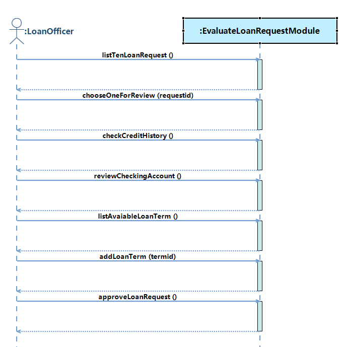
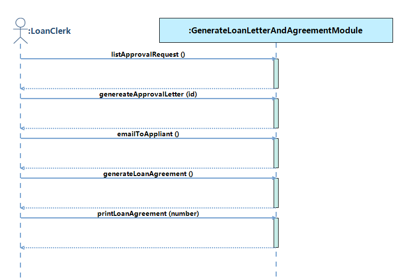
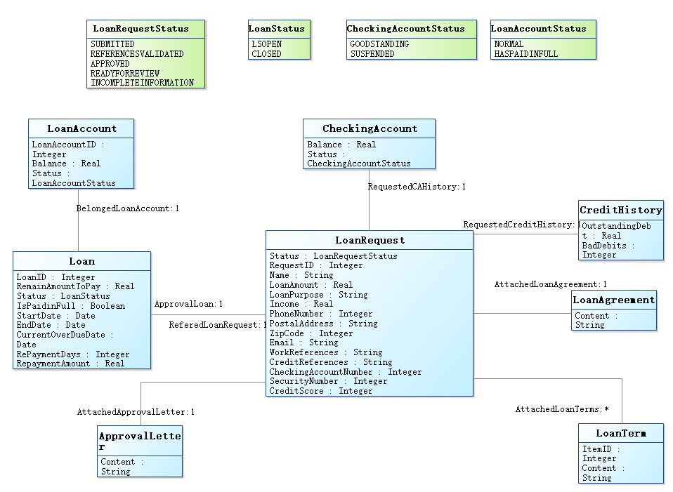

# 1   Introduction
## 1.1   Purpose
This subsection should

- a) Delineate the purpose of the SRS;
- b) Specify the intended audience for the SRS.
## 1.2   Scope
Name of software to be developed: LoanProcessingSystem System

This subsection should

- b) Explain what the software product(s) will, and, if necessary, will not do;
- c) Describe the application of the software being specifified, including relevant benefifits, objectives, and goals;
- d) Be consistent with similar statements in higher-level specififications (e.g., the system requirements specifification), if they exist.
## 1.3   Definitions, acronyms, and abbreviations
This subsection should provide the defifinitions of all terms, acronyms, and abbreviations required to properly interpret the SRS. This information may be provided by reference to one or more appendixes in the SRS or by reference to other documents.
## 1.4   References
This subsection should

- a) Provide a complete list of all documents referenced elsewhere in the SRS;
- b) Identify each document by title, report number (if applicable), date, and publishing organization;
- c) Specify the sources from which the references can be obtained.

This information may be provided by reference to an appendix or to another document.

## 1.5   Overview
This subsection should

- a) Describe what the rest of the SRS contains;
- b) Explain how the SRS is organized.
# 2  Overall description
## 2.1  Product perspective
This subsection of the SRS should put the product into perspective with other related products. If the product is independent and totally self-contained, it should be so stated here. If the SRS defines a product that is a component of a larger system, as frequently occurs, then this subsection should relate the requirements of that larger system to functionality of the software and should identify interfaces between that system and the software.
## 2.2  Product functions
## 2.3  User characteristics
The applicable objects of this system are LoanOfficer, LoanAssistant, LoanClerk, Scheduler, Applicant.
If they know the basic operation of computer, they can use the system to operate the required functions.
Maybe some users need some relevant training.
## 2.4  Constraints
This subsection of the SRS should provide a general description of any other items that will limit the developer’s options. These include

- a) Regulatory policies;
- b) Hardware limitations (e.g., signal timing requirements);
- c) Interfaces to other applications;
- d) Parallel operation;
- e) Audit functions;
- f) Control functions;
- g) Higher-order language requirements;
- h) Signal handshake protocols (e.g., XON-XOFF, ACK-NACK);
- i) Reliability requirements;
- j) Criticality of the application;
- k) Safety and security considerations.
## 2.5  Assumptions and dependencies
This subsection of the SRS should list each of the factors that affect the requirements stated in the SRS. These factors are not design constraints on the software but are, rather, any changes to them that can affect the requirements in the SRS. For example, an assumption may be that a specific operating system will be available on the hardware designated for the software product. If, in fact, the operating system is not available, the SRS would then have to change accordingly. 
## 2.6  Apportioning of requirements
This subsection of the SRS should identify requirements that may be delayed until future versions of the system.
# 3  Specific requirements
## 3.1  Functional requirements
### 3.1.1   User Requirements
<b>Use Case Diagram</b>


<b>A1 - LoanOfficer</b>
<table>
	<tr>
		<td><b>Actor Name:</b></td>
		<td colspan="5"><span name ="ACTORLoanOfficer">LoanOfficer</span></td>
	</tr>
	<tr>
		<td><b>Actor ID:</b></td>
		<td colspan="5">A1</td>
	</tr>
	<tr>
		<td><b>Description:</b></td>
		<td colspan="5">a loan officer is an officer of the bank who has the designated responsibilitiy of evaluating requests for a loan</td>
	</tr>				   
<tr>
	<td colspan="5"><b>Required Functions</b></td>
	<td><b>Related Use Case</b></td>
</tr>
<tr>
			<td colspan="5">The loan officer reviews the online information about the pending loan request to determine whether the loan should be approved</td>
			<td><a href="#UCevaluateLoanRequest">evaluateLoanRequest</a></td>
	</tr>
<tr>
			<td colspan="5"></td>
			<td><a href="#UCmanageLoanTerm">manageLoanTerm</a></td>
	</tr>
</table>
<b>A2 - LoanAssistant</b>
<table>
	<tr>
		<td><b>Actor Name:</b></td>
		<td colspan="5"><span name ="ACTORLoanAssistant">LoanAssistant</span></td>
	</tr>
	<tr>
		<td><b>Actor ID:</b></td>
		<td colspan="5">A2</td>
	</tr>
	<tr>
		<td><b>Description:</b></td>
		<td colspan="5">The loan assistant is responsible for manually capturing and entering into the system the credit information</td>
	</tr>				   
<tr>
	<td colspan="5"><b>Required Functions</b></td>
	<td><b>Related Use Case</b></td>
</tr>
<tr>
			<td colspan="5"></td>
			<td><a href="#UCenterValidatedCreditReferences">enterValidatedCreditReferences</a></td>
	</tr>
</table>
<b>A3 - LoanClerk</b>
<table>
	<tr>
		<td><b>Actor Name:</b></td>
		<td colspan="5"><span name ="ACTORLoanClerk">LoanClerk</span></td>
	</tr>
	<tr>
		<td><b>Actor ID:</b></td>
		<td colspan="5">A3</td>
	</tr>
	<tr>
		<td><b>Description:</b></td>
		<td colspan="5">The loan clerk is responsible for booking (recording and setting up) the loan</td>
	</tr>				   
<tr>
	<td colspan="5"><b>Required Functions</b></td>
	<td><b>Related Use Case</b></td>
</tr>
<tr>
			<td colspan="5">a loan clerk has the system genereate an approval letter for the applicant</td>
			<td><a href="#UCgenerateLoanLetterAndAgreement">generateLoanLetterAndAgreement</a></td>
	</tr>
<tr>
			<td colspan="5">Once a loan aggrement has been sighed by the customer and returned to the bank, the loan clerk has the system create a loan account based on the agreed-on terms and conditions</td>
			<td><a href="#UCbookNewLoan">bookNewLoan</a></td>
	</tr>
<tr>
			<td colspan="5">Payment is received from the customer, the loan clerk enters the payment into the appropriate loan account</td>
			<td><a href="#UCloanPayment">loanPayment</a></td>
	</tr>
<tr>
			<td colspan="5">The loan has been paid in full by the customer, and the loan will be closed</td>
			<td><a href="#UCcloseOutLoan">closeOutLoan</a></td>
	</tr>
</table>
<b>A4 - Scheduler</b>
<table>
	<tr>
		<td><b>Actor Name:</b></td>
		<td colspan="5"><span name ="ACTORScheduler">Scheduler</span></td>
	</tr>
	<tr>
		<td><b>Actor ID:</b></td>
		<td colspan="5">A4</td>
	</tr>
	<tr>
		<td><b>Description:</b></td>
		<td colspan="5"></td>
	</tr>				   
<tr>
	<td colspan="5"><b>Required Functions</b></td>
	<td><b>Related Use Case</b></td>
</tr>
<tr>
			<td colspan="5">when the monthly billing time occurs, the loan system genereates the bill statements for mailing to the customer</td>
			<td><a href="#UCgenerateStandardPaymentNotice">generateStandardPaymentNotice</a></td>
	</tr>
<tr>
			<td colspan="5">The loan system genereates the late notice for mailling to the customer</td>
			<td><a href="#UCgenerateLateNotice">generateLateNotice</a></td>
	</tr>
</table>
<b>A5 - Applicant</b>
<table>
	<tr>
		<td><b>Actor Name:</b></td>
		<td colspan="5"><span name ="ACTORApplicant">Applicant</span></td>
	</tr>
	<tr>
		<td><b>Actor ID:</b></td>
		<td colspan="5">A5</td>
	</tr>
	<tr>
		<td><b>Description:</b></td>
		<td colspan="5">An applicant is an individual or organization who sumits an application for a loan to the bank</td>
	</tr>				   
<tr>
	<td colspan="5"><b>Required Functions</b></td>
	<td><b>Related Use Case</b></td>
</tr>
<tr>
			<td colspan="5"></td>
			<td><a href="#UCsubmitLoanRequest">submitLoanRequest</a></td>
	</tr>
</table>

### 3.1.2   System Requirement
#### 3.1.2.1 Use Case Description
<b>UC1 - evaluateLoanRequest</b>

<table>
	<tr>
		<td><b>UseCase Name:</b></td>
		<td><span name ="UCevaluateLoanRequest">evaluateLoanRequest</span></td>
	</tr>
	<tr>
		<td><b>UseCase ID:</b></td>
		<td>UC1</td>
	</tr>
	<tr>
		<td><b>Brief Description:</b></td>
		<td>The loan officer reviews the online information about the pending loan request to determine whether the loan should be approved</td>
	</tr>
	<tr>
		<td><b>Involved Actor:</b></td>
	<td><a href="#ACTORLoanOfficer">LoanOfficer</a></td>
	</tr>
	<tr>
		<td><b>Preconditions:</b></td>
		<td><ol></ol></td>
	</tr>
	<tr>
		<td><b>Postconditions:</b></td>
		<td><ol></ol></td>
	</tr>						
	<tr>
		<td><b>Basic Path:</b></td>
	<td><p>1. LoanOfficer clicks to execute the operation <a href="#OPlistTenLoanRequest">listTenLoanRequest</a></p><p>2. LoanOfficer clicks to execute the operation <a href="#OPchooseOneForReview">chooseOneForReview</a>, with entering requestid</p><p>3. LoanOfficer clicks to execute the operation <a href="#OPcheckCreditHistory">checkCreditHistory</a></p><p>4. LoanOfficer clicks to execute the operation <a href="#OPreviewCheckingAccount">reviewCheckingAccount</a></p><p>5. LoanOfficer clicks to execute the operation <a href="#OPlistAvaiableLoanTerm">listAvaiableLoanTerm</a></p><p>6. LoanOfficer clicks to execute the operation <a href="#OPaddLoanTerm">addLoanTerm</a>, with entering termid</p><p>7. LoanOfficer clicks to execute the operation <a href="#OPapproveLoanRequest">approveLoanRequest</a></p></td>
	</tr>
	<tr>
		<td><b>Alternative Path:</b></td>
		<td></td>
	</tr>
	</table>



<b>UC2 - manageLoanTerm</b>

<table>
	<tr>
		<td><b>UseCase Name:</b></td>
		<td><span name ="UCmanageLoanTerm">manageLoanTerm</span></td>
	</tr>
	<tr>
		<td><b>UseCase ID:</b></td>
		<td>UC2</td>
	</tr>
	<tr>
		<td><b>Brief Description:</b></td>
		<td></td>
	</tr>
	<tr>
		<td><b>Involved Actor:</b></td>
	<td><a href="#ACTORLoanOfficer">LoanOfficer</a></td>
	</tr>
	<tr>
		<td><b>Preconditions:</b></td>
		<td><ol></ol></td>
	</tr>
	<tr>
		<td><b>Postconditions:</b></td>
		<td><ol></ol></td>
	</tr>						
	<tr>
		<td><b>Basic Path:</b></td>
	<td></td>
	</tr>
	<tr>
		<td><b>Alternative Path:</b></td>
		<td></td>
	</tr>
	</table>
 

<b>UC3 - enterValidatedCreditReferences</b>

<table>
	<tr>
		<td><b>UseCase Name:</b></td>
		<td><span name ="UCenterValidatedCreditReferences">enterValidatedCreditReferences</span></td>
	</tr>
	<tr>
		<td><b>UseCase ID:</b></td>
		<td>UC3</td>
	</tr>
	<tr>
		<td><b>Brief Description:</b></td>
		<td></td>
	</tr>
	<tr>
		<td><b>Involved Actor:</b></td>
	<td><a href="#ACTORLoanAssistant">LoanAssistant</a></td>
	</tr>
	<tr>
		<td><b>Preconditions:</b></td>
		<td><ol></ol></td>
	</tr>
	<tr>
		<td><b>Postconditions:</b></td>
		<td><ol></ol></td>
	</tr>						
	<tr>
		<td><b>Basic Path:</b></td>
	<td></td>
	</tr>
	<tr>
		<td><b>Alternative Path:</b></td>
		<td></td>
	</tr>
	</table>
 

<b>UC4 - generateLoanLetterAndAgreement</b>

<table>
	<tr>
		<td><b>UseCase Name:</b></td>
		<td><span name ="UCgenerateLoanLetterAndAgreement">generateLoanLetterAndAgreement</span></td>
	</tr>
	<tr>
		<td><b>UseCase ID:</b></td>
		<td>UC4</td>
	</tr>
	<tr>
		<td><b>Brief Description:</b></td>
		<td>a loan clerk has the system genereate an approval letter for the applicant</td>
	</tr>
	<tr>
		<td><b>Involved Actor:</b></td>
	<td><a href="#ACTORLoanClerk">LoanClerk</a></td>
	</tr>
	<tr>
		<td><b>Preconditions:</b></td>
		<td><ol></ol></td>
	</tr>
	<tr>
		<td><b>Postconditions:</b></td>
		<td><ol></ol></td>
	</tr>						
	<tr>
		<td><b>Basic Path:</b></td>
	<td><p>1. LoanClerk clicks to execute the operation <a href="#OPlistApprovalRequest">listApprovalRequest</a></p><p>2. LoanClerk clicks to execute the operation <a href="#OPgenereateApprovalLetter">genereateApprovalLetter</a>, with entering id</p><p>3. LoanClerk clicks to execute the operation <a href="#OPemailToAppliant">emailToAppliant</a></p><p>4. LoanClerk clicks to execute the operation <a href="#OPgenerateLoanAgreement">generateLoanAgreement</a></p><p>5. LoanClerk clicks to execute the operation <a href="#OPprintLoanAgreement">printLoanAgreement</a>, with entering number</p></td>
	</tr>
	<tr>
		<td><b>Alternative Path:</b></td>
		<td></td>
	</tr>
	</table>



<b>UC5 - bookNewLoan</b>

<table>
	<tr>
		<td><b>UseCase Name:</b></td>
		<td><span name ="UCbookNewLoan">bookNewLoan</span></td>
	</tr>
	<tr>
		<td><b>UseCase ID:</b></td>
		<td>UC5</td>
	</tr>
	<tr>
		<td><b>Brief Description:</b></td>
		<td>Once a loan aggrement has been sighed by the customer and returned to the bank, the loan clerk has the system create a loan account based on the agreed-on terms and conditions</td>
	</tr>
	<tr>
		<td><b>Involved Actor:</b></td>
	<td><a href="#ACTORLoanClerk">LoanClerk</a></td>
	</tr>
	<tr>
		<td><b>Preconditions:</b></td>
		<td><ol></ol></td>
	</tr>
	<tr>
		<td><b>Postconditions:</b></td>
		<td><ol></ol></td>
	</tr>						
	<tr>
		<td><b>Basic Path:</b></td>
	<td></td>
	</tr>
	<tr>
		<td><b>Alternative Path:</b></td>
		<td></td>
	</tr>
	</table>
 

<b>UC6 - loanPayment</b>

<table>
	<tr>
		<td><b>UseCase Name:</b></td>
		<td><span name ="UCloanPayment">loanPayment</span></td>
	</tr>
	<tr>
		<td><b>UseCase ID:</b></td>
		<td>UC6</td>
	</tr>
	<tr>
		<td><b>Brief Description:</b></td>
		<td>Payment is received from the customer, the loan clerk enters the payment into the appropriate loan account</td>
	</tr>
	<tr>
		<td><b>Involved Actor:</b></td>
	<td><a href="#ACTORLoanClerk">LoanClerk</a></td>
	</tr>
	<tr>
		<td><b>Preconditions:</b></td>
		<td><ol></ol></td>
	</tr>
	<tr>
		<td><b>Postconditions:</b></td>
		<td><ol></ol></td>
	</tr>						
	<tr>
		<td><b>Basic Path:</b></td>
	<td></td>
	</tr>
	<tr>
		<td><b>Alternative Path:</b></td>
		<td></td>
	</tr>
	</table>
 

<b>UC7 - closeOutLoan</b>

<table>
	<tr>
		<td><b>UseCase Name:</b></td>
		<td><span name ="UCcloseOutLoan">closeOutLoan</span></td>
	</tr>
	<tr>
		<td><b>UseCase ID:</b></td>
		<td>UC7</td>
	</tr>
	<tr>
		<td><b>Brief Description:</b></td>
		<td>The loan has been paid in full by the customer, and the loan will be closed</td>
	</tr>
	<tr>
		<td><b>Involved Actor:</b></td>
	<td><a href="#ACTORLoanClerk">LoanClerk</a></td>
	</tr>
	<tr>
		<td><b>Preconditions:</b></td>
		<td><ol></ol></td>
	</tr>
	<tr>
		<td><b>Postconditions:</b></td>
		<td><ol></ol></td>
	</tr>						
	<tr>
		<td><b>Basic Path:</b></td>
	<td></td>
	</tr>
	<tr>
		<td><b>Alternative Path:</b></td>
		<td></td>
	</tr>
	</table>
 

<b>UC8 - generateStandardPaymentNotice</b>

<table>
	<tr>
		<td><b>UseCase Name:</b></td>
		<td><span name ="UCgenerateStandardPaymentNotice">generateStandardPaymentNotice</span></td>
	</tr>
	<tr>
		<td><b>UseCase ID:</b></td>
		<td>UC8</td>
	</tr>
	<tr>
		<td><b>Brief Description:</b></td>
		<td>when the monthly billing time occurs, the loan system genereates the bill statements for mailing to the customer</td>
	</tr>
	<tr>
		<td><b>Involved Actor:</b></td>
	<td><a href="#ACTORScheduler">Scheduler</a></td>
	</tr>
	<tr>
		<td><b>Preconditions:</b></td>
		<td><ol></ol></td>
	</tr>
	<tr>
		<td><b>Postconditions:</b></td>
		<td><ol></ol></td>
	</tr>						
	<tr>
		<td><b>Basic Path:</b></td>
	<td></td>
	</tr>
	<tr>
		<td><b>Alternative Path:</b></td>
		<td></td>
	</tr>
	</table>
 

<b>UC9 - generateLateNotice</b>

<table>
	<tr>
		<td><b>UseCase Name:</b></td>
		<td><span name ="UCgenerateLateNotice">generateLateNotice</span></td>
	</tr>
	<tr>
		<td><b>UseCase ID:</b></td>
		<td>UC9</td>
	</tr>
	<tr>
		<td><b>Brief Description:</b></td>
		<td>The loan system genereates the late notice for mailling to the customer</td>
	</tr>
	<tr>
		<td><b>Involved Actor:</b></td>
	<td><a href="#ACTORScheduler">Scheduler</a></td>
	</tr>
	<tr>
		<td><b>Preconditions:</b></td>
		<td><ol></ol></td>
	</tr>
	<tr>
		<td><b>Postconditions:</b></td>
		<td><ol></ol></td>
	</tr>						
	<tr>
		<td><b>Basic Path:</b></td>
	<td></td>
	</tr>
	<tr>
		<td><b>Alternative Path:</b></td>
		<td></td>
	</tr>
	</table>
 

<b>UC10 - submitLoanRequest</b>

<table>
	<tr>
		<td><b>UseCase Name:</b></td>
		<td><span name ="UCsubmitLoanRequest">submitLoanRequest</span></td>
	</tr>
	<tr>
		<td><b>UseCase ID:</b></td>
		<td>UC10</td>
	</tr>
	<tr>
		<td><b>Brief Description:</b></td>
		<td></td>
	</tr>
	<tr>
		<td><b>Involved Actor:</b></td>
	<td><a href="#ACTORApplicant">Applicant</a></td>
	</tr>
	<tr>
		<td><b>Preconditions:</b></td>
		<td><ol></ol></td>
	</tr>
	<tr>
		<td><b>Postconditions:</b></td>
		<td><ol></ol></td>
	</tr>						
	<tr>
		<td><b>Basic Path:</b></td>
	<td></td>
	</tr>
	<tr>
		<td><b>Alternative Path:</b></td>
		<td></td>
	</tr>
	</table>
 


#### 3.1.2.2   Entity Analysis
<b>Conceptual Class Diagram</b> 



<b>E1 - LoanRequest</b>

<table>
	<tr>
		<td><b>Entity Name:</b></td>
		   <td colspan="3"><span name ="CLASSLoanRequest">LoanRequest</span></td>
	</tr>
	<tr>
		<td><b>Entity ID:</b></td>
		   <td colspan="3">E1</td>
	</tr>
	<tr>
	    <td><b>Entity Description:</b></td>
	    <td colspan="3"></td>
	</tr>
	<tr>
	    <td><b>Attribute Name</b></td>
		<td><b>Attribute Type</b></td>
		<td colspan="2"><b>Attribute Description</b></td>
	</tr>
	<tr>
	    <td>Status</td>
	<td>[SUBMITTED|REFERENCESVALIDATED|APPROVED|READYFORREVIEW|INCOMPLETEINFORMATION]</td>
	<td colspan="2">The Status of LoanRequest</td>
					</tr>
	<tr>
	    <td>RequestID</td>
	<td>Integer</td>
	<td colspan="2">The RequestID of LoanRequest</td>
					</tr>
	<tr>
	    <td>Name</td>
	<td>String</td>
	<td colspan="2">The Name of LoanRequest</td>
					</tr>
	<tr>
	    <td>LoanAmount</td>
	<td>Real</td>
	<td colspan="2">The LoanAmount of LoanRequest</td>
					</tr>
	<tr>
	    <td>LoanPurpose</td>
	<td>String</td>
	<td colspan="2">The LoanPurpose of LoanRequest</td>
					</tr>
	<tr>
	    <td>Income</td>
	<td>Real</td>
	<td colspan="2">The Income of LoanRequest</td>
					</tr>
	<tr>
	    <td>PhoneNumber</td>
	<td>Integer</td>
	<td colspan="2">The PhoneNumber of LoanRequest</td>
					</tr>
	<tr>
	    <td>PostalAddress</td>
	<td>String</td>
	<td colspan="2">The PostalAddress of LoanRequest</td>
					</tr>
	<tr>
	    <td>ZipCode</td>
	<td>Integer</td>
	<td colspan="2">The ZipCode of LoanRequest</td>
					</tr>
	<tr>
	    <td>Email</td>
	<td>String</td>
	<td colspan="2">The Email of LoanRequest</td>
					</tr>
	<tr>
	    <td>WorkReferences</td>
	<td>String</td>
	<td colspan="2">The WorkReferences of LoanRequest</td>
					</tr>
	<tr>
	    <td>CreditReferences</td>
	<td>String</td>
	<td colspan="2">The CreditReferences of LoanRequest</td>
					</tr>
	<tr>
	    <td>CheckingAccountNumber</td>
	<td>Integer</td>
	<td colspan="2">The CheckingAccountNumber of LoanRequest</td>
					</tr>
	<tr>
	    <td>SecurityNumber</td>
	<td>Integer</td>
	<td colspan="2">The SecurityNumber of LoanRequest</td>
					</tr>
	<tr>
	    <td>CreditScore</td>
	<td>Integer</td>
	<td colspan="2">The CreditScore of LoanRequest</td>
					</tr>
	<tr>
	    <td><b>Relationship Name</b></td>
	<td><b>Related Entity</b></td>
	<td><b>Relationship Type</b></td>
	<td><b>Relationship Description</b></td>
	</tr>
		<tr>
			<td>ApprovalLoan</td>
			<td><a href="#CLASSLoan">Loan</a></td>
			<td>Association</td>
		<td>One LoanRequest is linked with one Loan</td>
	</tr>
		<tr>
			<td>RequestedCAHistory</td>
			<td><a href="#CLASSCheckingAccount">CheckingAccount</a></td>
			<td>Association</td>
		<td>One LoanRequest is linked to one CheckingAccount</td>
	</tr>
		<tr>
			<td>RequestedCreditHistory</td>
			<td><a href="#CLASSCreditHistory">CreditHistory</a></td>
			<td>Association</td>
		<td>One LoanRequest is linked to one CreditHistory</td>
	</tr>
		<tr>
			<td>AttachedApprovalLetter</td>
			<td><a href="#CLASSApprovalLetter">ApprovalLetter</a></td>
			<td>Association</td>
		<td>One LoanRequest is linked to one ApprovalLetter</td>
	</tr>
		<tr>
			<td>AttachedLoanAgreement</td>
			<td><a href="#CLASSLoanAgreement">LoanAgreement</a></td>
			<td>Association</td>
		<td>One LoanRequest is linked to one LoanAgreement</td>
	</tr>
		<tr>
			<td>AttachedLoanTerms</td>
			<td><a href="#CLASSLoanTerm">LoanTerm</a></td>
			<td>Association</td>
		<td>One LoanRequest is linked to many LoanTerm</td>
	</tr>
	</table>

<b>E2 - Loan</b>

<table>
	<tr>
		<td><b>Entity Name:</b></td>
		   <td colspan="3"><span name ="CLASSLoan">Loan</span></td>
	</tr>
	<tr>
		<td><b>Entity ID:</b></td>
		   <td colspan="3">E2</td>
	</tr>
	<tr>
	    <td><b>Entity Description:</b></td>
	    <td colspan="3"></td>
	</tr>
	<tr>
	    <td><b>Attribute Name</b></td>
		<td><b>Attribute Type</b></td>
		<td colspan="2"><b>Attribute Description</b></td>
	</tr>
	<tr>
	    <td>LoanID</td>
	<td>Integer</td>
	<td colspan="2">The LoanID of Loan</td>
					</tr>
	<tr>
	    <td>RemainAmountToPay</td>
	<td>Real</td>
	<td colspan="2">The RemainAmountToPay of Loan</td>
					</tr>
	<tr>
	    <td>Status</td>
	<td>[LSOPEN|CLOSED]</td>
	<td colspan="2">The Status of Loan</td>
					</tr>
	<tr>
	    <td>IsPaidinFull</td>
	<td>Boolean</td>
	<td colspan="2">The IsPaidinFull of Loan</td>
					</tr>
	<tr>
	    <td>StartDate</td>
	<td>LocalDate</td>
	<td colspan="2">The StartDate of Loan</td>
					</tr>
	<tr>
	    <td>EndDate</td>
	<td>LocalDate</td>
	<td colspan="2">The EndDate of Loan</td>
					</tr>
	<tr>
	    <td>CurrentOverDueDate</td>
	<td>LocalDate</td>
	<td colspan="2">The CurrentOverDueDate of Loan</td>
					</tr>
	<tr>
	    <td>RePaymentDays</td>
	<td>Integer</td>
	<td colspan="2">The RePaymentDays of Loan</td>
					</tr>
	<tr>
	    <td>RepaymentAmount</td>
	<td>Real</td>
	<td colspan="2">The RepaymentAmount of Loan</td>
					</tr>
	<tr>
	    <td><b>Relationship Name</b></td>
	<td><b>Related Entity</b></td>
	<td><b>Relationship Type</b></td>
	<td><b>Relationship Description</b></td>
	</tr>
		<tr>
			<td>ReferedLoanRequest</td>
			<td><a href="#CLASSLoanRequest">LoanRequest</a></td>
			<td>Association</td>
		<td>One Loan is linked with one LoanRequest</td>
	</tr>
		<tr>
			<td>BelongedLoanAccount</td>
			<td><a href="#CLASSLoanAccount">LoanAccount</a></td>
			<td>Association</td>
		<td>One Loan is linked to one LoanAccount</td>
	</tr>
	</table>

<b>E3 - LoanTerm</b>

<table>
	<tr>
		<td><b>Entity Name:</b></td>
		   <td colspan="3"><span name ="CLASSLoanTerm">LoanTerm</span></td>
	</tr>
	<tr>
		<td><b>Entity ID:</b></td>
		   <td colspan="3">E3</td>
	</tr>
	<tr>
	    <td><b>Entity Description:</b></td>
	    <td colspan="3"></td>
	</tr>
	<tr>
	    <td><b>Attribute Name</b></td>
		<td><b>Attribute Type</b></td>
		<td colspan="2"><b>Attribute Description</b></td>
	</tr>
	<tr>
	    <td>ItemID</td>
	<td>Integer</td>
	<td colspan="2">The ItemID of LoanTerm</td>
					</tr>
	<tr>
	    <td>Content</td>
	<td>String</td>
	<td colspan="2">The Content of LoanTerm</td>
					</tr>
	</table>

<b>E4 - CheckingAccount</b>

<table>
	<tr>
		<td><b>Entity Name:</b></td>
		   <td colspan="3"><span name ="CLASSCheckingAccount">CheckingAccount</span></td>
	</tr>
	<tr>
		<td><b>Entity ID:</b></td>
		   <td colspan="3">E4</td>
	</tr>
	<tr>
	    <td><b>Entity Description:</b></td>
	    <td colspan="3"></td>
	</tr>
	<tr>
	    <td><b>Attribute Name</b></td>
		<td><b>Attribute Type</b></td>
		<td colspan="2"><b>Attribute Description</b></td>
	</tr>
	<tr>
	    <td>Balance</td>
	<td>Real</td>
	<td colspan="2">The Balance of CheckingAccount</td>
					</tr>
	<tr>
	    <td>Status</td>
	<td>[GOODSTANDING|SUSPENDED]</td>
	<td colspan="2">The Status of CheckingAccount</td>
					</tr>
	</table>

<b>E5 - CreditHistory</b>

<table>
	<tr>
		<td><b>Entity Name:</b></td>
		   <td colspan="3"><span name ="CLASSCreditHistory">CreditHistory</span></td>
	</tr>
	<tr>
		<td><b>Entity ID:</b></td>
		   <td colspan="3">E5</td>
	</tr>
	<tr>
	    <td><b>Entity Description:</b></td>
	    <td colspan="3"></td>
	</tr>
	<tr>
	    <td><b>Attribute Name</b></td>
		<td><b>Attribute Type</b></td>
		<td colspan="2"><b>Attribute Description</b></td>
	</tr>
	<tr>
	    <td>OutstandingDebt</td>
	<td>Real</td>
	<td colspan="2">The OutstandingDebt of CreditHistory</td>
					</tr>
	<tr>
	    <td>BadDebits</td>
	<td>Integer</td>
	<td colspan="2">The BadDebits of CreditHistory</td>
					</tr>
	</table>

<b>E6 - LoanAccount</b>

<table>
	<tr>
		<td><b>Entity Name:</b></td>
		   <td colspan="3"><span name ="CLASSLoanAccount">LoanAccount</span></td>
	</tr>
	<tr>
		<td><b>Entity ID:</b></td>
		   <td colspan="3">E6</td>
	</tr>
	<tr>
	    <td><b>Entity Description:</b></td>
	    <td colspan="3"></td>
	</tr>
	<tr>
	    <td><b>Attribute Name</b></td>
		<td><b>Attribute Type</b></td>
		<td colspan="2"><b>Attribute Description</b></td>
	</tr>
	<tr>
	    <td>LoanAccountID</td>
	<td>Integer</td>
	<td colspan="2">The LoanAccountID of LoanAccount</td>
					</tr>
	<tr>
	    <td>Balance</td>
	<td>Real</td>
	<td colspan="2">The Balance of LoanAccount</td>
					</tr>
	<tr>
	    <td>Status</td>
	<td>[NORMAL|HASPAIDINFULL]</td>
	<td colspan="2">The Status of LoanAccount</td>
					</tr>
	</table>

<b>E7 - ApprovalLetter</b>

<table>
	<tr>
		<td><b>Entity Name:</b></td>
		   <td colspan="3"><span name ="CLASSApprovalLetter">ApprovalLetter</span></td>
	</tr>
	<tr>
		<td><b>Entity ID:</b></td>
		   <td colspan="3">E7</td>
	</tr>
	<tr>
	    <td><b>Entity Description:</b></td>
	    <td colspan="3"></td>
	</tr>
	<tr>
	    <td><b>Attribute Name</b></td>
		<td><b>Attribute Type</b></td>
		<td colspan="2"><b>Attribute Description</b></td>
	</tr>
	<tr>
	    <td>Content</td>
	<td>String</td>
	<td colspan="2">The Content of ApprovalLetter</td>
					</tr>
	</table>

<b>E8 - LoanAgreement</b>

<table>
	<tr>
		<td><b>Entity Name:</b></td>
		   <td colspan="3"><span name ="CLASSLoanAgreement">LoanAgreement</span></td>
	</tr>
	<tr>
		<td><b>Entity ID:</b></td>
		   <td colspan="3">E8</td>
	</tr>
	<tr>
	    <td><b>Entity Description:</b></td>
	    <td colspan="3">The loan agreement</td>
	</tr>
	<tr>
	    <td><b>Attribute Name</b></td>
		<td><b>Attribute Type</b></td>
		<td colspan="2"><b>Attribute Description</b></td>
	</tr>
	<tr>
	    <td>Content</td>
	<td>String</td>
	<td colspan="2">The Content of LoanAgreement</td>
					</tr>
	</table>
​	 

#### 3.1.2.3   System Interfaces
##### System Interfaces
<b>SI1 - SubmitLoanRequestModule</b>
<table>
	<tr>
		<td><b>System Interface Name:</b></td>
		<td><span name ="SERVICESubmitLoanRequestModule">SubmitLoanRequestModule</span></td>
	</tr>
	<tr>
		<td><b>System Interface ID:</b></td>
		<td>SI1</td>
	</tr>
	<tr>
		<td><b>Description:</b></td>
		<td></td>
	</tr>
	<tr>
		<td><b>Operation:</b></td>
	<td><ul><li><a href="#OPenterLoanInformation">enterLoanInformation</a></li><li><a href="#OPcreditRequest">creditRequest</a></li><li><a href="#OPaccountStatusRequest">accountStatusRequest</a></li><li><a href="#OPcalculateScore">calculateScore</a></li></ul></td>
	</tr>
<tr>
			<td><b>Temporary Variable</b></td>
			<td><b>Variable Description</b></td>
	</tr>
	<tr>
		<td><span name ="SubmitLoanRequestModuleCurrentLoanRequest">CurrentLoanRequest</span></td>
		<td>CurrentLoanRequest is a object of <a href="#CLASSLoanRequest">LoanRequest</a></td>
					</tr>
	</table>

<b>SI2 - ThirdPartyServices</b>
<table>
	<tr>
		<td><b>System Interface Name:</b></td>
		<td><span name ="SERVICEThirdPartyServices">ThirdPartyServices</span></td>
	</tr>
	<tr>
		<td><b>System Interface ID:</b></td>
		<td>SI2</td>
	</tr>
	<tr>
		<td><b>Description:</b></td>
		<td></td>
	</tr>
	<tr>
		<td><b>Operation:</b></td>
	<td><ul><li><a href="#OPsendEmail">sendEmail</a></li><li><a href="#OPprint">print</a></li><li><a href="#OPcreateLoanAccount">createLoanAccount</a></li><li><a href="#OPtransferFunds">transferFunds</a></li><li><a href="#OPgetCreditHistory">getCreditHistory</a></li><li><a href="#OPgetCheckingAccountStatus">getCheckingAccountStatus</a></li></ul></td>
	</tr>
	</table>

<b>SI3 - EnterValidatedCreditReferencesModule</b>
<table>
	<tr>
		<td><b>System Interface Name:</b></td>
		<td><span name ="SERVICEEnterValidatedCreditReferencesModule">EnterValidatedCreditReferencesModule</span></td>
	</tr>
	<tr>
		<td><b>System Interface ID:</b></td>
		<td>SI3</td>
	</tr>
	<tr>
		<td><b>Description:</b></td>
		<td></td>
	</tr>
	<tr>
		<td><b>Operation:</b></td>
	<td><ul><li><a href="#OPlistSubmitedLoanRequest">listSubmitedLoanRequest</a></li><li><a href="#OPchooseLoanRequest">chooseLoanRequest</a></li><li><a href="#OPmarkRequestValid">markRequestValid</a></li></ul></td>
	</tr>
<tr>
			<td><b>Temporary Variable</b></td>
			<td><b>Variable Description</b></td>
	</tr>
	<tr>
		<td><span name ="EnterValidatedCreditReferencesModuleCurrentLoanRequest">CurrentLoanRequest</span></td>
		<td>CurrentLoanRequest is a object of <a href="#CLASSLoanRequest">LoanRequest</a></td>
					</tr>
	<tr>
		<td><span name ="EnterValidatedCreditReferencesModuleCurrentLoanRequests">CurrentLoanRequests</span></td>
		<td>CurrentLoanRequests is a set of <a href="#CLASSLoanRequest">LoanRequest</a></td>
					</tr>
	</table>

<b>SI4 - EvaluateLoanRequestModule</b>
<table>
	<tr>
		<td><b>System Interface Name:</b></td>
		<td><span name ="SERVICEEvaluateLoanRequestModule">EvaluateLoanRequestModule</span></td>
	</tr>
	<tr>
		<td><b>System Interface ID:</b></td>
		<td>SI4</td>
	</tr>
	<tr>
		<td><b>Description:</b></td>
		<td></td>
	</tr>
	<tr>
		<td><b>Operation:</b></td>
	<td><ul><li><a href="#OPlistTenLoanRequest">listTenLoanRequest</a></li><li><a href="#OPchooseOneForReview">chooseOneForReview</a></li><li><a href="#OPcheckCreditHistory">checkCreditHistory</a></li><li><a href="#OPreviewCheckingAccount">reviewCheckingAccount</a></li><li><a href="#OPlistAvaiableLoanTerm">listAvaiableLoanTerm</a></li><li><a href="#OPaddLoanTerm">addLoanTerm</a></li><li><a href="#OPapproveLoanRequest">approveLoanRequest</a></li></ul></td>
	</tr>
<tr>
			<td><b>Temporary Variable</b></td>
			<td><b>Variable Description</b></td>
	</tr>
	<tr>
		<td><span name ="EvaluateLoanRequestModuleCurrentLoanRequest">CurrentLoanRequest</span></td>
		<td>CurrentLoanRequest is a object of <a href="#CLASSLoanRequest">LoanRequest</a></td>
					</tr>
	<tr>
		<td><span name ="EvaluateLoanRequestModuleCurrentLoanRequests">CurrentLoanRequests</span></td>
		<td>CurrentLoanRequests is a set of <a href="#CLASSLoanRequest">LoanRequest</a></td>
					</tr>
	</table>

<b>SI5 - GenerateLoanLetterAndAgreementModule</b>
<table>
	<tr>
		<td><b>System Interface Name:</b></td>
		<td><span name ="SERVICEGenerateLoanLetterAndAgreementModule">GenerateLoanLetterAndAgreementModule</span></td>
	</tr>
	<tr>
		<td><b>System Interface ID:</b></td>
		<td>SI5</td>
	</tr>
	<tr>
		<td><b>Description:</b></td>
		<td></td>
	</tr>
	<tr>
		<td><b>Operation:</b></td>
	<td><ul><li><a href="#OPlistApprovalRequest">listApprovalRequest</a></li><li><a href="#OPgenereateApprovalLetter">genereateApprovalLetter</a></li><li><a href="#OPemailToAppliant">emailToAppliant</a></li><li><a href="#OPgenerateLoanAgreement">generateLoanAgreement</a></li><li><a href="#OPprintLoanAgreement">printLoanAgreement</a></li></ul></td>
	</tr>
<tr>
			<td><b>Temporary Variable</b></td>
			<td><b>Variable Description</b></td>
	</tr>
	<tr>
		<td><span name ="GenerateLoanLetterAndAgreementModuleCurrentApprovalLetter">CurrentApprovalLetter</span></td>
		<td>CurrentApprovalLetter is a object of <a href="#CLASSApprovalLetter">ApprovalLetter</a></td>
					</tr>
	<tr>
		<td><span name ="GenerateLoanLetterAndAgreementModuleCurrentLoanAgreement">CurrentLoanAgreement</span></td>
		<td>CurrentLoanAgreement is a object of <a href="#CLASSLoanAgreement">LoanAgreement</a></td>
					</tr>
	<tr>
		<td><span name ="GenerateLoanLetterAndAgreementModuleCurrentLoanRequest">CurrentLoanRequest</span></td>
		<td>CurrentLoanRequest is a object of <a href="#CLASSLoanRequest">LoanRequest</a></td>
					</tr>
	<tr>
		<td><span name ="GenerateLoanLetterAndAgreementModuleCurrentLoanRequests">CurrentLoanRequests</span></td>
		<td>CurrentLoanRequests is a set of <a href="#CLASSLoanRequest">LoanRequest</a></td>
					</tr>
	</table>

<b>SI6 - LoanProcessingSystemSystem</b>
<table>
	<tr>
		<td><b>System Interface Name:</b></td>
		<td><span name ="SERVICELoanProcessingSystemSystem">LoanProcessingSystemSystem</span></td>
	</tr>
	<tr>
		<td><b>System Interface ID:</b></td>
		<td>SI6</td>
	</tr>
	<tr>
		<td><b>Description:</b></td>
		<td></td>
	</tr>
	<tr>
		<td><b>Operation:</b></td>
	<td><ul><li><a href="#OPbookNewLoan">bookNewLoan</a></li><li><a href="#OPgenerateStandardPaymentNotice">generateStandardPaymentNotice</a></li><li><a href="#OPgenerateLateNotice">generateLateNotice</a></li><li><a href="#OPlistBookedLoans">listBookedLoans</a></li><li><a href="#OPloanPayment">loanPayment</a></li><li><a href="#OPcloseOutLoan">closeOutLoan</a></li></ul></td>
	</tr>
	</table>

<b>SI7 - ManageLoanTermCRUDService</b>
<table>
	<tr>
		<td><b>System Interface Name:</b></td>
		<td><span name ="SERVICEManageLoanTermCRUDService">ManageLoanTermCRUDService</span></td>
	</tr>
	<tr>
		<td><b>System Interface ID:</b></td>
		<td>SI7</td>
	</tr>
	<tr>
		<td><b>Description:</b></td>
		<td></td>
	</tr>
	<tr>
		<td><b>Operation:</b></td>
	<td><ul><li><a href="#OPcreateLoanTerm">createLoanTerm</a></li><li><a href="#OPqueryLoanTerm">queryLoanTerm</a></li><li><a href="#OPmodifyLoanTerm">modifyLoanTerm</a></li><li><a href="#OPdeleteLoanTerm">deleteLoanTerm</a></li></ul></td>
	</tr>
	</table>
​	 

##### System Operation Description
<b>OP1 - enterLoanInformation</b>
<table>
	<tr>
		<td><b>Operation Name:</b></td>
		<td><span name ="OPenterLoanInformation">enterLoanInformation</span></td>
	</tr>
	<tr>
		<td><b>Operation ID:</b></td>
		<td>OP1</td>
	</tr>
	<tr>
		<td><b>Description:</b></td>
		<td> </td>
	</tr>
	<tr>
		<td><b>Service:</b></td>
		<td><a href="#SERVICESubmitLoanRequestModule">SubmitLoanRequestModule</a></td>
	</tr>
	<tr>
		<td><b>Input:</b></td>
<td><p>1. name: <i>requestid</i>, type: Integer</p><p>2. name: <i>name</i>, type: String</p><p>3. name: <i>loanamount</i>, type: Real</p><p>4. name: <i>loanpurpose</i>, type: String</p><p>5. name: <i>income</i>, type: Real</p><p>6. name: <i>phonenumber</i>, type: Integer</p><p>7. name: <i>postaladdress</i>, type: String</p><p>8. name: <i>zipcode</i>, type: Integer</p><p>9. name: <i>email</i>, type: String</p><p>10. name: <i>workreferences</i>, type: String</p><p>11. name: <i>creditreferences</i>, type: String</p><p>12. name: <i>checkingaccountnumber</i>, type: Integer</p><p>13. name: <i>securitynumber</i>, type: Integer</p></td>
</tr>
<tr>
	<td><b>Output Type:</b></td>
	<td>Boolean</td>
</tr>
<tr>
			<td><b>Definition:</b></td>
<td><p><i>loanrequest</i> is the object <i>loa</i> in the instance set of class <a href="#CLASSLoanRequest">LoanRequest</a>. <i>loa</i> represents an object of class <a href="#CLASSLoanRequest">LoanRequest</a>, and <i>loa</i> meets:</p><p>&emsp;&emsp;The attribute <i>RequestID</i> of the object <i>loa</i> is equal to <i>requestid</i></p></td>
	</tr>
	<tr>
<td><b>Preconditions:</b></td>
		<td><p><i>loanrequest</i> doesn't exist</p></td>
</tr>
	<tr>
		<td><b>Postconditions:</b></td>
	<td><p>1. <i>loa</i> represented the object of class <a href="#CLASSLoanRequest">LoanRequest</a></p><p>2. The object <i>loa</i> was created</p><p>3. The attribute <i>RequestID</i> of the object <i>loa</i> became <i>requestid</i></p><p>4. The attribute <i>Name</i> of the object <i>loa</i> became <i>name</i></p><p>5. The attribute <i>LoanAmount</i> of the object <i>loa</i> became <i>loanamount</i></p><p>6. The attribute <i>LoanPurpose</i> of the object <i>loa</i> became <i>loanpurpose</i></p><p>7. The attribute <i>Income</i> of the object <i>loa</i> became <i>income</i></p><p>8. The attribute <i>PhoneNumber</i> of the object <i>loa</i> became <i>phonenumber</i></p><p>9. The attribute <i>PostalAddress</i> of the object <i>loa</i> became <i>postaladdress</i></p><p>10. The attribute <i>ZipCode</i> of the object <i>loa</i> became <i>zipcode</i></p><p>11. The attribute <i>Email</i> of the object <i>loa</i> became <i>email</i></p><p>12. The attribute <i>WorkReferences</i> of the object <i>loa</i> became <i>workreferences</i></p><p>13. The attribute <i>CreditReferences</i> of the object <i>loa</i> became <i>creditreferences</i></p><p>14. The attribute <i>CheckingAccountNumber</i> of the object <i>loa</i> became <i>checkingaccountnumber</i></p><p>15. The attribute <i>SecurityNumber</i> of the object <i>loa</i> became <i>securitynumber</i></p><p>16. The object <i>loa</i> was put into the instance set of class <a href="#CLASSLoanRequest">LoanRequest</a></p><p>17. The object <a href="#SubmitLoanRequestModuleCurrentLoanRequest">CurrentLoanRequest</a> became <i>loa</i></p><p>18. The return value was <b>true</b></p></td>
	</tr>
</table>

<p>Contract of enterLoanInformation:</p>

```java
Contract  SubmitLoanRequestModule::enterLoanInformation(requestid : Integer, name : String, loanamount : Real, loanpurpose : String, income : Real, phonenumber : Integer, postaladdress : String, zipcode : Integer, email : String, workreferences : String, creditreferences : String, checkingaccountnumber : Integer, securitynumber : Integer) : Boolean {
		/*
		 * Generated by RM2Doc - Definition
		 * loanrequest is the object loa in the instance set of class LoanRequest. loa represents an object of class LoanRequest, and loa meets:
		 *     The attribute RequestID of the object loa is equal to requestid
		 */
		definition:
			loanrequest:LoanRequest = LoanRequest.allInstance()->any(loa:LoanRequest | loa.RequestID = requestid)
		/*
		 * Generated by RM2Doc - Precondition
		 * loanrequest doesn't exist
		 */
		precondition:
			loanrequest.oclIsUndefined() = true
		/*
		 * Generated by RM2Doc - Postcondition
		 * loa represented the object of class LoanRequest
		 * The object loa was created
		 * The attribute RequestID of the object loa became requestid
		 * The attribute Name of the object loa became name
		 * The attribute LoanAmount of the object loa became loanamount
		 * The attribute LoanPurpose of the object loa became loanpurpose
		 * The attribute Income of the object loa became income
		 * The attribute PhoneNumber of the object loa became phonenumber
		 * The attribute PostalAddress of the object loa became postaladdress
		 * The attribute ZipCode of the object loa became zipcode
		 * The attribute Email of the object loa became email
		 * The attribute WorkReferences of the object loa became workreferences
		 * The attribute CreditReferences of the object loa became creditreferences
		 * The attribute CheckingAccountNumber of the object loa became checkingaccountnumber
		 * The attribute SecurityNumber of the object loa became securitynumber
		 * The object loa was put into the instance set of class LoanRequest
		 * The object CurrentLoanRequest became loa
		 * The return value was true
		 */
		postcondition:
			let loa:LoanRequest in
			loa.oclIsNew() and
			loa.RequestID = requestid and
			loa.Name = name and
			loa.LoanAmount = loanamount and
			loa.LoanPurpose = loanpurpose and
			loa.Income = income and
			loa.PhoneNumber = phonenumber and
			loa.PostalAddress = postaladdress and
			loa.ZipCode = zipcode and
			loa.Email = email and
			loa.WorkReferences = workreferences and
			loa.CreditReferences = creditreferences and
			loa.CheckingAccountNumber = checkingaccountnumber and
			loa.SecurityNumber = securitynumber and
			LoanRequest.allInstance()->includes(loa) and
			self.CurrentLoanRequest = loa and
			result = true
}
```

<b>OP2 - creditRequest</b>
<table>
	<tr>
		<td><b>Operation Name:</b></td>
		<td><span name ="OPcreditRequest">creditRequest</span></td>
	</tr>
	<tr>
		<td><b>Operation ID:</b></td>
		<td>OP2</td>
	</tr>
	<tr>
		<td><b>Description:</b></td>
		<td> </td>
	</tr>
	<tr>
		<td><b>Service:</b></td>
		<td><a href="#SERVICESubmitLoanRequestModule">SubmitLoanRequestModule</a></td>
	</tr>
	<tr>
		<td><b>Input:</b></td>
<td>None</td>
</tr>
<tr>
	<td><b>Output Type:</b></td>
	<td>Boolean</td>
</tr>
	<tr>
<td><b>Preconditions:</b></td>
		<td><p>The object <a href="#SubmitLoanRequestModuleCurrentLoanRequest">CurrentLoanRequest</a> exists</p></td>
</tr>
	<tr>
		<td><b>Postconditions:</b></td>
	<td><p>1. <i>his</i> represented the object of class <a href="#CLASSCreditHistory">CreditHistory</a></p><p>2. The object <i>his</i> was created</p><p>3. <i>his</i> became the return value of system operation <a href="#OPgetCreditHistory">getCreditHistory</a></p><p>4. The object <i>CurrentLoanRequest</i> was linked to the object <i>his</i> by <i>RequestedCreditHistory</i></p><p>5. The object <i>his</i> was put into the instance set of class <a href="#CLASSCreditHistory">CreditHistory</a></p><p>6. The return value was <b>true</b></p></td>
	</tr>
</table>

<p>Contract of creditRequest:</p>

```java
Contract SubmitLoanRequestModule::creditRequest() : Boolean {
		/*
		 * Generated by RM2Doc - Precondition
		 * The object CurrentLoanRequest exists
		 */
		precondition:
			self.CurrentLoanRequest.oclIsUndefined() = false
		/*
		 * Generated by RM2Doc - Postcondition
		 * his represented the object of class CreditHistory
		 * The object his was created
		 * his became the return value of system operation getCreditHistory
		 * The object CurrentLoanRequest was linked to the object his by RequestedCreditHistory
		 * The object his was put into the instance set of class CreditHistory
		 * The return value was true
		 */
		postcondition:
			let his:CreditHistory in
			his.oclIsNew() and
			his = getCreditHistory(CurrentLoanRequest.SecurityNumber, CurrentLoanRequest.Name) and
			CurrentLoanRequest.RequestedCreditHistory = his and
			CreditHistory.allInstance()->includes(his) and
			result = true
}
```

<b>OP3 - accountStatusRequest</b>
<table>
	<tr>
		<td><b>Operation Name:</b></td>
		<td><span name ="OPaccountStatusRequest">accountStatusRequest</span></td>
	</tr>
	<tr>
		<td><b>Operation ID:</b></td>
		<td>OP3</td>
	</tr>
	<tr>
		<td><b>Description:</b></td>
		<td> </td>
	</tr>
	<tr>
		<td><b>Service:</b></td>
		<td><a href="#SERVICESubmitLoanRequestModule">SubmitLoanRequestModule</a></td>
	</tr>
	<tr>
		<td><b>Input:</b></td>
<td>None</td>
</tr>
<tr>
	<td><b>Output Type:</b></td>
	<td>Boolean</td>
</tr>
	<tr>
<td><b>Preconditions:</b></td>
		<td><p>The object <a href="#SubmitLoanRequestModuleCurrentLoanRequest">CurrentLoanRequest</a> exists</p></td>
</tr>
	<tr>
		<td><b>Postconditions:</b></td>
	<td><p>1. <i>ca</i> represented the object of class <a href="#CLASSCheckingAccount">CheckingAccount</a></p><p>2. The object <i>ca</i> was created</p><p>3. <i>ca</i> became the return value of system operation <a href="#OPgetCheckingAccountStatus">getCheckingAccountStatus</a></p><p>4. The object <a href="#SubmitLoanRequestModuleCurrentLoanRequest">CurrentLoanRequest</a> was linked to the object <i>ca</i> by <i>RequestedCAHistory</i></p><p>5. The object <i>ca</i> was put into the instance set of class <a href="#CLASSCheckingAccount">CheckingAccount</a></p><p>6. The return value was <b>true</b></p></td>
	</tr>
</table>

<p>Contract of accountStatusRequest:</p>

```java
Contract SubmitLoanRequestModule::accountStatusRequest() : Boolean {
		/*
		 * Generated by RM2Doc - Precondition
		 * The object CurrentLoanRequest exists
		 */
		precondition:
			self.CurrentLoanRequest.oclIsUndefined() = false
		/*
		 * Generated by RM2Doc - Postcondition
		 * ca represented the object of class CheckingAccount
		 * The object ca was created
		 * ca became the return value of system operation getCheckingAccountStatus
		 * The object CurrentLoanRequest was linked to the object ca by RequestedCAHistory
		 * The object ca was put into the instance set of class CheckingAccount
		 * The return value was true
		 */
		postcondition:
			let ca:CheckingAccount in
			ca.oclIsNew() and
			ca = getCheckingAccountStatus(self.CurrentLoanRequest.CheckingAccountNumber) and
			self.CurrentLoanRequest.RequestedCAHistory = ca and
			CheckingAccount.allInstance()->includes(ca) and
			result = true
}
```

<b>OP4 - calculateScore</b>
<table>
	<tr>
		<td><b>Operation Name:</b></td>
		<td><span name ="OPcalculateScore">calculateScore</span></td>
	</tr>
	<tr>
		<td><b>Operation ID:</b></td>
		<td>OP4</td>
	</tr>
	<tr>
		<td><b>Description:</b></td>
		<td> </td>
	</tr>
	<tr>
		<td><b>Service:</b></td>
		<td><a href="#SERVICESubmitLoanRequestModule">SubmitLoanRequestModule</a></td>
	</tr>
	<tr>
		<td><b>Input:</b></td>
<td>None</td>
</tr>
<tr>
	<td><b>Output Type:</b></td>
	<td>Integer</td>
</tr>
	<tr>
<td><b>Preconditions:</b></td>
		<td><p>1. The object <a href="#SubmitLoanRequestModuleCurrentLoanRequest">CurrentLoanRequest</a> exists</p><p>2. <i>CurrentLoanRequest</i> exists</p><p>3. <i>CurrentLoanRequest</i> exists</p></td>
</tr>
	<tr>
		<td><b>Postconditions:</b></td>
	<td><p>1. The attribute <i>CreditScore</i> of the object <a href="#SubmitLoanRequestModuleCurrentLoanRequest">CurrentLoanRequest</a> became <b>100</b></p><p>2. The attribute <i>Status</i> of the object <a href="#SubmitLoanRequestModuleCurrentLoanRequest">CurrentLoanRequest</a> became <b>SUBMITTED</b></p><p>3. The return value was the attribute <i>CreditScore</i> of the object <a href="#SubmitLoanRequestModuleCurrentLoanRequest">CurrentLoanRequest</a></p></td>
	</tr>
</table>

<p>Contract of calculateScore:</p>

```java
Contract SubmitLoanRequestModule::calculateScore() : Integer {
		/*
		 * Generated by RM2Doc - Precondition
		 * The object CurrentLoanRequest exists
		 * CurrentLoanRequest exists
		 * CurrentLoanRequest exists
		 */
		precondition:
			self.CurrentLoanRequest.oclIsUndefined() = false and
			CurrentLoanRequest.RequestedCAHistory.oclIsUndefined() = false and
			CurrentLoanRequest.RequestedCreditHistory.oclIsUndefined() = false
		/*
		 * Generated by RM2Doc - Postcondition
		 * The attribute CreditScore of the object CurrentLoanRequest became 100
		 * The attribute Status of the object CurrentLoanRequest became SUBMITTED
		 * The return value was the attribute CreditScore of the object CurrentLoanRequest
		 */
		postcondition:
			// outstandingdebt,  baddebits,  balance,  checkingaccountstatus,  income 
			self.CurrentLoanRequest.CreditScore = 100 and
			self.CurrentLoanRequest.Status = LoanRequestStatus::SUBMITTED and
			result = self.CurrentLoanRequest.CreditScore
}
```

<b>OP5 - listSubmitedLoanRequest</b>
<table>
	<tr>
		<td><b>Operation Name:</b></td>
		<td><span name ="OPlistSubmitedLoanRequest">listSubmitedLoanRequest</span></td>
	</tr>
	<tr>
		<td><b>Operation ID:</b></td>
		<td>OP5</td>
	</tr>
	<tr>
		<td><b>Description:</b></td>
		<td> </td>
	</tr>
	<tr>
		<td><b>Service:</b></td>
		<td><a href="#SERVICEEnterValidatedCreditReferencesModule">EnterValidatedCreditReferencesModule</a></td>
	</tr>
	<tr>
		<td><b>Input:</b></td>
<td>None</td>
</tr>
<tr>
	<td><b>Output Type:</b></td>
	<td>Set of LoanRequest</td>
</tr>
<tr>
			<td><b>Definition:</b></td>
<td><p><i>rs</i> is the set of class <a href="#CLASSLoanRequest">LoanRequest</a>, including all <i>r</i> in the instance set of class <a href="#CLASSLoanRequest">LoanRequest</a>. <i>r</i> represents an object of class <a href="#CLASSLoanRequest">LoanRequest</a>, and <i>r</i> meets:</p><p>&emsp;&emsp;The attribute <i>Status</i> of the object <i>r</i> is equal to <b>SUBMITTED</b></p></td>
	</tr>
	<tr>
<td><b>Preconditions:</b></td>
		<td><p>The size of <i>rs</i> is greater than <b>0</b></p></td>
</tr>
	<tr>
		<td><b>Postconditions:</b></td>
	<td><p>1. The value of temporary variable <a href="#EnterValidatedCreditReferencesModuleCurrentLoanRequests">CurrentLoanRequests</a> became <i>rs</i></p><p>2. The return value was <i>rs</i></p></td>
	</tr>
</table>

<p>Contract of listSubmitedLoanRequest:</p>

```java
Contract EnterValidatedCreditReferencesModule::listSubmitedLoanRequest() : Set(LoanRequest) {
		/*
		 * Generated by RM2Doc - Definition
		 * rs is the set of class LoanRequest, including all r in the instance set of class LoanRequest. r represents an object of class LoanRequest, and r meets:
		 *     The attribute Status of the object r is equal to SUBMITTED
		 */
		definition:
			rs:Set(LoanRequest) = LoanRequest.allInstance()->select(r:LoanRequest | r.Status =  LoanRequestStatus::SUBMITTED)
		/*
		 * Generated by RM2Doc - Precondition
		 * The size of rs is greater than 0
		 */
		precondition:
			rs.size() > 0
		/*
		 * Generated by RM2Doc - Postcondition
		 * The value of temporary variable CurrentLoanRequests became rs
		 * The return value was rs
		 */
		postcondition:
			self.CurrentLoanRequests = rs and
			result = rs
}
```

<b>OP6 - chooseLoanRequest</b>
<table>
	<tr>
		<td><b>Operation Name:</b></td>
		<td><span name ="OPchooseLoanRequest">chooseLoanRequest</span></td>
	</tr>
	<tr>
		<td><b>Operation ID:</b></td>
		<td>OP6</td>
	</tr>
	<tr>
		<td><b>Description:</b></td>
		<td> </td>
	</tr>
	<tr>
		<td><b>Service:</b></td>
		<td><a href="#SERVICEEnterValidatedCreditReferencesModule">EnterValidatedCreditReferencesModule</a></td>
	</tr>
	<tr>
		<td><b>Input:</b></td>
<td><p>name: <i>requestid</i>, type: Integer</p></td>
</tr>
<tr>
	<td><b>Output Type:</b></td>
	<td><a href="#CLASSLoanRequest">LoanRequest</a></td>
</tr>
<tr>
			<td><b>Definition:</b></td>
<td><p><i>rs</i> is the object <i>r</i> in the set <a href="#EnterValidatedCreditReferencesModuleCurrentLoanRequests">CurrentLoanRequests</a>. <i>r</i> represents an object of class <a href="#CLASSLoanRequest">LoanRequest</a>, and <i>r</i> meets:</p><p>&emsp;&emsp;The attribute <i>RequestID</i> of the object <i>r</i> is equal to <i>requestid</i></p></td>
	</tr>
	<tr>
<td><b>Preconditions:</b></td>
		<td><p><i>rs</i> exists</p></td>
</tr>
	<tr>
		<td><b>Postconditions:</b></td>
	<td><p>1. The object <a href="#EnterValidatedCreditReferencesModuleCurrentLoanRequest">CurrentLoanRequest</a> became <i>rs</i></p><p>2. The return value was <i>rs</i></p></td>
	</tr>
</table>

<p>Contract of chooseLoanRequest:</p>

```java
Contract EnterValidatedCreditReferencesModule::chooseLoanRequest(requestid : Integer) : LoanRequest {
		/*
		 * Generated by RM2Doc - Definition
		 * rs is the object r in the set CurrentLoanRequests. r represents an object of class LoanRequest, and r meets:
		 *     The attribute RequestID of the object r is equal to requestid
		 */
		definition:
			rs:LoanRequest = self.CurrentLoanRequests->any(r:LoanRequest | r.RequestID = requestid)
		/*
		 * Generated by RM2Doc - Precondition
		 * rs exists
		 */
		precondition:
			rs.oclIsUndefined() = false
		/*
		 * Generated by RM2Doc - Postcondition
		 * The object CurrentLoanRequest became rs
		 * The return value was rs
		 */
		postcondition:
			self.CurrentLoanRequest = rs and
			result = rs
}
```

<b>OP7 - markRequestValid</b>
<table>
	<tr>
		<td><b>Operation Name:</b></td>
		<td><span name ="OPmarkRequestValid">markRequestValid</span></td>
	</tr>
	<tr>
		<td><b>Operation ID:</b></td>
		<td>OP7</td>
	</tr>
	<tr>
		<td><b>Description:</b></td>
		<td> </td>
	</tr>
	<tr>
		<td><b>Service:</b></td>
		<td><a href="#SERVICEEnterValidatedCreditReferencesModule">EnterValidatedCreditReferencesModule</a></td>
	</tr>
	<tr>
		<td><b>Input:</b></td>
<td>None</td>
</tr>
<tr>
	<td><b>Output Type:</b></td>
	<td>Boolean</td>
</tr>
	<tr>
<td><b>Preconditions:</b></td>
		<td><p>The object <a href="#EnterValidatedCreditReferencesModuleCurrentLoanRequest">CurrentLoanRequest</a> exists</p></td>
</tr>
	<tr>
		<td><b>Postconditions:</b></td>
	<td><p>1. The attribute <i>Status</i> of the object <a href="#EnterValidatedCreditReferencesModuleCurrentLoanRequest">CurrentLoanRequest</a> became <b>REFERENCESVALIDATED</b></p><p>2. The return value was <b>true</b></p></td>
	</tr>
</table>

<p>Contract of markRequestValid:</p>

```java
Contract EnterValidatedCreditReferencesModule::markRequestValid() : Boolean {
		/*
		 * Generated by RM2Doc - Precondition
		 * The object CurrentLoanRequest exists
		 */
		precondition:
			self.CurrentLoanRequest.oclIsUndefined() = false
		/*
		 * Generated by RM2Doc - Postcondition
		 * The attribute Status of the object CurrentLoanRequest became REFERENCESVALIDATED
		 * The return value was true
		 */
		postcondition:
			self.CurrentLoanRequest.Status = LoanRequestStatus::REFERENCESVALIDATED and
			result = true
}
```

<b>OP8 - listTenLoanRequest</b>
<table>
	<tr>
		<td><b>Operation Name:</b></td>
		<td><span name ="OPlistTenLoanRequest">listTenLoanRequest</span></td>
	</tr>
	<tr>
		<td><b>Operation ID:</b></td>
		<td>OP8</td>
	</tr>
	<tr>
		<td><b>Description:</b></td>
		<td> </td>
	</tr>
	<tr>
		<td><b>Service:</b></td>
		<td><a href="#SERVICEEvaluateLoanRequestModule">EvaluateLoanRequestModule</a></td>
	</tr>
	<tr>
		<td><b>Input:</b></td>
<td>None</td>
</tr>
<tr>
	<td><b>Output Type:</b></td>
	<td>Set of LoanRequest</td>
</tr>
<tr>
			<td><b>Definition:</b></td>
<td><p><i>rs</i> is the set of class <a href="#CLASSLoanRequest">LoanRequest</a>, including all <i>r</i> in the instance set of class <a href="#CLASSLoanRequest">LoanRequest</a>. <i>r</i> represents an object of class <a href="#CLASSLoanRequest">LoanRequest</a>, and <i>r</i> meets:</p><p>&emsp;&emsp;The attribute <i>Status</i> of the object <i>r</i> is equal to <b>REFERENCESVALIDATED</b></p></td>
	</tr>
	<tr>
<td><b>Preconditions:</b></td>
		<td><p><i>rs</i> exists</p></td>
</tr>
	<tr>
		<td><b>Postconditions:</b></td>
	<td><p>1. The value of temporary variable <a href="#EvaluateLoanRequestModuleCurrentLoanRequests">CurrentLoanRequests</a> became <i>rs</i></p><p>2. The return value was <i>rs</i></p></td>
	</tr>
</table>

<p>Contract of listTenLoanRequest:</p>

```java
Contract EvaluateLoanRequestModule::listTenLoanRequest() : Set(LoanRequest) {
		/*
		 * Generated by RM2Doc - Definition
		 * rs is the set of class LoanRequest, including all r in the instance set of class LoanRequest. r represents an object of class LoanRequest, and r meets:
		 *     The attribute Status of the object r is equal to REFERENCESVALIDATED
		 */
		definition:
			rs:Set(LoanRequest) = LoanRequest.allInstance()->select(r:LoanRequest | r.Status =  LoanRequestStatus::REFERENCESVALIDATED)
		/*
		 * Generated by RM2Doc - Precondition
		 * rs exists
		 */
		precondition:
			rs.oclIsUndefined() = false
		/*
		 * Generated by RM2Doc - Postcondition
		 * The value of temporary variable CurrentLoanRequests became rs
		 * The return value was rs
		 */
		postcondition:
			self.CurrentLoanRequests = rs and
			result = rs
}
```

<b>OP9 - chooseOneForReview</b>
<table>
	<tr>
		<td><b>Operation Name:</b></td>
		<td><span name ="OPchooseOneForReview">chooseOneForReview</span></td>
	</tr>
	<tr>
		<td><b>Operation ID:</b></td>
		<td>OP9</td>
	</tr>
	<tr>
		<td><b>Description:</b></td>
		<td> </td>
	</tr>
	<tr>
		<td><b>Service:</b></td>
		<td><a href="#SERVICEEvaluateLoanRequestModule">EvaluateLoanRequestModule</a></td>
	</tr>
	<tr>
		<td><b>Input:</b></td>
<td><p>name: <i>requestid</i>, type: Integer</p></td>
</tr>
<tr>
	<td><b>Output Type:</b></td>
	<td><a href="#CLASSLoanRequest">LoanRequest</a></td>
</tr>
<tr>
			<td><b>Definition:</b></td>
<td><p><i>rs</i> is the object <i>r</i> in the set <a href="#EvaluateLoanRequestModuleCurrentLoanRequests">CurrentLoanRequests</a>. <i>r</i> represents an object of class <a href="#CLASSLoanRequest">LoanRequest</a>, and <i>r</i> meets:</p><p>&emsp;&emsp;The attribute <i>RequestID</i> of the object <i>r</i> is equal to <i>requestid</i></p></td>
	</tr>
	<tr>
<td><b>Preconditions:</b></td>
		<td><p><i>rs</i> exists</p></td>
</tr>
	<tr>
		<td><b>Postconditions:</b></td>
	<td><p>1. The object <a href="#EvaluateLoanRequestModuleCurrentLoanRequest">CurrentLoanRequest</a> became <i>rs</i></p><p>2. The return value was <i>rs</i></p></td>
	</tr>
</table>

<p>Contract of chooseOneForReview:</p>

```java
Contract EvaluateLoanRequestModule::chooseOneForReview(requestid : Integer) : LoanRequest {
		/*
		 * Generated by RM2Doc - Definition
		 * rs is the object r in the set CurrentLoanRequests. r represents an object of class LoanRequest, and r meets:
		 *     The attribute RequestID of the object r is equal to requestid
		 */
		definition:
			rs:LoanRequest = self.CurrentLoanRequests->any(r:LoanRequest | r.RequestID = requestid)
		/*
		 * Generated by RM2Doc - Precondition
		 * rs exists
		 */
		precondition:
			rs.oclIsUndefined() = false
		/*
		 * Generated by RM2Doc - Postcondition
		 * The object CurrentLoanRequest became rs
		 * The return value was rs
		 */
		postcondition:
			self.CurrentLoanRequest = rs and
			result = rs
}
```

<b>OP10 - checkCreditHistory</b>
<table>
	<tr>
		<td><b>Operation Name:</b></td>
		<td><span name ="OPcheckCreditHistory">checkCreditHistory</span></td>
	</tr>
	<tr>
		<td><b>Operation ID:</b></td>
		<td>OP10</td>
	</tr>
	<tr>
		<td><b>Description:</b></td>
		<td> </td>
	</tr>
	<tr>
		<td><b>Service:</b></td>
		<td><a href="#SERVICEEvaluateLoanRequestModule">EvaluateLoanRequestModule</a></td>
	</tr>
	<tr>
		<td><b>Input:</b></td>
<td>None</td>
</tr>
<tr>
	<td><b>Output Type:</b></td>
	<td><a href="#CLASSCreditHistory">CreditHistory</a></td>
</tr>
	<tr>
<td><b>Preconditions:</b></td>
		<td><p>1. The object <a href="#EvaluateLoanRequestModuleCurrentLoanRequest">CurrentLoanRequest</a> exists</p><p>2. <i>CurrentLoanRequest</i> exists</p></td>
</tr>
	<tr>
		<td><b>Postconditions:</b></td>
	<td><p>The return value was the object which <i>CurrentLoanRequest</i> was linked to by <i>RequestedCreditHistory</i></p></td>
	</tr>
</table>

<p>Contract of checkCreditHistory:</p>

```java
Contract EvaluateLoanRequestModule::checkCreditHistory() : CreditHistory {
		/*
		 * Generated by RM2Doc - Precondition
		 * The object CurrentLoanRequest exists
		 * CurrentLoanRequest exists
		 */
		precondition:
			self.CurrentLoanRequest.oclIsUndefined() = false and
			CurrentLoanRequest.RequestedCreditHistory.oclIsUndefined() = false
		/*
		 * Generated by RM2Doc - Postcondition
		 * The return value was the object which CurrentLoanRequest was linked to by RequestedCreditHistory
		 */
		postcondition:
			result = CurrentLoanRequest.RequestedCreditHistory
}
```

<b>OP11 - reviewCheckingAccount</b>
<table>
	<tr>
		<td><b>Operation Name:</b></td>
		<td><span name ="OPreviewCheckingAccount">reviewCheckingAccount</span></td>
	</tr>
	<tr>
		<td><b>Operation ID:</b></td>
		<td>OP11</td>
	</tr>
	<tr>
		<td><b>Description:</b></td>
		<td> </td>
	</tr>
	<tr>
		<td><b>Service:</b></td>
		<td><a href="#SERVICEEvaluateLoanRequestModule">EvaluateLoanRequestModule</a></td>
	</tr>
	<tr>
		<td><b>Input:</b></td>
<td>None</td>
</tr>
<tr>
	<td><b>Output Type:</b></td>
	<td><a href="#CLASSCheckingAccount">CheckingAccount</a></td>
</tr>
	<tr>
<td><b>Preconditions:</b></td>
		<td><p>1. The object <a href="#EvaluateLoanRequestModuleCurrentLoanRequest">CurrentLoanRequest</a> exists</p><p>2. <i>CurrentLoanRequest</i> exists</p></td>
</tr>
	<tr>
		<td><b>Postconditions:</b></td>
	<td><p>The return value was the object which <i>CurrentLoanRequest</i> was linked to by <i>RequestedCAHistory</i></p></td>
	</tr>
</table>

<p>Contract of reviewCheckingAccount:</p>

```java
Contract EvaluateLoanRequestModule::reviewCheckingAccount() : CheckingAccount {
		/*
		 * Generated by RM2Doc - Precondition
		 * The object CurrentLoanRequest exists
		 * CurrentLoanRequest exists
		 */
		precondition:
			self.CurrentLoanRequest.oclIsUndefined() = false and
			CurrentLoanRequest.RequestedCAHistory.oclIsUndefined() = false
		/*
		 * Generated by RM2Doc - Postcondition
		 * The return value was the object which CurrentLoanRequest was linked to by RequestedCAHistory
		 */
		postcondition:
			result = CurrentLoanRequest.RequestedCAHistory
}
```

<b>OP12 - listAvaiableLoanTerm</b>
<table>
	<tr>
		<td><b>Operation Name:</b></td>
		<td><span name ="OPlistAvaiableLoanTerm">listAvaiableLoanTerm</span></td>
	</tr>
	<tr>
		<td><b>Operation ID:</b></td>
		<td>OP12</td>
	</tr>
	<tr>
		<td><b>Description:</b></td>
		<td> </td>
	</tr>
	<tr>
		<td><b>Service:</b></td>
		<td><a href="#SERVICEEvaluateLoanRequestModule">EvaluateLoanRequestModule</a></td>
	</tr>
	<tr>
		<td><b>Input:</b></td>
<td>None</td>
</tr>
<tr>
	<td><b>Output Type:</b></td>
	<td>Set of LoanTerm</td>
</tr>
	<tr>
<td><b>Preconditions:</b></td>
		<td><p>None</p></td>
</tr>
	<tr>
		<td><b>Postconditions:</b></td>
	<td><p>The return value was the instance set of class <a href="#CLASSLoanTerm">LoanTerm</a></p></td>
	</tr>
</table>

<p>Contract of listAvaiableLoanTerm:</p>

```java
Contract EvaluateLoanRequestModule::listAvaiableLoanTerm() : Set(LoanTerm) {
		/*
		 * Generated by RM2Doc - Precondition
		 * None
		 */
		precondition:
			true
		/*
		 * Generated by RM2Doc - Postcondition
		 * The return value was the instance set of class LoanTerm
		 */
		postcondition:
			result = LoanTerm.allInstance()
}
```

<b>OP13 - addLoanTerm</b>
<table>
	<tr>
		<td><b>Operation Name:</b></td>
		<td><span name ="OPaddLoanTerm">addLoanTerm</span></td>
	</tr>
	<tr>
		<td><b>Operation ID:</b></td>
		<td>OP13</td>
	</tr>
	<tr>
		<td><b>Description:</b></td>
		<td> </td>
	</tr>
	<tr>
		<td><b>Service:</b></td>
		<td><a href="#SERVICEEvaluateLoanRequestModule">EvaluateLoanRequestModule</a></td>
	</tr>
	<tr>
		<td><b>Input:</b></td>
<td><p>name: <i>termid</i>, type: Integer</p></td>
</tr>
<tr>
	<td><b>Output Type:</b></td>
	<td>Boolean</td>
</tr>
<tr>
			<td><b>Definition:</b></td>
<td><p><i>loanterm</i> is the object <i>loa</i> in the instance set of class <a href="#CLASSLoanTerm">LoanTerm</a>. <i>loa</i> represents an object of class <a href="#CLASSLoanTerm">LoanTerm</a>, and <i>loa</i> meets:</p><p>&emsp;&emsp;The attribute <i>ItemID</i> of the object <i>loa</i> is equal to <i>termid</i></p></td>
	</tr>
	<tr>
<td><b>Preconditions:</b></td>
		<td><p>1. The object <a href="#EvaluateLoanRequestModuleCurrentLoanRequest">CurrentLoanRequest</a> exists</p><p>2. <i>loanterm</i> exists</p></td>
</tr>
	<tr>
		<td><b>Postconditions:</b></td>
	<td><p>1. The object <i>CurrentLoanRequest</i> was linked to the object <i>loanterm</i> by <i>AttachedLoanTerms</i></p><p>2. The return value was <b>true</b></p></td>
	</tr>
</table>

<p>Contract of addLoanTerm:</p>

```java
Contract EvaluateLoanRequestModule::addLoanTerm(termid : Integer) : Boolean {
		/*
		 * Generated by RM2Doc - Definition
		 * loanterm is the object loa in the instance set of class LoanTerm. loa represents an object of class LoanTerm, and loa meets:
		 *     The attribute ItemID of the object loa is equal to termid
		 */
		definition:
			loanterm:LoanTerm = LoanTerm.allInstance()->any(loa:LoanTerm | loa.ItemID = termid)
		/*
		 * Generated by RM2Doc - Precondition
		 * The object CurrentLoanRequest exists
		 * loanterm exists
		 */
		precondition:
			self.CurrentLoanRequest.oclIsUndefined() = false and
			loanterm.oclIsUndefined() = false
		/*
		 * Generated by RM2Doc - Postcondition
		 * The object CurrentLoanRequest was linked to the object loanterm by AttachedLoanTerms
		 * The return value was true
		 */
		postcondition:
			CurrentLoanRequest.AttachedLoanTerms->includes(loanterm) and
			result = true
}
```

<b>OP14 - approveLoanRequest</b>
<table>
	<tr>
		<td><b>Operation Name:</b></td>
		<td><span name ="OPapproveLoanRequest">approveLoanRequest</span></td>
	</tr>
	<tr>
		<td><b>Operation ID:</b></td>
		<td>OP14</td>
	</tr>
	<tr>
		<td><b>Description:</b></td>
		<td> </td>
	</tr>
	<tr>
		<td><b>Service:</b></td>
		<td><a href="#SERVICEEvaluateLoanRequestModule">EvaluateLoanRequestModule</a></td>
	</tr>
	<tr>
		<td><b>Input:</b></td>
<td>None</td>
</tr>
<tr>
	<td><b>Output Type:</b></td>
	<td>Boolean</td>
</tr>
	<tr>
<td><b>Preconditions:</b></td>
		<td><p>The object <a href="#EvaluateLoanRequestModuleCurrentLoanRequest">CurrentLoanRequest</a> exists</p></td>
</tr>
	<tr>
		<td><b>Postconditions:</b></td>
	<td><p>1. The attribute <i>Status</i> of the object <a href="#EvaluateLoanRequestModuleCurrentLoanRequest">CurrentLoanRequest</a> became <b>APPROVED</b></p><p>2. The return value was <b>true</b></p></td>
	</tr>
</table>

<p>Contract of approveLoanRequest:</p>

```java
Contract EvaluateLoanRequestModule::approveLoanRequest() : Boolean {
		/*
		 * Generated by RM2Doc - Precondition
		 * The object CurrentLoanRequest exists
		 */
		precondition:
			self.CurrentLoanRequest.oclIsUndefined() = false
		/*
		 * Generated by RM2Doc - Postcondition
		 * The attribute Status of the object CurrentLoanRequest became APPROVED
		 * The return value was true
		 */
		postcondition:
			self.CurrentLoanRequest.Status = LoanRequestStatus::APPROVED and
			result = true
}
```

<b>OP15 - listApprovalRequest</b>
<table>
	<tr>
		<td><b>Operation Name:</b></td>
		<td><span name ="OPlistApprovalRequest">listApprovalRequest</span></td>
	</tr>
	<tr>
		<td><b>Operation ID:</b></td>
		<td>OP15</td>
	</tr>
	<tr>
		<td><b>Description:</b></td>
		<td> </td>
	</tr>
	<tr>
		<td><b>Service:</b></td>
		<td><a href="#SERVICEGenerateLoanLetterAndAgreementModule">GenerateLoanLetterAndAgreementModule</a></td>
	</tr>
	<tr>
		<td><b>Input:</b></td>
<td>None</td>
</tr>
<tr>
	<td><b>Output Type:</b></td>
	<td>Set of LoanRequest</td>
</tr>
<tr>
			<td><b>Definition:</b></td>
<td><p><i>rs</i> is the set of class <a href="#CLASSLoanRequest">LoanRequest</a>, including all <i>r</i> in the instance set of class <a href="#CLASSLoanRequest">LoanRequest</a>. <i>r</i> represents an object of class <a href="#CLASSLoanRequest">LoanRequest</a>, and <i>r</i> meets:</p><p>&emsp;&emsp;The attribute <i>Status</i> of the object <i>r</i> is equal to <b>APPROVED</b></p></td>
	</tr>
	<tr>
<td><b>Preconditions:</b></td>
		<td><p><i>rs</i> exists</p></td>
</tr>
	<tr>
		<td><b>Postconditions:</b></td>
	<td><p>1. The value of temporary variable <a href="#GenerateLoanLetterAndAgreementModuleCurrentLoanRequests">CurrentLoanRequests</a> became <i>rs</i></p><p>2. The return value was <i>rs</i></p></td>
	</tr>
</table>

<p>Contract of listApprovalRequest:</p>

```java
Contract GenerateLoanLetterAndAgreementModule::listApprovalRequest() : Set(LoanRequest) {
		/*
		 * Generated by RM2Doc - Definition
		 * rs is the set of class LoanRequest, including all r in the instance set of class LoanRequest. r represents an object of class LoanRequest, and r meets:
		 *     The attribute Status of the object r is equal to APPROVED
		 */
		definition:
			rs:Set(LoanRequest) = LoanRequest.allInstance()->select(r:LoanRequest | r.Status =  LoanRequestStatus::APPROVED)
		/*
		 * Generated by RM2Doc - Precondition
		 * rs exists
		 */
		precondition:
			rs.oclIsUndefined() = false
		/*
		 * Generated by RM2Doc - Postcondition
		 * The value of temporary variable CurrentLoanRequests became rs
		 * The return value was rs
		 */
		postcondition:
			self.CurrentLoanRequests = rs and
			result = rs
}
```

<b>OP16 - genereateApprovalLetter</b>
<table>
	<tr>
		<td><b>Operation Name:</b></td>
		<td><span name ="OPgenereateApprovalLetter">genereateApprovalLetter</span></td>
	</tr>
	<tr>
		<td><b>Operation ID:</b></td>
		<td>OP16</td>
	</tr>
	<tr>
		<td><b>Description:</b></td>
		<td> </td>
	</tr>
	<tr>
		<td><b>Service:</b></td>
		<td><a href="#SERVICEGenerateLoanLetterAndAgreementModule">GenerateLoanLetterAndAgreementModule</a></td>
	</tr>
	<tr>
		<td><b>Input:</b></td>
<td><p>name: <i>id</i>, type: Integer</p></td>
</tr>
<tr>
	<td><b>Output Type:</b></td>
	<td>Boolean</td>
</tr>
<tr>
			<td><b>Definition:</b></td>
<td><p><i>r</i> is the object <i>lr</i> in the instance set of class <a href="#CLASSLoanRequest">LoanRequest</a>. <i>lr</i> represents an object of class <a href="#CLASSLoanRequest">LoanRequest</a>, and <i>lr</i> meets:</p><p>&emsp;&emsp;The attribute <i>RequestID</i> of the object <i>lr</i> is equal to <i>id</i></p></td>
	</tr>
	<tr>
<td><b>Preconditions:</b></td>
		<td><p><i>r</i> exists</p></td>
</tr>
	<tr>
		<td><b>Postconditions:</b></td>
	<td><p>1. <i>l</i> represented the object of class <a href="#CLASSApprovalLetter">ApprovalLetter</a></p><p>2. The object <i>l</i> was created</p><p>3. The attribute <i>Content</i> of the object <i>l</i> became <b>"ApprovalLetterContent"</b></p><p>4. The object <i>r</i> was linked to the object <i>l</i> by <i>AttachedApprovalLetter</i></p><p>5. The object <a href="#GenerateLoanLetterAndAgreementModuleCurrentLoanRequest">CurrentLoanRequest</a> became <i>r</i></p><p>6. The object <i>l</i> was put into the instance set of class <a href="#CLASSApprovalLetter">ApprovalLetter</a></p><p>7. The return value was <b>true</b></p></td>
	</tr>
</table>

<p>Contract of genereateApprovalLetter:</p>

```java
Contract GenerateLoanLetterAndAgreementModule::genereateApprovalLetter(id : Integer) : Boolean {
		/*
		 * Generated by RM2Doc - Definition
		 * r is the object lr in the instance set of class LoanRequest. lr represents an object of class LoanRequest, and lr meets:
		 *     The attribute RequestID of the object lr is equal to id
		 */
		definition:
			r:LoanRequest = LoanRequest.allInstance()->any(lr:LoanRequest | lr.RequestID = id)
		/*
		 * Generated by RM2Doc - Precondition
		 * r exists
		 */
		precondition:
			r.oclIsUndefined() = false
		/*
		 * Generated by RM2Doc - Postcondition
		 * l represented the object of class ApprovalLetter
		 * The object l was created
		 * The attribute Content of the object l became "ApprovalLetterContent"
		 * The object r was linked to the object l by AttachedApprovalLetter
		 * The object CurrentLoanRequest became r
		 * The object l was put into the instance set of class ApprovalLetter
		 * The return value was true
		 */
		postcondition:
			let l:ApprovalLetter in
			l.oclIsNew() and
			l.Content = "ApprovalLetterContent" and
			r.AttachedApprovalLetter = l and
			self.CurrentLoanRequest = r and
			ApprovalLetter.allInstance()->includes(l) and
			result = true
}
```

<b>OP17 - emailToAppliant</b>
<table>
	<tr>
		<td><b>Operation Name:</b></td>
		<td><span name ="OPemailToAppliant">emailToAppliant</span></td>
	</tr>
	<tr>
		<td><b>Operation ID:</b></td>
		<td>OP17</td>
	</tr>
	<tr>
		<td><b>Description:</b></td>
		<td> </td>
	</tr>
	<tr>
		<td><b>Service:</b></td>
		<td><a href="#SERVICEGenerateLoanLetterAndAgreementModule">GenerateLoanLetterAndAgreementModule</a></td>
	</tr>
	<tr>
		<td><b>Input:</b></td>
<td>None</td>
</tr>
<tr>
	<td><b>Output Type:</b></td>
	<td>Boolean</td>
</tr>
	<tr>
<td><b>Preconditions:</b></td>
		<td><p>The object <a href="#GenerateLoanLetterAndAgreementModuleCurrentLoanRequest">CurrentLoanRequest</a> exists</p></td>
</tr>
	<tr>
		<td><b>Postconditions:</b></td>
	<td><p>1. The system operation <a href="#OPsendEmail">sendEmail</a> was executed</p><p>2. The return value was <b>true</b></p></td>
	</tr>
</table>

<p>Contract of emailToAppliant:</p>

```java
Contract GenerateLoanLetterAndAgreementModule::emailToAppliant() : Boolean {
		/*
		 * Generated by RM2Doc - Precondition
		 * The object CurrentLoanRequest exists
		 */
		precondition:
			self.CurrentLoanRequest.oclIsUndefined() = false
		/*
		 * Generated by RM2Doc - Postcondition
		 * The system operation sendEmail was executed
		 * The return value was true
		 */
		postcondition:
			// "Your Loan Request was approved"
			sendEmail(CurrentLoanRequest.Email, CurrentLoanRequest.Name, "Your Loan Request was approved") and
			result = true
}
```

<b>OP18 - generateLoanAgreement</b>
<table>
	<tr>
		<td><b>Operation Name:</b></td>
		<td><span name ="OPgenerateLoanAgreement">generateLoanAgreement</span></td>
	</tr>
	<tr>
		<td><b>Operation ID:</b></td>
		<td>OP18</td>
	</tr>
	<tr>
		<td><b>Description:</b></td>
		<td> </td>
	</tr>
	<tr>
		<td><b>Service:</b></td>
		<td><a href="#SERVICEGenerateLoanLetterAndAgreementModule">GenerateLoanLetterAndAgreementModule</a></td>
	</tr>
	<tr>
		<td><b>Input:</b></td>
<td>None</td>
</tr>
<tr>
	<td><b>Output Type:</b></td>
	<td>Boolean</td>
</tr>
	<tr>
<td><b>Preconditions:</b></td>
		<td><p>The object <a href="#GenerateLoanLetterAndAgreementModuleCurrentLoanRequest">CurrentLoanRequest</a> exists</p></td>
</tr>
	<tr>
		<td><b>Postconditions:</b></td>
	<td><p>1. <i>la</i> represented the object of class <a href="#CLASSLoanAgreement">LoanAgreement</a></p><p>2. The object <i>la</i> was created</p><p>3. The attribute <i>Content</i> of the object <i>la</i> became <b>"Loan Agreement"</b></p><p>4. The object <a href="#GenerateLoanLetterAndAgreementModuleCurrentLoanRequest">CurrentLoanRequest</a> was linked to the object <i>la</i> by <i>AttachedLoanAgreement</i></p><p>5. The object <i>la</i> was put into the instance set of class <a href="#CLASSLoanAgreement">LoanAgreement</a></p><p>6. The return value was <b>true</b></p></td>
	</tr>
</table>

<p>Contract of generateLoanAgreement:</p>

```java
Contract GenerateLoanLetterAndAgreementModule::generateLoanAgreement() : Boolean {
		/*
		 * Generated by RM2Doc - Precondition
		 * The object CurrentLoanRequest exists
		 */
		precondition:
			self.CurrentLoanRequest.oclIsUndefined() = false
		/*
		 * Generated by RM2Doc - Postcondition
		 * la represented the object of class LoanAgreement
		 * The object la was created
		 * The attribute Content of the object la became "Loan Agreement"
		 * The object CurrentLoanRequest was linked to the object la by AttachedLoanAgreement
		 * The object la was put into the instance set of class LoanAgreement
		 * The return value was true
		 */
		postcondition:
			let la:LoanAgreement in
			la.oclIsNew() and
			la.Content = "Loan Agreement" and
			self.CurrentLoanRequest.AttachedLoanAgreement = la and
			LoanAgreement.allInstance()->includes(la) and
			result = true
}
```

<b>OP19 - printLoanAgreement</b>
<table>
	<tr>
		<td><b>Operation Name:</b></td>
		<td><span name ="OPprintLoanAgreement">printLoanAgreement</span></td>
	</tr>
	<tr>
		<td><b>Operation ID:</b></td>
		<td>OP19</td>
	</tr>
	<tr>
		<td><b>Description:</b></td>
		<td> </td>
	</tr>
	<tr>
		<td><b>Service:</b></td>
		<td><a href="#SERVICEGenerateLoanLetterAndAgreementModule">GenerateLoanLetterAndAgreementModule</a></td>
	</tr>
	<tr>
		<td><b>Input:</b></td>
<td><p>name: <i>number</i>, type: Integer</p></td>
</tr>
<tr>
	<td><b>Output Type:</b></td>
	<td>Boolean</td>
</tr>
	<tr>
<td><b>Preconditions:</b></td>
		<td><p>The object <a href="#GenerateLoanLetterAndAgreementModuleCurrentLoanRequest">CurrentLoanRequest</a> exists</p></td>
</tr>
	<tr>
		<td><b>Postconditions:</b></td>
	<td><p>1. The system operation <a href="#OPprint">print</a> was executed</p><p>2. The return value was <b>true</b></p></td>
	</tr>
</table>

<p>Contract of printLoanAgreement:</p>

```java
Contract GenerateLoanLetterAndAgreementModule::printLoanAgreement(number : Integer) : Boolean {
		/*
		 * Generated by RM2Doc - Precondition
		 * The object CurrentLoanRequest exists
		 */
		precondition:
			self.CurrentLoanRequest.oclIsUndefined() = false
		/*
		 * Generated by RM2Doc - Postcondition
		 * The system operation print was executed
		 * The return value was true
		 */
		postcondition:
			print(CurrentLoanRequest.AttachedLoanAgreement.Content, number) and
			result = true
}
```

<b>OP20 - bookNewLoan</b>
<table>
	<tr>
		<td><b>Operation Name:</b></td>
		<td><span name ="OPbookNewLoan">bookNewLoan</span></td>
	</tr>
	<tr>
		<td><b>Operation ID:</b></td>
		<td>OP20</td>
	</tr>
	<tr>
		<td><b>Description:</b></td>
		<td> </td>
	</tr>
	<tr>
		<td><b>Service:</b></td>
		<td><a href="#SERVICELoanProcessingSystemSystem">LoanProcessingSystemSystem</a></td>
	</tr>
	<tr>
		<td><b>Input:</b></td>
<td><p>1. name: <i>requestid</i>, type: Integer</p><p>2. name: <i>loanid</i>, type: Integer</p><p>3. name: <i>accountid</i>, type: Integer</p><p>4. name: <i>startdate</i>, type: LocalDate</p><p>5. name: <i>enddate</i>, type: LocalDate</p><p>6. name: <i>repaymentdays</i>, type: Integer</p></td>
</tr>
<tr>
	<td><b>Output Type:</b></td>
	<td>Boolean</td>
</tr>
<tr>
			<td><b>Definition:</b></td>
<td><p>1. <i>loan</i> is the object <i>loa</i> in the instance set of class <a href="#CLASSLoan">Loan</a>. <i>loa</i> represents an object of class <a href="#CLASSLoan">Loan</a>, and <i>loa</i> meets:</p><p>&emsp;&emsp;The attribute <i>LoanID</i> of the object <i>loa</i> is equal to <i>loanid</i></p><p>2. <i>r</i> is the object <i>lr</i> in the instance set of class <a href="#CLASSLoanRequest">LoanRequest</a>. <i>lr</i> represents an object of class <a href="#CLASSLoanRequest">LoanRequest</a>, and <i>lr</i> meets:</p><p>&emsp;&emsp;The attribute <i>RequestID</i> of the object <i>lr</i> is equal to <i>requestid</i></p><p>3. <i>la</i> is the object <i>lacc</i> in the instance set of class <a href="#CLASSLoanAccount">LoanAccount</a>. <i>lacc</i> represents an object of class <a href="#CLASSLoanAccount">LoanAccount</a>, and <i>lacc</i> meets:</p><p>&emsp;&emsp;The attribute <i>LoanAccountID</i> of the object <i>lacc</i> is equal to <i>accountid</i></p></td>
	</tr>
	<tr>
<td><b>Preconditions:</b></td>
		<td><p>1. <i>loan</i> doesn't exist</p><p>2. <i>r</i> exists</p></td>
</tr>
	<tr>
		<td><b>Postconditions:</b></td>
	<td><p>1. <i>loa</i> represented the object of class <a href="#CLASSLoan">Loan</a></p><p>2. <i>lacc</i> represented the object of class <a href="#CLASSLoanAccount">LoanAccount</a></p><p>3. The object <i>loa</i> was created</p><p>4. The attribute <i>LoanID</i> of the object <i>loa</i> became <i>loanid</i></p><p>5. The attribute <i>StartDate</i> of the object <i>loa</i> became <i>startdate</i></p><p>6. The attribute <i>EndDate</i> of the object <i>loa</i> became <i>enddate</i></p><p>7. The attribute <i>RePaymentDays</i> of the object <i>loa</i> became <i>repaymentdays</i></p><p>8. The attribute <i>Status</i> of the object <i>loa</i> became <b>LSOPEN</b></p><p>9. The attribute <i>RepaymentAmount</i> of the object <i>loa</i> became the attribute <i>LoanAmount</i> of the object <i>r</i></p><p>10. The attribute <i>CurrentOverDueDate</i> of the object <i>loa</i> became the day <i>repaymentdays</i> after <i>startdate</i></p><p>11. If <i>la</i> didn't exist, take the following as postcondition(s):</p><p>&emsp;&emsp;<i>lacc</i> became the return value of system operation <a href="#OPcreateLoanAccount">createLoanAccount</a></p><p>&emsp;&emsp;The object <i>lacc</i> was put into the instance set of class <a href="#CLASSLoanAccount">LoanAccount</a></p><p>&emsp;&emsp;The attribute <i>Balance</i> of the object <i>lacc</i> became the attribute <i>LoanAmount</i> of the object <i>r</i></p><p>&emsp;&emsp;The object <i>loa</i> was linked to the object <i>lacc</i> by <i>BelongedLoanAccount</i></p><p>Otherwise, take the following as postcondition(s):</p><p>&emsp;&emsp;The attribute <i>Balance</i> of the object <i>la</i> became the previous value of the attribute <i>Balance</i> of the object <i>la</i> plus the attribute <i>LoanAmount</i> of the object <i>r</i></p><p>12. The system operation <a href="#OPtransferFunds">transferFunds</a> was executed</p><p>13. The attribute <i>RemainAmountToPay</i> of the object <i>loa</i> became the attribute <i>LoanAmount</i> of the object <i>r</i></p><p>14. The object <i>loa</i> was put into the instance set of class <a href="#CLASSLoan">Loan</a></p><p>15. The object <i>r</i> was linked to the object <i>loa</i> by <i>ApprovalLoan</i></p><p>16. The object <i>loa</i> was linked to the object <i>r</i> by <i>ReferedLoanRequest</i></p><p>17. The return value was <b>true</b></p></td>
	</tr>
</table>

<p>Contract of bookNewLoan:</p>

```java
Contract  LoanProcessingSystemSystem::bookNewLoan(requestid : Integer, loanid : Integer, accountid: Integer, startdate : Date, enddate : Date, repaymentdays : Integer) : Boolean {
		/*
		 * Generated by RM2Doc - Definition
		 * loan is the object loa in the instance set of class Loan. loa represents an object of class Loan, and loa meets:
		 *     The attribute LoanID of the object loa is equal to loanid
		 * r is the object lr in the instance set of class LoanRequest. lr represents an object of class LoanRequest, and lr meets:
		 *     The attribute RequestID of the object lr is equal to requestid
		 * la is the object lacc in the instance set of class LoanAccount. lacc represents an object of class LoanAccount, and lacc meets:
		 *     The attribute LoanAccountID of the object lacc is equal to accountid
		 */
		definition:
			loan:Loan = Loan.allInstance()->any(loa:Loan | loa.LoanID = loanid),
			r:LoanRequest = LoanRequest.allInstance()->any(lr:LoanRequest | lr.RequestID = requestid),
			la:LoanAccount = LoanAccount.allInstance()->any(lacc:LoanAccount | lacc.LoanAccountID = accountid)
		/*
		 * Generated by RM2Doc - Precondition
		 * loan doesn't exist
		 * r exists
		 */
		precondition:
			loan.oclIsUndefined() = true and
			r.oclIsUndefined() = false
		/*
		 * Generated by RM2Doc - Postcondition
		 * loa represented the object of class Loan
		 * lacc represented the object of class LoanAccount
		 * The object loa was created
		 * The attribute LoanID of the object loa became loanid
		 * The attribute StartDate of the object loa became startdate
		 * The attribute EndDate of the object loa became enddate
		 * The attribute RePaymentDays of the object loa became repaymentdays
		 * The attribute Status of the object loa became LSOPEN
		 * The attribute RepaymentAmount of the object loa became the attribute LoanAmount of the object r
		 * The attribute CurrentOverDueDate of the object loa became the day repaymentdays after startdate
		 * If la didn't exist, take the following as postcondition(s):
		 *     lacc became the return value of system operation createLoanAccount
		 *     The object lacc was put into the instance set of class LoanAccount
		 *     The attribute Balance of the object lacc became the attribute LoanAmount of the object r
		 *     The object loa was linked to the object lacc by BelongedLoanAccount
		 * Otherwise, take the following as postcondition(s):
		 *     The attribute Balance of the object la became the previous value of the attribute Balance of the object la plus the attribute LoanAmount of the object r
		 * The system operation transferFunds was executed
		 * The attribute RemainAmountToPay of the object loa became the attribute LoanAmount of the object r
		 * The object loa was put into the instance set of class Loan
		 * The object r was linked to the object loa by ApprovalLoan
		 * The object loa was linked to the object r by ReferedLoanRequest
		 * The return value was true
		 */
		postcondition:
			let loa:Loan, lacc:LoanAccount in
			loa.oclIsNew() and
			loa.LoanID = loanid and
			loa.StartDate = startdate and
			loa.EndDate = enddate and
			loa.RePaymentDays = repaymentdays and
			loa.Status = LoanStatus::LSOPEN and
			loa.RepaymentAmount = r.LoanAmount and
			loa.CurrentOverDueDate = startdate.After(repaymentdays) and
			if
				la.oclIsUndefined() = true
			then
				lacc = createLoanAccount(accountid) and
				LoanAccount.allInstance()->includes(lacc) and
				lacc.Balance = r.LoanAmount and
				loa.BelongedLoanAccount = lacc
			else
				la.Balance = la.Balance@pre + r.LoanAmount
			endif and
			transferFunds(accountid, r.LoanAmount) and
			loa.RemainAmountToPay = r.LoanAmount and
			Loan.allInstance()->includes(loa) and
			r.ApprovalLoan = loa and
			loa.ReferedLoanRequest = r and
			result = true
}
```

<b>OP21 - generateStandardPaymentNotice</b>
<table>
	<tr>
		<td><b>Operation Name:</b></td>
		<td><span name ="OPgenerateStandardPaymentNotice">generateStandardPaymentNotice</span></td>
	</tr>
	<tr>
		<td><b>Operation ID:</b></td>
		<td>OP21</td>
	</tr>
	<tr>
		<td><b>Description:</b></td>
		<td> </td>
	</tr>
	<tr>
		<td><b>Service:</b></td>
		<td><a href="#SERVICELoanProcessingSystemSystem">LoanProcessingSystemSystem</a></td>
	</tr>
	<tr>
		<td><b>Input:</b></td>
<td>None</td>
</tr>
<tr>
	<td><b>Output Type:</b></td>
	<td>Boolean</td>
</tr>
<tr>
			<td><b>Definition:</b></td>
<td><p><i>loans</i> is the set of class <a href="#CLASSLoan">Loan</a>, including all <i>loa</i> in the instance set of class <a href="#CLASSLoan">Loan</a>. <i>loa</i> represents an object of class <a href="#CLASSLoan">Loan</a>, and <i>loa</i> meets:</p><p>&emsp;&emsp;The attribute <i>Status</i> of the object <i>loa</i> is equal to <b>LSOPEN</b></p><p>&emsp;&emsp;The day <b>3</b> days after <i>Today</i> is after the attribute <i>CurrentOverDueDate</i> of the object <i>loa</i></p></td>
	</tr>
	<tr>
<td><b>Preconditions:</b></td>
		<td><p><i>loans</i> exists</p></td>
</tr>
	<tr>
		<td><b>Postconditions:</b></td>
	<td><p>1. For each object of class <a href="#CLASSLoan">Loan</a> in the set <i>loans</i>, <i>l</i> represented it(the object) and the following operations were performed:</p><p>&emsp;&emsp;The system operation <a href="#OPsendEmail">sendEmail</a> was executed</p><p>2. The return value was <b>true</b></p></td>
	</tr>
</table>

<p>Contract of generateStandardPaymentNotice:</p>

```java
Contract LoanProcessingSystemSystem::generateStandardPaymentNotice() : Boolean {
		/*
		 * Generated by RM2Doc - Definition
		 * loans is the set of class Loan, including all loa in the instance set of class Loan. loa represents an object of class Loan, and loa meets:
		 *     The attribute Status of the object loa is equal to LSOPEN
		 *     The day 3 days after Today is after the attribute CurrentOverDueDate of the object loa
		 */
		definition:
			loans:Set(Loan) = Loan.allInstance()->select(loa:Loan | loa.Status = LoanStatus::LSOPEN and Today.After(3).isAfter(loa.CurrentOverDueDate))
		/*
		 * Generated by RM2Doc - Precondition
		 * loans exists
		 */
		precondition:
			loans.oclIsUndefined() = false
		/*
		 * Generated by RM2Doc - Postcondition
		 * For each object of class Loan in the set loans, l represented it(the object) and the following operations were performed:
		 *     The system operation sendEmail was executed
		 * The return value was true
		 */
		postcondition:
			loans->forAll(l:Loan |
				sendEmail(l.ReferedLoanRequest.Email, "OverDueSoon", "You account is OverDueSoon"))
			and
			result = true
}
```

<b>OP22 - generateLateNotice</b>
<table>
	<tr>
		<td><b>Operation Name:</b></td>
		<td><span name ="OPgenerateLateNotice">generateLateNotice</span></td>
	</tr>
	<tr>
		<td><b>Operation ID:</b></td>
		<td>OP22</td>
	</tr>
	<tr>
		<td><b>Description:</b></td>
		<td> </td>
	</tr>
	<tr>
		<td><b>Service:</b></td>
		<td><a href="#SERVICELoanProcessingSystemSystem">LoanProcessingSystemSystem</a></td>
	</tr>
	<tr>
		<td><b>Input:</b></td>
<td>None</td>
</tr>
<tr>
	<td><b>Output Type:</b></td>
	<td>Boolean</td>
</tr>
<tr>
			<td><b>Definition:</b></td>
<td><p><i>loans</i> is the set of class <a href="#CLASSLoan">Loan</a>, including all <i>loa</i> in the instance set of class <a href="#CLASSLoan">Loan</a>. <i>loa</i> represents an object of class <a href="#CLASSLoan">Loan</a>, and <i>loa</i> meets:</p><p>&emsp;&emsp;The attribute <i>Status</i> of the object <i>loa</i> is equal to <b>LSOPEN</b></p><p>&emsp;&emsp;<i>Today</i> is after the attribute <i>CurrentOverDueDate</i> of the object <i>loa</i></p></td>
	</tr>
	<tr>
<td><b>Preconditions:</b></td>
		<td><p><i>loans</i> exists</p></td>
</tr>
	<tr>
		<td><b>Postconditions:</b></td>
	<td><p>1. For each object of class <a href="#CLASSLoan">Loan</a> in the set <i>loans</i>, <i>l</i> represented it(the object) and the following operations were performed:</p><p>&emsp;&emsp;The system operation <a href="#OPsendEmail">sendEmail</a> was executed</p><p>2. The return value was <b>true</b></p></td>
	</tr>
</table>

<p>Contract of generateLateNotice:</p>

```java
Contract LoanProcessingSystemSystem::generateLateNotice() : Boolean {
		/*
		 * Generated by RM2Doc - Definition
		 * loans is the set of class Loan, including all loa in the instance set of class Loan. loa represents an object of class Loan, and loa meets:
		 *     The attribute Status of the object loa is equal to LSOPEN
		 *     Today is after the attribute CurrentOverDueDate of the object loa
		 */
		definition:
			loans:Set(Loan) = Loan.allInstance()->select(loa:Loan | loa.Status = LoanStatus::LSOPEN and Today.isAfter(loa.CurrentOverDueDate))
		/*
		 * Generated by RM2Doc - Precondition
		 * loans exists
		 */
		precondition:
			loans.oclIsUndefined() = false
		/*
		 * Generated by RM2Doc - Postcondition
		 * For each object of class Loan in the set loans, l represented it(the object) and the following operations were performed:
		 *     The system operation sendEmail was executed
		 * The return value was true
		 */
		postcondition:
			loans->forAll(l:Loan |
				sendEmail(l.ReferedLoanRequest.Email, "OverDued", "You are overdued, please repayment ASAP"))
			and
			result = true
}
```

<b>OP23 - loanPayment</b>
<table>
	<tr>
		<td><b>Operation Name:</b></td>
		<td><span name ="OPloanPayment">loanPayment</span></td>
	</tr>
	<tr>
		<td><b>Operation ID:</b></td>
		<td>OP23</td>
	</tr>
	<tr>
		<td><b>Description:</b></td>
		<td> </td>
	</tr>
	<tr>
		<td><b>Service:</b></td>
		<td><a href="#SERVICELoanProcessingSystemSystem">LoanProcessingSystemSystem</a></td>
	</tr>
	<tr>
		<td><b>Input:</b></td>
<td><p>name: <i>loanid</i>, type: Integer</p></td>
</tr>
<tr>
	<td><b>Output Type:</b></td>
	<td>Boolean</td>
</tr>
<tr>
			<td><b>Definition:</b></td>
<td><p><i>loan</i> is the object <i>loa</i> in the instance set of class <a href="#CLASSLoan">Loan</a>. <i>loa</i> represents an object of class <a href="#CLASSLoan">Loan</a>, and <i>loa</i> meets:</p><p>&emsp;&emsp;The attribute <i>LoanID</i> of the object <i>loa</i> is equal to <i>loanid</i></p></td>
	</tr>
	<tr>
<td><b>Preconditions:</b></td>
		<td><p>1. <i>loan</i> exists</p><p>2. The attribute <i>Status</i> of the object <i>loan</i> is equal to <b>LSOPEN</b></p></td>
</tr>
	<tr>
		<td><b>Postconditions:</b></td>
	<td><p>1. The attribute <i>RemainAmountToPay</i> of the object <i>loan</i> became the previous value of the attribute <i>RemainAmountToPay</i> of the object <i>loan</i> minus the attribute <i>RepaymentAmount</i> of the object <i>loan</i></p><p>2. The return value was <b>true</b></p></td>
	</tr>
</table>

<p>Contract of loanPayment:</p>

```java
Contract LoanProcessingSystemSystem::loanPayment(loanid : Integer) : Boolean {
		/*
		 * Generated by RM2Doc - Definition
		 * loan is the object loa in the instance set of class Loan. loa represents an object of class Loan, and loa meets:
		 *     The attribute LoanID of the object loa is equal to loanid
		 */
		definition:
			loan:Loan = Loan.allInstance()->any(loa:Loan | loa.LoanID = loanid)
		/*
		 * Generated by RM2Doc - Precondition
		 * loan exists
		 * The attribute Status of the object loan is equal to LSOPEN
		 */
		precondition:
			loan.oclIsUndefined() = false and
			loan.Status = LoanStatus::LSOPEN
		/*
		 * Generated by RM2Doc - Postcondition
		 * The attribute RemainAmountToPay of the object loan became the previous value of the attribute RemainAmountToPay of the object loan minus the attribute RepaymentAmount of the object loan
		 * The return value was true
		 */
		postcondition:
			loan.RemainAmountToPay = loan.RemainAmountToPay@pre - loan.RepaymentAmount and
			result = true
}
```

<b>OP24 - closeOutLoan</b>
<table>
	<tr>
		<td><b>Operation Name:</b></td>
		<td><span name ="OPcloseOutLoan">closeOutLoan</span></td>
	</tr>
	<tr>
		<td><b>Operation ID:</b></td>
		<td>OP24</td>
	</tr>
	<tr>
		<td><b>Description:</b></td>
		<td> </td>
	</tr>
	<tr>
		<td><b>Service:</b></td>
		<td><a href="#SERVICELoanProcessingSystemSystem">LoanProcessingSystemSystem</a></td>
	</tr>
	<tr>
		<td><b>Input:</b></td>
<td><p>name: <i>loanid</i>, type: Integer</p></td>
</tr>
<tr>
	<td><b>Output Type:</b></td>
	<td>Boolean</td>
</tr>
<tr>
			<td><b>Definition:</b></td>
<td><p><i>loan</i> is the object <i>loa</i> in the instance set of class <a href="#CLASSLoan">Loan</a>. <i>loa</i> represents an object of class <a href="#CLASSLoan">Loan</a>, and <i>loa</i> meets:</p><p>&emsp;&emsp;The attribute <i>LoanID</i> of the object <i>loa</i> is equal to <i>loanid</i></p></td>
	</tr>
	<tr>
<td><b>Preconditions:</b></td>
		<td><p>1. <i>loan</i> exists</p><p>2. The attribute <i>Status</i> of the object <i>loan</i> is equal to <b>LSOPEN</b></p></td>
</tr>
	<tr>
		<td><b>Postconditions:</b></td>
	<td><p>1. The attribute <i>Status</i> of the object <i>loan</i> became <b>CLOSED</b></p><p>2. The return value was <b>true</b></p></td>
	</tr>
</table>

<p>Contract of closeOutLoan:</p>

```java
Contract LoanProcessingSystemSystem::closeOutLoan(loanid : Integer) : Boolean {
		/*
		 * Generated by RM2Doc - Definition
		 * loan is the object loa in the instance set of class Loan. loa represents an object of class Loan, and loa meets:
		 *     The attribute LoanID of the object loa is equal to loanid
		 */
		definition:
			loan:Loan = Loan.allInstance()->any(loa:Loan | loa.LoanID = loanid)
		/*
		 * Generated by RM2Doc - Precondition
		 * loan exists
		 * The attribute Status of the object loan is equal to LSOPEN
		 */
		precondition:
			loan.oclIsUndefined() = false and
			loan.Status = LoanStatus::LSOPEN
		/*
		 * Generated by RM2Doc - Postcondition
		 * The attribute Status of the object loan became CLOSED
		 * The return value was true
		 */
		postcondition:
			loan.Status = LoanStatus::CLOSED and
			result = true
}
```

<b>OP25 - createLoanTerm</b>
<table>
	<tr>
		<td><b>Operation Name:</b></td>
		<td><span name ="OPcreateLoanTerm">createLoanTerm</span></td>
	</tr>
	<tr>
		<td><b>Operation ID:</b></td>
		<td>OP25</td>
	</tr>
	<tr>
		<td><b>Description:</b></td>
		<td> </td>
	</tr>
	<tr>
		<td><b>Service:</b></td>
		<td><a href="#SERVICEManageLoanTermCRUDService">ManageLoanTermCRUDService</a></td>
	</tr>
	<tr>
		<td><b>Input:</b></td>
<td><p>1. name: <i>itemid</i>, type: Integer</p><p>2. name: <i>content</i>, type: String</p></td>
</tr>
<tr>
	<td><b>Output Type:</b></td>
	<td>Boolean</td>
</tr>
<tr>
			<td><b>Definition:</b></td>
<td><p><i>loanterm</i> is the object <i>loa</i> in the instance set of class <a href="#CLASSLoanTerm">LoanTerm</a>. <i>loa</i> represents an object of class <a href="#CLASSLoanTerm">LoanTerm</a>, and <i>loa</i> meets:</p><p>&emsp;&emsp;The attribute <i>ItemID</i> of the object <i>loa</i> is equal to <i>itemid</i></p></td>
	</tr>
	<tr>
<td><b>Preconditions:</b></td>
		<td><p><i>loanterm</i> doesn't exist</p></td>
</tr>
	<tr>
		<td><b>Postconditions:</b></td>
	<td><p>1. <i>loa</i> represented the object of class <a href="#CLASSLoanTerm">LoanTerm</a></p><p>2. The object <i>loa</i> was created</p><p>3. The attribute <i>ItemID</i> of the object <i>loa</i> became <i>itemid</i></p><p>4. The attribute <i>Content</i> of the object <i>loa</i> became <i>content</i></p><p>5. The object <i>loa</i> was put into the instance set of class <a href="#CLASSLoanTerm">LoanTerm</a></p><p>6. The return value was <b>true</b></p></td>
	</tr>
</table>

<p>Contract of createLoanTerm:</p>

```java
Contract  ManageLoanTermCRUDService::createLoanTerm(itemid : Integer, content : String) : Boolean {
		/*
		 * Generated by RM2Doc - Definition
		 * loanterm is the object loa in the instance set of class LoanTerm. loa represents an object of class LoanTerm, and loa meets:
		 *     The attribute ItemID of the object loa is equal to itemid
		 */
		definition:
			loanterm:LoanTerm = LoanTerm.allInstance()->any(loa:LoanTerm | loa.ItemID = itemid)
		/*
		 * Generated by RM2Doc - Precondition
		 * loanterm doesn't exist
		 */
		precondition:
			loanterm.oclIsUndefined() = true
		/*
		 * Generated by RM2Doc - Postcondition
		 * loa represented the object of class LoanTerm
		 * The object loa was created
		 * The attribute ItemID of the object loa became itemid
		 * The attribute Content of the object loa became content
		 * The object loa was put into the instance set of class LoanTerm
		 * The return value was true
		 */
		postcondition:
			let loa:LoanTerm in
			loa.oclIsNew() and
			loa.ItemID = itemid and
			loa.Content = content and
			LoanTerm.allInstance()->includes(loa) and
			result = true
}
```

<b>OP26 - queryLoanTerm</b>
<table>
	<tr>
		<td><b>Operation Name:</b></td>
		<td><span name ="OPqueryLoanTerm">queryLoanTerm</span></td>
	</tr>
	<tr>
		<td><b>Operation ID:</b></td>
		<td>OP26</td>
	</tr>
	<tr>
		<td><b>Description:</b></td>
		<td> </td>
	</tr>
	<tr>
		<td><b>Service:</b></td>
		<td><a href="#SERVICEManageLoanTermCRUDService">ManageLoanTermCRUDService</a></td>
	</tr>
	<tr>
		<td><b>Input:</b></td>
<td><p>name: <i>itemid</i>, type: Integer</p></td>
</tr>
<tr>
	<td><b>Output Type:</b></td>
	<td><a href="#CLASSLoanTerm">LoanTerm</a></td>
</tr>
<tr>
			<td><b>Definition:</b></td>
<td><p><i>loanterm</i> is the object <i>loa</i> in the instance set of class <a href="#CLASSLoanTerm">LoanTerm</a>. <i>loa</i> represents an object of class <a href="#CLASSLoanTerm">LoanTerm</a>, and <i>loa</i> meets:</p><p>&emsp;&emsp;The attribute <i>ItemID</i> of the object <i>loa</i> is equal to <i>itemid</i></p></td>
	</tr>
	<tr>
<td><b>Preconditions:</b></td>
		<td><p><i>loanterm</i> exists</p></td>
</tr>
	<tr>
		<td><b>Postconditions:</b></td>
	<td><p>The return value was <i>loanterm</i></p></td>
	</tr>
</table>

<p>Contract of queryLoanTerm:</p>

```java
Contract  ManageLoanTermCRUDService::queryLoanTerm(itemid : Integer) : LoanTerm {
		/*
		 * Generated by RM2Doc - Definition
		 * loanterm is the object loa in the instance set of class LoanTerm. loa represents an object of class LoanTerm, and loa meets:
		 *     The attribute ItemID of the object loa is equal to itemid
		 */
		definition:
			loanterm:LoanTerm = LoanTerm.allInstance()->any(loa:LoanTerm | loa.ItemID = itemid)
		/*
		 * Generated by RM2Doc - Precondition
		 * loanterm exists
		 */
		precondition:
			loanterm.oclIsUndefined() = false
		/*
		 * Generated by RM2Doc - Postcondition
		 * The return value was loanterm
		 */
		postcondition:
			result = loanterm
}
```

<b>OP27 - modifyLoanTerm</b>
<table>
	<tr>
		<td><b>Operation Name:</b></td>
		<td><span name ="OPmodifyLoanTerm">modifyLoanTerm</span></td>
	</tr>
	<tr>
		<td><b>Operation ID:</b></td>
		<td>OP27</td>
	</tr>
	<tr>
		<td><b>Description:</b></td>
		<td> </td>
	</tr>
	<tr>
		<td><b>Service:</b></td>
		<td><a href="#SERVICEManageLoanTermCRUDService">ManageLoanTermCRUDService</a></td>
	</tr>
	<tr>
		<td><b>Input:</b></td>
<td><p>1. name: <i>itemid</i>, type: Integer</p><p>2. name: <i>content</i>, type: String</p></td>
</tr>
<tr>
	<td><b>Output Type:</b></td>
	<td>Boolean</td>
</tr>
<tr>
			<td><b>Definition:</b></td>
<td><p><i>loanterm</i> is the object <i>loa</i> in the instance set of class <a href="#CLASSLoanTerm">LoanTerm</a>. <i>loa</i> represents an object of class <a href="#CLASSLoanTerm">LoanTerm</a>, and <i>loa</i> meets:</p><p>&emsp;&emsp;The attribute <i>ItemID</i> of the object <i>loa</i> is equal to <i>itemid</i></p></td>
	</tr>
	<tr>
<td><b>Preconditions:</b></td>
		<td><p><i>loanterm</i> exists</p></td>
</tr>
	<tr>
		<td><b>Postconditions:</b></td>
	<td><p>1. The attribute <i>ItemID</i> of the object <i>loanterm</i> became <i>itemid</i></p><p>2. The attribute <i>Content</i> of the object <i>loanterm</i> became <i>content</i></p><p>3. The return value was <b>true</b></p></td>
	</tr>
</table>

<p>Contract of modifyLoanTerm:</p>

```java
Contract  ManageLoanTermCRUDService::modifyLoanTerm(itemid : Integer, content : String) : Boolean {
		/*
		 * Generated by RM2Doc - Definition
		 * loanterm is the object loa in the instance set of class LoanTerm. loa represents an object of class LoanTerm, and loa meets:
		 *     The attribute ItemID of the object loa is equal to itemid
		 */
		definition:
			loanterm:LoanTerm = LoanTerm.allInstance()->any(loa:LoanTerm | loa.ItemID = itemid)
		/*
		 * Generated by RM2Doc - Precondition
		 * loanterm exists
		 */
		precondition:
			loanterm.oclIsUndefined() = false
		/*
		 * Generated by RM2Doc - Postcondition
		 * The attribute ItemID of the object loanterm became itemid
		 * The attribute Content of the object loanterm became content
		 * The return value was true
		 */
		postcondition:
			loanterm.ItemID = itemid and
			loanterm.Content = content and
			result = true
}
```

<b>OP28 - deleteLoanTerm</b>
<table>
	<tr>
		<td><b>Operation Name:</b></td>
		<td><span name ="OPdeleteLoanTerm">deleteLoanTerm</span></td>
	</tr>
	<tr>
		<td><b>Operation ID:</b></td>
		<td>OP28</td>
	</tr>
	<tr>
		<td><b>Description:</b></td>
		<td> </td>
	</tr>
	<tr>
		<td><b>Service:</b></td>
		<td><a href="#SERVICEManageLoanTermCRUDService">ManageLoanTermCRUDService</a></td>
	</tr>
	<tr>
		<td><b>Input:</b></td>
<td><p>name: <i>itemid</i>, type: Integer</p></td>
</tr>
<tr>
	<td><b>Output Type:</b></td>
	<td>Boolean</td>
</tr>
<tr>
			<td><b>Definition:</b></td>
<td><p><i>loanterm</i> is the object <i>loa</i> in the instance set of class <a href="#CLASSLoanTerm">LoanTerm</a>. <i>loa</i> represents an object of class <a href="#CLASSLoanTerm">LoanTerm</a>, and <i>loa</i> meets:</p><p>&emsp;&emsp;The attribute <i>ItemID</i> of the object <i>loa</i> is equal to <i>itemid</i></p></td>
	</tr>
	<tr>
<td><b>Preconditions:</b></td>
		<td><p>1. <i>loanterm</i> exists</p><p>2. The object <i>loanterm</i> is in the instance set of class <a href="#CLASSLoanTerm">LoanTerm</a></p></td>
</tr>
	<tr>
		<td><b>Postconditions:</b></td>
	<td><p>1. The object <i>loanterm</i> was deleted from the instance set of class <a href="#CLASSLoanTerm">LoanTerm</a></p><p>2. The return value was <b>true</b></p></td>
	</tr>
</table>

<p>Contract of deleteLoanTerm:</p>

```java
Contract  ManageLoanTermCRUDService::deleteLoanTerm(itemid : Integer) : Boolean {
		/*
		 * Generated by RM2Doc - Definition
		 * loanterm is the object loa in the instance set of class LoanTerm. loa represents an object of class LoanTerm, and loa meets:
		 *     The attribute ItemID of the object loa is equal to itemid
		 */
		definition:
			loanterm:LoanTerm = LoanTerm.allInstance()->any(loa:LoanTerm | loa.ItemID = itemid)
		/*
		 * Generated by RM2Doc - Precondition
		 * loanterm exists
		 * The object loanterm is in the instance set of class LoanTerm
		 */
		precondition:
			loanterm.oclIsUndefined() = false and
			LoanTerm.allInstance()->includes(loanterm)
		/*
		 * Generated by RM2Doc - Postcondition
		 * The object loanterm was deleted from the instance set of class LoanTerm
		 * The return value was true
		 */
		postcondition:
			LoanTerm.allInstance()->excludes(loanterm) and
			result = true
}
```

<b>OP29 - getCheckingAccountStatus</b>
<table>
	<tr>
		<td><b>Operation Name:</b></td>
		<td><span name ="OPgetCheckingAccountStatus">getCheckingAccountStatus</span></td>
	</tr>
	<tr>
		<td><b>Operation ID:</b></td>
		<td>OP29</td>
	</tr>
	<tr>
		<td><b>Description:</b></td>
		<td> </td>
	</tr>
	<tr>
		<td><b>Service:</b></td>
		<td><a href="#SERVICEThirdPartyServices">ThirdPartyServices</a></td>
	</tr>
	<tr>
		<td><b>Input:</b></td>
<td><p>name: <i>cid</i>, type: Integer</p></td>
</tr>
<tr>
	<td><b>Output Type:</b></td>
	<td><a href="#CLASSCheckingAccount">CheckingAccount</a></td>
</tr>
	<tr>
<td><b>Preconditions:</b></td>
		<td><p>None</p></td>
</tr>
	<tr>
		<td><b>Postconditions:</b></td>
	<td><p>The return value was <b>null</b></p></td>
	</tr>
</table>

<p>Contract of getCheckingAccountStatus:</p>

```java
Contract ThirdPartyServices::getCheckingAccountStatus(cid : Integer) : CheckingAccount {
		/*
		 * Generated by RM2Doc - Precondition
		 * None
		 */
		precondition:
			true
		/*
		 * Generated by RM2Doc - Postcondition
		 * The return value was null
		 */
		postcondition:
			result = null
}
```

<b>OP30 - getCreditHistory</b>
<table>
	<tr>
		<td><b>Operation Name:</b></td>
		<td><span name ="OPgetCreditHistory">getCreditHistory</span></td>
	</tr>
	<tr>
		<td><b>Operation ID:</b></td>
		<td>OP30</td>
	</tr>
	<tr>
		<td><b>Description:</b></td>
		<td> </td>
	</tr>
	<tr>
		<td><b>Service:</b></td>
		<td><a href="#SERVICEThirdPartyServices">ThirdPartyServices</a></td>
	</tr>
	<tr>
		<td><b>Input:</b></td>
<td><p>1. name: <i>securityid</i>, type: Integer</p><p>2. name: <i>name</i>, type: String</p></td>
</tr>
<tr>
	<td><b>Output Type:</b></td>
	<td><a href="#CLASSCreditHistory">CreditHistory</a></td>
</tr>
	<tr>
<td><b>Preconditions:</b></td>
		<td><p>None</p></td>
</tr>
	<tr>
		<td><b>Postconditions:</b></td>
	<td><p>The return value was <b>null</b></p></td>
	</tr>
</table>

<p>Contract of getCreditHistory:</p>

```java
Contract ThirdPartyServices::getCreditHistory(securityid : Integer, name :String) : CreditHistory {
		/*
		 * Generated by RM2Doc - Precondition
		 * None
		 */
		precondition:
			true
		/*
		 * Generated by RM2Doc - Postcondition
		 * The return value was null
		 */
		postcondition:
			result = null
}
```

<b>OP31 - sendEmail</b>
<table>
	<tr>
		<td><b>Operation Name:</b></td>
		<td><span name ="OPsendEmail">sendEmail</span></td>
	</tr>
	<tr>
		<td><b>Operation ID:</b></td>
		<td>OP31</td>
	</tr>
	<tr>
		<td><b>Description:</b></td>
		<td> </td>
	</tr>
	<tr>
		<td><b>Service:</b></td>
		<td><a href="#SERVICEThirdPartyServices">ThirdPartyServices</a></td>
	</tr>
	<tr>
		<td><b>Input:</b></td>
<td><p>1. name: <i>emailaddress</i>, type: String</p><p>2. name: <i>title</i>, type: String</p><p>3. name: <i>content</i>, type: String</p></td>
</tr>
<tr>
	<td><b>Output Type:</b></td>
	<td>Boolean</td>
</tr>
	<tr>
<td><b>Preconditions:</b></td>
		<td><p>None</p></td>
</tr>
	<tr>
		<td><b>Postconditions:</b></td>
	<td><p>The return value was <b>true</b></p></td>
	</tr>
</table>

<p>Contract of sendEmail:</p>

```java
Contract ThirdPartyServices::sendEmail(emailaddress : String, title : String, content :String) : Boolean {
		/*
		 * Generated by RM2Doc - Precondition
		 * None
		 */
		precondition:
			true
		/*
		 * Generated by RM2Doc - Postcondition
		 * The return value was true
		 */
		postcondition:
			result = true
}
```

<b>OP32 - print</b>
<table>
	<tr>
		<td><b>Operation Name:</b></td>
		<td><span name ="OPprint">print</span></td>
	</tr>
	<tr>
		<td><b>Operation ID:</b></td>
		<td>OP32</td>
	</tr>
	<tr>
		<td><b>Description:</b></td>
		<td> </td>
	</tr>
	<tr>
		<td><b>Service:</b></td>
		<td><a href="#SERVICEThirdPartyServices">ThirdPartyServices</a></td>
	</tr>
	<tr>
		<td><b>Input:</b></td>
<td><p>1. name: <i>content</i>, type: String</p><p>2. name: <i>numbers</i>, type: Integer</p></td>
</tr>
<tr>
	<td><b>Output Type:</b></td>
	<td>Boolean</td>
</tr>
	<tr>
<td><b>Preconditions:</b></td>
		<td><p>None</p></td>
</tr>
	<tr>
		<td><b>Postconditions:</b></td>
	<td><p>The return value was <b>true</b></p></td>
	</tr>
</table>

<p>Contract of print:</p>

```java
Contract ThirdPartyServices::print(content : String, numbers : Integer) : Boolean {
		/*
		 * Generated by RM2Doc - Precondition
		 * None
		 */
		precondition:
			true
		/*
		 * Generated by RM2Doc - Postcondition
		 * The return value was true
		 */
		postcondition:
			result = true
}
```

<b>OP33 - createLoanAccount</b>
<table>
	<tr>
		<td><b>Operation Name:</b></td>
		<td><span name ="OPcreateLoanAccount">createLoanAccount</span></td>
	</tr>
	<tr>
		<td><b>Operation ID:</b></td>
		<td>OP33</td>
	</tr>
	<tr>
		<td><b>Description:</b></td>
		<td> </td>
	</tr>
	<tr>
		<td><b>Service:</b></td>
		<td><a href="#SERVICEThirdPartyServices">ThirdPartyServices</a></td>
	</tr>
	<tr>
		<td><b>Input:</b></td>
<td><p>name: <i>id</i>, type: Integer</p></td>
</tr>
<tr>
	<td><b>Output Type:</b></td>
	<td><a href="#CLASSLoanAccount">LoanAccount</a></td>
</tr>
	<tr>
<td><b>Preconditions:</b></td>
		<td><p>None</p></td>
</tr>
	<tr>
		<td><b>Postconditions:</b></td>
	<td><p>The return value was <b>null</b></p></td>
	</tr>
</table>

<p>Contract of createLoanAccount:</p>

```java
Contract ThirdPartyServices::createLoanAccount(id : Integer) : LoanAccount {
		/*
		 * Generated by RM2Doc - Precondition
		 * None
		 */
		precondition:
			true
		/*
		 * Generated by RM2Doc - Postcondition
		 * The return value was null
		 */
		postcondition:
			result = null
}
```

<b>OP34 - transferFunds</b>
<table>
	<tr>
		<td><b>Operation Name:</b></td>
		<td><span name ="OPtransferFunds">transferFunds</span></td>
	</tr>
	<tr>
		<td><b>Operation ID:</b></td>
		<td>OP34</td>
	</tr>
	<tr>
		<td><b>Description:</b></td>
		<td> </td>
	</tr>
	<tr>
		<td><b>Service:</b></td>
		<td><a href="#SERVICEThirdPartyServices">ThirdPartyServices</a></td>
	</tr>
	<tr>
		<td><b>Input:</b></td>
<td><p>1. name: <i>id</i>, type: Integer</p><p>2. name: <i>amount</i>, type: Real</p></td>
</tr>
<tr>
	<td><b>Output Type:</b></td>
	<td>Boolean</td>
</tr>
	<tr>
<td><b>Preconditions:</b></td>
		<td><p>None</p></td>
</tr>
	<tr>
		<td><b>Postconditions:</b></td>
	<td><p>The return value was <b>true</b></p></td>
	</tr>
</table>

<p>Contract of transferFunds:</p>

```java
Contract ThirdPartyServices::transferFunds(id : Integer, amount : Real) : Boolean {
		/*
		 * Generated by RM2Doc - Precondition
		 * None
		 */
		precondition:
			true
		/*
		 * Generated by RM2Doc - Postcondition
		 * The return value was true
		 */
		postcondition:
			result = true
}
```

<b>OP35 - listBookedLoans</b>
<table>
	<tr>
		<td><b>Operation Name:</b></td>
		<td><span name ="OPlistBookedLoans">listBookedLoans</span></td>
	</tr>
	<tr>
		<td><b>Operation ID:</b></td>
		<td>OP35</td>
	</tr>
	<tr>
		<td><b>Description:</b></td>
		<td> </td>
	</tr>
	<tr>
		<td><b>Service:</b></td>
		<td><a href="#SERVICELoanProcessingSystemSystem">LoanProcessingSystemSystem</a></td>
	</tr>
	<tr>
		<td><b>Input:</b></td>
<td>None</td>
</tr>
<tr>
	<td><b>Output Type:</b></td>
	<td>Boolean</td>
</tr>
	<tr>
<td><b>Preconditions:</b></td>
		<td><p>None</p></td>
</tr>
	<tr>
		<td><b>Postconditions:</b></td>
	<td><p>The return value was <b>true</b></p></td>
	</tr>
</table>

<p>Contract of listBookedLoans:</p>

```java
Contract LoanProcessingSystemSystem::listBookedLoans() : Boolean {
		/*
		 * Generated by RM2Doc - Precondition
		 * None
		 */
		precondition:
			true
		/*
		 * Generated by RM2Doc - Postcondition
		 * The return value was true
		 */
		postcondition:
			result = true
}
```


## 3.2  External interface requirements
User interfaces
Hardware interfaces
Software interfaces
Communications interfaces
## 3.3  Performance requirements
### 3.3.1  Static numerical requirements
This subsection should specify both the static and the dynamic numerical requirements placed on the software or on human interaction with the software as a whole. Static numerical requirements may include the following:

- a) The number of terminals to be supported;
- b) The number of simultaneous users to be supported;
- c) Amount and type of information to be handled.
### 3.3.2  Dynamic numerical requirements
Dynamic numerical requirements may include, for example, the numbers of transactions and tasks and the amount of data to be processed within certain time periods for both normal and peak workload conditions.

All of these requirements should be stated in measurable terms.

For example, 

- *95% of the transactions shall be processed in less than 1 s.*

rather than,

- *An operator shall not have to wait for the transaction to complete.*

NOTE:Numerical limits applied to one specifific function are normally specifified as part of the processing subparagraph description of that function. 

## 3.4  Design constraints
### 3.4.1  Standards compliance
This subsection should specify the requirements derived from existing standards or regulations. They may include the following:
		
- a) Report format;
- b) Data naming;
- c) Accounting procedures;
- d) Audit tracing.
		

For example, this could specify the requirement for software to trace processing activity. Such traces are needed for some applications to meet minimum regulatory or financial standards. An audit trace requirement may, for example, state that all changes to a payroll database must be recorded in a trace file with before and after values.
		
### 3.4.2  Hardware limitations
## 3.5  Software system attributes
### 3.5.1  Reliability
This should specify the factors required to establish the required reliability of the software system at time of delivery.
### 3.5.2  Availability
This should specify the factors required to guarantee a defined availability level for the entire system such as checkpoint, recovery, and restart.

### 3.5.3  Security
This should specify the factors that protect the software from accidental or malicious access, use, modification, destruction, or disclosure. Specific requirements in this area could include the need to

- a) Utilize certain cryptographical techniques;
- b) Keep specific log or history data sets;
- c) Assign certain functions to different modules;
- d) Restrict communications between some areas of the program;
- e) Check data integrity for critical variables.
### 3.5.4  Maintainability
This should specify attributes of software that relate to the ease of maintenance of the software itself. There may be some requirement for certain modularity, interfaces, complexity, etc. Requirements should not be placed here just because they are thought to be good design practices.

### 3.5.5  Portability
This should specify attributes of software that relate to the ease of porting the software to other host machines and/or operating systems. This may include the following:

- a) Percentage of components with host-dependent code;
- b) Percentage of code that is host dependent;
- c) Use of a proven portable language;
- d) Use of a particular compiler or language subset;
- e) Use of a particular operating system.
## 3.6  Other requirements
### 3.6.1  Logical database requirements
This should specify the logical requirements for any information that is to be placed into a database. This may include the following:

- a) Types of information used by various functions;
- b) Frequency of use;
- c) Accessing capabilities;
- d) Data entities and their relationships;
- e) Integrity constraints;
- f) Data retention requirements.
