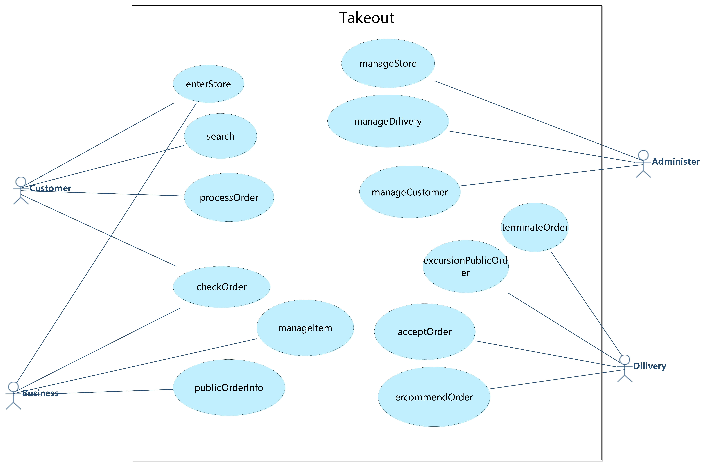
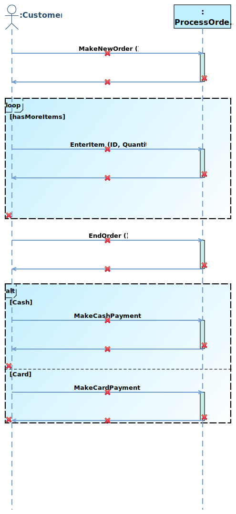

# 1   Introduction
## 1.1   Purpose
This subsection should

- a) Delineate the purpose of the SRS;
- b) Specify the intended audience for the SRS.
## 1.2   Scope
Name of software to be developed: Takeout System

This subsection should

- b) Explain what the software product(s) will, and, if necessary, will not do;
- c) Describe the application of the software being specifified, including relevant benefifits, objectives, and goals;
- d) Be consistent with similar statements in higher-level specififications (e.g., the system requirements specifification), if they exist.
## 1.3   Product Overview

### 1.3.1  Product perspective
This subsection of the SRS should put the product into perspective with other related products. If the product is independent and totally self-contained, it should be so stated here. If the SRS defines a product that is a component of a larger system, as frequently occurs, then this subsection should relate the requirements of that larger system to functionality of the software and should identify interfaces between that system and the software.

This subsection should also describe how the software operates inside various constraints. For example,
these constraints could include
- a) System interfaces;
- b) User interfaces;
- c) Hardware interfaces;
- d) Software interfaces;
- e) Communications interfaces;
- f) Memory;
- j) Operations;
- k) Site adaptation requirements.
#### 1.3.1.1   System interfaces
<b>SI1 - TakeoutSystem</b>
<table>
	<tr>
		<td><b>Service Name:</b></td>
		<td><span name ="SERVICETakeoutSystem">TakeoutSystem</span></td>
	</tr>
	<tr>
		<td><b>Service ID:</b></td>
		<td>SI1</td>
	</tr>
	<tr>
		<td><b>Description:</b></td>
		<td></td>
	</tr>
	<tr>
		<td><b>Operation:</b></td>
	<td><ul><li><a href="#OPsearch">search</a></li><li><a href="#OPenterStore">enterStore</a></li><li><a href="#OPexcursionPublicOrder">excursionPublicOrder</a></li><li><a href="#OPacceptOrder">acceptOrder</a></li><li><a href="#OPterminateOrder">terminateOrder</a></li></ul></td>
	</tr>
<tr>
			<td><b>Temporary Variable</b></td>
			<td><b>Variable Description</b></td>
	</tr>
	<tr>
		<td><span name ="TakeoutSystemCurrentStore">CurrentStore</span></td>
		<td>CurrentStore is a object of <a href="#CLASSStore">Store</a></td>
					</tr>
	<tr>
		<td><span name ="TakeoutSystemCurrentDilivery">CurrentDilivery</span></td>
		<td>CurrentDilivery is a object of <a href="#CLASSDilivery">Dilivery</a></td>
					</tr>
	</table>

<b>SI2 - ThirdPartyServices</b>
<table>
	<tr>
		<td><b>Service Name:</b></td>
		<td><span name ="SERVICEThirdPartyServices">ThirdPartyServices</span></td>
	</tr>
	<tr>
		<td><b>Service ID:</b></td>
		<td>SI2</td>
	</tr>
	<tr>
		<td><b>Description:</b></td>
		<td></td>
	</tr>
	<tr>
		<td><b>Operation:</b></td>
	<td><ul></ul></td>
	</tr>
	</table>

<b>SI3 - ProcessOrderService</b>
<table>
	<tr>
		<td><b>Service Name:</b></td>
		<td><span name ="SERVICEProcessOrderService">ProcessOrderService</span></td>
	</tr>
	<tr>
		<td><b>Service ID:</b></td>
		<td>SI3</td>
	</tr>
	<tr>
		<td><b>Description:</b></td>
		<td></td>
	</tr>
	<tr>
		<td><b>Operation:</b></td>
	<td><ul><li><a href="#OPmakeNewOrder">makeNewOrder</a></li><li><a href="#OPenterItem">enterItem</a></li><li><a href="#OPendOrder">endOrder</a></li><li><a href="#OPmakeCashPayment">makeCashPayment</a></li><li><a href="#OPmakeCardPayment">makeCardPayment</a></li></ul></td>
	</tr>
<tr>
			<td><b>Temporary Variable</b></td>
			<td><b>Variable Description</b></td>
	</tr>
	<tr>
		<td><span name ="ProcessOrderServiceCurrentOrderLine">CurrentOrderLine</span></td>
		<td>CurrentOrderLine is a object of <a href="#CLASSOrderLineItem">OrderLineItem</a></td>
					</tr>
	<tr>
		<td><span name ="ProcessOrderServiceCurrentSale">CurrentSale</span></td>
		<td>CurrentSale is a object of <a href="#CLASSSale">Sale</a></td>
					</tr>
	<tr>
		<td><span name ="ProcessOrderServiceCurrentPaymentMethod">CurrentPaymentMethod</span></td>
		<td>CurrentPaymentMethod has several options: [CASH|CARD]</td>
					</tr>
	</table>

<b>SI4 - ManageItemCRUDService</b>
<table>
	<tr>
		<td><b>Service Name:</b></td>
		<td><span name ="SERVICEManageItemCRUDService">ManageItemCRUDService</span></td>
	</tr>
	<tr>
		<td><b>Service ID:</b></td>
		<td>SI4</td>
	</tr>
	<tr>
		<td><b>Description:</b></td>
		<td></td>
	</tr>
	<tr>
		<td><b>Operation:</b></td>
	<td><ul><li><a href="#OPcreateItem">createItem</a></li><li><a href="#OPqueryItem">queryItem</a></li><li><a href="#OPmodifyItem">modifyItem</a></li><li><a href="#OPdeleteItem">deleteItem</a></li></ul></td>
	</tr>
	</table>

<b>SI5 - ManageStoreCRUDService</b>
<table>
	<tr>
		<td><b>Service Name:</b></td>
		<td><span name ="SERVICEManageStoreCRUDService">ManageStoreCRUDService</span></td>
	</tr>
	<tr>
		<td><b>Service ID:</b></td>
		<td>SI5</td>
	</tr>
	<tr>
		<td><b>Description:</b></td>
		<td></td>
	</tr>
	<tr>
		<td><b>Operation:</b></td>
	<td><ul><li><a href="#OPcreateStore">createStore</a></li><li><a href="#OPqueryStore">queryStore</a></li><li><a href="#OPmodifyStore">modifyStore</a></li><li><a href="#OPdeleteStore">deleteStore</a></li></ul></td>
	</tr>
	</table>
<b>SI6 - ManageDiliveryCRUDService</b>

<table>
	<tr>
		<td><b>Service Name:</b></td>
		<td><span name ="SERVICEManageDiliveryCRUDService">ManageDiliveryCRUDService</span></td>
	</tr>
	<tr>
		<td><b>Service ID:</b></td>
		<td>SI6</td>
	</tr>
	<tr>
		<td><b>Description:</b></td>
		<td></td>
	</tr>
	<tr>
		<td><b>Operation:</b></td>
	<td><ul><li><a href="#OPcreateDilivery">createDilivery</a></li></ul></td>
	</tr>
	</table>
​	 

### 1.3.2  Product functions
<b>Use Case Diagram</b>


<table>
	<tr>
		<td><b>ID</b></td>
		<td><b>Use Case Name</b></td>
		<td><b>Use Case Description</b></td>
		<td><b>Subfunction</b></td>
	</tr>
	<tr>
		<td>UC1</td>
		<td><a href="#UCsearch">search</a></td>
		<td></td>
		<td>
		</td>
	</tr>
	<tr>
		<td>UC2</td>
		<td><a href="#UCcheckOrder">checkOrder</a></td>
		<td></td>
		<td>
		</td>
	</tr>
	<tr>
		<td>UC3</td>
		<td><a href="#UCpublicOrderInfo">publicOrderInfo</a></td>
		<td></td>
		<td>
		</td>
	</tr>
	<tr>
		<td>UC4</td>
		<td><a href="#UCacceptOrder">acceptOrder</a></td>
		<td></td>
		<td>
		</td>
	</tr>
	<tr>
		<td>UC5</td>
		<td><a href="#UCercommendOrder">ercommendOrder</a></td>
		<td></td>
		<td>
		</td>
	</tr>
	<tr>
		<td>UC6</td>
		<td><a href="#UCexcursionPublicOrder">excursionPublicOrder</a></td>
		<td></td>
		<td>
		</td>
	</tr>
	<tr>
		<td>UC7</td>
		<td><a href="#UCmanageStore">manageStore</a></td>
		<td></td>
		<td>
		<p><a href="#OPcreateStore">createStore</a></p><p><a href="#OPqueryStore">queryStore</a></p><p><a href="#OPmodifyStore">modifyStore</a></p><p><a href="#OPdeleteStore">deleteStore</a></p>
		</td>
	</tr>
	<tr>
		<td>UC8</td>
		<td><a href="#UCmanageDilivery">manageDilivery</a></td>
		<td></td>
		<td>
		<p><a href="#OPcreateDilivery">createDilivery</a></p>
		</td>
	</tr>
	<tr>
		<td>UC9</td>
		<td><a href="#UCmanageCustomer">manageCustomer</a></td>
		<td></td>
		<td>
		</td>
	</tr>
	<tr>
		<td>UC10</td>
		<td><a href="#UCprocessOrder">processOrder</a></td>
		<td></td>
		<td>
		<p><a href="#OPmakeNewOrder">makeNewOrder</a></p><p><a href="#OPenterItem">enterItem</a></p><p><a href="#OPendOrder">endOrder</a></p><p><a href="#OPmakeCashPayment">makeCashPayment</a></p><p><a href="#OPmakeCardPayment">makeCardPayment</a></p>
		</td>
	</tr>
	<tr>
		<td>UC11</td>
		<td><a href="#UCmanageItem">manageItem</a></td>
		<td></td>
		<td>
		<p><a href="#OPcreateItem">createItem</a></p><p><a href="#OPqueryItem">queryItem</a></p><p><a href="#OPmodifyItem">modifyItem</a></p><p><a href="#OPdeleteItem">deleteItem</a></p>
		</td>
	</tr>
	<tr>
		<td>UC12</td>
		<td><a href="#UCenterStore">enterStore</a></td>
		<td></td>
		<td>
		</td>
	</tr>
	<tr>
		<td>UC13</td>
		<td><a href="#UCterminateOrder">terminateOrder</a></td>
		<td></td>
		<td>
		</td>
	</tr>
</table>
### 1.3.3  User characteristics

<table>
	<tr>
		<td><b>ID</b></td>
		<td><b>Actor</b></td>
		<td><b>Description</b></td>
		<td><b>Super Actor</b></td>
	</tr>
	<tr>
		<td>A1</td>
		<td><span name ="ACTORCustomer">Customer</span></td>
		<td></td>
		<td></td>
	</tr><tr>
		<td>A2</td>
		<td><span name ="ACTORBusiness">Business</span></td>
		<td></td>
		<td></td>
	</tr><tr>
		<td>A3</td>
		<td><span name ="ACTORAdminister">Administer</span></td>
		<td></td>
		<td></td>
	</tr><tr>
		<td>A4</td>
		<td><span name ="ACTORDilivery">Dilivery</span></td>
		<td></td>
		<td></td>
	</tr>
</table>

### 1.3.4 Limitations
This subsection of the SRS should provide a general description of any other items that will limit the developer’s options. These include

- a) Regulatory policies;
- b) Hardware limitations (e.g., signal timing requirements);
- c) Interfaces to other applications;
- d) Parallel operation;
- e) Audit functions;
- f) Control functions;
- g) Higher-order language requirements;
- h) Signal handshake protocols (e.g., XON-XOFF, ACK-NACK);
- i) Reliability requirements;
- j) Criticality of the application;
- k) Safety and security considerations.
- l) physical/mental considerations; and
- m) limitations that are sourced from other systems, including real-time requirements from the controlled system through interfaces.

## 1.4   Definitions
This subsection should provide the defifinitions of all terms required to properly interpret the SRS. This information may be provided by reference to one or more appendixes in the SRS or by reference to other documents.

# 2  References
This subsection should

- a) Provide a complete list of all documents referenced elsewhere in the SRS;
- b) Identify each document by title, report number (if applicable), date, and publishing organization;
- c) Specify the sources from which the references can be obtained.

This information may be provided by reference to an appendix or to another document.

# 3  Requirements
## 3.1  Functions
### 3.1.1   Use Case
<b>UC1 - search</b>

<p>Use Case Description:</p>

<table>
	<tr>
		<td><b>UseCase Name:</b></td>
		<td><span name ="UCsearch">search</span></td>
	</tr>
	<tr>
		<td><b>UseCase ID:</b></td>
		<td>UC1</td>
	</tr>
	<tr>
		<td><b>Brief Description:</b></td>
		<td></td>
	</tr>
	<tr>
		<td><b>Involved Actor:</b></td>
	<td><a href="#ACTORCustomer">Customer</a></td>
	</tr>
	<tr>
		<td><b>Preconditions:</b></td>
		<td><ol></ol></td>
	</tr>
	<tr>
		<td><b>Postconditions:</b></td>
		<td><ol></ol></td>
	</tr>						
	<tr>
		<td><b>Basic Path:</b></td>
	<td></td>
	</tr>
	<tr>
		<td><b>Alternative Path:</b></td>
		<td></td>
	</tr>
	</table>

<b>UC2 - checkOrder</b>

<p>Use Case Description:</p>

<table>
	<tr>
		<td><b>UseCase Name:</b></td>
		<td><span name ="UCcheckOrder">checkOrder</span></td>
	</tr>
	<tr>
		<td><b>UseCase ID:</b></td>
		<td>UC2</td>
	</tr>
	<tr>
		<td><b>Brief Description:</b></td>
		<td></td>
	</tr>
	<tr>
		<td><b>Involved Actor:</b></td>
	<td><a href="#ACTORCustomer">Customer</a><a href="#ACTORBusiness">Business</a></td>
	</tr>
	<tr>
		<td><b>Preconditions:</b></td>
		<td><ol></ol></td>
	</tr>
	<tr>
		<td><b>Postconditions:</b></td>
		<td><ol></ol></td>
	</tr>						
	<tr>
		<td><b>Basic Path:</b></td>
	<td></td>
	</tr>
	<tr>
		<td><b>Alternative Path:</b></td>
		<td></td>
	</tr>
	</table>

<b>UC3 - publicOrderInfo</b>

<p>Use Case Description:</p>

<table>
	<tr>
		<td><b>UseCase Name:</b></td>
		<td><span name ="UCpublicOrderInfo">publicOrderInfo</span></td>
	</tr>
	<tr>
		<td><b>UseCase ID:</b></td>
		<td>UC3</td>
	</tr>
	<tr>
		<td><b>Brief Description:</b></td>
		<td></td>
	</tr>
	<tr>
		<td><b>Involved Actor:</b></td>
	<td><a href="#ACTORBusiness">Business</a></td>
	</tr>
	<tr>
		<td><b>Preconditions:</b></td>
		<td><ol></ol></td>
	</tr>
	<tr>
		<td><b>Postconditions:</b></td>
		<td><ol></ol></td>
	</tr>						
	<tr>
		<td><b>Basic Path:</b></td>
	<td></td>
	</tr>
	<tr>
		<td><b>Alternative Path:</b></td>
		<td></td>
	</tr>
	</table>

<b>UC4 - acceptOrder</b>

<p>Use Case Description:</p>

<table>
	<tr>
		<td><b>UseCase Name:</b></td>
		<td><span name ="UCacceptOrder">acceptOrder</span></td>
	</tr>
	<tr>
		<td><b>UseCase ID:</b></td>
		<td>UC4</td>
	</tr>
	<tr>
		<td><b>Brief Description:</b></td>
		<td></td>
	</tr>
	<tr>
		<td><b>Involved Actor:</b></td>
	<td><a href="#ACTORDilivery">Dilivery</a></td>
	</tr>
	<tr>
		<td><b>Preconditions:</b></td>
		<td><ol></ol></td>
	</tr>
	<tr>
		<td><b>Postconditions:</b></td>
		<td><ol></ol></td>
	</tr>						
	<tr>
		<td><b>Basic Path:</b></td>
	<td></td>
	</tr>
	<tr>
		<td><b>Alternative Path:</b></td>
		<td></td>
	</tr>
	</table>

<b>UC5 - ercommendOrder</b>

<p>Use Case Description:</p>

<table>
	<tr>
		<td><b>UseCase Name:</b></td>
		<td><span name ="UCercommendOrder">ercommendOrder</span></td>
	</tr>
	<tr>
		<td><b>UseCase ID:</b></td>
		<td>UC5</td>
	</tr>
	<tr>
		<td><b>Brief Description:</b></td>
		<td></td>
	</tr>
	<tr>
		<td><b>Involved Actor:</b></td>
	<td><a href="#ACTORDilivery">Dilivery</a></td>
	</tr>
	<tr>
		<td><b>Preconditions:</b></td>
		<td><ol></ol></td>
	</tr>
	<tr>
		<td><b>Postconditions:</b></td>
		<td><ol></ol></td>
	</tr>						
	<tr>
		<td><b>Basic Path:</b></td>
	<td></td>
	</tr>
	<tr>
		<td><b>Alternative Path:</b></td>
		<td></td>
	</tr>
	</table>

<b>UC6 - excursionPublicOrder</b>

<p>Use Case Description:</p>

<table>
	<tr>
		<td><b>UseCase Name:</b></td>
		<td><span name ="UCexcursionPublicOrder">excursionPublicOrder</span></td>
	</tr>
	<tr>
		<td><b>UseCase ID:</b></td>
		<td>UC6</td>
	</tr>
	<tr>
		<td><b>Brief Description:</b></td>
		<td></td>
	</tr>
	<tr>
		<td><b>Involved Actor:</b></td>
	<td><a href="#ACTORDilivery">Dilivery</a></td>
	</tr>
	<tr>
		<td><b>Preconditions:</b></td>
		<td><ol></ol></td>
	</tr>
	<tr>
		<td><b>Postconditions:</b></td>
		<td><ol></ol></td>
	</tr>						
	<tr>
		<td><b>Basic Path:</b></td>
	<td></td>
	</tr>
	<tr>
		<td><b>Alternative Path:</b></td>
		<td></td>
	</tr>
	</table>

<b>UC7 - manageStore</b>

<p>Use Case Description:</p>

<table>
	<tr>
		<td><b>UseCase Name:</b></td>
		<td><span name ="UCmanageStore">manageStore</span></td>
	</tr>
	<tr>
		<td><b>UseCase ID:</b></td>
		<td>UC7</td>
	</tr>
	<tr>
		<td><b>Brief Description:</b></td>
		<td></td>
	</tr>
	<tr>
		<td><b>Involved Actor:</b></td>
	<td><a href="#ACTORAdminister">Administer</a></td>
	</tr>
	<tr>
		<td><b>Preconditions:</b></td>
		<td><ol></ol></td>
	</tr>
	<tr>
		<td><b>Postconditions:</b></td>
		<td><ol></ol></td>
	</tr>						
	<tr>
		<td><b>Basic Path:</b></td>
	<td></td>
	</tr>
	<tr>
		<td><b>Alternative Path:</b></td>
		<td></td>
	</tr>
	</table>

<b>UC8 - manageDilivery</b>

<p>Use Case Description:</p>

<table>
	<tr>
		<td><b>UseCase Name:</b></td>
		<td><span name ="UCmanageDilivery">manageDilivery</span></td>
	</tr>
	<tr>
		<td><b>UseCase ID:</b></td>
		<td>UC8</td>
	</tr>
	<tr>
		<td><b>Brief Description:</b></td>
		<td></td>
	</tr>
	<tr>
		<td><b>Involved Actor:</b></td>
	<td><a href="#ACTORAdminister">Administer</a></td>
	</tr>
	<tr>
		<td><b>Preconditions:</b></td>
		<td><ol></ol></td>
	</tr>
	<tr>
		<td><b>Postconditions:</b></td>
		<td><ol></ol></td>
	</tr>						
	<tr>
		<td><b>Basic Path:</b></td>
	<td></td>
	</tr>
	<tr>
		<td><b>Alternative Path:</b></td>
		<td></td>
	</tr>
	</table>

<b>UC9 - manageCustomer</b>

<p>Use Case Description:</p>

<table>
	<tr>
		<td><b>UseCase Name:</b></td>
		<td><span name ="UCmanageCustomer">manageCustomer</span></td>
	</tr>
	<tr>
		<td><b>UseCase ID:</b></td>
		<td>UC9</td>
	</tr>
	<tr>
		<td><b>Brief Description:</b></td>
		<td></td>
	</tr>
	<tr>
		<td><b>Involved Actor:</b></td>
	<td><a href="#ACTORAdminister">Administer</a></td>
	</tr>
	<tr>
		<td><b>Preconditions:</b></td>
		<td><ol></ol></td>
	</tr>
	<tr>
		<td><b>Postconditions:</b></td>
		<td><ol></ol></td>
	</tr>						
	<tr>
		<td><b>Basic Path:</b></td>
	<td></td>
	</tr>
	<tr>
		<td><b>Alternative Path:</b></td>
		<td></td>
	</tr>
	</table>

<b>UC10 - processOrder</b>
<p>System Sequence Diagram:</p>



<p>Use Case Description:</p>

<table>
	<tr>
		<td><b>UseCase Name:</b></td>
		<td><span name ="UCprocessOrder">processOrder</span></td>
	</tr>
	<tr>
		<td><b>UseCase ID:</b></td>
		<td>UC10</td>
	</tr>
	<tr>
		<td><b>Brief Description:</b></td>
		<td></td>
	</tr>
	<tr>
		<td><b>Involved Actor:</b></td>
	<td><a href="#ACTORCustomer">Customer</a></td>
	</tr>
	<tr>
		<td><b>Preconditions:</b></td>
		<td><ol></ol></td>
	</tr>
	<tr>
		<td><b>Postconditions:</b></td>
		<td><ol></ol></td>
	</tr>						
	<tr>
		<td><b>Basic Path:</b></td>
	<td><p>1. Customer clicks to execute the operation <a href="#OPmakeNewOrder">makeNewOrder</a></p><p>2. Customer clicks to execute the operation <a href="#OPenterItem">enterItem</a>, with entering id, quantity</p><p>&emsp;<i>If hasMoreItems, repeat the step(s) 2 </i></p><p>3. Customer clicks to execute the operation <a href="#OPendOrder">endOrder</a></p><p>4.  Execute  combinedFragement2</p><p>&emsp;Select cash:</p><p>&emsp;&emsp;Customer clicks to execute the operation <a href="#OPmakeCashPayment">makeCashPayment</a>, with entering amount</p><p>&emsp;Select card:</p><p>&emsp;&emsp;Customer clicks to execute the operation <a href="#OPmakeCardPayment">makeCardPayment</a></p></td>
	</tr>
	<tr>
		<td><b>Alternative Path:</b></td>
		<td></td>
	</tr>
	</table>

<b>UC11 - manageItem</b>

<p>Use Case Description:</p>

<table>
	<tr>
		<td><b>UseCase Name:</b></td>
		<td><span name ="UCmanageItem">manageItem</span></td>
	</tr>
	<tr>
		<td><b>UseCase ID:</b></td>
		<td>UC11</td>
	</tr>
	<tr>
		<td><b>Brief Description:</b></td>
		<td></td>
	</tr>
	<tr>
		<td><b>Involved Actor:</b></td>
	<td><a href="#ACTORBusiness">Business</a></td>
	</tr>
	<tr>
		<td><b>Preconditions:</b></td>
		<td><ol></ol></td>
	</tr>
	<tr>
		<td><b>Postconditions:</b></td>
		<td><ol></ol></td>
	</tr>						
	<tr>
		<td><b>Basic Path:</b></td>
	<td></td>
	</tr>
	<tr>
		<td><b>Alternative Path:</b></td>
		<td></td>
	</tr>
	</table>

<b>UC12 - enterStore</b>

<p>Use Case Description:</p>

<table>
	<tr>
		<td><b>UseCase Name:</b></td>
		<td><span name ="UCenterStore">enterStore</span></td>
	</tr>
	<tr>
		<td><b>UseCase ID:</b></td>
		<td>UC12</td>
	</tr>
	<tr>
		<td><b>Brief Description:</b></td>
		<td></td>
	</tr>
	<tr>
		<td><b>Involved Actor:</b></td>
	<td><a href="#ACTORCustomer">Customer</a><a href="#ACTORBusiness">Business</a></td>
	</tr>
	<tr>
		<td><b>Preconditions:</b></td>
		<td><ol></ol></td>
	</tr>
	<tr>
		<td><b>Postconditions:</b></td>
		<td><ol></ol></td>
	</tr>						
	<tr>
		<td><b>Basic Path:</b></td>
	<td></td>
	</tr>
	<tr>
		<td><b>Alternative Path:</b></td>
		<td></td>
	</tr>
	</table>

<b>UC13 - terminateOrder</b>

<p>Use Case Description:</p>

<table>
	<tr>
		<td><b>UseCase Name:</b></td>
		<td><span name ="UCterminateOrder">terminateOrder</span></td>
	</tr>
	<tr>
		<td><b>UseCase ID:</b></td>
		<td>UC13</td>
	</tr>
	<tr>
		<td><b>Brief Description:</b></td>
		<td></td>
	</tr>
	<tr>
		<td><b>Involved Actor:</b></td>
	<td><a href="#ACTORDilivery">Dilivery</a></td>
	</tr>
	<tr>
		<td><b>Preconditions:</b></td>
		<td><ol></ol></td>
	</tr>
	<tr>
		<td><b>Postconditions:</b></td>
		<td><ol></ol></td>
	</tr>						
	<tr>
		<td><b>Basic Path:</b></td>
	<td></td>
	</tr>
	<tr>
		<td><b>Alternative Path:</b></td>
		<td></td>
	</tr>
	</table>


### 3.1.2   System Operation
<b>OP1 - createDilivery</b>
<table>
	<tr>
		<td><b>Operation Name:</b></td>
		<td><span name ="OPcreateDilivery">createDilivery</span></td>
	</tr>
	<tr>
		<td><b>Operation ID:</b></td>
		<td>OP1</td>
	</tr>
	<tr>
		<td><b>Description:</b></td>
		<td> </td>
	</tr>
	<tr>
		<td><b>Service:</b></td>
		<td><a href="#SERVICEManageDiliveryCRUDService">ManageDiliveryCRUDService</a></td>
	</tr>
	<tr>
		<td><b>Input:</b></td>
<td><p>1. name: <i>id</i>, type: String</p><p>2. name: <i>name</i>, type: String</p></td>
</tr>
<tr>
	<td><b>Output Type:</b></td>
	<td>Boolean</td>
</tr>
<tr>
			<td><b>Definition:</b></td>
<td><p><i>di</i> is the object <i>ite</i> in the instance set of class <a href="#CLASSDilivery">Dilivery</a>. <i>ite</i> represents an object of class <a href="#CLASSDilivery">Dilivery</a>, and <i>ite</i> meets:</p><p>&emsp;&emsp;The attribute <i>Id</i> of the object <i>ite</i> is equal to <i>id</i></p></td>
	</tr>
	<tr>
<td><b>Preconditions:</b></td>
		<td><p>The object <i>di</i> doesn't exist</p></td>
</tr>
	<tr>
		<td><b>Postconditions:</b></td>
	<td><p>1. <i>temp</i> represented the object of class <a href="#CLASSDilivery">Dilivery</a></p><p>2. The object <i>temp</i> was created</p><p>3. The attribute <i>Id</i> of the object <i>temp</i> became <i>id</i></p><p>4. The attribute <i>Name</i> of the object <i>temp</i> became <i>name</i></p><p>5. The object <i>temp</i> was put into the instance set of class <a href="#CLASSDilivery">Dilivery</a></p><p>6. ERROR12</p><p>6. The return value was <b>true</b></p></td>
	</tr>
</table>


<p>Contract of <b>createDilivery</b>:</p>

```java
Contract  ManageDiliveryCRUDService::createDilivery(id : String, name : String) : Boolean {
		definition:
			di:Dilivery = Dilivery.allInstance()->any(ite:Dilivery | ite.Id = id)
		precondition:
			di.oclIsUndefined() = true
		postcondition:
			let temp:Dilivery in
			temp.oclIsNew() and
			temp.Id = id and
			temp.Name = name and
			Dilivery.allInstance()->includes(temp) and
			CurrentDilivery = temp and
			result = true
}
```

<b>OP2 - acceptOrder</b>
<table>
	<tr>
		<td><b>Operation Name:</b></td>
		<td><span name ="OPacceptOrder">acceptOrder</span></td>
	</tr>
	<tr>
		<td><b>Operation ID:</b></td>
		<td>OP2</td>
	</tr>
	<tr>
		<td><b>Description:</b></td>
		<td> </td>
	</tr>
	<tr>
		<td><b>Service:</b></td>
		<td><a href="#SERVICETakeoutSystem">TakeoutSystem</a></td>
	</tr>
	<tr>
		<td><b>Input:</b></td>
<td><p>name: <i>name</i>, type: String</p></td>
</tr>
<tr>
	<td><b>Output Type:</b></td>
	<td>Boolean</td>
</tr>
<tr>
			<td><b>Definition:</b></td>
<td><p><i>order</i> is the object <i>s</i> in the instance set of class <a href="#CLASSSale">Sale</a>. <i>s</i> represents an object of class <a href="#CLASSSale">Sale</a>, and <i>s</i> meets:</p><p>&emsp;&emsp;The attribute <i>Name</i> of the object <i>s</i> is equal to <i>name</i></p></td>
	</tr>
	<tr>
<td><b>Preconditions:</b></td>
		<td><p>1. The object <i>order</i> exists</p><p>2. The attribute <i>IsAccept</i> of the object <i>order</i> is equal to <b>false</b></p></td>
</tr>
	<tr>
		<td><b>Postconditions:</b></td>
	<td><p>1. The attribute <i>IsAccept</i> of the object <i>order</i> became <b>true</b></p><p>2. The object <i>order</i> was linked to the object <i>CurrentDilivery</i> by <i>SaletoDilivery</i></p><p>3. The object <i>CurrentDilivery</i> was linked to the object <i>order</i> by <i>DiliverytoSale</i></p><p>4. The return value was <b>true</b></p></td>
	</tr>
</table>

<p>Contract of <b>acceptOrder</b>:</p>

```java
Contract TakeoutSystem::acceptOrder(name : String) : Boolean {
		definition:
			order:Sale = Sale.allInstance()->any(s:Sale | s.Name = name)
		precondition:
			order.oclIsUndefined() = false and
			order.IsAccept = false
		postcondition:
			order.IsAccept = true and
			order.SaletoDilivery = CurrentDilivery and
			CurrentDilivery.DiliverytoSale->includes(order) and
			result = true
}
```

<b>OP3 - terminateOrder</b>
<table>
	<tr>
		<td><b>Operation Name:</b></td>
		<td><span name ="OPterminateOrder">terminateOrder</span></td>
	</tr>
	<tr>
		<td><b>Operation ID:</b></td>
		<td>OP3</td>
	</tr>
	<tr>
		<td><b>Description:</b></td>
		<td> </td>
	</tr>
	<tr>
		<td><b>Service:</b></td>
		<td><a href="#SERVICETakeoutSystem">TakeoutSystem</a></td>
	</tr>
	<tr>
		<td><b>Input:</b></td>
<td><p>name: <i>name</i>, type: String</p></td>
</tr>
<tr>
	<td><b>Output Type:</b></td>
	<td>Boolean</td>
</tr>
<tr>
			<td><b>Definition:</b></td>
<td><p><i>order</i> is the object <i>s</i> in the instance set of class <a href="#CLASSSale">Sale</a>. <i>s</i> represents an object of class <a href="#CLASSSale">Sale</a>, and <i>s</i> meets:</p><p>&emsp;&emsp;The attribute <i>Name</i> of the object <i>s</i> is equal to <i>name</i></p></td>
	</tr>
	<tr>
<td><b>Preconditions:</b></td>
		<td><p>1. The object <i>order</i> exists</p><p>2. The attribute <i>IsAccept</i> of the object <i>order</i> is equal to <b>true</b></p><p>3. The object <i>order</i> is linked to the object <i>CurrentDilivery</i> by <i>SaletoDilivery</i></p></td>
</tr>
	<tr>
		<td><b>Postconditions:</b></td>
	<td><p>1. The attribute <i>IsComplete</i> of the object <i>order</i> became <b>true</b></p><p>2. The return value was <b>true</b></p></td>
	</tr>
</table>

<p>Contract of <b>terminateOrder</b>:</p>

```java
Contract TakeoutSystem::terminateOrder(name : String) : Boolean {
		definition:
			order:Sale = Sale.allInstance()->any(s:Sale | s.Name = name)
		precondition:
			order.oclIsUndefined() = false and
			order.IsAccept = true and
			order.SaletoDilivery = CurrentDilivery
		postcondition:
			order.IsComplete = true and
			result = true
}
```

<b>OP4 - excursionPublicOrder</b>
<table>
	<tr>
		<td><b>Operation Name:</b></td>
		<td><span name ="OPexcursionPublicOrder">excursionPublicOrder</span></td>
	</tr>
	<tr>
		<td><b>Operation ID:</b></td>
		<td>OP4</td>
	</tr>
	<tr>
		<td><b>Description:</b></td>
		<td> </td>
	</tr>
	<tr>
		<td><b>Service:</b></td>
		<td><a href="#SERVICETakeoutSystem">TakeoutSystem</a></td>
	</tr>
	<tr>
		<td><b>Input:</b></td>
<td><p>name: <i>id</i>, type: String</p></td>
</tr>
<tr>
	<td><b>Output Type:</b></td>
	<td>Set of Sale</td>
</tr>
<tr>
			<td><b>Definition:</b></td>
<td><p><i>di</i> is the object <i>s</i> in the instance set of class <a href="#CLASSDilivery">Dilivery</a>. <i>s</i> represents an object of class <a href="#CLASSDilivery">Dilivery</a>, and <i>s</i> meets:</p><p>&emsp;&emsp;The attribute <i>Id</i> of the object <i>s</i> is equal to <i>id</i></p></td>
	</tr>
	<tr>
<td><b>Preconditions:</b></td>
		<td><p>The object <i>di</i> exists</p></td>
</tr>
	<tr>
		<td><b>Postconditions:</b></td>
	<td><p>The return value was the instance set of class <a href="#CLASSSale">Sale</a></p></td>
	</tr>
</table>

<p>Contract of <b>excursionPublicOrder</b>:</p>

```java
Contract TakeoutSystem::excursionPublicOrder(id : String) : Set(Sale) {
		/*
		 * Generated by RM2DOc - Definition
		 * cd is the object s in the instance set of class CashDesk. s represents an object of class CashDesk, and s meets:
		 *     The attribute Id of the object s is equal to cashDeskID
		 */
		definition:
			di:Dilivery = Dilivery.allInstance()->any(s:Dilivery | s.Id = id)
		/*
		 * Generated by RM2DOc - Precondition
		 * cd exists
		 * The attribute IsOpened of the object cd is equal to false
		 * CurrentStore exists
		 * The attribute IsOpened of the object CurrentStore is equal to true
		 */
		precondition:
			di.oclIsUndefined() = false
		/*
		 * Generated by RM2DOc - Postcondition
		 * The object CurrentCashDesk became cd
		 * The attribute IsOpened of the object cd became true
		 * The return value was true
		 */
		postcondition:
			result = Sale.allInstance()
}
```

<b>OP5 - enterStore</b>
<table>
	<tr>
		<td><b>Operation Name:</b></td>
		<td><span name ="OPenterStore">enterStore</span></td>
	</tr>
	<tr>
		<td><b>Operation ID:</b></td>
		<td>OP5</td>
	</tr>
	<tr>
		<td><b>Description:</b></td>
		<td> </td>
	</tr>
	<tr>
		<td><b>Service:</b></td>
		<td><a href="#SERVICETakeoutSystem">TakeoutSystem</a></td>
	</tr>
	<tr>
		<td><b>Input:</b></td>
<td><p>name: <i>id</i>, type: Integer</p></td>
</tr>
<tr>
	<td><b>Output Type:</b></td>
	<td>Boolean</td>
</tr>
<tr>
			<td><b>Definition:</b></td>
<td><p><i>store</i> is the object <i>s</i> in the instance set of class <a href="#CLASSStore">Store</a>. <i>s</i> represents an object of class <a href="#CLASSStore">Store</a>, and <i>s</i> meets:</p><p>&emsp;&emsp;The attribute <i>Id</i> of the object <i>s</i> is equal to <i>id</i></p></td>
	</tr>
	<tr>
<td><b>Preconditions:</b></td>
		<td><p>The object <i>store</i> exists</p></td>
</tr>
	<tr>
		<td><b>Postconditions:</b></td>
	<td><p>1. The object <a href="#TakeoutSystemCurrentStore">CurrentStore</a> became <i>store</i></p><p>2. The return value was <b>true</b></p></td>
	</tr>
</table>

<p>Contract of <b>enterStore</b>:</p>

```java
Contract TakeoutSystem::enterStore(id : Integer) : Boolean {
		/*
		 * Generated by RM2DOc - Definition
		 * cd is the object s in the instance set of class CashDesk. s represents an object of class CashDesk, and s meets:
		 *     The attribute Id of the object s is equal to cashDeskID
		 */
		definition:
			store:Store = Store.allInstance()->any(s:Store | s.Id = id)
		/*
		 * Generated by RM2DOc - Precondition
		 * cd exists
		 * The attribute IsOpened of the object cd is equal to false
		 * CurrentStore exists
		 * The attribute IsOpened of the object CurrentStore is equal to true
		 */
		precondition:
			store.oclIsUndefined() = false
		/*
		 * Generated by RM2DOc - Postcondition
		 * The object CurrentCashDesk became cd
		 * The attribute IsOpened of the object cd became true
		 * The return value was true
		 */
		postcondition:
			self.CurrentStore = store and
			result = true
}
```

<b>OP6 - createItem</b>
<table>
	<tr>
		<td><b>Operation Name:</b></td>
		<td><span name ="OPcreateItem">createItem</span></td>
	</tr>
	<tr>
		<td><b>Operation ID:</b></td>
		<td>OP6</td>
	</tr>
	<tr>
		<td><b>Description:</b></td>
		<td> </td>
	</tr>
	<tr>
		<td><b>Service:</b></td>
		<td><a href="#SERVICEManageItemCRUDService">ManageItemCRUDService</a></td>
	</tr>
	<tr>
		<td><b>Input:</b></td>
<td><p>1. name: <i>id</i>, type: Integer</p><p>2. name: <i>name</i>, type: String</p><p>3. name: <i>price</i>, type: Real</p><p>4. name: <i>stocknumber</i>, type: Integer</p><p>5. name: <i>orderprice</i>, type: Real</p></td>
</tr>
<tr>
	<td><b>Output Type:</b></td>
	<td>Boolean</td>
</tr>
<tr>
			<td><b>Definition:</b></td>
<td><p><i>item</i> is the object <i>ite</i> in the instance set of class <a href="#CLASSItem">Item</a>. <i>ite</i> represents an object of class <a href="#CLASSItem">Item</a>, and <i>ite</i> meets:</p><p>&emsp;&emsp;The attribute <i>Id</i> of the object <i>ite</i> is equal to <i>id</i></p></td>
	</tr>
	<tr>
<td><b>Preconditions:</b></td>
		<td><p>1. The object <i>item</i> doesn't exist</p><p>2. The object <i>CurrentStore</i> exists</p></td>
</tr>
	<tr>
		<td><b>Postconditions:</b></td>
	<td><p>1. <i>ite</i> represented the object of class <a href="#CLASSItem">Item</a></p><p>2. The object <i>ite</i> was created</p><p>3. The attribute <i>Id</i> of the object <i>ite</i> became <i>id</i></p><p>4. The attribute <i>Name</i> of the object <i>ite</i> became <i>name</i></p><p>5. The attribute <i>Price</i> of the object <i>ite</i> became <i>price</i></p><p>6. The attribute <i>StockNumber</i> of the object <i>ite</i> became <i>stocknumber</i></p><p>7. The attribute <i>OrderPrice</i> of the object <i>ite</i> became <i>orderprice</i></p><p>8. The object <i>ite</i> was linked to the object <i>CurrentStore</i> by <i>ItemtoStore</i></p><p>9. The object <i>ite</i> was put into the instance set of class <a href="#CLASSItem">Item</a></p><p>10. The return value was <b>true</b></p></td>
	</tr>
</table>

<p>Contract of <b>createItem</b>:</p>

```java
Contract  ManageItemCRUDService::createItem(id : Integer, name : String, price : Real, stocknumber : Integer, orderprice : Real) : Boolean {
		/*
		 * Generated by RM2DOc - Definition
		 * item is the object ite in the instance set of class Item. ite represents an object of class Item, and ite meets:
		 *     The attribute Barcode of the object ite is equal to barcode
		 */
		definition:
			item:Item = Item.allInstance()->any(ite:Item | ite.Id = id)
		/*
		 * Generated by RM2DOc - Precondition
		 * item doesn't exist
		 */
		precondition:
			item.oclIsUndefined() = true and
			CurrentStore.oclIsUndefined() = false
		/*
		 * Generated by RM2DOc - Postcondition
		 * ite represented the object of class Item
		 * The object ite was created
		 * The attribute Barcode of the object ite became barcode
		 * The attribute Name of the object ite became name
		 * The attribute Price of the object ite became price
		 * The attribute StockNumber of the object ite became stocknumber
		 * The attribute OrderPrice of the object ite became orderprice
		 * The object ite was put into the instance set of class Item
		 * The return value was true
		 */
		postcondition:
			let ite:Item in
			ite.oclIsNew() and
			ite.Id = id and
			ite.Name = name and
			ite.Price = price and
			ite.StockNumber = stocknumber and
			ite.OrderPrice = orderprice and
			ite.ItemtoStore = CurrentStore and
			Item.allInstance()->includes(ite) and
			result = true
}
```

<b>OP7 - queryItem</b>
<table>
	<tr>
		<td><b>Operation Name:</b></td>
		<td><span name ="OPqueryItem">queryItem</span></td>
	</tr>
	<tr>
		<td><b>Operation ID:</b></td>
		<td>OP7</td>
	</tr>
	<tr>
		<td><b>Description:</b></td>
		<td> </td>
	</tr>
	<tr>
		<td><b>Service:</b></td>
		<td><a href="#SERVICEManageItemCRUDService">ManageItemCRUDService</a></td>
	</tr>
	<tr>
		<td><b>Input:</b></td>
<td><p>name: <i>id</i>, type: Integer</p></td>
</tr>
<tr>
	<td><b>Output Type:</b></td>
	<td><a href="#CLASSItem">Item</a></td>
</tr>
<tr>
			<td><b>Definition:</b></td>
<td><p><i>item</i> is the object <i>ite</i> in the instance set of class <a href="#CLASSItem">Item</a>. <i>ite</i> represents an object of class <a href="#CLASSItem">Item</a>, and <i>ite</i> meets:</p><p>&emsp;&emsp;The attribute <i>Id</i> of the object <i>ite</i> is equal to <i>id</i></p></td>
	</tr>
	<tr>
<td><b>Preconditions:</b></td>
		<td><p>The object <i>item</i> exists</p></td>
</tr>
	<tr>
		<td><b>Postconditions:</b></td>
	<td><p>The return value was <i>item</i></p></td>
	</tr>
</table>

<p>Contract of <b>queryItem</b>:</p>

```java
Contract  ManageItemCRUDService::queryItem(id : Integer) : Item {
		/*
		 * Generated by RM2DOc - Definition
		 * item is the object ite in the instance set of class Item. ite represents an object of class Item, and ite meets:
		 *     The attribute Barcode of the object ite is equal to barcode
		 */
		definition:
			item:Item = Item.allInstance()->any(ite:Item | ite.Id = id)
		/*
		 * Generated by RM2DOc - Precondition
		 * item exists
		 */
		precondition:
			item.oclIsUndefined() = false
		/*
		 * Generated by RM2DOc - Postcondition
		 * The return value was item
		 */
		postcondition:
			result = item
}
```

<b>OP8 - modifyItem</b>
<table>
	<tr>
		<td><b>Operation Name:</b></td>
		<td><span name ="OPmodifyItem">modifyItem</span></td>
	</tr>
	<tr>
		<td><b>Operation ID:</b></td>
		<td>OP8</td>
	</tr>
	<tr>
		<td><b>Description:</b></td>
		<td> </td>
	</tr>
	<tr>
		<td><b>Service:</b></td>
		<td><a href="#SERVICEManageItemCRUDService">ManageItemCRUDService</a></td>
	</tr>
	<tr>
		<td><b>Input:</b></td>
<td><p>1. name: <i>id</i>, type: Integer</p><p>2. name: <i>name</i>, type: String</p><p>3. name: <i>price</i>, type: Real</p><p>4. name: <i>stocknumber</i>, type: Integer</p><p>5. name: <i>orderprice</i>, type: Real</p></td>
</tr>
<tr>
	<td><b>Output Type:</b></td>
	<td>Boolean</td>
</tr>
<tr>
			<td><b>Definition:</b></td>
<td><p><i>item</i> is the object <i>ite</i> in the instance set of class <a href="#CLASSItem">Item</a>. <i>ite</i> represents an object of class <a href="#CLASSItem">Item</a>, and <i>ite</i> meets:</p><p>&emsp;&emsp;The attribute <i>Id</i> of the object <i>ite</i> is equal to <i>id</i></p></td>
	</tr>
	<tr>
<td><b>Preconditions:</b></td>
		<td><p>The object <i>item</i> exists</p></td>
</tr>
	<tr>
		<td><b>Postconditions:</b></td>
	<td><p>1. The attribute <i>Id</i> of the object <i>item</i> became <i>id</i></p><p>2. The attribute <i>Name</i> of the object <i>item</i> became <i>name</i></p><p>3. The attribute <i>Price</i> of the object <i>item</i> became <i>price</i></p><p>4. The attribute <i>StockNumber</i> of the object <i>item</i> became <i>stocknumber</i></p><p>5. The attribute <i>OrderPrice</i> of the object <i>item</i> became <i>orderprice</i></p><p>6. The return value was <b>true</b></p></td>
	</tr>
</table>

<p>Contract of <b>modifyItem</b>:</p>

```java
Contract  ManageItemCRUDService::modifyItem(id : Integer, name : String, price : Real, stocknumber : Integer, orderprice : Real) : Boolean {
		/*
		 * Generated by RM2DOc - Definition
		 * item is the object ite in the instance set of class Item. ite represents an object of class Item, and ite meets:
		 *     The attribute Barcode of the object ite is equal to barcode
		 */
		definition:
			item:Item = Item.allInstance()->any(ite:Item | ite.Id = id)
		/*
		 * Generated by RM2DOc - Precondition
		 * item exists
		 */
		precondition:
			item.oclIsUndefined() = false
		/*
		 * Generated by RM2DOc - Postcondition
		 * The attribute Barcode of the object item became barcode
		 * The attribute Name of the object item became name
		 * The attribute Price of the object item became price
		 * The attribute StockNumber of the object item became stocknumber
		 * The attribute OrderPrice of the object item became orderprice
		 * The return value was true
		 */
		postcondition:
			item.Id = id and
			item.Name = name and
			item.Price = price and
			item.StockNumber = stocknumber and
			item.OrderPrice = orderprice and
			result = true
}
```

<b>OP9 - deleteItem</b>
<table>
	<tr>
		<td><b>Operation Name:</b></td>
		<td><span name ="OPdeleteItem">deleteItem</span></td>
	</tr>
	<tr>
		<td><b>Operation ID:</b></td>
		<td>OP9</td>
	</tr>
	<tr>
		<td><b>Description:</b></td>
		<td> </td>
	</tr>
	<tr>
		<td><b>Service:</b></td>
		<td><a href="#SERVICEManageItemCRUDService">ManageItemCRUDService</a></td>
	</tr>
	<tr>
		<td><b>Input:</b></td>
<td><p>name: <i>id</i>, type: Integer</p></td>
</tr>
<tr>
	<td><b>Output Type:</b></td>
	<td>Boolean</td>
</tr>
<tr>
			<td><b>Definition:</b></td>
<td><p><i>item</i> is the object <i>ite</i> in the instance set of class <a href="#CLASSItem">Item</a>. <i>ite</i> represents an object of class <a href="#CLASSItem">Item</a>, and <i>ite</i> meets:</p><p>&emsp;&emsp;The attribute <i>Id</i> of the object <i>ite</i> is equal to <i>id</i></p></td>
	</tr>
	<tr>
<td><b>Preconditions:</b></td>
		<td><p>1. The object <i>item</i> exists</p><p>2. The object <i>item</i> is in the instance set of class <a href="#CLASSItem">Item</a></p></td>
</tr>
	<tr>
		<td><b>Postconditions:</b></td>
	<td><p>1. The object <i>item</i> was deleted from the instance set of class <a href="#CLASSItem">Item</a></p><p>2. The return value was <b>true</b></p></td>
	</tr>
</table>

<p>Contract of <b>deleteItem</b>:</p>

```java
Contract  ManageItemCRUDService::deleteItem(id : Integer) : Boolean {
		/*
		 * Generated by RM2DOc - Definition
		 * item is the object ite in the instance set of class Item. ite represents an object of class Item, and ite meets:
		 *     The attribute Barcode of the object ite is equal to barcode
		 */
		definition:
			item:Item = Item.allInstance()->any(ite:Item | ite.Id = id)
		/*
		 * Generated by RM2DOc - Precondition
		 * item exists
		 * The object item is in the instance set of class Item
		 */
		precondition:
			item.oclIsUndefined() = false and
			Item.allInstance()->includes(item)
		/*
		 * Generated by RM2DOc - Postcondition
		 * The object item was deleted from the instance set of class Item
		 * The return value was true
		 */
		postcondition:
			Item.allInstance()->excludes(item) and
			result = true
}
```

<b>OP10 - search</b>
<table>
	<tr>
		<td><b>Operation Name:</b></td>
		<td><span name ="OPsearch">search</span></td>
	</tr>
	<tr>
		<td><b>Operation ID:</b></td>
		<td>OP10</td>
	</tr>
	<tr>
		<td><b>Description:</b></td>
		<td> </td>
	</tr>
	<tr>
		<td><b>Service:</b></td>
		<td><a href="#SERVICETakeoutSystem">TakeoutSystem</a></td>
	</tr>
	<tr>
		<td><b>Input:</b></td>
<td><p>name: <i>itemname</i>, type: String</p></td>
</tr>
<tr>
	<td><b>Output Type:</b></td>
	<td><a href="#CLASSItem">Item</a></td>
</tr>
<tr>
			<td><b>Definition:</b></td>
<td><p><i>item</i> is the object <i>ite</i> in the instance set of class <a href="#CLASSItem">Item</a>. <i>ite</i> represents an object of class <a href="#CLASSItem">Item</a>, and <i>ite</i> meets:</p><p>&emsp;&emsp;The attribute <i>Name</i> of the object <i>ite</i> is equal to <i>itemname</i></p><p>&emsp;&emsp;The object <i>ite</i> is linked to the object <i>CurrentStore</i> by <i>ItemtoStore</i></p></td>
	</tr>
	<tr>
<td><b>Preconditions:</b></td>
		<td><p>The object <i>item</i> exists</p></td>
</tr>
	<tr>
		<td><b>Postconditions:</b></td>
	<td><p>The return value was <i>item</i></p></td>
	</tr>
</table>

<p>Contract of <b>search</b>:</p>

```java
Contract TakeoutSystem::search(itemname : String) : Item {
		/*
		 * Generated by RM2DOc - Definition
		 * item is the object ite in the instance set of class Item. ite represents an object of class Item, and ite meets:
		 *     The attribute Barcode of the object ite is equal to barcode
		 */
		definition:
			item:Item = Item.allInstance()->any(ite:Item | ite.Name = itemname and ite.ItemtoStore = CurrentStore)
		/*
		 * Generated by RM2DOc - Precondition
		 * item exists
		 */
		precondition:
			item.oclIsUndefined() = false
		/*
		 * Generated by RM2DOc - Postcondition
		 * The return value was item
		 */
		postcondition:
			result = item
}
```

<b>OP11 - createStore</b>
<table>
	<tr>
		<td><b>Operation Name:</b></td>
		<td><span name ="OPcreateStore">createStore</span></td>
	</tr>
	<tr>
		<td><b>Operation ID:</b></td>
		<td>OP11</td>
	</tr>
	<tr>
		<td><b>Description:</b></td>
		<td> </td>
	</tr>
	<tr>
		<td><b>Service:</b></td>
		<td><a href="#SERVICEManageStoreCRUDService">ManageStoreCRUDService</a></td>
	</tr>
	<tr>
		<td><b>Input:</b></td>
<td><p>1. name: <i>id</i>, type: Integer</p><p>2. name: <i>name</i>, type: String</p><p>3. name: <i>address</i>, type: String</p><p>4. name: <i>isopened</i>, type: Boolean</p></td>
</tr>
<tr>
	<td><b>Output Type:</b></td>
	<td>Boolean</td>
</tr>
<tr>
			<td><b>Definition:</b></td>
<td><p><i>store</i> is the object <i>sto</i> in the instance set of class <a href="#CLASSStore">Store</a>. <i>sto</i> represents an object of class <a href="#CLASSStore">Store</a>, and <i>sto</i> meets:</p><p>&emsp;&emsp;The attribute <i>Id</i> of the object <i>sto</i> is equal to <i>id</i></p></td>
	</tr>
	<tr>
<td><b>Preconditions:</b></td>
		<td><p>The object <i>store</i> doesn't exist</p></td>
</tr>
	<tr>
		<td><b>Postconditions:</b></td>
	<td><p>1. <i>sto</i> represented the object of class <a href="#CLASSStore">Store</a></p><p>2. The object <i>sto</i> was created</p><p>3. The attribute <i>Id</i> of the object <i>sto</i> became <i>id</i></p><p>4. The attribute <i>Name</i> of the object <i>sto</i> became <i>name</i></p><p>5. The attribute <i>Address</i> of the object <i>sto</i> became <i>address</i></p><p>6. The attribute <i>IsOpened</i> of the object <i>sto</i> became <i>isopened</i></p><p>7. The object <i>sto</i> was put into the instance set of class <a href="#CLASSStore">Store</a></p><p>8. The return value was <b>true</b></p></td>
	</tr>
</table>

<p>Contract of <b>createStore</b>:</p>

```java
Contract  ManageStoreCRUDService::createStore(id : Integer, name : String, address : String, isopened : Boolean) : Boolean {
		/*
		 * Generated by RM2DOc - Definition
		 * store is the object sto in the instance set of class Store. sto represents an object of class Store, and sto meets:
		 *     The attribute Id of the object sto is equal to id
		 */
		definition:
			store:Store = Store.allInstance()->any(sto:Store | sto.Id = id)
		/*
		 * Generated by RM2DOc - Precondition
		 * store doesn't exist
		 */
		precondition:
			store.oclIsUndefined() = true
		/*
		 * Generated by RM2DOc - Postcondition
		 * sto represented the object of class Store
		 * The object sto was created
		 * The attribute Id of the object sto became id
		 * The attribute Name of the object sto became name
		 * The attribute Address of the object sto became address
		 * The attribute IsOpened of the object sto became isopened
		 * The object sto was put into the instance set of class Store
		 * The return value was true
		 */
		postcondition:
			let sto:Store in
			sto.oclIsNew() and
			sto.Id = id and
			sto.Name = name and
			sto.Address = address and
			sto.IsOpened = isopened and
			Store.allInstance()->includes(sto) and
			result = true
}
```

<b>OP12 - queryStore</b>
<table>
	<tr>
		<td><b>Operation Name:</b></td>
		<td><span name ="OPqueryStore">queryStore</span></td>
	</tr>
	<tr>
		<td><b>Operation ID:</b></td>
		<td>OP12</td>
	</tr>
	<tr>
		<td><b>Description:</b></td>
		<td> </td>
	</tr>
	<tr>
		<td><b>Service:</b></td>
		<td><a href="#SERVICEManageStoreCRUDService">ManageStoreCRUDService</a></td>
	</tr>
	<tr>
		<td><b>Input:</b></td>
<td><p>name: <i>id</i>, type: Integer</p></td>
</tr>
<tr>
	<td><b>Output Type:</b></td>
	<td><a href="#CLASSStore">Store</a></td>
</tr>
<tr>
			<td><b>Definition:</b></td>
<td><p><i>store</i> is the object <i>sto</i> in the instance set of class <a href="#CLASSStore">Store</a>. <i>sto</i> represents an object of class <a href="#CLASSStore">Store</a>, and <i>sto</i> meets:</p><p>&emsp;&emsp;The attribute <i>Id</i> of the object <i>sto</i> is equal to <i>id</i></p></td>
	</tr>
	<tr>
<td><b>Preconditions:</b></td>
		<td><p>The object <i>store</i> exists</p></td>
</tr>
	<tr>
		<td><b>Postconditions:</b></td>
	<td><p>The return value was <i>store</i></p></td>
	</tr>
</table>

<p>Contract of <b>queryStore</b>:</p>

```java
Contract  ManageStoreCRUDService::queryStore(id : Integer) : Store {
		/*
		 * Generated by RM2DOc - Definition
		 * store is the object sto in the instance set of class Store. sto represents an object of class Store, and sto meets:
		 *     The attribute Id of the object sto is equal to id
		 */
		definition:
			store:Store = Store.allInstance()->any(sto:Store | sto.Id = id)
		/*
		 * Generated by RM2DOc - Precondition
		 * store exists
		 */
		precondition:
			store.oclIsUndefined() = false
		/*
		 * Generated by RM2DOc - Postcondition
		 * The return value was store
		 */
		postcondition:
			result = store
}
```

<b>OP13 - modifyStore</b>
<table>
	<tr>
		<td><b>Operation Name:</b></td>
		<td><span name ="OPmodifyStore">modifyStore</span></td>
	</tr>
	<tr>
		<td><b>Operation ID:</b></td>
		<td>OP13</td>
	</tr>
	<tr>
		<td><b>Description:</b></td>
		<td> </td>
	</tr>
	<tr>
		<td><b>Service:</b></td>
		<td><a href="#SERVICEManageStoreCRUDService">ManageStoreCRUDService</a></td>
	</tr>
	<tr>
		<td><b>Input:</b></td>
<td><p>1. name: <i>id</i>, type: Integer</p><p>2. name: <i>name</i>, type: String</p><p>3. name: <i>address</i>, type: String</p><p>4. name: <i>isopened</i>, type: Boolean</p></td>
</tr>
<tr>
	<td><b>Output Type:</b></td>
	<td>Boolean</td>
</tr>
<tr>
			<td><b>Definition:</b></td>
<td><p><i>store</i> is the object <i>sto</i> in the instance set of class <a href="#CLASSStore">Store</a>. <i>sto</i> represents an object of class <a href="#CLASSStore">Store</a>, and <i>sto</i> meets:</p><p>&emsp;&emsp;The attribute <i>Id</i> of the object <i>sto</i> is equal to <i>id</i></p></td>
	</tr>
	<tr>
<td><b>Preconditions:</b></td>
		<td><p>The object <i>store</i> exists</p></td>
</tr>
	<tr>
		<td><b>Postconditions:</b></td>
	<td><p>1. The attribute <i>Id</i> of the object <i>store</i> became <i>id</i></p><p>2. The attribute <i>Name</i> of the object <i>store</i> became <i>name</i></p><p>3. The attribute <i>Address</i> of the object <i>store</i> became <i>address</i></p><p>4. The attribute <i>IsOpened</i> of the object <i>store</i> became <i>isopened</i></p><p>5. The return value was <b>true</b></p></td>
	</tr>
</table>

<p>Contract of <b>modifyStore</b>:</p>

```java
Contract  ManageStoreCRUDService::modifyStore(id : Integer, name : String, address : String, isopened : Boolean) : Boolean {
		/*
		 * Generated by RM2DOc - Definition
		 * store is the object sto in the instance set of class Store. sto represents an object of class Store, and sto meets:
		 *     The attribute Id of the object sto is equal to id
		 */
		definition:
			store:Store = Store.allInstance()->any(sto:Store | sto.Id = id)
		/*
		 * Generated by RM2DOc - Precondition
		 * store exists
		 */
		precondition:
			store.oclIsUndefined() = false
		/*
		 * Generated by RM2DOc - Postcondition
		 * The attribute Id of the object store became id
		 * The attribute Name of the object store became name
		 * The attribute Address of the object store became address
		 * The attribute IsOpened of the object store became isopened
		 * The return value was true
		 */
		postcondition:
			store.Id = id and
			store.Name = name and
			store.Address = address and
			store.IsOpened = isopened and
			result = true
}
```

<b>OP14 - deleteStore</b>
<table>
	<tr>
		<td><b>Operation Name:</b></td>
		<td><span name ="OPdeleteStore">deleteStore</span></td>
	</tr>
	<tr>
		<td><b>Operation ID:</b></td>
		<td>OP14</td>
	</tr>
	<tr>
		<td><b>Description:</b></td>
		<td> </td>
	</tr>
	<tr>
		<td><b>Service:</b></td>
		<td><a href="#SERVICEManageStoreCRUDService">ManageStoreCRUDService</a></td>
	</tr>
	<tr>
		<td><b>Input:</b></td>
<td><p>name: <i>id</i>, type: Integer</p></td>
</tr>
<tr>
	<td><b>Output Type:</b></td>
	<td>Boolean</td>
</tr>
<tr>
			<td><b>Definition:</b></td>
<td><p><i>store</i> is the object <i>sto</i> in the instance set of class <a href="#CLASSStore">Store</a>. <i>sto</i> represents an object of class <a href="#CLASSStore">Store</a>, and <i>sto</i> meets:</p><p>&emsp;&emsp;The attribute <i>Id</i> of the object <i>sto</i> is equal to <i>id</i></p></td>
	</tr>
	<tr>
<td><b>Preconditions:</b></td>
		<td><p>1. The object <i>store</i> exists</p><p>2. The object <i>store</i> is in the instance set of class <a href="#CLASSStore">Store</a></p></td>
</tr>
	<tr>
		<td><b>Postconditions:</b></td>
	<td><p>1. The object <i>store</i> was deleted from the instance set of class <a href="#CLASSStore">Store</a></p><p>2. The return value was <b>true</b></p></td>
	</tr>
</table>

<p>Contract of <b>deleteStore</b>:</p>

```java
Contract  ManageStoreCRUDService::deleteStore(id : Integer) : Boolean {
		/*
		 * Generated by RM2DOc - Definition
		 * store is the object sto in the instance set of class Store. sto represents an object of class Store, and sto meets:
		 *     The attribute Id of the object sto is equal to id
		 */
		definition:
			store:Store = Store.allInstance()->any(sto:Store | sto.Id = id)
		/*
		 * Generated by RM2DOc - Precondition
		 * store exists
		 * The object store is in the instance set of class Store
		 */
		precondition:
			store.oclIsUndefined() = false and
			Store.allInstance()->includes(store)
		/*
		 * Generated by RM2DOc - Postcondition
		 * The object store was deleted from the instance set of class Store
		 * The return value was true
		 */
		postcondition:
			Store.allInstance()->excludes(store) and
			result = true
}
```

<b>OP15 - makeNewOrder</b>
<table>
	<tr>
		<td><b>Operation Name:</b></td>
		<td><span name ="OPmakeNewOrder">makeNewOrder</span></td>
	</tr>
	<tr>
		<td><b>Operation ID:</b></td>
		<td>OP15</td>
	</tr>
	<tr>
		<td><b>Description:</b></td>
		<td> </td>
	</tr>
	<tr>
		<td><b>Service:</b></td>
		<td><a href="#SERVICEProcessOrderService">ProcessOrderService</a></td>
	</tr>
	<tr>
		<td><b>Input:</b></td>
<td>None</td>
</tr>
<tr>
	<td><b>Output Type:</b></td>
	<td>Boolean</td>
</tr>
	<tr>
<td><b>Preconditions:</b></td>
		<td><p>1. The object <i>CurrentStore</i> exists</p><p>2. (the object <i>CurrentSale</i> doesn't exist, or (the object <i>CurrentSale</i> exists, and the attribute <i>IsComplete</i> of the object <i>CurrentSale</i> is equal to <b>true</b>))</p></td>
</tr>
	<tr>
		<td><b>Postconditions:</b></td>
	<td><p>1. <i>s</i> represented the object of class <a href="#CLASSSale">Sale</a></p><p>2. The object <i>s</i> was created</p><p>3. The object <i>s</i> was linked to the object <i>CurrentStore</i> by <i>SaletoStore</i></p><p>4. The object <i>CurrentStore</i> was linked to the object <i>s</i> by <i>StoretoSale</i></p><p>5. The attribute <i>IsComplete</i> of the object <i>s</i> became <b>false</b></p><p>6. The attribute <i>IsReadytoPay</i> of the object <i>s</i> became <b>false</b></p><p>7. The object <i>s</i> was put into the instance set of class <a href="#CLASSSale">Sale</a></p><p>8. The object <a href="#ProcessOrderServiceCurrentSale">CurrentSale</a> became <i>s</i></p><p>9. The return value was <b>true</b></p></td>
	</tr>
</table>

<p>Contract of <b>makeNewOrder</b>:</p>

```java
Contract ProcessOrderService::makeNewOrder() : Boolean {
		/*
		 * Generated by RM2DOc - Precondition
		 * CurrentCashDesk exists
		 * The attribute IsOpened of the object CurrentCashDesk is equal to true
		 * (CurrentSale doesn't exist, or (CurrentSale exists, and the attribute IsComplete of the object CurrentSale is equal to true))
		 */
		precondition:
			CurrentStore.oclIsUndefined() = false and
			(CurrentSale.oclIsUndefined() = true or
				(CurrentSale.oclIsUndefined() = false and
					CurrentSale.IsComplete = true
				)
			)
		/*
		 * Generated by RM2DOc - Postcondition
		 * s represented the object of class Sale
		 * The object s was created
		 * The object s was linked to the object CurrentCashDesk by BelongedCashDesk
		 * The object CurrentCashDesk was linked to the object s by ContainedSales
		 * The attribute IsComplete of the object s became false
		 * The attribute IsReadytoPay of the object s became false
		 * The object s was put into the instance set of class Sale
		 * The object CurrentSale became s
		 * The return value was true
		 */
		postcondition:
			let s:Sale in
			s.oclIsNew() and
			s.SaletoStore = CurrentStore and
			CurrentStore.StoretoSale->includes(s) and
			s.IsComplete = false and
			s.IsReadytoPay = false and
			Sale.allInstance()->includes(s) and
			self.CurrentSale = s and
			result = true
}
```

<b>OP16 - enterItem</b>
<table>
	<tr>
		<td><b>Operation Name:</b></td>
		<td><span name ="OPenterItem">enterItem</span></td>
	</tr>
	<tr>
		<td><b>Operation ID:</b></td>
		<td>OP16</td>
	</tr>
	<tr>
		<td><b>Description:</b></td>
		<td> </td>
	</tr>
	<tr>
		<td><b>Service:</b></td>
		<td><a href="#SERVICEProcessOrderService">ProcessOrderService</a></td>
	</tr>
	<tr>
		<td><b>Input:</b></td>
<td><p>1. name: <i>id</i>, type: Integer</p><p>2. name: <i>quantity</i>, type: Integer</p></td>
</tr>
<tr>
	<td><b>Output Type:</b></td>
	<td>Boolean</td>
</tr>
<tr>
			<td><b>Definition:</b></td>
<td><p><i>item</i> is the object <i>i</i> in the instance set of class <a href="#CLASSItem">Item</a>. <i>i</i> represents an object of class <a href="#CLASSItem">Item</a>, and <i>i</i> meets:</p><p>&emsp;&emsp;The attribute <i>Id</i> of the object <i>i</i> is equal to <i>id</i></p></td>
	</tr>
	<tr>
<td><b>Preconditions:</b></td>
		<td><p>1. The object <i>CurrentSale</i> exists</p><p>2. The attribute <i>IsComplete</i> of the object <i>CurrentSale</i> is equal to <b>false</b></p><p>3. The object <i>item</i> exists</p><p>4. The attribute <i>StockNumber</i> of the object <i>item</i> is greater than <b>0</b></p></td>
</tr>
	<tr>
		<td><b>Postconditions:</b></td>
	<td><p>1. <i>sli</i> represented the object of class <a href="#CLASSOrderLineItem">OrderLineItem</a></p><p>2. The object <i>sli</i> was created</p><p>3. The object <a href="#ProcessOrderServiceCurrentOrderLine">CurrentOrderLine</a> became <i>sli</i></p><p>4. The object <i>sli</i> was linked to the object <i>CurrentSale</i> by <i>OrderLineItemtoSale</i></p><p>5. The object <i>CurrentSale</i> was linked to the object <i>sli</i> by <i>SaletoOrderLineItem</i></p><p>6. The attribute <i>Quantity</i> of the object <i>sli</i> became <i>quantity</i></p><p>7. The object <i>sli</i> was linked to the object <i>item</i> by <i>OrderLineItemtoItem</i></p><p>8. The attribute <i>StockNumber</i> of the object <i>item</i> became its previous value minus <i>quantity</i></p><p>9. The attribute <i>Subamount</i> of the object <i>sli</i> became the attribute <i>Price</i> of the object <i>item</i> times <i>quantity</i></p><p>10. The object <i>sli</i> was put into the instance set of class <a href="#CLASSOrderLineItem">OrderLineItem</a></p><p>11. The return value was <b>true</b></p></td>
	</tr>
</table>

<p>Contract of <b>enterItem</b>:</p>

```java
Contract ProcessOrderService::enterItem(id : Integer, quantity : Integer) : Boolean {
		/*
		 * Generated by RM2DOc - Definition
		 * item is the object i in the instance set of class Item. i represents an object of class Item, and i meets:
		 *     The attribute Barcode of the object i is equal to barcode
		 */
		definition:
			item:Item = Item.allInstance()->any(i:Item | i.Id = id)
		/*
		 * Generated by RM2DOc - Precondition
		 * CurrentSale exists
		 * The attribute IsComplete of the object CurrentSale is equal to false
		 * item exists
		 * The attribute StockNumber of the object item is greater than 0
		 */
		precondition:
			CurrentSale.oclIsUndefined() = false and
			CurrentSale.IsComplete = false and
			item.oclIsUndefined() = false and
			item.StockNumber > 0
		/*
		 * Generated by RM2DOc - Postcondition
		 * sli represented the object of class SalesLineItem
		 * The object sli was created
		 * The object CurrentSaleLine became sli
		 * The object sli was linked to the object CurrentSale by BelongedSale
		 * The object CurrentSale was linked to the object sli by ContainedSalesLine
		 * The attribute Quantity of the object sli became quantity
		 * The object sli was linked to the object item by BelongedItem
		 * The attribute StockNumber of the object item became the previous value of the attribute StockNumber of the object item minus quantity
		 * The attribute Subamount of the object sli became the attribute Price of the object item times quantity
		 * The object sli was put into the instance set of class SalesLineItem
		 * The return value was true
		 */
		postcondition:
			let sli:OrderLineItem in
			sli.oclIsNew() and
			self.CurrentOrderLine = sli and
			sli.OrderLineItemtoSale = CurrentSale and
			CurrentSale.SaletoOrderLineItem->includes(sli) and
			sli.Quantity = quantity and
			sli.OrderLineItemtoItem = item and
			item.StockNumber = item.StockNumber@pre - quantity and
			sli.Subamount = item.Price * quantity and
			OrderLineItem.allInstance()->includes(sli) and
			result = true
}
```

<b>OP17 - endOrder</b>
<table>
	<tr>
		<td><b>Operation Name:</b></td>
		<td><span name ="OPendOrder">endOrder</span></td>
	</tr>
	<tr>
		<td><b>Operation ID:</b></td>
		<td>OP17</td>
	</tr>
	<tr>
		<td><b>Description:</b></td>
		<td> </td>
	</tr>
	<tr>
		<td><b>Service:</b></td>
		<td><a href="#SERVICEProcessOrderService">ProcessOrderService</a></td>
	</tr>
	<tr>
		<td><b>Input:</b></td>
<td>None</td>
</tr>
<tr>
	<td><b>Output Type:</b></td>
	<td>Real</td>
</tr>
<tr>
			<td><b>Definition:</b></td>
<td><p>1. <i>sls</i> is the Set of class <a href="#CLASSOrderLineItem">OrderLineItem</a>, including  which <i>CurrentSale</i> is linked to</p><p>2. <i>sub</i> is the Set of Real, including the <i>Subamount</i> of each object in the set <i>sls</i></p></td>
	</tr>
	<tr>
<td><b>Preconditions:</b></td>
		<td><p>1. The object <i>CurrentSale</i> exists</p><p>2. The attribute <i>IsComplete</i> of the object <i>CurrentSale</i> is equal to <b>false</b></p><p>3. The attribute <i>IsReadytoPay</i> of the object <i>CurrentSale</i> is equal to <b>false</b></p></td>
</tr>
	<tr>
		<td><b>Postconditions:</b></td>
	<td><p>1. The attribute <i>Amount</i> of the object <i>CurrentSale</i> became the sum of <i>sub</i></p><p>2. The attribute <i>IsReadytoPay</i> of the object <i>CurrentSale</i> became <b>true</b></p><p>3. The return value was the attribute <i>Amount</i> of the object <i>CurrentSale</i></p></td>
	</tr>
</table>

<p>Contract of <b>endOrder</b>:</p>

```java
Contract ProcessOrderService::endOrder() : Real {
		/*
		 * Generated by RM2DOc - Definition
		 * sls is the Set of class SalesLineItem, including  which CurrentSale is linked to
		 * sub is the Set of Real, including the Subamount of each object in the set sls
		 */
		definition:
			sls:Set(OrderLineItem) = CurrentSale.SaletoOrderLineItem,
			sub:Set(Real) = sls->collect(s:OrderLineItem | s.Subamount)
		/*
		 * Generated by RM2DOc - Precondition
		 * CurrentSale exists
		 * The attribute IsComplete of the object CurrentSale is equal to false
		 * The attribute IsReadytoPay of the object CurrentSale is equal to false
		 */
		precondition:
			CurrentSale.oclIsUndefined() = false and
			CurrentSale.IsComplete = false and
			CurrentSale.IsReadytoPay = false
		/*
		 * Generated by RM2DOc - Postcondition
		 * The attribute Amount of the object CurrentSale became the sum of sub
		 * The attribute IsReadytoPay of the object CurrentSale became true
		 * The return value was the attribute Amount of the object CurrentSale
		 */
		postcondition:
			CurrentSale.Amount = sub.sum() and
			CurrentSale.IsReadytoPay = true and
			result = CurrentSale.Amount
}
```

<b>OP18 - makeCashPayment</b>
<table>
	<tr>
		<td><b>Operation Name:</b></td>
		<td><span name ="OPmakeCashPayment">makeCashPayment</span></td>
	</tr>
	<tr>
		<td><b>Operation ID:</b></td>
		<td>OP18</td>
	</tr>
	<tr>
		<td><b>Description:</b></td>
		<td> </td>
	</tr>
	<tr>
		<td><b>Service:</b></td>
		<td><a href="#SERVICEProcessOrderService">ProcessOrderService</a></td>
	</tr>
	<tr>
		<td><b>Input:</b></td>
<td><p>name: <i>amount</i>, type: Real</p></td>
</tr>
<tr>
	<td><b>Output Type:</b></td>
	<td>Boolean</td>
</tr>
	<tr>
<td><b>Preconditions:</b></td>
		<td><p>1. The object <i>CurrentSale</i> exists</p><p>2. The attribute <i>IsComplete</i> of the object <i>CurrentSale</i> is equal to <b>false</b></p><p>3. The attribute <i>IsReadytoPay</i> of the object <i>CurrentSale</i> is equal to <b>true</b></p><p>4. The <i>amount</i> is greater than or equal to the attribute <i>Amount</i> of the object <i>CurrentSale</i></p></td>
</tr>
	<tr>
		<td><b>Postconditions:</b></td>
	<td><p>1. <i>cp</i> represented the object of class <a href="#CLASSCashPayment">CashPayment</a></p><p>2. The object <i>cp</i> was created</p><p>3. The attribute <i>AmountTendered</i> of the object <i>cp</i> became <i>amount</i></p><p>4. The object <i>cp</i> was linked to the object <i>CurrentSale</i> by <i>PaymenttoSale</i></p><p>5. The object <i>CurrentSale</i> was linked to the object <i>cp</i> by <i>SaletoPayment</i></p><p>6. The object <i>CurrentSale</i> was linked to the object <i>CurrentStore</i> by <i>SaletoStore</i></p><p>7. The object <i>CurrentStore</i> was linked to the object <i>CurrentSale</i> by <i>StoretoSale</i></p><p>8. The attribute <i>Balance</i> of the object <i>cp</i> became <i>amount</i> minus the attribute <i>Amount</i> of the object <i>CurrentSale</i></p><p>9. The object <i>cp</i> was put into the instance set of class <a href="#CLASSCashPayment">CashPayment</a></p><p>10. The attribute <i>IsAccept</i> of the object <i>CurrentSale</i> became <b>false</b></p><p>11. The attribute <i>Name</i> of the object <i>CurrentSale</i> became the attribute <i>Name</i> of the object <i>CurrentStore</i></p><p>12. The return value was <b>true</b></p></td>
	</tr>
</table>

<p>Contract of <b>makeCashPayment</b>:</p>

```java
Contract ProcessOrderService::makeCashPayment(amount : Real) : Boolean {
		/*
		 * Generated by RM2DOc - Precondition
		 * CurrentSale exists
		 * The attribute IsComplete of the object CurrentSale is equal to false
		 * The attribute IsReadytoPay of the object CurrentSale is equal to true
		 * The amount is greater than or equal to the attribute Amount of the object CurrentSale
		 */
		precondition:
			CurrentSale.oclIsUndefined() = false and
			CurrentSale.IsComplete = false and
			CurrentSale.IsReadytoPay = true and
			amount >= CurrentSale.Amount
		/*
		 * Generated by RM2DOc - Postcondition
		 * cp represented the object of class CashPayment
		 * The object cp was created
		 * The attribute AmountTendered of the object cp became amount
		 * The object cp was linked to the object CurrentSale by BelongedSale
		 * The object CurrentSale was linked to the object cp by AssoicatedPayment
		 * The object CurrentSale was linked to the object CurrentStore by Belongedstore
		 * The object CurrentStore was linked to the object CurrentSale by Sales
		 * The attribute IsComplete of the object CurrentSale became true
		 * The attribute Time of the object CurrentSale was equal to Now
		 * The attribute Balance of the object cp became amount minus the attribute Amount of the object CurrentSale
		 * The object cp was put into the instance set of class CashPayment
		 * The return value was true
		 */
		postcondition:
			let cp:CashPayment in
			cp.oclIsNew() and
			cp.AmountTendered = amount and
			cp.PaymenttoSale = CurrentSale and
			CurrentSale.SaletoPayment = cp and
			CurrentSale.SaletoStore = CurrentStore and
			CurrentStore.StoretoSale->includes(CurrentSale) and
			cp.Balance = amount - CurrentSale.Amount and
			CashPayment.allInstance()->includes(cp) and
			CurrentSale.IsAccept = false and
			CurrentSale.Name = CurrentStore.Name and
			result = true
}
```


## 3.2  Database requirements
#### 3.2.1   Entity Analysis
<b>Conceptual Class Diagram</b> 


<b>E1 - Item</b>

<table>
	<tr>
		<td><b>Entity Name:</b></td>
		   <td colspan="2"><span name ="CLASSItem">Item</span></td>
	</tr>
	<tr>
		<td><b>Entity ID:</b></td>
		   <td colspan="2">E1</td>
	</tr>
	<tr>
	    <td><b>Entity Description:</b></td>
	    <td colspan="2"></td>
	</tr>
	<tr>
	    <td><b>Attribute Name</b></td>
		<td><b>Attribute Type</b></td>
		<td><b>Attribute Description</b></td>
	</tr>
	<tr>
	    <td>Id</td>
	<td>Integer</td>
	<td>The Id of Item</td>
					</tr>
	<tr>
	    <td>Name</td>
	<td>String</td>
	<td>The Name of Item</td>
					</tr>
	<tr>
	    <td>Price</td>
	<td>Real</td>
	<td>The Price of Item</td>
					</tr>
	<tr>
	    <td>StockNumber</td>
	<td>Integer</td>
	<td>The StockNumber of Item</td>
					</tr>
	<tr>
	    <td>OrderPrice</td>
	<td>Real</td>
	<td>The OrderPrice of Item</td>
					</tr>
	<tr>
	    <td><b>Relationship Name</b></td>
	<td><b>Related Entity</b></td>
	<td><b>Relationship Type</b></td>
	</tr>
	<tr>
		<td>ItemtoProductCatalog</td>
		<td><a href="#CLASSProductCatalog">ProductCatalog</a></td>
		<td>Association: One-to-One</td>
	</tr>
	<tr>
		<td>ItemtoStore</td>
		<td><a href="#CLASSStore">Store</a></td>
		<td>Association: One-to-One</td>
	</tr>
	</table>

<b>E2 - OrderLineItem</b>

<table>
	<tr>
		<td><b>Entity Name:</b></td>
		   <td colspan="2"><span name ="CLASSOrderLineItem">OrderLineItem</span></td>
	</tr>
	<tr>
		<td><b>Entity ID:</b></td>
		   <td colspan="2">E2</td>
	</tr>
	<tr>
	    <td><b>Entity Description:</b></td>
	    <td colspan="2"></td>
	</tr>
	<tr>
	    <td><b>Attribute Name</b></td>
		<td><b>Attribute Type</b></td>
		<td><b>Attribute Description</b></td>
	</tr>
	<tr>
	    <td>Quantity</td>
	<td>Integer</td>
	<td>The Quantity of OrderLineItem</td>
					</tr>
	<tr>
	    <td>Subamount</td>
	<td>Real</td>
	<td>The Subamount of OrderLineItem</td>
					</tr>
	<tr>
	    <td><b>Relationship Name</b></td>
	<td><b>Related Entity</b></td>
	<td><b>Relationship Type</b></td>
	</tr>
	<tr>
		<td>OrderLineItemtoItem</td>
		<td><a href="#CLASSItem">Item</a></td>
		<td>Association: One-to-One</td>
	</tr>
	<tr>
		<td>OrderLineItemtoSale</td>
		<td><a href="#CLASSSale">Sale</a></td>
		<td>Association: One-to-One</td>
	</tr>
	</table>

<b>E3 - Sale</b>

<table>
	<tr>
		<td><b>Entity Name:</b></td>
		   <td colspan="2"><span name ="CLASSSale">Sale</span></td>
	</tr>
	<tr>
		<td><b>Entity ID:</b></td>
		   <td colspan="2">E3</td>
	</tr>
	<tr>
	    <td><b>Entity Description:</b></td>
	    <td colspan="2"></td>
	</tr>
	<tr>
	    <td><b>Attribute Name</b></td>
		<td><b>Attribute Type</b></td>
		<td><b>Attribute Description</b></td>
	</tr>
	<tr>
	    <td>Time</td>
	<td>LocalDate</td>
	<td>The Time of Sale</td>
					</tr>
	<tr>
	    <td>IsComplete</td>
	<td>Boolean</td>
	<td>The IsComplete of Sale</td>
					</tr>
	<tr>
	    <td>Amount</td>
	<td>Real</td>
	<td>The Amount of Sale</td>
					</tr>
	<tr>
	    <td>IsReadytoPay</td>
	<td>Boolean</td>
	<td>The IsReadytoPay of Sale</td>
					</tr>
	<tr>
	    <td>IsAccept</td>
	<td>Boolean</td>
	<td>The IsAccept of Sale</td>
					</tr>
	<tr>
	    <td>Name</td>
	<td>String</td>
	<td>The Name of Sale</td>
					</tr>
	<tr>
	    <td><b>Relationship Name</b></td>
	<td><b>Related Entity</b></td>
	<td><b>Relationship Type</b></td>
	</tr>
	<tr>
		<td>SaletoOrderLineItem</td>
		<td><a href="#CLASSOrderLineItem">OrderLineItem</a></td>
		<td>Association: One-to-Many</td>
	</tr>
	<tr>
		<td>SaletoPayment</td>
		<td><a href="#CLASSPayment">Payment</a></td>
		<td>Association: One-to-One</td>
	</tr>
	<tr>
		<td>SaletoStore</td>
		<td><a href="#CLASSStore">Store</a></td>
		<td>Association: One-to-One</td>
	</tr>
	<tr>
		<td>SaletoCutomer</td>
		<td><a href="#CLASSCutomer">Cutomer</a></td>
		<td>Association: One-to-One</td>
	</tr>
	<tr>
		<td>SaletoDilivery</td>
		<td><a href="#CLASSDilivery">Dilivery</a></td>
		<td>Association: One-to-One</td>
	</tr>
	</table>

<b>E4 - Payment</b>

<table>
	<tr>
		<td><b>Entity Name:</b></td>
		   <td colspan="2"><span name ="CLASSPayment">Payment</span></td>
	</tr>
	<tr>
		<td><b>Entity ID:</b></td>
		   <td colspan="2">E4</td>
	</tr>
	<tr>
	    <td><b>Entity Description:</b></td>
	    <td colspan="2"></td>
	</tr>
	<tr>
	    <td><b>Attribute Name</b></td>
		<td><b>Attribute Type</b></td>
		<td><b>Attribute Description</b></td>
	</tr>
	<tr>
	    <td>AmountTendered</td>
	<td>Real</td>
	<td>The AmountTendered of Payment</td>
					</tr>
	<tr>
	    <td><b>Relationship Name</b></td>
	<td><b>Related Entity</b></td>
	<td><b>Relationship Type</b></td>
	</tr>
	<tr>
		<td>PaymenttoSale</td>
		<td><a href="#CLASSSale">Sale</a></td>
		<td>Association: One-to-One</td>
	</tr>
	</table>

<b>E5 - CashPayment</b>

<table>
	<tr>
		<td><b>Entity Name:</b></td>
		   <td colspan="2"><span name ="CLASSCashPayment">CashPayment</span></td>
	</tr>
	<tr>
		<td><b>Entity ID:</b></td>
		   <td colspan="2">E5</td>
	</tr>
	<tr>
	    <td><b>Entity Description:</b></td>
	    <td colspan="2"></td>
	</tr>
	<tr>
		<td><b>Super Entity:</b></td>
		<td colspan="2"><a href="#CLASSPayment">Payment</a></td>
					</tr>
	<tr>
	    <td><b>Attribute Name</b></td>
		<td><b>Attribute Type</b></td>
		<td><b>Attribute Description</b></td>
	</tr>
	<tr>
	    <td>Balance</td>
	<td>Real</td>
	<td>The Balance of CashPayment</td>
					</tr>
	</table>

<b>E6 - CardPayment</b>

<table>
	<tr>
		<td><b>Entity Name:</b></td>
		   <td colspan="2"><span name ="CLASSCardPayment">CardPayment</span></td>
	</tr>
	<tr>
		<td><b>Entity ID:</b></td>
		   <td colspan="2">E6</td>
	</tr>
	<tr>
	    <td><b>Entity Description:</b></td>
	    <td colspan="2"></td>
	</tr>
	<tr>
		<td><b>Super Entity:</b></td>
		<td colspan="2"><a href="#CLASSPayment">Payment</a></td>
					</tr>
	<tr>
	    <td><b>Attribute Name</b></td>
		<td><b>Attribute Type</b></td>
		<td><b>Attribute Description</b></td>
	</tr>
	<tr>
	    <td>CardAcountNUmber</td>
	<td>String</td>
	<td>The CardAcountNUmber of CardPayment</td>
					</tr>
	<tr>
	    <td>ExpireDate</td>
	<td>LocalDate</td>
	<td>The ExpireDate of CardPayment</td>
					</tr>
	</table>

<b>E7 - Store</b>

<table>
	<tr>
		<td><b>Entity Name:</b></td>
		   <td colspan="2"><span name ="CLASSStore">Store</span></td>
	</tr>
	<tr>
		<td><b>Entity ID:</b></td>
		   <td colspan="2">E7</td>
	</tr>
	<tr>
	    <td><b>Entity Description:</b></td>
	    <td colspan="2"></td>
	</tr>
	<tr>
	    <td><b>Attribute Name</b></td>
		<td><b>Attribute Type</b></td>
		<td><b>Attribute Description</b></td>
	</tr>
	<tr>
	    <td>Id</td>
	<td>Integer</td>
	<td>The Id of Store</td>
					</tr>
	<tr>
	    <td>Name</td>
	<td>String</td>
	<td>The Name of Store</td>
					</tr>
	<tr>
	    <td>Address</td>
	<td>String</td>
	<td>The Address of Store</td>
					</tr>
	<tr>
	    <td>IsOpened</td>
	<td>Boolean</td>
	<td>The IsOpened of Store</td>
					</tr>
	<tr>
	    <td><b>Relationship Name</b></td>
	<td><b>Related Entity</b></td>
	<td><b>Relationship Type</b></td>
	</tr>
	<tr>
		<td>StoretoSale</td>
		<td><a href="#CLASSSale">Sale</a></td>
		<td>Association: One-to-Many</td>
	</tr>
	<tr>
		<td>StoretoItem</td>
		<td><a href="#CLASSItem">Item</a></td>
		<td>Association: One-to-Many</td>
	</tr>
	<tr>
		<td>StoretoProductCatalog</td>
		<td><a href="#CLASSProductCatalog">ProductCatalog</a></td>
		<td>Association: One-to-Many</td>
	</tr>
	</table>

<b>E8 - ProductCatalog</b>

<table>
	<tr>
		<td><b>Entity Name:</b></td>
		   <td colspan="2"><span name ="CLASSProductCatalog">ProductCatalog</span></td>
	</tr>
	<tr>
		<td><b>Entity ID:</b></td>
		   <td colspan="2">E8</td>
	</tr>
	<tr>
	    <td><b>Entity Description:</b></td>
	    <td colspan="2"></td>
	</tr>
	<tr>
	    <td><b>Attribute Name</b></td>
		<td><b>Attribute Type</b></td>
		<td><b>Attribute Description</b></td>
	</tr>
	<tr>
	    <td>Id</td>
	<td>Integer</td>
	<td>The Id of ProductCatalog</td>
					</tr>
	<tr>
	    <td>Name</td>
	<td>String</td>
	<td>The Name of ProductCatalog</td>
					</tr>
	<tr>
	    <td><b>Relationship Name</b></td>
	<td><b>Related Entity</b></td>
	<td><b>Relationship Type</b></td>
	</tr>
	<tr>
		<td>ProductCatalogtoItem</td>
		<td><a href="#CLASSItem">Item</a></td>
		<td>Association: One-to-Many</td>
	</tr>
	</table>

<b>E9 - Cutomer</b>

<table>
	<tr>
		<td><b>Entity Name:</b></td>
		   <td colspan="2"><span name ="CLASSCutomer">Cutomer</span></td>
	</tr>
	<tr>
		<td><b>Entity ID:</b></td>
		   <td colspan="2">E9</td>
	</tr>
	<tr>
	    <td><b>Entity Description:</b></td>
	    <td colspan="2"></td>
	</tr>
	<tr>
	    <td><b>Attribute Name</b></td>
		<td><b>Attribute Type</b></td>
		<td><b>Attribute Description</b></td>
	</tr>
	<tr>
	    <td>Id</td>
	<td>String</td>
	<td>The Id of Cutomer</td>
					</tr>
	<tr>
	    <td>Address</td>
	<td>String</td>
	<td>The Address of Cutomer</td>
					</tr>
	<tr>
	    <td>Name</td>
	<td>String</td>
	<td>The Name of Cutomer</td>
					</tr>
	</table>

<b>E10 - Dilivery</b>

<table>
	<tr>
		<td><b>Entity Name:</b></td>
		   <td colspan="2"><span name ="CLASSDilivery">Dilivery</span></td>
	</tr>
	<tr>
		<td><b>Entity ID:</b></td>
		   <td colspan="2">E10</td>
	</tr>
	<tr>
	    <td><b>Entity Description:</b></td>
	    <td colspan="2"></td>
	</tr>
	<tr>
	    <td><b>Attribute Name</b></td>
		<td><b>Attribute Type</b></td>
		<td><b>Attribute Description</b></td>
	</tr>
	<tr>
	    <td>Id</td>
	<td>String</td>
	<td>The Id of Dilivery</td>
					</tr>
	<tr>
	    <td>Name</td>
	<td>String</td>
	<td>The Name of Dilivery</td>
					</tr>
	<tr>
	    <td><b>Relationship Name</b></td>
	<td><b>Related Entity</b></td>
	<td><b>Relationship Type</b></td>
	</tr>
	<tr>
		<td>DiliverytoSale</td>
		<td><a href="#CLASSSale">Sale</a></td>
		<td>Association: One-to-Many</td>
	</tr>
	</table>

​	 

#### 3.2.2   Other database requirements
This should specify the logical requirements for any information that is to be placed into a database. This may include the following:

- a) Types of information used by various functions;
- b) Frequency of use;
- c) Accessing capabilities;
- d) Integrity constraints;
- e) Data retention requirements.			


## 3.3  Performance requirements
### 3.3.1  Static numerical requirements
This subsection should specify both the static and the dynamic numerical requirements placed on the software or on human interaction with the software as a whole. Static numerical requirements may include the following:

- a) The number of terminals to be supported;
- b) The number of simultaneous users to be supported;
- c) Amount and type of information to be handled.
### 3.3.2  Dynamic numerical requirements
Dynamic numerical requirements may include, for example, the numbers of transactions and tasks and the amount of data to be processed within certain time periods for both normal and peak workload conditions.

All of these requirements should be stated in measurable terms.

For example, 

- *95% of the transactions shall be processed in less than 1 s.*

rather than,

- *An operator shall not have to wait for the transaction to complete.*

NOTE:Numerical limits applied to one specifific function are normally specifified as part of the processing subparagraph description of that function. 

## 3.4  Usability requirements
Define usability and quality in use requirements and objectives for the software system that can include measurable effectiveness, efficiency, satisfaction criteria and avoidance of harm that could arise from use in specific contexts of use.
## 3.5  Interface requirements
### 3.5.1  User interfaces
This should specify the following:
- a) The logical characteristics of each interface between the software product and its users. This includes those configuration characteristics (e.g., required screen formats, page or window layouts, content of any reports or menus, or availability of programmable function keys) necessary to accomplish the software requirements.
- b) All the aspects of optimizing the interface with the person who must use the system. This may simply comprise a list of do’s and don’ts on how the system will appear to the user. One example may be a requirement for the option of long or short error messages. Like all others, these requirements should be verifiable, e.g., “a clerk typist grade 4 can do function X in Z min after 1 h of training” rather than “a typist can do function X.” (This may also be specified in the Software System Attributes under a section titled Ease of Use.) 
### 3.5.2  Hardware interfaces
This should specify the logical characteristics of each interface between the software product and the hardware components of the system. This includes configuration characteristics (number of ports, instruction sets, etc.). It also covers such matters as what devices are to be supported, how they are to be supported, and protocols. For example, terminal support may specify full-screen support as opposed to line-by-line support.
### 3.5.3  Software interfaces
This should specify the use of other required software products (e.g., a data management system, an operating system, or a mathematical package), and interfaces with other application systems (e.g., the linkage between an accounts receivable system and a general ledger system). For each required software product, the following should be provided:
- a) Name;
- b) Mnemonic;
- c) Specification number;
- d) Version number;
- e) Source.

For each interface, the following should be provided:
- a) Discussion of the purpose of the interfacing software as related to this software product.
- b) Definition of the interface in terms of message content and format. It is not necessary to detail any well-documented interface, but a reference to the document defining the interface is required.
### 3.5.4  Communications interfaces
This should specify the various interfaces to communications such as local network protocols, etc.

## 3.6  Design constraints
Specify constraints on the system design imposed by external standards, regulatory requirements or project limitations.
### 3.6.1  Standards compliance
This subsection should specify the requirements derived from existing standards or regulations. They may include the following:
		
- a) Report format;
- b) Data naming;
- c) Accounting procedures;
- d) Audit tracing.
		

For example, this could specify the requirement for software to trace processing activity. Such traces are needed for some applications to meet minimum regulatory or financial standards. An audit trace requirement may, for example, state that all changes to a payroll database must be recorded in a trace file with before and after values.

## 3.7  Software system attributes
### 3.7.1  Reliability
This should specify the factors required to establish the required reliability of the software system at time of delivery.
### 3.7.2  Availability
This should specify the factors required to guarantee a defined availability level for the entire system such as checkpoint, recovery, and restart.

### 3.7.3  Security
This should specify the factors that protect the software from accidental or malicious access, use, modification, destruction, or disclosure. Specific requirements in this area could include the need to

- a) Utilize certain cryptographical techniques;
- b) Keep specific log or history data sets;
- c) Assign certain functions to different modules;
- d) Restrict communications between some areas of the program;
- e) Check data integrity for critical variables.
### 3.7.4  Maintainability
This should specify attributes of software that relate to the ease of maintenance of the software itself. There may be some requirement for certain modularity, interfaces, complexity, etc. Requirements should not be placed here just because they are thought to be good design practices.

### 3.7.5  Portability
This should specify attributes of software that relate to the ease of porting the software to other host machines and/or operating systems. This may include the following:

- a) Percentage of components with host-dependent code;
- b) Percentage of code that is host dependent;
- c) Use of a proven portable language;
- d) Use of a particular compiler or language subset;
- e) Use of a particular operating system.
## 3.8  Supporting information
Additional supporting information to be considered includes:

- a) sample input/output formats, descriptions of cost analysis studies or results of user surveys;
- b) supporting or background information that can help the readers of the SRS;
- c) a description of the problems to be solved by the software; and
- d) special packaging instructions for the code and the media to meet security, export, initial loading or other requirements.

The SRS should explicitly state whether or not these information items are to be considered part of the requirements.
			
# 4  Verification
Provide the verification approaches and methods planned to qualify the software. The information items for verification are recommended to be given in a parallel manner with the information items in 	Section 3.
# 5  Appendices
## 5.1  Assumptions and dependencies
This subsection of the SRS should list each of the factors that affect the requirements stated in the SRS. These factors are not design constraints on the software but are, rather, any changes to them that can affect the requirements in the SRS. For example, an assumption may be that a specific operating system will be available on the hardware designated for the software product. If, in fact, the operating system is not available, the SRS would then have to change accordingly. 
## 5.2 Apportioning of requirements
Apportion the software requirements to software elements. For requirements that will require implementation over multiple software elements, or when allocation to a software element is initially undefined, this should be so stated. A cross-reference table by function and software element should be used to summarize the apportionments.

Identify requirements that may be delayed until future versions of the system (e.g., blocks and/or increments).
## 5.3  Acronyms and abbreviations
This subsection should provide the acronyms and abbreviations required to properly interpret the SRS. This information may be provided by reference to one or more appendixes in the SRS or by reference to other documents.
